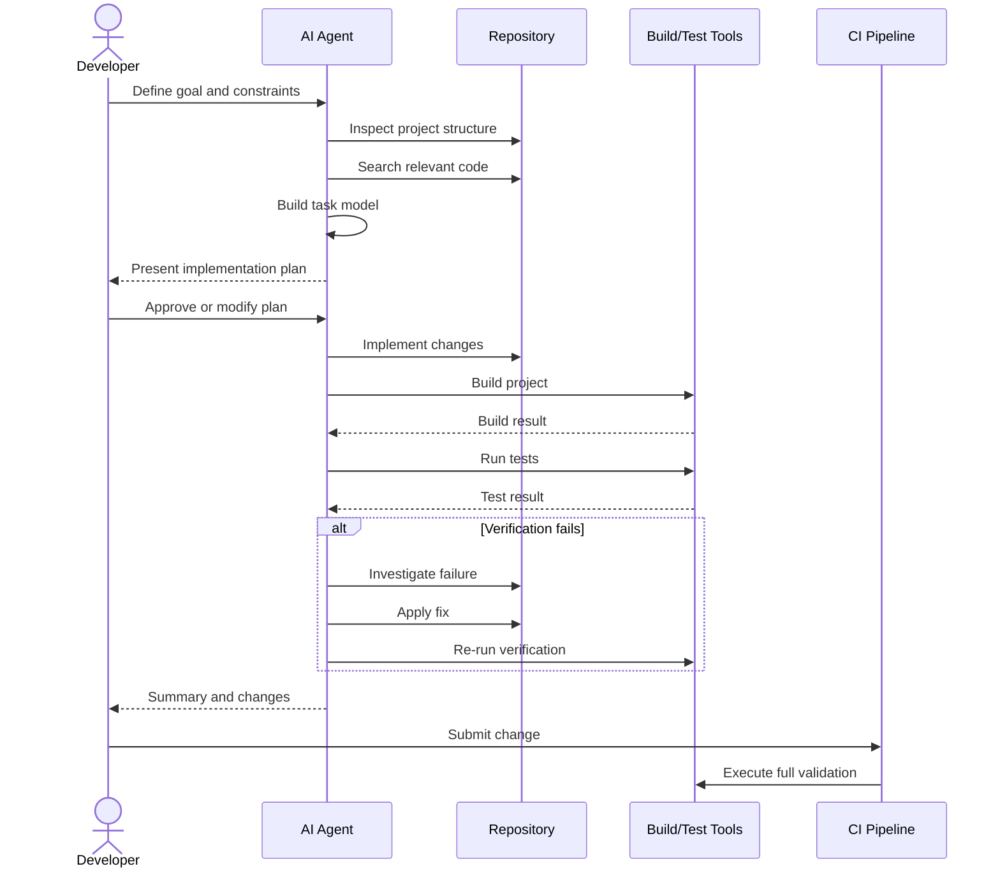
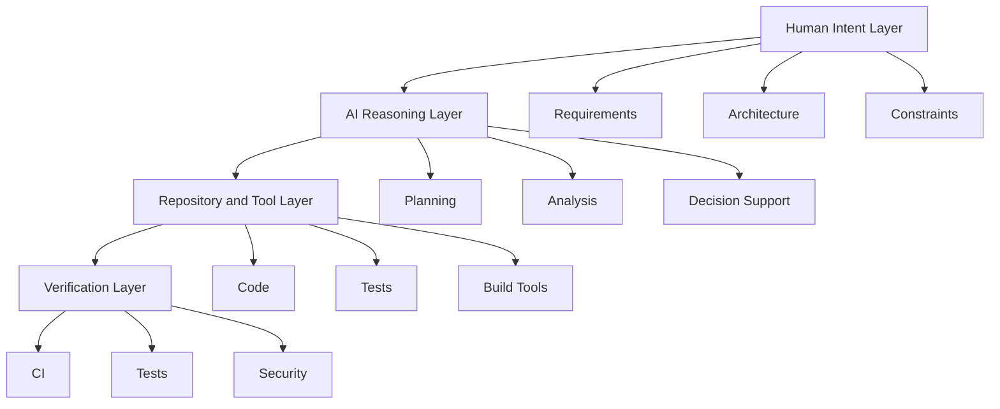
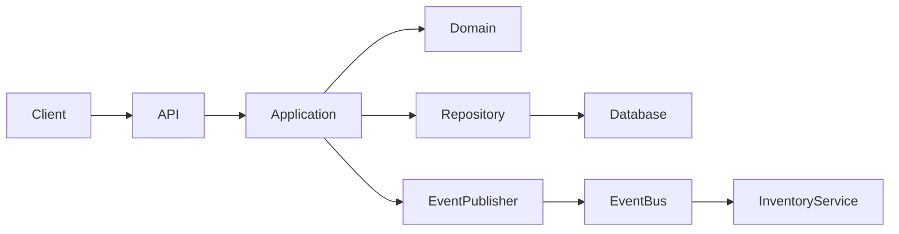

# AI-Assisted Software Development Skills

## Scope and Assumptions

This guide treats **AI-assisted software development** as the discipline of using AI systems—especially coding agents such as Claude Code, IDE assistants, autonomous agents, and repository-aware tools—to improve the complete software engineering lifecycle.

The scope includes:

* Planning
* Architecture
* Coding
* Debugging
* Testing
* Code review
* Documentation
* Refactoring
* Repository understanding
* Context management
* Agent orchestration
* Parallel execution
* Automated verification

The goal is **not to learn how to ask an AI to write code**.

The goal is to become an engineer or architect who can design a reliable system in which:

> **Humans provide intent, constraints, judgment, and accountability; AI accelerates analysis, implementation, exploration, and verification.**

---

# 1. Executive Summary

## What Is AI-Assisted Software Development?

**AI-assisted software development** is the use of artificial intelligence to participate in software engineering activities.

Instead of AI being limited to autocomplete, modern AI systems can:

* Read repositories
* Understand relationships between files
* Search codebases
* Propose implementation plans
* Modify multiple files
* Execute commands
* Run tests
* Investigate failures
* Review changes
* Generate documentation
* Coordinate specialized agents

A modern workflow may look like:

```text
Human Intent
     │
     ▼
AI-Assisted Planning
     │
     ▼
Architecture & Design
     │
     ▼
Task Decomposition
     │
     ├───────────────┬────────────────┐
     ▼               ▼                ▼
Coding Agent    Testing Agent    Research Agent
     │               │                │
     └───────────────┴────────────────┘
                     │
                     ▼
              Verification
                     │
                     ▼
               Human Review
                     │
                     ▼
                 Production
```

---

## Why Was It Created?

Traditional software development has several bottlenecks.

Developers spend significant time:

* Reading unfamiliar code
* Searching repositories
* Understanding dependencies
* Repeating implementation patterns
* Writing boilerplate
* Debugging
* Writing tests
* Reviewing pull requests
* Updating documentation
* Switching between tools and contexts

AI-assisted development attempts to reduce the cost of these activities.

The objective is not simply:

> Write code faster.

The larger objective is:

> **Reduce the time required to transform a business requirement into verified, maintainable software.**

---

## What Problem Does It Solve?

AI-assisted development is particularly useful for reducing:

### 1. Cognitive Load

**Cognitive load** is the amount of mental effort required to understand and solve a problem.

Example:

Instead of manually tracing:

```text
API Controller
    ↓
Application Service
    ↓
Domain Model
    ↓
Repository
    ↓
Database
    ↓
Event Handler
```

an AI agent can help map the flow.

---

### 2. Repository Navigation Cost

Large repositories may contain:

```text
20,000 files
500 projects
100 services
50 databases
30 deployment pipelines
```

Understanding where to change something can take longer than writing the change.

AI can accelerate:

* Code search
* Dependency tracing
* Call graph exploration
* Pattern discovery
* Historical analysis

---

### 3. Implementation Repetition

Many engineering tasks follow recognizable patterns.

For example:

```text
Create API endpoint
        ↓
Validate request
        ↓
Call application service
        ↓
Persist entity
        ↓
Publish event
        ↓
Write tests
        ↓
Update documentation
```

AI can automate repetitive portions while developers focus on correctness and design.

---

### 4. Context Switching

Developers often switch between:

```text
IDE
Git
Terminal
Documentation
Browser
Ticket System
Logs
Monitoring
Database
```

Agentic tools can integrate several steps into a workflow.

---

## What Problems Does It Not Solve?

AI-assisted development does **not automatically solve**:

* Bad requirements
* Poor architecture
* Incorrect business assumptions
* Missing domain knowledge
* Security accountability
* Production ownership
* Regulatory compliance
* Distributed systems complexity
* Organizational communication
* Product prioritization

AI can confidently generate incorrect solutions.

This is one of the central engineering principles:

> **AI reduces implementation effort more reliably than it reduces the need for engineering judgment.**

---

## Who Uses It?

### Individual Developers

For:

* Coding
* Debugging
* Learning
* Refactoring
* Testing

---

### Teams

For:

* Pull request review
* Documentation
* Repository understanding
* Shared development workflows

---

### Architects

For:

* Architecture exploration
* Trade-off analysis
* Dependency analysis
* Migration planning
* System documentation

---

### Engineering Organizations

For:

* Developer productivity
* Platform engineering
* Automated verification
* Code modernization
* Internal developer tooling

---

## When Should You Use It?

AI assistance is highly valuable when:

* The task is well-defined.
* The repository can provide useful context.
* The output can be verified.
* Repetitive work is involved.
* Multiple implementation options need exploration.
* The developer remains responsible for final decisions.

It is less suitable when:

* Requirements are ambiguous.
* The cost of an error is extremely high.
* Verification is difficult.
* Sensitive information cannot be shared with the AI system.
* The agent lacks necessary context.

---

## Quick Gist

> **AI-assisted software development is not “AI writes code for developers.”**

It is a new engineering workflow where AI becomes an active implementation and analysis layer.

The most important skills are:

```text
Problem Definition
        +
Context Management
        +
Task Decomposition
        +
Agent Delegation
        +
Verification
        +
Engineering Judgment
```

---

# 2. Core Concepts

## 2.1 AI-Assisted Development

### Definition

Using AI to support engineering activities.

### Why It Matters

It improves productivity across the entire lifecycle rather than only code generation.

### Example

Instead of:

```text
Developer reads 50 files
Developer identifies change
Developer writes implementation
Developer writes tests
```

use:

```text
AI analyzes 50 files
        ↓
AI explains architecture
        ↓
Developer validates understanding
        ↓
AI proposes implementation plan
        ↓
AI implements isolated changes
        ↓
AI runs tests
        ↓
Developer reviews result
```

---

# 2.2 AI-Assisted Planning

Planning means converting a requirement into an implementation strategy.

AI can help identify:

* Affected components
* Dependencies
* Risks
* Existing patterns
* Required tests
* Migration requirements

### Example

Requirement:

> Add multi-tenant support.

A weak workflow is:

```text
Ask AI:
"Add multi-tenancy."
```

A stronger workflow is:

```text
1. Analyze repository architecture.
2. Identify data ownership boundaries.
3. Identify authentication flow.
4. Identify database isolation strategy.
5. Identify API changes.
6. Identify background processing impact.
7. Propose migration plan.
8. Review plan before implementation.
```

---

# 2.3 AI-Assisted Architecture

AI-assisted architecture means using AI to explore and evaluate possible designs.

The AI should not be treated as the architect.

Instead:

```text
Architect
   │
   ├── Defines constraints
   ├── Defines quality attributes
   ├── Defines business requirements
   │
   ▼
AI
   │
   ├── Explores alternatives
   ├── Identifies trade-offs
   ├── Generates diagrams
   ├── Finds repository dependencies
   │
   ▼
Architect
   │
   └── Makes final decision
```

---

## 2.4 AI-Assisted Coding

This is the most visible capability.

AI can:

* Generate functions
* Create classes
* Modify files
* Implement APIs
* Generate SQL
* Create infrastructure configuration

The critical skill is not prompting:

> "Write this code."

The critical skill is specifying:

```text
Goal
+
Constraints
+
Context
+
Acceptance Criteria
+
Verification
```

Example:

```text
Goal:
Add order cancellation.

Constraints:
- Follow existing CQRS structure.
- Do not modify public API contracts.
- Cancellation allowed only before shipment.
- Publish OrderCancelled event.

Acceptance Criteria:
- Validation included.
- Unit tests added.
- Integration tests pass.

Verification:
- Run affected test suite.
- Run architecture validation.
```

---

# 2.5 AI-Assisted Debugging

AI debugging should follow an investigation workflow.

Bad approach:

```text
Here is an error.
Fix it.
```

Better approach:

```text
1. Reproduce the problem.
2. Collect logs.
3. Identify failing boundary.
4. Form hypotheses.
5. Test hypotheses.
6. Implement smallest fix.
7. Add regression test.
```

AI should help generate hypotheses, but verification must determine which hypothesis is correct.

---

# 2.6 AI-Assisted Testing

AI can generate:

* Unit tests
* Integration tests
* Contract tests
* Test data
* Edge cases
* Negative tests

However:

> AI-generated tests can repeat the same misunderstanding as AI-generated code.

Example:

```text
AI generates:
    Implementation
        +
    Tests validating implementation behavior
```

Both can be wrong.

Therefore, test design should begin from:

```text
Requirements
    ↓
Acceptance Criteria
    ↓
Behavior Specification
    ↓
Tests
    ↓
Implementation
```

---

# 2.7 AI-Assisted Code Review

AI can review:

* Correctness
* Security issues
* Performance risks
* Style consistency
* Missing tests
* Architectural violations

AI review is especially valuable for generating a second perspective.

However, it should not be treated as automatic approval.

---

# 2.8 Repository Understanding

**Repository understanding** is the ability to construct a useful mental model of a codebase.

An AI agent may analyze:

```text
Repository
│
├── Applications
├── Libraries
├── Services
├── APIs
├── Infrastructure
├── Tests
└── Documentation
```

It should identify:

* Entry points
* Architectural layers
* Dependencies
* Build process
* Testing strategy
* Deployment model

---

# 2.9 Context Management

**Context management** means deciding what information an AI needs to perform a task correctly.

AI does not benefit from unlimited repository content.

Too much irrelevant information can cause:

* Confusion
* Incorrect pattern selection
* Higher cost
* Slower execution

Good context is:

```text
Relevant
+
Current
+
Authoritative
+
Sufficient
```

---

# 2.10 Task Decomposition

**Task decomposition** means breaking a large objective into smaller independently understandable tasks.

Example:

```text
Add Payment Retry
```

Can become:

```text
1. Analyze existing payment workflow.
2. Identify failure states.
3. Define retry policy.
4. Modify domain model.
5. Implement application logic.
6. Add persistence changes.
7. Add API support.
8. Add tests.
9. Update monitoring.
10. Verify deployment compatibility.
```

---

# 2.11 Agentic Development

**Agentic development** is software development where AI agents can:

* Plan
* Select tools
* Execute commands
* Modify files
* Observe results
* Iterate

The basic loop is:

```text
Observe
   ↓
Reason
   ↓
Plan
   ↓
Act
   ↓
Verify
   ↓
Observe Again
```

---

# 2.12 Parallel Agents

Parallel agents divide work.

Example:

```text
                Feature Request
                      │
        ┌─────────────┼─────────────┐
        ▼             ▼             ▼
 Architecture     Repository      Test
   Agent           Agent          Agent
        │             │             │
        └─────────────┼─────────────┘
                      ▼
                Lead Agent
                      │
                      ▼
                 Implementation
```

Parallelism is useful only when tasks have manageable dependencies.

---

# 2.13 Automated Verification

An AI-generated change should be verified through machines whenever possible.

Examples:

```text
Compilation
Static Analysis
Unit Tests
Integration Tests
Security Scanning
Architecture Tests
Formatting
Type Checking
Contract Tests
```

The ideal workflow is:

```text
AI generates change
        ↓
Automated verification
        ↓
Failure?
   ┌────┴────┐
  Yes        No
   │          │
   ▼          ▼
Fix       Human Review
```

---

## Commonly Confused Concepts

| Concept                | Meaning                                            |
| ---------------------- | -------------------------------------------------- |
| AI Assistant           | Responds to user requests                          |
| Coding Assistant       | Helps generate or edit code                        |
| Agent                  | Can autonomously perform multiple actions          |
| Workflow               | Defined sequence of steps                          |
| Multi-Agent System     | Multiple agents collaborate                        |
| Autonomous Development | Agent performs work with limited human interaction |
| Verification           | Checking whether output satisfies criteria         |
| Validation             | Checking whether the right problem was solved      |

---

# 3. How AI-Assisted Development Works

## End-to-End Operational Flow



---

## Step 1: Understand Intent

The developer provides:

```text
Business Goal
Functional Requirements
Non-Functional Requirements
Constraints
Acceptance Criteria
```

Example:

```text
Goal:
Allow customers to retry failed payments.

Constraints:
- Maximum 3 retries.
- Existing payment provider API unchanged.
- Retry attempts must be auditable.
- Avoid duplicate charges.

Quality Requirements:
- Idempotency required.
- Failures must be observable.
```

---

## Step 2: Repository Discovery

The AI should investigate before changing code.

Useful questions:

```text
Where is payment initiated?
Where is payment state stored?
What identifies a payment uniquely?
How are retries currently handled?
What tests exist?
What events are published?
```

---

## Step 3: Build a Context Model

The agent constructs relationships:

```text
Payment API
     │
     ▼
Payment Service
     │
     ├── Payment Repository
     │
     ├── Payment Provider
     │
     └── Event Publisher
```

This context is more useful than simply sending many files to an AI.

---

## Step 4: Plan

Example:

```text
1. Extend payment state model.
2. Add retry attempt tracking.
3. Add retry policy.
4. Add idempotency validation.
5. Update payment orchestration.
6. Add event logging.
7. Add unit tests.
8. Add integration tests.
```

---

## Step 5: Execute

The AI modifies the repository.

Important principle:

> Prefer small, verifiable changes over massive autonomous changes.

---

## Step 6: Verify

The agent should execute:

```text
Build
↓
Static Analysis
↓
Unit Tests
↓
Integration Tests
↓
Architecture Validation
```

---

## Step 7: Human Review

The human evaluates:

```text
Did we solve the correct problem?
Are the architectural decisions sound?
Are there hidden business risks?
Is the change maintainable?
```

---

# 4. Implementation

## Assumed Technology Stack

For concrete examples, assume:

```text
Backend: .NET 10
Language: C#
Architecture: Clean Architecture + CQRS
Database: PostgreSQL
Messaging: Event-driven integration
Testing: Unit + Integration Tests
CI: Git-based pipeline
```

The principles apply equally to Java, TypeScript, Python, Go, and other ecosystems.

---

# Recommended AI-Ready Project Structure

```text
repository/
│
├── .ai/
│   ├── architecture.md
│   ├── coding-standards.md
│   ├── testing-strategy.md
│   ├── security.md
│   └── workflows/
│
├── docs/
│   ├── architecture/
│   ├── decisions/
│   └── domain/
│
├── src/
│   ├── Domain/
│   ├── Application/
│   ├── Infrastructure/
│   └── Api/
│
├── tests/
│   ├── UnitTests/
│   ├── IntegrationTests/
│   └── ArchitectureTests/
│
├── scripts/
│
├── CLAUDE.md
├── README.md
└── solution.sln
```

The exact filename depends on the AI tool. The important idea is to provide a **machine-readable engineering contract**.

---

# Repository Instruction File

Example:

```markdown
# Repository Engineering Rules

## Architecture

- Domain must not depend on Infrastructure.
- Application depends on Domain.
- API communicates with Application only.
- Database access belongs in Infrastructure.

## Coding

- Prefer immutable models.
- Use async APIs for I/O.
- Avoid hidden global state.
- Follow existing patterns.

## Testing

- New behavior requires tests.
- Bug fixes require regression tests.
- Integration tests are required for persistence changes.

## Verification

Run:

dotnet build
dotnet test
```

---

# AI-Assisted Planning Workflow

```text
User Requirement
      │
      ▼
Repository Analysis
      │
      ▼
Architecture Analysis
      │
      ▼
Risk Identification
      │
      ▼
Implementation Plan
      │
      ▼
Human Approval
      │
      ▼
Execution
```

---

# Example Planning Prompt Structure

```markdown
## Goal

Add support for payment retries.

## Before Implementing

1. Analyze the current payment architecture.
2. Identify all affected components.
3. Identify existing retry mechanisms.
4. Identify data consistency risks.
5. Propose an implementation plan.

## Constraints

- Maximum 3 retries.
- Prevent duplicate charges.
- Maintain backward compatibility.
- Follow existing architecture.

## Do Not

- Modify unrelated modules.
- Introduce a new framework.
- Change public contracts without justification.

## Deliverables

- Architecture analysis
- File impact list
- Implementation plan
- Risk analysis
- Test plan
```

---

# AI-Assisted Coding Pattern

Use the following lifecycle:

```text
EXPLORE
   ↓
PLAN
   ↓
IMPLEMENT
   ↓
VERIFY
   ↓
REVIEW
```

Do not default to:

```text
PROMPT
   ↓
CODE
   ↓
MERGE
```

---

# Example Domain Code

```csharp
public sealed class Payment
{
    private const int MaxRetryAttempts = 3;

    public Guid Id { get; private set; }

    public int RetryAttempts { get; private set; }

    public PaymentStatus Status { get; private set; }

    public bool CanRetry()
    {
        return Status == PaymentStatus.Failed &&
               RetryAttempts < MaxRetryAttempts;
    }

    public void RegisterRetry()
    {
        if (!CanRetry())
        {
            throw new InvalidOperationException(
                "Payment cannot be retried.");
        }

        RetryAttempts++;
        Status = PaymentStatus.Pending;
    }
}
```

AI should be able to explain:

```text
Why is retry behavior domain logic?

Because retry eligibility represents a business invariant.
```

The architect should ask:

```text
Should retry limits be domain rules?
Should they be configuration?
Should different payment providers have different policies?
```

---

# Testing Strategy

```text
                /\
               /  \
              / E2E \
             /--------\
            /Integration\
           /------------\
          / Unit Tests   \
         /----------------\
```

AI should assist with all layers.

Example:

```csharp
[Fact]
public void FailedPayment_WithRemainingRetries_CanRetry()
{
    var payment = CreateFailedPayment(retries: 1);

    var result = payment.CanRetry();

    Assert.True(result);
}
```

More important:

```csharp
[Fact]
public void FailedPayment_WithMaximumRetries_CannotRetry()
{
    var payment = CreateFailedPayment(retries: 3);

    var result = payment.CanRetry();

    Assert.False(result);
}
```

AI should help discover boundary conditions, not merely generate happy-path tests.

---

# 5. Architecture and Design

# The Architect's Mental Model

An architect should evaluate AI-assisted development across four layers.



---

## Architectural Principle: AI Is Not a Trusted Boundary

Do not assume:

```text
AI Output = Correct
```

Treat AI output as:

```text
Untrusted Input
```

until verified.

This is similar to:

```text
External API
User Input
Generated Code
Third-Party Dependency
```

---

# Recommended Architecture

```text
                Human
                  │
                  ▼
             AI Agent Layer
                  │
        ┌─────────┼─────────┐
        ▼         ▼         ▼
      Code      Tests    Analysis
        │         │         │
        └─────────┼─────────┘
                  ▼
          Controlled Tool Layer
                  │
        ┌─────────┼─────────┐
        ▼         ▼         ▼
      Git       Build     Database
                  │
                  ▼
           Verification Layer
                  │
        ┌─────────┼─────────┐
        ▼         ▼         ▼
     Tests    Security    Review
```

---

# Decision Matrix

| Situation                  | Recommended AI Autonomy |
| -------------------------- | ----------------------- |
| Rename internal variable   | High                    |
| Generate unit tests        | High                    |
| Implement isolated feature | Medium                  |
| Database migration         | Medium/Low              |
| Security-sensitive code    | Low                     |
| Authentication changes     | Low                     |
| Production infrastructure  | Low                     |
| Architecture redesign      | Human-led               |

---

# Architecture Patterns for Agentic Development

## Pattern 1: Single Expert Agent

```text
Human
  ↓
AI Agent
  ↓
Repository
```

Best for:

* Small changes
* Individual development
* Simple repositories

---

## Pattern 2: Planner + Executor

```text
Planner Agent
      │
      ▼
Implementation Plan
      │
      ▼
Executor Agent
      │
      ▼
Verification
```

Best for:

* Medium complexity
* Multi-step changes

---

## Pattern 3: Specialized Agents

```text
             Coordinator
                 │
     ┌───────────┼───────────┐
     ▼           ▼           ▼
Architecture    Code        Test
 Agent          Agent       Agent
```

Best for:

* Large tasks
* Independent workstreams

---

## Pattern 4: Human-Governed Agents

```text
Agent proposes
      ↓
Human approves
      ↓
Agent executes
      ↓
Automated verification
      ↓
Human approves
```

Best for:

* Enterprise environments
* Sensitive systems

---

# 6. Production Readiness

## Security

AI agents may have access to:

```text
Source Code
Environment Variables
Credentials
Cloud Accounts
Production Logs
Databases
```

Follow least privilege.

```text
Agent
 │
 ├── Read Repository
 ├── Write Feature Branch
 ├── Run Tests
 │
 └── No Production Access
```

Avoid:

```text
Agent
  │
  ├── Production Database
  ├── Cloud Admin
  └── Secret Store Administrator
```

---

# Secret Protection

Never assume AI-generated logs or prompts are safe places for:

* API keys
* Passwords
* Tokens
* Private certificates
* Customer data

Use:

```text
Secret scanning
Credential isolation
Environment controls
Redaction
Least privilege
```

---

# Scalability

AI development workflows themselves can become bottlenecks.

Problems include:

```text
Too many agents
Large context windows
Duplicate work
Conflicting modifications
Expensive verification
```

Scale by partitioning work.

```text
Repository
│
├── Domain Agent
├── API Agent
├── Test Agent
└── Documentation Agent
```

But avoid splitting tightly coupled work.

---

# Reliability

A reliable workflow should tolerate:

```text
Agent Failure
Tool Failure
Incorrect Plan
Test Failure
Merge Conflict
```

Use checkpoints.

```text
Explore
   ↓
CHECKPOINT
   ↓
Plan
   ↓
CHECKPOINT
   ↓
Implement
   ↓
CHECKPOINT
   ↓
Verify
```

---

# Observability

Track:

* Agent task duration
* Tool failures
* Test failures
* Rework
* Review rejection rate
* Defect escape rate

Do not measure only:

```text
Lines of Code Generated
```

This metric is often misleading.

Better:

```text
Verified Engineering Throughput
```

---

# Deployment

Recommended deployment model:

```text
Developer Branch
      │
      ▼
AI-Assisted Change
      │
      ▼
Local Verification
      │
      ▼
Pull Request
      │
      ▼
CI Verification
      │
      ▼
Human Approval
      │
      ▼
Deployment
```

---

# 7. Real-World Usage

## Use Case 1: Legacy System Modernization

Enterprise system:

```text
.NET Framework
Monolith
Old ORM
Limited Tests
Large Repository
```

AI can help:

* Map dependencies
* Identify obsolete APIs
* Generate migration plans
* Add tests before refactoring

Best approach:

```text
Analyze
↓
Add characterization tests
↓
Refactor incrementally
↓
Verify continuously
```

Do not:

```text
Ask AI to rewrite the entire system.
```

---

## Use Case 2: Large Feature Development

Example:

> Introduce subscription billing.

Agents can work on:

```text
Domain Model
API
Persistence
Integration
Tests
Documentation
```

A coordinator maintains:

```text
Requirements
Dependencies
Contracts
Acceptance Criteria
```

---

## Use Case 3: Production Incident Investigation

Workflow:

```text
Alert
 ↓
Collect Logs
 ↓
Identify Failing Service
 ↓
Trace Recent Changes
 ↓
Generate Hypotheses
 ↓
Reproduce
 ↓
Fix
 ↓
Regression Test
```

AI can accelerate investigation, but humans must control production actions.

---

# When It Is a Good Fit

Use AI heavily when:

* Code patterns are established.
* Tests exist.
* Requirements are clear.
* Changes are verifiable.

---

# When Another Approach Is Better

Avoid autonomous agents when:

* Requirements are still being discovered.
* Business decisions dominate.
* The system has poorly understood production behavior.
* Verification is weak.

In these cases, improve:

```text
Requirements
Documentation
Tests
Observability
Architecture
```

before increasing autonomy.

---

# 8. Common Mistakes

## Mistake 1: Asking AI to "Implement Everything"

Problem:

```text
Huge task
+
No boundaries
+
No verification
```

Result:

* Large diffs
* Hidden regressions
* Architectural drift

Solution:

```text
Explore → Plan → Approve → Implement → Verify
```

---

## Mistake 2: Skipping Repository Analysis

Never assume AI understands your project.

Require it to answer:

```text
What components are involved?
What pattern does this repository use?
What files are affected?
```

---

## Mistake 3: Treating AI Output as Truth

AI can produce convincing incorrect explanations.

Solution:

```text
Evidence
+
Tests
+
Source Code
+
Documentation
```

---

## Mistake 4: Too Much Context

More context is not always better.

Prefer:

```text
Task Context
+
Relevant Architecture
+
Relevant Files
+
Constraints
```

---

## Mistake 5: Too Little Context

Example:

```text
"Implement authentication."
```

This omits:

* Identity provider
* Token strategy
* Authorization model
* Existing architecture

---

## Mistake 6: Parallel Agents Editing the Same Area

This causes:

```text
Merge Conflicts
Duplicated Work
Inconsistent Designs
```

Partition by ownership.

---

## Mistake 7: No Automated Verification

If AI can generate code faster than developers can verify it:

```text
Defect Risk ↑
```

AI productivity must be paired with verification automation.

---

# 9. End-to-End Project

# Project: AI-Assisted Order Management Feature

## Requirements

Build:

```text
Order Cancellation
```

Rules:

```text
Orders can be cancelled before shipment.
Cancellation restores inventory.
Cancellation publishes an event.
Cancellation must be auditable.
```

---

# Architecture



---

# Step 1: Repository Analysis

AI identifies:

```text
Order Aggregate
Order Repository
Shipment Service
Inventory Service
Event Bus
Existing Tests
```

---

# Step 2: Plan

```text
1. Add Cancel method to Order.
2. Validate shipment state.
3. Persist cancellation.
4. Publish OrderCancelled event.
5. Handle inventory restoration.
6. Add audit record.
7. Add unit tests.
8. Add integration tests.
```

---

# Step 3: Domain Implementation

```csharp
public void Cancel()
{
    if (Status == OrderStatus.Shipped)
    {
        throw new InvalidOperationException(
            "Shipped orders cannot be cancelled.");
    }

    Status = OrderStatus.Cancelled;

    AddDomainEvent(
        new OrderCancelledEvent(Id));
}
```

---

# Step 4: Tests

```text
OrderTests
│
├── CanCancelPendingOrder
├── CannotCancelShippedOrder
└── CancellationPublishesEvent
```

---

# Step 5: Integration Verification

```text
Create Order
    ↓
Cancel Order
    ↓
Verify Database
    ↓
Verify Event
    ↓
Verify Inventory Restoration
```

---

# Evolution

As scale increases:

```text
Simple Transaction
        ↓
Transactional Outbox
        ↓
Asynchronous Event Processing
        ↓
Idempotent Consumers
        ↓
Distributed Observability
```

The AI workflow must evolve with system complexity.

---

# 10. Final Review

# Quick Gist

The core AI-assisted engineering loop is:

```text
UNDERSTAND
    ↓
CONTEXTUALIZE
    ↓
PLAN
    ↓
DECOMPOSE
    ↓
DELEGATE
    ↓
IMPLEMENT
    ↓
VERIFY
    ↓
REVIEW
```

The most important skills are:

1. **Problem specification**
2. **Repository understanding**
3. **Context management**
4. **Task decomposition**
5. **Agent delegation**
6. **Automated verification**
7. **Architecture judgment**

---

# Practical Example

Instead of:

```text
"Claude, add payment retries."
```

Use:

```text
Goal:
Add payment retry support.

First:
Analyze the payment architecture and existing failure handling.

Then:
Produce a plan before changing code.

Constraints:
- Maximum three retries.
- Prevent duplicate charges.
- Preserve existing API contracts.

Verification:
- Add regression tests.
- Run unit tests.
- Run integration tests.

Do not:
- Modify unrelated modules.
- Introduce new dependencies without justification.
```

This is the difference between:

```text
AI as Code Generator
```

and:

```text
AI as Engineering System
```

---

# Best Practices

## Repository

* [ ] Maintain clear architecture documentation.
* [ ] Document coding standards.
* [ ] Keep build instructions reproducible.
* [ ] Keep tests reliable.

## Planning

* [ ] Analyze before implementation.
* [ ] Identify affected components.
* [ ] Define constraints explicitly.
* [ ] Define acceptance criteria.

## Agents

* [ ] Give agents bounded responsibilities.
* [ ] Avoid overlapping ownership.
* [ ] Use parallel agents only for independent work.

## Verification

* [ ] Build automatically.
* [ ] Run tests automatically.
* [ ] Perform static analysis.
* [ ] Scan for security issues.
* [ ] Require human review for important decisions.

## Architecture

* [ ] Treat AI output as untrusted until verified.
* [ ] Preserve architectural boundaries.
* [ ] Prefer incremental changes.
* [ ] Maintain decision records.

---

# Expert-Level Interview Questions & Answers

## 1. How would you design an enterprise AI-assisted development workflow?

**Answer:**

I would design it around controlled autonomy.

```text
Human defines intent
        ↓
AI analyzes repository
        ↓
AI proposes plan
        ↓
Human approves significant decisions
        ↓
AI implements bounded tasks
        ↓
Automated verification
        ↓
Human reviews high-risk changes
```

The architecture should emphasize:

* Least privilege
* Reproducible environments
* Automated verification
* Auditability
* Branch isolation

I would not allow an agent unrestricted production access.

---

## 2. How do you prevent AI agents from causing architectural drift?

**Answer:**

Architectural drift occurs when individually reasonable changes gradually violate the intended design.

Mitigations include:

```text
Architecture Documentation
+
Repository Rules
+
Architecture Tests
+
Code Review
+
Small Changes
```

Architecture should be executable where possible.

For example:

```text
Domain must not reference Infrastructure.
```

This should be automatically tested rather than merely documented.

---

## 3. When should multiple AI agents work in parallel?

**Answer:**

Only when work can be partitioned with minimal shared-state dependency.

Good:

```text
Agent A → Repository Analysis
Agent B → Test Strategy
Agent C → Documentation Analysis
```

Risky:

```text
Agent A → Modify Order Service
Agent B → Modify Order Service
Agent C → Refactor Order Service
```

Parallelism increases throughput only when coordination cost remains lower than the saved execution time.

---

## 4. How do you measure AI-assisted engineering productivity?

**Answer:**

Do not rely primarily on:

```text
Lines Generated
Commits Generated
Agent Runtime
```

Measure engineering outcomes:

```text
Lead Time
Deployment Frequency
Defect Rate
Change Failure Rate
Review Rework
Time to Understand Repository
Time to Resolve Incidents
```

The goal is not more generated code.

The goal is more **correct, maintainable, verified software**.

---

## 5. What is the biggest risk of AI-assisted development?

**Answer:**

The largest risk is often **automation outpacing verification**.

AI can increase implementation speed dramatically.

If testing, review, security, and architecture validation do not improve at the same time:

```text
Code Production ↑
Verification Capacity →
Risk ↑
```

Therefore:

> **AI-assisted development should increase verification capability at least as aggressively as implementation capability.**

---

# Further Study

## Level 1: AI Development Foundations

Study:

* Prompt engineering for engineering tasks
* Repository context
* AI-assisted debugging
* AI-assisted testing

---

## Level 2: Agentic Development

Study:

* Agent loops
* Tool use
* Task planning
* Agent memory
* Context windows
* Agent coordination

---

## Level 3: Repository Intelligence

Study:

* Code graphs
* Dependency graphs
* Semantic search
* Repository indexing
* Retrieval-augmented generation

---

## Level 4: Verification

Study:

* Property-based testing
* Contract testing
* Architecture testing
* Static analysis
* Security scanning

---

## Level 5: Multi-Agent Systems

Study:

```text
Planner Agent
Executor Agent
Reviewer Agent
Testing Agent
Research Agent
Coordinator Agent
```

Focus on:

* Coordination
* Shared state
* Conflict management
* Task ownership

---

## Level 6: AI-Native Software Architecture

The advanced architectural question is no longer:

> "How can AI write code?"

It becomes:

> **"How should we design software engineering systems where humans and AI agents collaborate safely, efficiently, and verifiably?"**

That is the central skill of **AI-assisted software development at architect level**.
