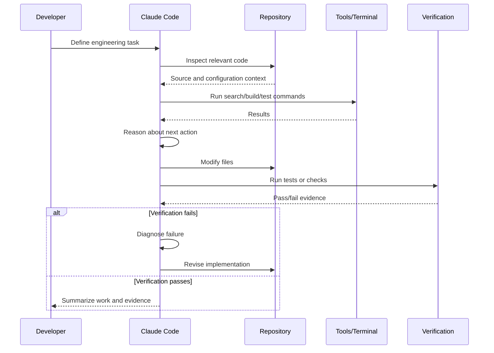
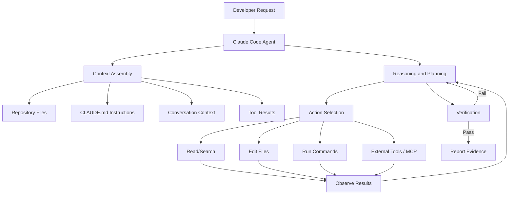
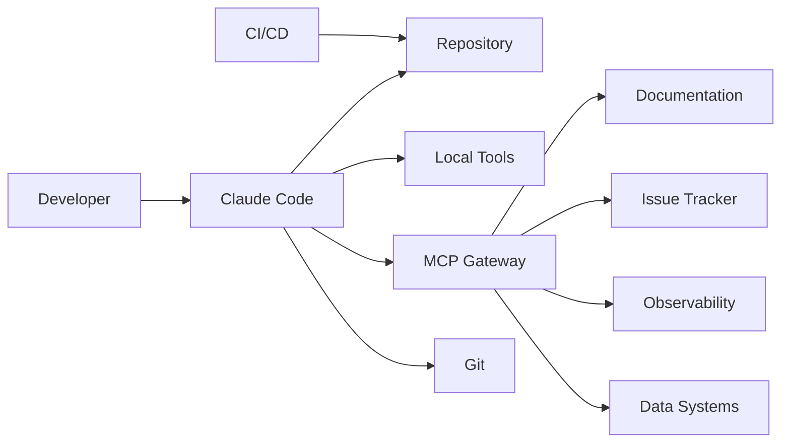
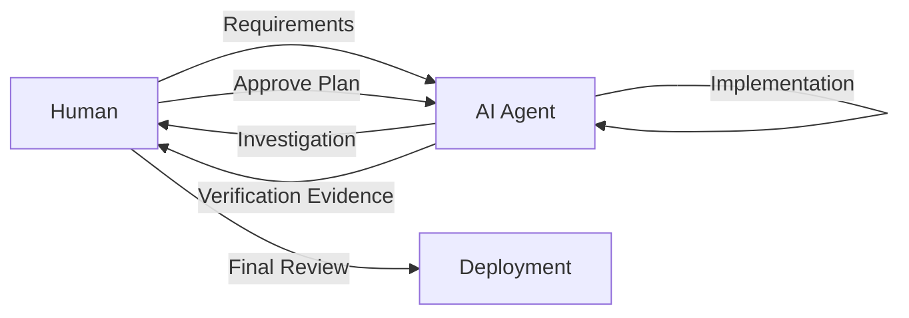
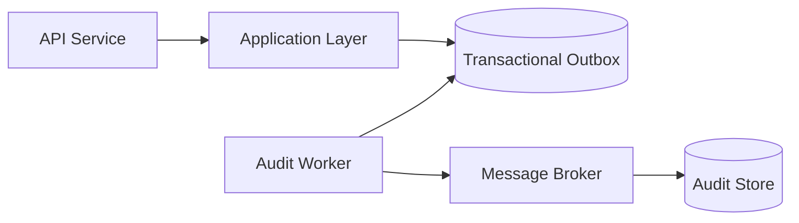
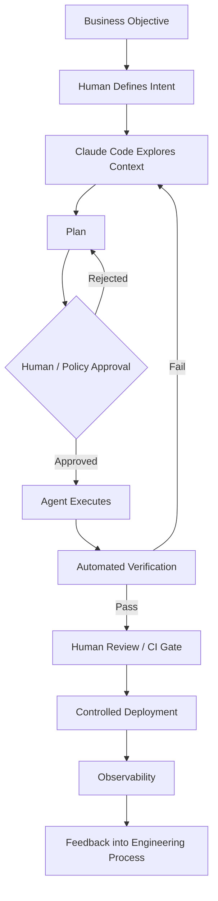

# Claude Code: A Complete Practical and Architect-Level Guide

> **Scope and assumptions:** This guide covers Claude Code as an agentic software-engineering environment used from the terminal and within a repository. Claude Code evolves rapidly, so command names, models, configuration options, and plan capabilities can change. Examples use TypeScript/Node.js for concreteness, but the architectural principles apply to .NET, Java, Python, Go, and other ecosystems. Current Claude Code capabilities described here are based primarily on Anthropic's official documentation and engineering material. ([Anthropic][1])

# 1. Executive Summary

## What Is Claude Code?

**Claude Code** is Anthropic's agentic coding tool that works directly with your development environment, particularly your terminal and repository.

Unlike a traditional code-completion tool that primarily predicts the next few lines you type, Claude Code can operate through an iterative engineering loop:

1. Understand a task.
2. Inspect a repository.
3. Search code and documentation.
4. Form a plan.
5. Modify files.
6. Run commands.
7. Execute tests.
8. Inspect failures.
9. Iterate.
10. Report the result.

It is therefore best understood as an **AI software engineering agent**, rather than merely an AI editor or autocomplete engine.

Anthropic describes Claude Code as an active collaborator capable of searching and reading code, editing files, running tests, and using command-line tools while keeping the developer involved in the workflow. ([Anthropic][2])

## Why Was It Created?

Traditional AI coding assistants reduce the cost of writing individual pieces of code, but software engineering is rarely just about producing syntax.

Real engineering requires connecting many activities:

* understanding an unfamiliar codebase;
* tracing a production bug;
* finding relevant abstractions;
* understanding dependencies;
* changing multiple files consistently;
* updating tests;
* running builds;
* interpreting failures;
* reviewing architectural consequences.

Claude Code was created to move AI assistance from **code generation** toward **task execution**.

Instead of asking:

> "What code should appear at this cursor?"

an agentic workflow asks:

> "What actions must be taken to complete this engineering objective?"

This distinction is fundamental.

## What Problem Does It Solve?

Claude Code primarily solves the problem of **engineering execution overhead**.

A software task often contains many small mechanical operations:

```text
Understand requirement
        ↓
Find relevant files
        ↓
Trace dependencies
        ↓
Understand existing conventions
        ↓
Implement change
        ↓
Update tests
        ↓
Run tests
        ↓
Interpret failures
        ↓
Fix failures
        ↓
Review changes
```

A human developer can perform all of these steps, but switching repeatedly between them consumes time and attention.

Claude Code can automate or accelerate much of this loop.

Typical strong use cases include:

* debugging;
* test-driven development;
* large-scale refactoring;
* repository exploration;
* feature implementation;
* test generation;
* migration work;
* dependency upgrades;
* repetitive engineering changes;
* codebase documentation;
* investigating failures.

Anthropic has specifically described Claude Code as useful for test-driven development, debugging complex problems, and large-scale refactoring. ([Anthropic][2])

## What Problems Does It Not Solve?

Claude Code is not a substitute for engineering judgment.

It does **not automatically know**:

* whether the business requirement is correct;
* whether the architecture is appropriate;
* whether a generated implementation creates unacceptable risk;
* whether a test actually tests the correct behavior;
* whether a database migration is safe in production;
* whether credentials should have access to a system;
* whether an external dependency is trustworthy;
* whether a passing build represents a successful product.

It can also make mistakes such as:

* misunderstanding existing abstractions;
* modifying the wrong layer;
* producing over-engineered solutions;
* introducing subtle regressions;
* interpreting incomplete context incorrectly;
* performing an unsafe command if granted excessive permissions.

An agent is therefore best treated as a highly capable execution system operating within an engineering control environment.

## Who Uses Claude Code?

Claude Code is useful for:

| User                 | Typical Use                                                  |
| -------------------- | ------------------------------------------------------------ |
| Individual developer | Features, bugs, tests, refactoring                           |
| Senior engineer      | Repository analysis and implementation acceleration          |
| Tech lead            | Delegating bounded implementation work                       |
| Platform engineer    | Automation, migrations, infrastructure changes               |
| DevOps/SRE           | Investigation and operational automation                     |
| QA engineer          | Test generation and failure analysis                         |
| Security engineer    | Code inspection and controlled investigation                 |
| Engineering team     | Standardized workflows through shared instructions and tools |

Anthropic's research on large-scale usage found a pattern in which people tend to retain responsibility for much of the planning—what should be done—while the agent performs much of the execution—how to carry it out. ([Anthropic][1])

## Where Is It Used?

Claude Code operates naturally around a software repository and command-line environment.

Typical contexts include:

```text
Developer Workstation
        │
        ▼
┌───────────────────┐
│   Claude Code     │
└─────────┬─────────┘
          │
          ├── Repository
          ├── Source files
          ├── Tests
          ├── Build tools
          ├── Git
          ├── Package managers
          ├── Containers
          ├── Cloud CLIs
          └── External tools via MCP
```

The **Model Context Protocol (MCP)** can extend this environment by connecting Claude Code to external tools, services, APIs, databases, issue trackers, and documentation systems. ([Claude Docs][3])

## When Should You Use It?

Use Claude Code when the task is:

* sufficiently concrete;
* inspectable through available context;
* verifiable;
* bounded by permissions and safety controls.

Good request:

> Investigate why checkout requests fail when an order contains more than 50 items. Do not modify code until you identify the likely root cause. Then propose a fix and run the affected tests.

Less effective request:

> Make the entire application better.

The first defines an observable engineering problem.

The second delegates undefined architectural judgment.

## Quick Gist

> **Claude Code is an agentic engineering environment.**
> It can inspect a repository, reason about a task, use tools, modify code, run commands, and iterate on results. Its greatest value comes from delegating bounded, verifiable engineering work while humans retain responsibility for requirements, architecture, security, and production risk.

---

# 2. Core Concepts

## 2.1 Agentic Coding

### Definition

**Agentic coding** is software development in which an AI system can perform multiple actions toward a goal rather than generating a single response.

The fundamental loop is:

```text
Observe → Reason → Act → Observe → Adapt
```

### Why It Matters

Normal code generation is largely stateless from an operational perspective:

```text
Prompt → Code
```

Agentic coding is iterative:

```text
Task
  ↓
Inspect
  ↓
Hypothesize
  ↓
Modify
  ↓
Test
  ↓
Observe
  ↓
Repeat
```

This makes multi-file and repository-level tasks possible.

### Example

Prompt:

> Find the cause of the failing payment integration tests and fix the smallest root cause.

Possible agent workflow:

```text
1. Read test failure.
2. Find payment client.
3. Inspect recent related changes.
4. Reproduce failure.
5. Identify invalid serialization.
6. Modify serializer.
7. Run focused tests.
8. Run broader test suite.
9. Report changed files and verification.
```

---

## 2.2 The Agent Loop

A useful conceptual model is:



The important concept is **feedback**.

The model does not simply generate code and hope it works. Tool results become additional context for subsequent decisions.

---

## 2.3 Context

### Definition

**Context** is the information available to the model when making decisions.

For Claude Code, useful context may include:

* source code;
* file structure;
* build configuration;
* test output;
* Git status;
* project instructions;
* issue descriptions;
* tool output;
* connected external systems.

### Why It Matters

An AI agent is only as effective as its operational understanding.

Bad context:

> Fix authentication.

Better context:

> Authentication is implemented in `src/auth`. JWT validation occurs in `JwtVerifier`. Do not modify token format. The failing scenario is expired refresh tokens. Run `npm test -- auth`.

Best context is often **discoverable context**, rather than manually copying the entire repository into a prompt.

The agent can inspect what it needs.

---

## 2.4 `CLAUDE.md`

A `CLAUDE.md` file acts as persistent project guidance for Claude Code.

Think of it as an **AI-oriented project briefing**.

It can describe:

* architecture;
* conventions;
* important commands;
* testing requirements;
* prohibited changes;
* repository structure;
* domain terminology.

Example:

```markdown
# Project Instructions

## Architecture

This service uses Clean Architecture.

Dependency direction:

API -> Application -> Domain
Infrastructure -> Application

Domain must not depend on infrastructure.

## Commands

Run tests:

npm test

Run lint:

npm run lint

Run integration tests:

npm run test:integration

## Rules

- Do not introduce new ORM dependencies.
- Prefer existing Result types for expected failures.
- New API endpoints require authorization tests.
- Database migrations must be backward compatible.
- Do not modify public API contracts without explicit approval.
```

### Why It Matters

Without project guidance, an agent must infer conventions.

Inference is useful but probabilistic.

Explicit constraints are more reliable.

### Common Confusion: `CLAUDE.md` vs Documentation

| `CLAUDE.md`                     | General Documentation  |
| ------------------------------- | ---------------------- |
| Instructions for agent behavior | Information for humans |
| Operational                     | Educational            |
| Concise                         | Can be extensive       |
| Focuses on constraints          | Focuses on explanation |
| Loaded as working guidance      | Consulted when needed  |

The best `CLAUDE.md` files are not encyclopedias.

They encode **high-value decisions that are difficult to infer automatically**.

---

## 2.5 Tools

Claude Code becomes useful because it can interact with tools.

Typical tool categories:

```text
Repository Tools
├── Read files
├── Search files
└── Edit files

Terminal Tools
├── Build
├── Test
├── Lint
└── Run scripts

Version Control
├── Inspect changes
├── Diff
└── Commit workflows

External Tools
├── Issue trackers
├── Documentation
├── Monitoring
└── Databases
```

A model without tools can describe what should happen.

A model with tools can participate in making it happen.

---

## 2.6 Permissions

### Definition

**Permissions** control what Claude Code is allowed to do.

Potential actions have different risk levels.

For example:

```text
Read source file              Low risk
Run unit test                 Low risk
Modify source file            Moderate risk
Delete directory              High risk
Push Git changes              Higher risk
Run cloud deployment          Very high risk
Modify production database    Extremely high risk
```

Anthropic's tooling emphasizes explicit approval and containment because agent capabilities increase the potential **blast radius**—the amount of damage a failure could cause. ([Anthropic][4])

### Architect Principle

> Grant agents the minimum authority necessary to perform the task.

This is the same **principle of least privilege** used in security architecture.

---

## 2.7 Plan Before Execution

Complex tasks benefit from separating:

```text
Thinking about the change
```

from:

```text
Performing the change
```

Example:

```text
Developer:
Investigate the authentication redesign.
Do not modify files yet.

Agent:
1. Maps authentication flow.
2. Identifies affected services.
3. Finds API consumers.
4. Identifies database implications.
5. Proposes implementation sequence.
```

Only after review:

```text
Developer:
Proceed with phases 1 and 2.
Do not change public API contracts.
```

This reduces accidental architectural drift.

---

## 2.8 Verification

The most important engineering principle for AI-assisted development is:

> Never confuse generated output with verified behavior.

Useful verification layers:

```text
Static checks
    ↓
Compilation
    ↓
Unit tests
    ↓
Integration tests
    ↓
Contract tests
    ↓
Security checks
    ↓
Human review
    ↓
Production monitoring
```

Claude Code should be encouraged to produce **evidence**:

```text
Changed:
- PaymentSerializer.ts
- PaymentSerializer.test.ts

Verification:
- npm test -- payment
- npm run lint

Result:
- All targeted tests passed
- Linter passed
```

---

## 2.9 MCP: Model Context Protocol

### Definition

The **Model Context Protocol (MCP)** is an open protocol for connecting AI systems to external tools and information sources.

Claude Code can use MCP servers to access external systems such as:

* issue trackers;
* documentation platforms;
* databases;
* monitoring systems;
* design systems;
* internal APIs.

Anthropic documents MCP integrations as a way for Claude Code to access tools, databases, and APIs beyond the local repository. ([Claude Docs][3])

### Example

```text
Task:
Implement ENG-4521.

Agent workflow:
1. Read ENG-4521 from issue tracker.
2. Inspect repository.
3. Read related architecture documentation.
4. Implement feature.
5. Run tests.
6. Create a pull request.
```

### Critical Distinction

**MCP is not automatically safe.**

An MCP connection increases the agent's capabilities.

Therefore it also increases:

* credential exposure;
* access surface;
* blast radius;
* supply-chain risk.

Treat MCP servers like application dependencies with privileged access.

---

## 2.10 Subagents and Parallel Work

A complex task can sometimes be decomposed.

For example:

```text
Main Agent
├── Explore authentication architecture
├── Investigate failing tests
└── Inspect database migration impact
```

Parallel work can improve throughput when tasks are independent.

However, subagents are not universally beneficial.

Anthropic's guidance notes that delegation can be excessive and that simple tasks may be faster when performed directly. Good candidates for subagents include independent or parallel workstreams and isolated context requirements. ([Claude Docs][5])

### Architect Rule

Use parallelism when:

```text
Workstreams are independent
AND
Shared state is minimal
AND
Results can be combined cleanly
```

Do not parallelize simply because the system can.

---

# 3. How It Works

## Operational Architecture



## Step-by-Step Runtime Flow

### Step 1: Receive Objective

The developer provides:

```text
Goal
+
Constraints
+
Acceptance criteria
```

Example:

```text
Add rate limiting to the public password reset endpoint.

Constraints:
- Redis is already used in the platform.
- Do not change response format.
- Limit by IP and email.
- Add unit and integration tests.
```

---

### Step 2: Establish Context

Claude Code investigates:

```text
Repository root
        ↓
Project instructions
        ↓
Relevant modules
        ↓
Existing patterns
        ↓
Tests
        ↓
Dependencies
```

This phase should answer:

* Where does this feature belong?
* What abstractions already exist?
* What conventions must be followed?

---

### Step 3: Form a Working Model

The agent constructs a temporary model of:

```text
Architecture
        +
Dependencies
        +
Relevant code paths
        +
Task constraints
```

For example:

```text
HTTP Controller
      ↓
Application Service
      ↓
Rate Limit Abstraction
      ↓
Redis Adapter
```

---

### Step 4: Choose Actions

Possible actions:

```text
Search
Read
Inspect
Run
Modify
Verify
```

The agent should select actions that reduce uncertainty.

A strong workflow does not begin editing immediately.

---

### Step 5: Execute Changes

The agent modifies one or more files.

Good changes are:

* minimal;
* consistent with local architecture;
* testable;
* reversible.

---

### Step 6: Verify

The agent should execute relevant checks.

Example:

```bash
npm run lint
npm test -- password-reset
npm run test:integration
```

Verification is evidence, not a guarantee.

A passing test suite can still miss:

* untested behavior;
* production configuration;
* security issues;
* performance regressions.

---

### Step 7: Iterate

If verification fails:

```text
Failure
   ↓
Interpret output
   ↓
Identify cause
   ↓
Modify implementation
   ↓
Verify again
```

This is the primary advantage of an agent over one-shot code generation.

---

### Step 8: Report

A useful final report includes:

```text
What changed
Why it changed
Files affected
Verification performed
Known limitations
Recommended review areas
```

---

# 4. Implementation

## Assumed Project

We will use a TypeScript backend:

```text
Node.js
TypeScript
Express-style HTTP layer
PostgreSQL
Redis
Docker
GitHub Actions
```

The principles transfer directly to other stacks.

## Recommended Repository Structure

```text
commerce-service/
│
├── CLAUDE.md
├── package.json
├── tsconfig.json
├── README.md
│
├── src/
│   ├── domain/
│   │   ├── entities/
│   │   ├── value-objects/
│   │   └── services/
│   │
│   ├── application/
│   │   ├── use-cases/
│   │   ├── ports/
│   │   └── dto/
│   │
│   ├── infrastructure/
│   │   ├── persistence/
│   │   ├── cache/
│   │   └── messaging/
│   │
│   └── api/
│       ├── controllers/
│       ├── middleware/
│       └── routes/
│
├── tests/
│   ├── unit/
│   ├── integration/
│   └── contract/
│
├── scripts/
├── docs/
│   └── architecture/
│
└── .github/
    └── workflows/
```

## Recommended `CLAUDE.md`

```markdown
# Commerce Service

## Architecture

The service follows dependency inversion.

Allowed dependency direction:

API -> Application -> Domain
Infrastructure -> Application

Domain must not depend on API, infrastructure, database libraries,
or framework-specific types.

## Testing

Run targeted tests first:

npm test -- <pattern>

Before completing a feature:

npm test
npm run lint
npm run typecheck

Integration tests require:

docker compose up -d postgres redis

## Engineering Rules

- Prefer existing abstractions before creating new ones.
- Do not introduce new libraries without explaining why.
- Keep public API contracts backward compatible.
- Add tests for behavior, not implementation details.
- Do not modify database schema without a migration.
- Migrations must be backward compatible.
- Never read, print, or commit secrets.
```

### Why This Design?

This file captures decisions that are:

* important;
* stable;
* difficult to infer.

It does not contain:

```text
Every class
Every method
Every historical decision
```

Too much guidance creates context noise.

---

## Example Task

Suppose the developer requests:

> Add idempotency support to payment creation. Repeated requests with the same idempotency key must not create duplicate payments.

A strong Claude Code workflow might begin with:

> First inspect the existing payment flow and tests. Do not modify files until you explain the current request lifecycle and propose the smallest compatible design.

This forces discovery before implementation.

---

## Domain Model

```typescript
export interface Payment {
  id: string;
  orderId: string;
  amount: number;
  status: "pending" | "completed" | "failed";
}
```

Application port:

```typescript
export interface IdempotencyStore {
  find(key: string): Promise<string | null>;

  reserve(
    key: string,
    paymentId: string,
    ttlSeconds: number
  ): Promise<boolean>;
}
```

Use case:

```typescript
export class CreatePayment {
  constructor(
    private readonly payments: PaymentRepository,
    private readonly idempotency: IdempotencyStore
  ) {}

  async execute(
    input: CreatePaymentInput,
    idempotencyKey: string
  ): Promise<Payment> {
    const existingId =
      await this.idempotency.find(idempotencyKey);

    if (existingId) {
      return this.payments.getById(existingId);
    }

    const payment = PaymentFactory.create(input);

    const reserved =
      await this.idempotency.reserve(
        idempotencyKey,
        payment.id,
        24 * 60 * 60
      );

    if (!reserved) {
      const id =
        await this.idempotency.find(idempotencyKey);

      if (!id) {
        throw new Error(
          "Unable to resolve idempotency state"
        );
      }

      return this.payments.getById(id);
    }

    await this.payments.save(payment);

    return payment;
  }
}
```

### Why an Interface?

The application layer depends on an abstraction:

```text
Application
      ↓
IdempotencyStore interface
      ↑
Redis implementation
```

This allows:

* Redis in production;
* in-memory implementation in tests;
* future alternative infrastructure.

---

## Testing Strategy

### Unit Test

```typescript
describe("CreatePayment", () => {
  it("returns the existing payment for a repeated key", async () => {
    const payment = createPayment();

    const idempotencyStore = {
      find: jest
        .fn()
        .mockResolvedValue(payment.id),

      reserve: jest.fn()
    };

    const payments = {
      getById: jest
        .fn()
        .mockResolvedValue(payment)
    };

    const useCase = new CreatePayment(
      payments as any,
      idempotencyStore
    );

    const result = await useCase.execute(
      createPaymentInput(),
      "request-123"
    );

    expect(result.id).toBe(payment.id);
    expect(idempotencyStore.reserve)
      .not.toHaveBeenCalled();
  });
});
```

### Integration Test

Verify actual infrastructure:

```text
HTTP Request
      ↓
API Layer
      ↓
Application Layer
      ↓
Redis
      ↓
Database
```

Test:

```text
POST /payments
Idempotency-Key: abc

POST /payments
Idempotency-Key: abc

Expected:
Same payment returned
Only one database payment record exists
```

---

## Recommended Claude Code Workflow

### Phase 1: Exploration

```text
Explore the payment creation flow.

Answer:
1. Where requests enter.
2. Which use case creates payments.
3. How transactions are handled.
4. Existing Redis abstractions.
5. Existing concurrency protections.
6. Relevant tests.

Do not modify files.
```

### Phase 2: Design

```text
Based on the existing architecture, propose the smallest design for
idempotent payment creation.

Include:
- affected layers;
- race conditions;
- Redis failure behavior;
- test strategy.

Do not modify files.
```

### Phase 3: Implementation

```text
Implement the approved design.

Constraints:
- preserve existing API behavior;
- avoid new dependencies;
- add focused unit tests;
- add an integration test;
- run targeted tests before the full suite.
```

### Phase 4: Review

```text
Review the diff as if you were a senior engineer.

Look specifically for:
- race conditions;
- duplicate payment creation;
- dependency direction violations;
- error handling gaps;
- missing tests.

Do not modify files. Report findings first.
```

This multi-phase workflow is more reliable than:

> Implement idempotency.

---

# 5. Architecture and Design

## The Architect's Perspective

A Solution Architect should not ask:

> Can Claude Code do this?

The more useful question is:

> Under what control model should an AI agent be allowed to do this?

## Architecture Layers



The agent should not automatically have unrestricted access to every system.

---

## Recommended Trust Zones

```text
Zone 1: Local Read
------------------
Repository
Documentation
Tests

Risk: Low

Zone 2: Local Write
-------------------
Source files
Test files

Risk: Moderate

Zone 3: External Read
--------------------
Issue tracker
Observability
Documentation

Risk: Moderate

Zone 4: External Write
---------------------
Git hosting
Issue updates

Risk: High

Zone 5: Production Mutation
---------------------------
Database
Cloud infrastructure
Deployments

Risk: Very High
```

The higher the zone, the stronger the controls should be.

---

## Pattern: Human Planning + Agent Execution

This is one of the strongest operating models:



The human retains authority over:

* objectives;
* architecture;
* risk acceptance;
* deployment.

The agent accelerates:

* exploration;
* implementation;
* testing;
* iteration.

---

## Pattern: Agent as Bounded Worker

Instead of:

```text
Build the feature however you think is best.
```

use:

```text
Objective:
Add feature X.

Boundaries:
- modify only these modules;
- do not alter API contracts;
- do not add dependencies.

Acceptance criteria:
- tests A, B, and C pass.

Verification:
- run commands X, Y, Z.
```

This is analogous to a well-defined work item for a human engineering team.

---

## Alternatives

### Traditional IDE Copilot

Best for:

* fast code completion;
* local implementation assistance;
* developer-controlled editing.

Less suitable for:

* autonomous multi-step workflows.

### Claude Code

Best for:

* repository-level tasks;
* debugging;
* refactoring;
* iterative execution.

### CI Automation

Best for:

* deterministic, repeatable workflows.

Example:

```text
Run tests
Build image
Deploy staging
```

Claude Code should generally **not replace deterministic automation**.

Use an agent to solve uncertain problems.

Use CI/CD to execute known processes.

### Custom Agent Platform

Best when:

* many developers need identical workflows;
* organizational controls are required;
* custom integrations are essential.

This increases:

* implementation cost;
* operational burden;
* governance complexity.

---

# 6. Production Readiness

## 6.1 Security

The central production question is:

> What can the agent do if its reasoning is wrong?

The answer determines the required controls.

### Recommended Controls

```text
Least privilege
        +
Explicit approvals
        +
Sandboxing where appropriate
        +
Credential isolation
        +
Auditability
        +
Scoped environments
```

Anthropic has explicitly emphasized the trade-off between reduced permission friction and increased safety risk, including the dangers of broadly skipping permission controls. ([Anthropic][4])

---

## 6.2 Authentication and Authorization

If MCP or external systems are involved:

```text
Claude Code
    ↓
Short-lived scoped credential
    ↓
External service
```

Avoid:

```text
Claude Code
    ↓
Permanent administrator credential
    ↓
Everything
```

Prefer:

* short-lived credentials;
* scoped tokens;
* environment separation;
* revocable access.

---

## 6.3 Secret Protection

Do not place secrets in:

* prompts;
* `CLAUDE.md`;
* repository documentation;
* logs;
* test fixtures.

Use environment-level secret management.

Example:

```text
Developer environment
        ↓
Secret manager
        ↓
Scoped runtime credential
        ↓
Authorized tool
```

Never assume that a file is safe merely because it is local.

---

## 6.4 Data Protection

MCP and external tools can expose sensitive information.

Define:

```text
Allowed data
Restricted data
Prohibited data
```

For example:

```text
Allowed:
- anonymized logs
- test environments

Restricted:
- customer metadata

Prohibited:
- raw production credentials
- unrestricted personal data
```

---

## 6.5 Scalability

Claude Code itself is generally not the primary scalability problem.

The architectural challenge is **workflow concurrency**.

If many agents operate simultaneously:

```text
Agent A ─┐
Agent B ─┼──> Repository / Shared Services
Agent C ─┘
```

Risks:

* merge conflicts;
* duplicated work;
* competing database changes;
* shared environment contention.

Use isolation:

```text
Agent
  ↓
Dedicated branch
  ↓
Dedicated worktree/environment
  ↓
Independent verification
```

---

## 6.6 Reliability

Agent output is probabilistic.

Therefore production workflows require deterministic validation.

```text
Agent-generated change
        ↓
Compilation
        ↓
Automated tests
        ↓
Static analysis
        ↓
Security scanning
        ↓
Code review
        ↓
Deployment gates
```

Never replace objective controls with:

> The agent said it works.

---

## 6.7 Observability

Track:

* task type;
* files modified;
* commands executed;
* test results;
* external systems accessed;
* approval events;
* failures;
* rollback events.

This supports:

* auditing;
* incident investigation;
* workflow improvement.

---

## 6.8 Failure Recovery

Every autonomous modification workflow should be recoverable.

Recommended controls:

```text
Git branch
    +
Small commits
    +
Reproducible tests
    +
Deployment rollback
```

Avoid agent workflows that perform many unrelated changes before verification.

---

# 7. Real-World Usage

## Use Case 1: Legacy Monolith Modernization

### Problem

A 10-year-old monolith contains:

* duplicated validation;
* outdated dependencies;
* inconsistent error handling.

### Claude Code Workflow

```text
1. Map validation implementations.
2. Identify duplication.
3. Propose common abstraction.
4. Migrate one module.
5. Run tests.
6. Review compatibility.
7. Repeat incrementally.
```

### Good Fit?

Yes.

Especially for repetitive, repository-wide analysis.

### Better Alternative?

For a one-time deterministic rename:

```bash
sed
codemod
IDE refactoring
```

A conventional tool may be faster and more predictable.

---

## Use Case 2: Production Bug Investigation

### Scenario

Users intermittently receive duplicate invoices.

### Agent Workflow

```text
Read incident description
        ↓
Search invoice creation
        ↓
Inspect concurrency behavior
        ↓
Analyze relevant logs
        ↓
Form hypothesis
        ↓
Reproduce
        ↓
Implement fix
        ↓
Add regression test
```

### Good Fit?

Very good.

The task involves exploration and hypothesis testing.

---

## Use Case 3: Enterprise Feature Development

### Scenario

Implement:

> Organization-level audit logging.

The agent can:

```text
Read requirement
↓
Inspect architecture
↓
Find authorization model
↓
Identify events
↓
Implement infrastructure
↓
Add tests
```

The architect should still decide:

* event schema;
* retention policy;
* data classification;
* storage strategy;
* compliance requirements.

---

## Use Case 4: Dependency Migration

Example:

```text
React version upgrade
```

Agent workflow:

```text
Inventory dependencies
↓
Identify incompatible APIs
↓
Apply changes
↓
Run tests
↓
Fix failures
```

This can be highly productive.

However, migration should be reviewed for:

* semantic changes;
* performance regressions;
* hidden breaking changes.

---

# 8. Common Mistakes

## Mistake 1: Giving Vague Objectives

Bad:

> Improve the backend.

Better:

> Reduce duplicate database queries in order retrieval without changing API behavior. First identify the top three sources of repeated queries.

---

## Mistake 2: Letting the Agent Edit Before Understanding

Danger:

```text
Prompt
  ↓
Immediate edits
```

Better:

```text
Explore
  ↓
Explain
  ↓
Plan
  ↓
Approve
  ↓
Implement
```

---

## Mistake 3: Treating Tests as Absolute Proof

Passing tests prove only that:

> the tested scenarios passed.

They do not prove:

* all production behavior;
* security;
* performance;
* operational correctness.

---

## Mistake 4: Excessive Permissions

Avoid turning:

```text
Developer convenience
```

into:

```text
Unrestricted execution authority
```

Approval fatigue is real, but the solution should not automatically be eliminating all safeguards. Anthropic's own discussion of permission handling highlights this trade-off. ([Anthropic][4])

---

## Mistake 5: Overloading `CLAUDE.md`

Bad:

```text
50 pages of architecture history
```

Better:

```text
Important constraints
Commands
Architecture boundaries
Non-obvious conventions
```

---

## Mistake 6: Asking the Agent to Make Architectural Decisions Implicitly

Bad:

> Refactor this to be scalable.

Better:

> Compare these two approaches:
>
> 1. asynchronous queue;
> 2. synchronous service.
>
> Evaluate latency, failure recovery, operational complexity, and cost.
>
> Do not implement yet.

---

## Mistake 7: Allowing Unbounded Changes

Bad:

> Fix everything related to authentication.

Better:

```text
Scope:
src/auth
tests/auth

Do not modify:
public API contracts
database schema
other services
```

---

## Mistake 8: No Acceptance Criteria

Every task should ideally have:

```text
Functional outcome
+
Constraints
+
Verification
```

---

## Mistake 9: Using an Agent for Deterministic Workflows

If the process is:

```text
Known
Repeatable
Stable
```

automate it conventionally.

Examples:

```text
CI pipeline
Database backup
Deployment
Release tagging
```

Agents are most valuable where uncertainty and reasoning are significant.

---

# 9. End-to-End Project

# Project: Audit Trail Service

## Requirements

Build an audit logging capability.

Events:

```text
UserCreated
UserUpdated
PermissionChanged
OrderCancelled
```

Requirements:

* append-only events;
* asynchronous processing;
* query by entity;
* correlation IDs;
* retries;
* no loss of the primary business transaction if audit infrastructure is temporarily unavailable.

---

## Architecture



## Why Transactional Outbox?

Avoid:

```text
Business DB write
      ↓
Audit publish
```

because:

```text
Database succeeds
Audit publish fails
```

creates inconsistency.

Instead:

```text
Transaction
├── Business change
└── Outbox event
```

A worker publishes the event later.

---

## Domain Event

```typescript
export interface AuditEvent {
  id: string;
  eventType: string;
  entityType: string;
  entityId: string;
  actorId?: string;
  correlationId: string;
  occurredAt: Date;
  payload: Record<string, unknown>;
}
```

---

## Application Port

```typescript
export interface AuditEventRepository {
  append(event: AuditEvent): Promise<void>;

  findByEntity(
    entityType: string,
    entityId: string
  ): Promise<AuditEvent[]>;
}
```

---

## Claude Code Task Sequence

### Task 1: Repository Discovery

```text
Inspect the repository and identify:

- transaction abstraction;
- existing outbox implementation;
- messaging infrastructure;
- correlation ID propagation.

Do not modify files.
```

### Task 2: Architecture Proposal

```text
Propose how audit events should fit the existing architecture.

Constraints:
- append-only;
- asynchronous;
- backward compatible;
- reuse existing infrastructure.

Do not modify files.
```

### Task 3: Implementation

```text
Implement the approved design.

Requirements:
- domain event model;
- outbox persistence;
- worker;
- unit tests;
- integration tests.
```

### Task 4: Verification

```text
Run:

1. focused unit tests;
2. integration tests;
3. full type checking;
4. linting.

Report exact results.
```

---

## Testing Matrix

| Scenario                    | Test Type       |
| --------------------------- | --------------- |
| Event created               | Unit            |
| Event stored in transaction | Integration     |
| Worker publishes event      | Integration     |
| Temporary broker failure    | Integration     |
| Duplicate delivery          | Integration     |
| Event query                 | Integration     |
| Authorization               | API/Integration |
| High event volume           | Performance     |

---

## Evolution Path

### Stage 1: Small Application

```text
Application
    ↓
Audit Table
```

### Stage 2: Moderate Scale

```text
Application
    ↓
Outbox
    ↓
Worker
    ↓
Audit Store
```

### Stage 3: Enterprise

```text
Services
   ↓
Event Streams
   ↓
Audit Processing
   ↓
Long-Term Storage
   ↓
Analytics / Compliance
```

Do not start at Stage 3 unless requirements justify it.

Architecture should evolve with:

* load;
* organizational complexity;
* retention requirements;
* compliance requirements.

---

# 10. Final Review

## Quick Gist

Claude Code is most useful when you think of it as:

```text
AI Model
    +
Repository Context
    +
Tools
    +
Feedback Loop
    +
Human Oversight
```

Its strengths are:

* exploration;
* multi-step execution;
* debugging;
* refactoring;
* testing;
* repository-scale work.

The core workflow is:

```text
Define
   ↓
Explore
   ↓
Plan
   ↓
Approve
   ↓
Implement
   ↓
Verify
   ↓
Review
```

The best developers do not simply ask the agent to:

> Write code.

They define:

```text
Objective
+
Constraints
+
Architecture boundaries
+
Acceptance criteria
+
Verification
```

---

## Practical Example

Suppose a test is failing.

Weak prompt:

```text
Fix the failing test.
```

Strong prompt:

```text
Investigate the failing order integration test.

First:
1. Reproduce the failure.
2. Trace the execution path.
3. Identify the root cause.
4. Explain whether the defect is in production code or the test.

Do not modify files yet.

After analysis, propose the smallest fix and identify the tests
that should verify it.
```

After approval:

```text
Implement the approved fix.

Constraints:
- avoid unrelated refactoring;
- preserve API behavior;
- add a regression test;
- run the focused tests;
- report the verification results.
```

This turns an ambiguous interaction into an engineering workflow.

---

## Best Practices

### Context

* [ ] Maintain a concise `CLAUDE.md`.
* [ ] Document architectural boundaries.
* [ ] Document important commands.
* [ ] Encode non-obvious constraints.

### Prompting

* [ ] Define the objective.
* [ ] Define scope.
* [ ] Define constraints.
* [ ] Define acceptance criteria.
* [ ] Request exploration before large changes.

### Architecture

* [ ] Separate planning from execution.
* [ ] Keep changes bounded.
* [ ] Prefer existing abstractions.
* [ ] Avoid unnecessary dependencies.

### Verification

* [ ] Run focused tests first.
* [ ] Run broader tests when appropriate.
* [ ] Review diffs.
* [ ] Require evidence rather than assertions.

### Security

* [ ] Apply least privilege.
* [ ] Scope credentials.
* [ ] Protect secrets.
* [ ] Treat MCP integrations as privileged dependencies.
* [ ] Limit production mutation authority.

### Operations

* [ ] Use branches or isolated workspaces.
* [ ] Preserve rollback paths.
* [ ] Audit significant actions.
* [ ] Keep deterministic processes in conventional automation.

---

## Expert-Level Interview Questions & Answers

### 1. Why is Claude Code architecturally different from autocomplete?

**Answer:**

Autocomplete primarily operates at the level of local code prediction:

```text
Developer types
    ↓
Model suggests code
```

Claude Code operates as an iterative agent:

```text
Goal
 ↓
Inspect
 ↓
Reason
 ↓
Act
 ↓
Observe
 ↓
Adapt
```

The architectural consequence is that Claude Code requires more attention to:

* permissions;
* tool boundaries;
* context management;
* verification;
* auditability.

The agent has greater capability, so it also has greater potential blast radius.

---

### 2. How would you safely introduce Claude Code into an enterprise?

**Answer:**

Use progressive capability expansion.

```text
Phase 1
Read-only repository access

Phase 2
Local file modifications

Phase 3
Local command execution

Phase 4
Read-only external integrations

Phase 5
Controlled external writes

Phase 6
Highly restricted production operations
```

Do not start with unrestricted access.

Measure:

* task success;
* defect rate;
* review findings;
* permission events;
* security incidents.

---

### 3. When should you use an agent instead of deterministic automation?

**Answer:**

Use an agent when:

```text
The path to the answer is uncertain.
```

Use automation when:

```text
The path is known and repeatable.
```

Example:

```text
"Investigate why deployment failed."
```

Agentic task.

```text
"Deploy version 4.2.1."
```

Prefer deterministic automation.

---

### 4. How do you prevent architectural drift caused by AI-generated changes?

**Answer:**

Use multiple controls:

1. Architecture documented in project instructions.
2. Dependency rules enforced automatically.
3. Small bounded changes.
4. Explicit review checkpoints.
5. Static analysis.
6. Architectural tests.

Example rule:

```text
Domain must not reference Infrastructure.
```

The agent should be guided by the rule, but tooling should enforce it independently.

---

### 5. What is the biggest mistake organizations make with coding agents?

**Answer:**

Treating increased coding speed as equivalent to increased engineering quality.

AI can increase implementation throughput faster than organizations can:

* review changes;
* test systems;
* validate architecture;
* manage risk.

The bottleneck may therefore move from:

```text
Writing code
```

to:

```text
Verification and decision-making
```

A mature organization invests in both.

---

### 6. How should MCP integrations be governed?

**Answer:**

Treat each MCP server as a privileged integration.

Evaluate:

```text
What data can it expose?
What actions can it perform?
What credentials does it use?
Who maintains it?
How is it updated?
How is activity audited?
What happens if its output is malicious or incorrect?
```

Use scopes and permissions appropriate to the risk.

---

### 7. Should Claude Code be allowed to deploy directly to production?

**Answer:**

Usually not without substantial controls.

A safer architecture is:

```text
Claude Code
    ↓
Creates change
    ↓
Automated verification
    ↓
Code review / approval
    ↓
CI/CD
    ↓
Controlled deployment
```

Direct production mutation may be appropriate only for narrowly scoped, well-governed operational workflows.

---

## Further Study

After mastering Claude Code fundamentals, study:

### AI Engineering

* agent architectures;
* context engineering;
* tool design;
* prompt engineering;
* agent evaluation;
* multi-agent systems.

### Software Architecture

* Clean Architecture;
* Domain-Driven Design;
* event-driven architecture;
* distributed systems;
* API design.

### Security

* least privilege;
* secrets management;
* zero trust;
* supply-chain security;
* sandboxing;
* capability-based security.

### Reliability

* observability;
* SRE practices;
* chaos engineering;
* incident management;
* rollback strategies.

### Agentic Development Practices

* repository instruction design;
* task decomposition;
* plan-first workflows;
* automated verification;
* architectural guardrails;
* AI-assisted code review.

## The Architect's Final Mental Model



> **The most effective way to use Claude Code is not to maximize autonomy. It is to maximize useful autonomy within clear architectural, security, and verification boundaries.**

For current installation instructions, configuration details, MCP capabilities, and product updates, use Anthropic's official [Claude documentation](https://docs.anthropic.com/?utm_source=chatgpt.com) and [Anthropic engineering resources](https://www.anthropic.com/engineering?utm_source=chatgpt.com). Current usage patterns and product behavior can evolve quickly as Claude Code itself changes. ([Anthropic][1])

[1]: https://www.anthropic.com/research/claude-code-expertise?utm_source=chatgpt.com "How Claude Code is used in practice \ Anthropic"
[2]: https://www.anthropic.com/research/claude-3-7-sonnet?utm_source=chatgpt.com "Claude 3.7 Sonnet and Claude Code \ Anthropic"
[3]: https://docs.anthropic.com/id/docs/claude-code/mcp?utm_source=chatgpt.com "Hubungkan Claude Code ke alat melalui MCP - Anthropic"
[4]: https://www.anthropic.com/engineering/claude-code-auto-mode?utm_source=chatgpt.com "How we built Claude Code auto mode: a safer way to skip permissions \ Anthropic"
[5]: https://docs.anthropic.com/en/docs/build-with-claude/prompt-engineering/prompt-templates-and-variables?utm_source=chatgpt.com "Prompting best practices - Claude Platform Docs"
