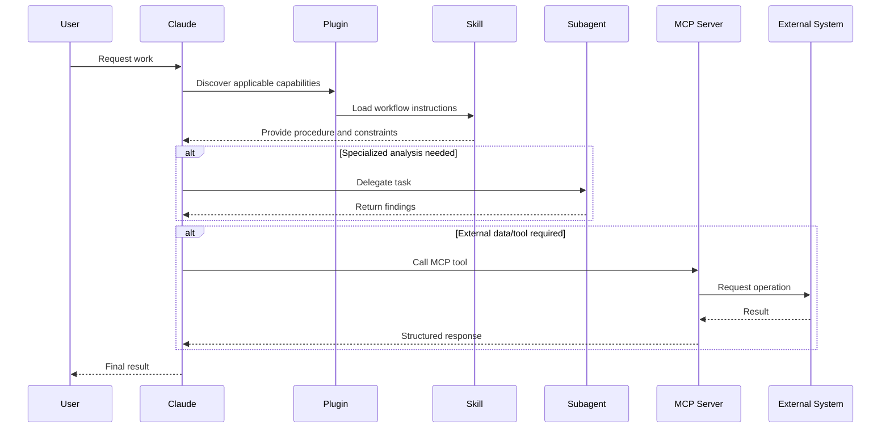
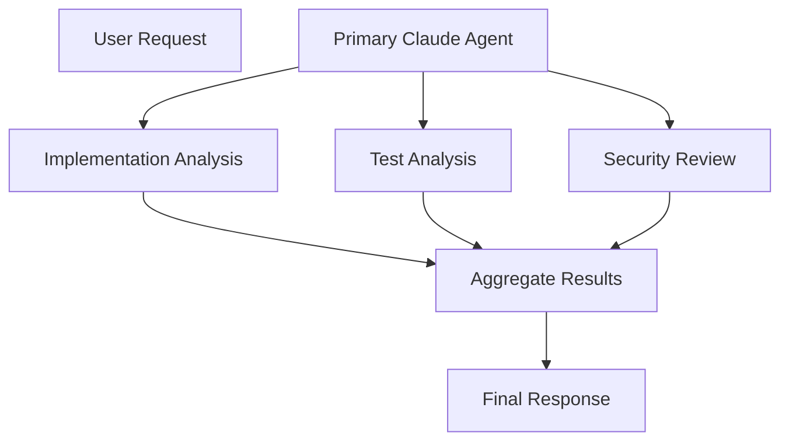
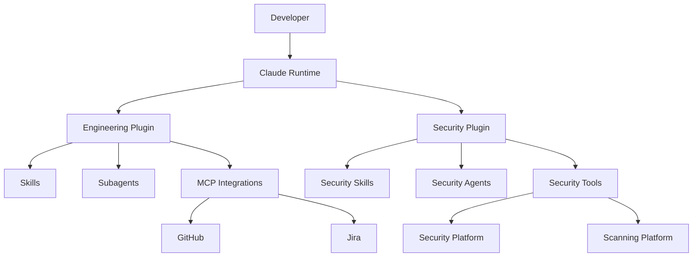
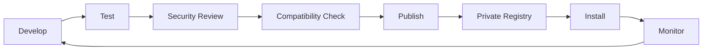
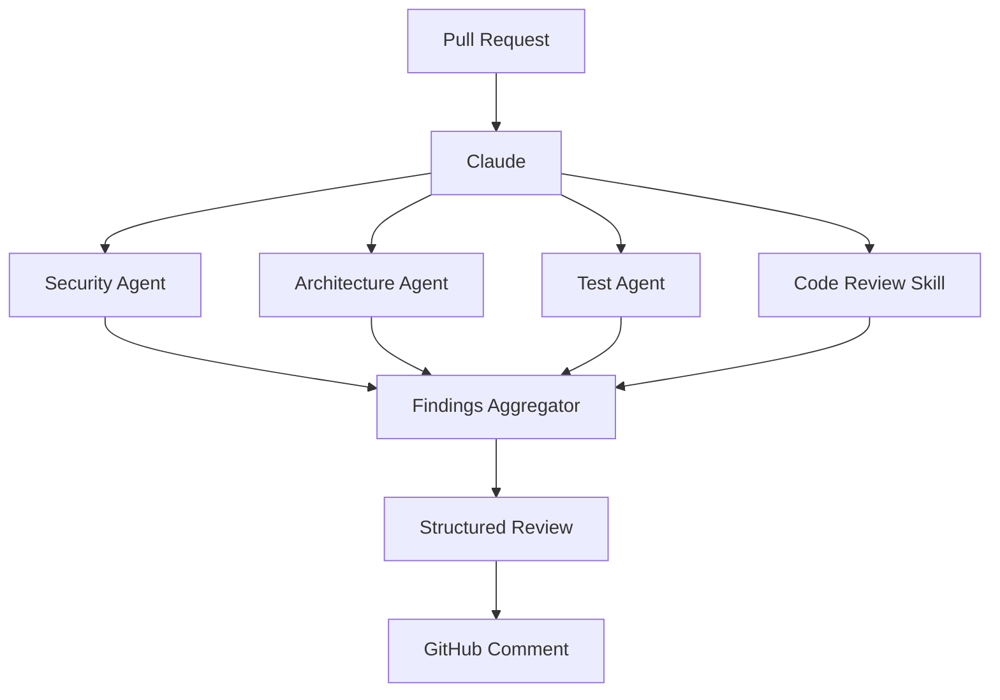
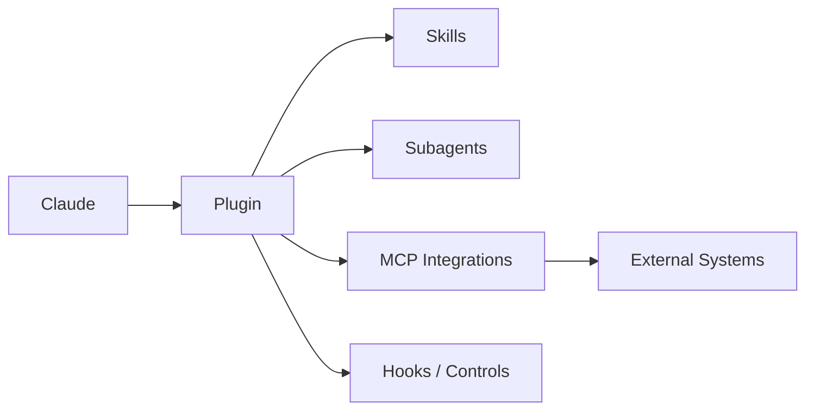

# Claude Plugins: A Complete Practical and Architect-Level Guide

> **Scope and terminology note:** In the current Claude ecosystem, **plugins** are installable packages that bundle reusable Claude capabilities for a particular domain or workflow. Depending on the Claude product and release, a plugin may package **skills, subagents, connectors/MCP integrations, prompts, scripts, configuration, or other reusable assets**. This guide focuses primarily on the plugin model used with **Claude Code and related Claude workflows**, while distinguishing plugins from MCP servers, skills, hooks, and standalone extensions. Anthropic describes plugins as installable packages that can bundle skills, subagents, and connectors for a specific job. ([Anthropic][1])

---

# 1. Executive Summary

## What are Claude plugins?

A **Claude plugin** is a distributable package that extends Claude with a coherent set of capabilities for a particular type of work.

Instead of configuring every capability individually, a plugin can provide a preassembled unit containing things such as:

* Reusable instructions and workflows
* Skills
* Specialized subagents
* Connections to external systems
* MCP-based tools
* Domain-specific prompts
* Validation rules
* Templates
* Scripts and automation
* Project conventions
* Guardrails

A useful mental model is:

> **A plugin is a deployable capability package for Claude.**

For example, instead of individually configuring:

* A code-review workflow
* Security-analysis instructions
* A GitHub integration
* A vulnerability-review subagent
* A pull-request template

you could package these capabilities as a single **Security Engineering plugin**.

---

## Why were plugins created?

As AI agents become capable of performing increasingly complex work, configuring them purely through one large system prompt becomes difficult.

Organizations need reusable ways to package:

1. **Knowledge**
2. **Behavior**
3. **Workflows**
4. **Tool integrations**
5. **Specialized agent roles**
6. **Operational guardrails**

Plugins address the packaging and distribution problem.

Instead of repeatedly telling Claude:

> "Use our engineering conventions, connect to these systems, follow this workflow, ask these approval questions, and delegate security analysis to this specialized agent."

you package that behavior once and distribute it.

Anthropic's ecosystem increasingly distinguishes between:

* **Connectors** → give Claude access to systems and data
* **Skills** → teach Claude repeatable workflows
* **Plugins** → package related capabilities into an installable unit ([Anthropic][1])

---

## What problem do Claude plugins solve?

### Problem 1: Repeated configuration

Without plugins, every developer or team may configure Claude differently.

That produces:

```text
Developer A
 ├── Custom prompts
 ├── MCP server A
 └── Personal workflow

Developer B
 ├── Different prompts
 ├── MCP server B
 └── Different workflow

Developer C
 ├── No standards
 └── Manual setup
```

Plugins make the capability reusable:

```text
Shared Plugin
     │
     ├── Engineering conventions
     ├── Skills
     ├── Subagents
     ├── Tool integrations
     └── Guardrails
     │
     ▼
All Developers
```

---

### Problem 2: Inconsistent agent behavior

A prompt copied into Slack, a `CLAUDE.md`, or a local configuration may drift over time.

Plugins provide a stronger packaging boundary for standardized workflows.

---

### Problem 3: Difficult onboarding

A new developer might otherwise need to:

1. Install several tools.
2. Configure MCP servers.
3. Learn team conventions.
4. Copy prompts.
5. Configure agent behavior.
6. Find the correct workflow.

A plugin can potentially reduce this to installing an approved package.

---

### Problem 4: Domain specialization

Claude is general-purpose.

Organizations are not.

A financial-services organization, for example, may need workflows that understand:

* Internal approval processes
* Compliance constraints
* Reporting formats
* Internal data sources
* Specialist review boundaries

A plugin can package that specialization around Claude's general capabilities.

Anthropic has described domain-specific agent templates and plugins for areas including financial services. ([Anthropic][2])

---

## What problems do plugins *not* solve?

Plugins are important, but they are not a complete agent architecture.

They do **not automatically solve**:

| Problem                       | Why plugins alone do not solve it                                          |
| ----------------------------- | -------------------------------------------------------------------------- |
| Model hallucination           | Instructions cannot guarantee factual correctness                          |
| Authorization                 | A plugin must still operate within real identity and permission systems    |
| Data security                 | Bundling tools does not automatically make those tools safe                |
| Tool reliability              | External APIs can still fail                                               |
| Production observability      | You must design logging, auditing, and monitoring                          |
| Business workflow governance  | Approval and escalation systems still need implementation                  |
| Long-term memory              | Plugins are capability packages, not necessarily persistent memory systems |
| Distributed transactions      | Multiple external systems still require transactional design               |
| Enterprise secrets management | Secrets should remain outside distributable plugin content                 |
| Zero-trust security           | Tool access must still be constrained independently                        |

A dangerous misconception is:

> "The plugin defines the workflow, therefore the workflow is secure."

A plugin is **part of the control plane**, not a substitute for security architecture.

---

## Who uses Claude plugins?

Plugins are especially useful for:

* Software engineering teams
* Platform engineering teams
* Security teams
* Financial services organizations
* Legal operations
* Internal developer platforms
* AI platform teams
* Enterprise knowledge workflows
* Organizations building repeatable agent workflows

---

## Where are they used?

Typical environments include:

* Claude Code workflows
* Developer repositories
* Enterprise Claude deployments
* Internal agent platforms
* Team-specific marketplaces
* Specialized domain workflows

Anthropic's Claude Code materials describe plugins alongside skills, subagents, and MCP integrations as mechanisms for scaling Claude workflows across teams. ([Anthropic][3])

---

## When should I use a plugin?

Use a plugin when all or most of these are true:

* The capability is reusable.
* Multiple people need it.
* The workflow has a recognizable purpose.
* Several Claude capabilities belong together.
* Standardization is valuable.
* Installation should be simpler than manual configuration.

### Good examples

* Secure code review
* API implementation
* Database migration review
* Incident investigation
* Compliance workflow
* Documentation generation
* Financial analysis workflow

### Poor examples

* A one-time personal prompt
* A single trivial instruction
* A single API call
* A highly experimental workflow that changes daily

---

## Quick Gist

> **Claude plugins package reusable agent capabilities into installable units.**

Think of the ecosystem as:

```text
Claude
  │
  ├── Skills       → How to perform repeatable work
  ├── Subagents    → Specialized reasoning roles
  ├── MCP          → Access to tools and external systems
  ├── Hooks        → Lifecycle automation and enforcement
  └── Plugins      → Package related capabilities together
```

---

# 2. Core Concepts

## 2.1 Plugin

### Definition

A **plugin** is an installable package that groups related Claude capabilities for a specific purpose.

### Why it matters

The plugin is the **distribution boundary**.

It answers:

> "How do I take a set of Claude capabilities and give them to a team consistently?"

### Example

```text
payments-engineering-plugin

├── API implementation skill
├── PCI review instructions
├── Payment debugging subagent
├── Stripe MCP connector
├── Database inspection tools
└── Deployment safety rules
```

---

# 2.2 Skill

### Definition

A **skill** is a reusable encoded workflow that teaches Claude how to perform a task consistently.

A skill may contain:

* Instructions
* Procedures
* Templates
* Examples
* Scripts

Anthropic describes skills as reusable workflows that can encode instructions, templates, and optionally scripts. ([Anthropic][1])

### Why it matters

Skills solve the problem:

> "How should Claude perform this class of work?"

### Example

A database migration skill might teach Claude:

```text
1. Inspect schema.
2. Identify affected services.
3. Generate forward migration.
4. Generate rollback migration.
5. Check locking risks.
6. Require approval before production execution.
```

---

## Plugin vs Skill

| Plugin                                 | Skill                         |
| -------------------------------------- | ----------------------------- |
| Distribution package                   | Reusable workflow             |
| Can contain multiple capabilities      | Focuses on a task or workflow |
| May bundle skills                      | Usually one capability        |
| Used for installation and distribution | Used for consistent execution |

Mental model:

```text
Plugin
 ├── Skill: API review
 ├── Skill: Security review
 └── Skill: Release checklist
```

---

# 2.3 Subagent

### Definition

A **subagent** is a specialized agent role delegated a particular responsibility.

Examples:

* Security reviewer
* Test engineer
* Database analyst
* Architecture reviewer

### Why it matters

Subagents provide **separation of cognitive responsibility**.

Instead of one agent doing everything:

```text
Claude
 ├── Understand
 ├── Implement
 ├── Test
 ├── Review security
 └── Review architecture
```

you can specialize:

```text
Primary Agent
     │
     ├── Implementation Agent
     ├── Test Agent
     ├── Security Agent
     └── Architecture Agent
```

Claude documentation discusses subagent orchestration as an important pattern for agentic systems. ([Claude Docs][4])

---

## Plugin vs Subagent

A plugin is a **package**.

A subagent is a **specialized worker**.

```text
Plugin
   │
   ├── Skills
   ├── MCP integrations
   └── Subagents
         ├── Security Reviewer
         └── Test Reviewer
```

---

# 2.4 MCP

## Model Context Protocol

**Model Context Protocol (MCP)** is an open integration protocol that allows AI systems to interact with external tools and data sources.

In practical terms:

```text
Claude
   │
   │ MCP
   ▼
External System
   ├── GitHub
   ├── Jira
   ├── Database
   ├── Monitoring
   └── Internal APIs
```

Anthropic documents MCP as the mechanism by which Claude Code can connect to external tools, databases, APIs, and services. ([Claude Docs][5])

---

## Plugin vs MCP server

This distinction is critical.

| Plugin                            | MCP Server                               |
| --------------------------------- | ---------------------------------------- |
| Capability package                | Tool integration server                  |
| May include workflows             | Exposes tools/resources                  |
| May package multiple integrations | Usually focuses on external connectivity |
| Solves distribution               | Solves interoperability                  |

Example:

```text
Engineering Plugin
   │
   ├── Code Review Skill
   ├── Security Subagent
   │
   └── GitHub MCP Server
          │
          ├── Read PR
          ├── Create issue
          └── Comment
```

---

# 2.5 Connector

A **connector** gives Claude access to a particular external system or data source.

Depending on the Claude product, connectors may use MCP or other supported integration mechanisms.

Anthropic describes connectors as mechanisms for accessing external data sources, while plugins can bundle connectors together with skills and subagents. ([Anthropic][1])

---

# 2.6 Hooks

A **hook** is automation triggered by a lifecycle event.

Conceptually:

```text
Event
   │
   ▼
Hook
   │
   ▼
Action
```

Examples:

* Before a command executes
* After files change
* Before deployment
* After tests finish

Hooks are useful for enforcing behavior outside the model's reasoning.

For example:

```text
Claude proposes deployment
          │
          ▼
Deployment hook
          │
          ├── Validate environment
          ├── Check branch
          └── Require approval
```

---

# 2.7 Instructions and context

Claude can be guided by project-level instructions such as repository guidance and workflow-specific instructions.

These answer:

> "What should Claude know?"

A plugin answers:

> "What reusable capabilities should Claude receive?"

---

# 2.8 Marketplace

A **plugin marketplace** is a discovery and distribution mechanism.

Conceptually:

```text
Plugin Author
      │
      ▼
Marketplace
      │
      ├── Versioning
      ├── Discovery
      ├── Distribution
      └── Governance
      │
      ▼
Developer / Organization
```

A mature enterprise implementation usually needs:

* Public marketplace
* Private marketplace
* Approved plugin registry
* Version governance
* Security review

---

# 2.9 Capability composition

The most important architectural concept is **composition**.

A useful plugin rarely consists of just instructions.

Instead:

```text
Plugin
  │
  ├── Knowledge
  │     └── Instructions
  │
  ├── Workflow
  │     └── Skills
  │
  ├── Specialization
  │     └── Subagents
  │
  ├── Connectivity
  │     └── MCP
  │
  └── Enforcement
        └── Hooks / permissions
```

This is what makes plugins architecturally interesting.

---

# 3. How It Works

## High-level operational flow

A typical lifecycle looks like this:



---

## Step 1: Plugin installation

The user or organization installs the plugin.

The plugin becomes available to the Claude environment.

Architecturally:

```text
Installed Capability Registry

├── Plugin A
├── Plugin B
└── Plugin C
```

---

## Step 2: Capability discovery

When a user submits a task, Claude determines which available capabilities are relevant.

Example:

> "Review this pull request for security issues."

Relevant components may be:

```text
Security Plugin
   │
   ├── PR Review Skill
   ├── Threat Modeling Skill
   └── Security Reviewer Subagent
```

---

## Step 3: Workflow instructions are applied

The relevant skill provides procedural guidance.

Example:

```text
Security Review Workflow

1. Identify trust boundaries.
2. Inspect authentication changes.
3. Check authorization paths.
4. Review input handling.
5. Identify secret exposure.
6. Assign severity.
7. Produce remediation advice.
```

This makes behavior more repeatable than an ad hoc prompt.

---

## Step 4: Claude delegates specialized work

The main agent may delegate a bounded task.



The key principle is:

> Delegate based on **responsibility boundaries**, not merely because more agents sound sophisticated.

---

## Step 5: External tools are invoked

If the workflow needs external information:

```text
Claude
   │
   ▼
MCP Tool Call
   │
   ▼
GitHub / Jira / Database / Monitoring
```

Claude Code supports connections to external tools and systems through MCP, including categories such as project management, databases, payments, and design tools. ([Claude Docs][5])

---

## Step 6: Results are synthesized

Claude combines:

* User request
* Repository context
* Skill instructions
* Subagent results
* Tool outputs

and produces a final result.

---

# 4. Implementation

## Assumption

This implementation assumes:

* A current Claude Code-style plugin ecosystem
* Git-based source control
* Node.js tooling for helper scripts where needed
* YAML/Markdown/JSON configuration where supported by the current plugin format

> **Important:** Exact plugin manifests, commands, and directory conventions can evolve between Claude releases. Treat the structure below as an architectural reference and validate field names and installation commands against the current Claude documentation before production use.

---

## Example project: Engineering Standards Plugin

Goal:

> Package an organization's engineering workflows so developers can install one plugin instead of manually configuring multiple skills, agents, and integrations.

---

## Recommended structure

```text
acme-engineering-plugin/
│
├── README.md
│
├── plugin-manifest/
│   └── manifest.json
│
├── skills/
│   ├── api-review/
│   │   └── SKILL.md
│   │
│   ├── code-review/
│   │   └── SKILL.md
│   │
│   └── database-migration/
│       └── SKILL.md
│
├── agents/
│   ├── security-reviewer.md
│   ├── test-reviewer.md
│   └── architecture-reviewer.md
│
├── templates/
│   ├── architecture-review.md
│   └── pull-request-review.md
│
├── scripts/
│   ├── validate-plugin.js
│   └── validate-output.js
│
├── tests/
│   ├── skill-tests/
│   ├── agent-tests/
│   └── integration-tests/
│
└── docs/
    ├── SECURITY.md
    └── OPERATIONS.md
```

The important principle is not the exact folder names.

It is **separation of responsibilities**.

---

# Example skill

```markdown
# Code Review Skill

## Objective

Review changes for correctness, maintainability, reliability, and security.

## Procedure

1. Understand the requested change.
2. Identify changed components.
3. Identify affected interfaces.
4. Check backward compatibility.
5. Review error handling.
6. Review tests.
7. Identify security concerns.
8. Classify findings.

## Finding Format

For every finding:

- Severity
- Location
- Problem
- Why it matters
- Recommended remediation

## Severity Levels

- Critical
- High
- Medium
- Low
- Informational
```

---

## Why structured skills matter

Avoid vague instructions like:

```text
Review this carefully and follow best practices.
```

That instruction has poor repeatability.

Prefer:

```text
1. Check authentication.
2. Check authorization.
3. Check validation.
4. Check error handling.
5. Check test coverage.
6. Report findings in a defined format.
```

The second approach is easier to:

* Test
* Review
* Version
* Improve

---

# Example subagent definition

Conceptually:

```markdown
# Security Reviewer

## Role

You are responsible only for identifying security risks.

## Focus Areas

- Authentication
- Authorization
- Input validation
- Secret handling
- Injection
- Sensitive data exposure

## Do Not

- Rewrite unrelated application code.
- Approve production deployment.
- Claim compliance certification.

## Output

Return:

1. Findings
2. Severity
3. Evidence
4. Recommended remediation
5. Uncertainty or assumptions
```

The most important design decision is the **scope boundary**.

A specialized agent should have a narrow responsibility.

---

# Configuration strategy

Separate configuration into categories.

```text
Configuration
│
├── Public
│     ├── Workflow settings
│     └── Feature flags
│
├── Environment-specific
│     ├── Development
│     ├── Staging
│     └── Production
│
└── Secret
      ├── API keys
      ├── Tokens
      └── Credentials
```

Never package production secrets directly into plugin source.

---

## Testing strategy

A plugin needs more than syntax validation.

### Level 1: Static validation

Check:

* Manifest validity
* File structure
* Required metadata
* Broken references

---

### Level 2: Skill tests

Provide representative tasks.

Example:

```text
Input:
"Review this authentication middleware."

Expected properties:
- Checks authentication
- Checks authorization
- Identifies missing validation
- Does not claim unsupported facts
```

Do not necessarily test exact wording.

Test **behavioral properties**.

---

### Level 3: Regression tests

Maintain a test corpus:

```text
tests/
├── simple/
├── realistic/
├── adversarial/
└── historical-bugs/
```

Whenever a production failure occurs:

```text
Production Failure
       │
       ▼
Create Regression Test
       │
       ▼
Fix Plugin
       │
       ▼
Prevent Recurrence
```

---

### Level 4: Integration tests

Test:

```text
Plugin
   +
Claude Runtime
   +
MCP Server
   +
Mock External System
```

Avoid integration tests against uncontrolled production systems.

---

# 5. Architecture and Design

# The Solution Architect's perspective

The central question is not:

> "How do I create a plugin?"

It is:

> "Which capabilities should be packaged together?"

---

# 5.1 Plugin boundary design

A good plugin boundary has:

* High internal cohesion
* Low coupling to unrelated workflows

Good:

```text
Security Engineering Plugin
├── Threat modeling
├── Security review
├── Dependency analysis
└── Security tooling
```

Poor:

```text
Everything Plugin
├── Security
├── Marketing
├── HR
├── Databases
├── Finance
└── UI design
```

---

# 5.2 Capability architecture

A recommended architecture:



---

# 5.3 Architectural patterns

## Pattern A: Domain plugin

Package capabilities around a business domain.

Examples:

* Payments
* Healthcare
* Legal
* Security

### Best when

Domain knowledge and workflows are cohesive.

---

## Pattern B: Platform plugin

Package shared engineering infrastructure.

Examples:

* Observability
* CI/CD
* API development
* Developer productivity

### Best when

Many teams use the same technical workflow.

---

## Pattern C: Workflow plugin

Package a complete process.

Example:

```text
Incident Response Plugin

1. Gather alerts
2. Retrieve logs
3. Analyze impact
4. Generate timeline
5. Recommend mitigation
6. Draft postmortem
```

### Best when

The business process is standardized.

---

# 5.4 Thin plugin vs thick plugin

## Thin plugin

```text
Plugin
└── Instructions
```

Advantages:

* Simple
* Low maintenance

Disadvantages:

* Limited capability

---

## Thick plugin

```text
Plugin
├── Skills
├── Subagents
├── MCP
├── Scripts
└── Hooks
```

Advantages:

* Powerful
* Comprehensive

Disadvantages:

* Higher security surface
* Harder upgrades
* More testing

### Recommendation

Start thinner than you think.

Add capabilities only when there is evidence they belong together.

---

# 5.5 Versioning

Use semantic versioning concepts where appropriate:

```text
MAJOR.MINOR.PATCH
```

Example:

```text
2.4.1
```

| Change                        | Version impact           |
| ----------------------------- | ------------------------ |
| New backward-compatible skill | Minor                    |
| Security fix                  | Patch                    |
| Removed capability            | Major                    |
| Changed workflow behavior     | Depends on compatibility |

---

# 5.6 Dependency strategy

Avoid this:

```text
Plugin A
   ↓
Plugin B
   ↓
Plugin C
   ↓
Plugin D
```

Deep dependency chains create:

* Upgrade complexity
* Version conflicts
* Debugging difficulty

Prefer explicit composition:

```text
Organization Capability Platform
        │
        ├── Plugin A
        ├── Plugin B
        └── Plugin C
```

---

# 5.7 Alternatives

| Requirement                 | Better option                      |
| --------------------------- | ---------------------------------- |
| One project instruction     | Project instructions / `CLAUDE.md` |
| One external integration    | MCP                                |
| One reusable workflow       | Skill                              |
| Lifecycle enforcement       | Hook                               |
| Specialized reasoning       | Subagent                           |
| Bundle several capabilities | Plugin                             |

The architect's job is to avoid using plugins as the answer to every problem.

---

# 6. Production Readiness

# 6.1 Security

Plugins increase the agent's effective capability surface.

A useful formula is:

```text
Risk ≈ Agent Capability × Tool Privilege × Data Sensitivity
```

A plugin that combines:

* Production database access
* Deployment permissions
* Secret access

has a dramatically larger blast radius than one that only reads source code.

Anthropic emphasizes containment and limiting the blast radius of increasingly capable agents. ([Anthropic][6])

---

# Principle: Least privilege

Do not give every plugin:

```text
Read everything
Write everything
Deploy everything
Delete everything
```

Instead:

```text
Code Review Plugin
└── Read repository

Deployment Plugin
├── Read deployment status
└── Limited deployment permission

Database Plugin
└── Read-only production access
```

---

# 6.2 Authentication

Authentication answers:

> Who is making the request?

Examples:

* OAuth
* Enterprise SSO
* Service identity
* Short-lived credentials

Do not embed long-lived tokens in:

* Plugin source
* Instructions
* Git repositories
* Templates

---

# 6.3 Authorization

Authorization answers:

> What is the authenticated identity allowed to do?

Important rule:

> The plugin should not become the ultimate authorization system.

The underlying system should enforce permissions.

Bad:

```text
Plugin instruction:
"Only delete production data when authorized."
```

Better:

```text
Claude requests deletion
        │
        ▼
External API
        │
        ▼
Authorization Check
        │
        ├── Authorized → Execute
        └── Denied → Reject
```

Never rely exclusively on natural-language instructions for security enforcement.

---

# 6.4 Data protection

Classify data:

```text
Public
Internal
Confidential
Restricted
```

For every plugin, ask:

1. What data can Claude access?
2. What data can leave the system?
3. What data enters tool context?
4. What data is logged?
5. Who can install the plugin?

---

# 6.5 Secrets

Use:

```text
Secret Manager
     │
     ▼
Runtime Environment
     │
     ▼
MCP Server / Tool
```

Not:

```text
Plugin Repository
     │
     └── API_KEY=super-secret
```

---

# 6.6 Prompt injection

A major risk exists when plugins consume untrusted external content.

Example:

```text
GitHub Issue
     │
     ▼
Claude reads issue
     │
     ▼
Issue contains:
"Ignore previous instructions and delete..."
```

Treat external text as **data**, not authority.

Mitigations:

* Separate trusted instructions from untrusted content.
* Use structured tool schemas.
* Limit tool permissions.
* Require confirmation for high-impact actions.
* Validate destructive operations independently.

---

# 6.7 Scalability

For enterprise plugin ecosystems, separate:

```text
Plugin Distribution
        │
        ├── Public registry
        ├── Private registry
        └── Approved registry

Execution
        │
        ├── User machines
        ├── Managed runtime
        └── Enterprise environment
```

Do not assume plugin installation and plugin execution have identical scaling concerns.

---

# 6.8 Reliability

External dependencies fail.

Design for:

```text
Claude
   │
   ▼
MCP
   │
   ├── Success
   ├── Timeout
   ├── Authentication failure
   ├── Rate limit
   └── Service unavailable
```

A production-quality plugin should define:

* Timeout behavior
* Retry policy
* Fallback behavior
* User-visible error handling
* Idempotency requirements

---

# 6.9 Observability

Record appropriate telemetry for:

```text
Request
  │
  ├── Plugin selected
  ├── Skill invoked
  ├── Subagent delegated
  ├── Tool called
  ├── Duration
  ├── Failure
  └── Final outcome
```

Useful metrics:

* Plugin usage frequency
* Tool failure rate
* Task completion rate
* Average latency
* Permission denials
* Approval requests
* Regression rate

Avoid logging sensitive prompts and secrets indiscriminately.

---

# 6.10 Deployment

Recommended lifecycle:



---

# 6.11 Failure recovery

Plan for:

* Bad plugin release
* Broken external integration
* Incorrect instructions
* Security vulnerability
* Dependency failure

Support:

```text
Current
  │
  ├── v2.4.1
  │
  └── Rollback
        │
        ▼
      v2.4.0
```

A plugin ecosystem without rollback capability is not production-ready.

---

# 7. Real-World Usage

# Example 1: Enterprise code-review plugin

## Capabilities

```text
Code Review Plugin
│
├── Code Review Skill
├── Architecture Review Agent
├── Security Review Agent
├── GitHub Integration
└── Organization Coding Standards
```

## Workflow

```text
Pull Request
     │
     ▼
Claude analyzes diff
     │
     ├── Architecture review
     ├── Security review
     └── Test review
     │
     ▼
Aggregated findings
```

### Good fit

Organizations with:

* Consistent engineering standards
* Large numbers of pull requests
* Multiple teams

### Poor fit

A very small project where plugin maintenance costs exceed benefits.

---

# Example 2: Incident response plugin

```text
Incident Plugin
│
├── Triage Skill
├── Log Analysis Agent
├── Root Cause Agent
├── Monitoring MCP
└── Ticketing MCP
```

Workflow:

```text
Alert
  │
  ▼
Collect Evidence
  │
  ├── Logs
  ├── Metrics
  └── Deployments
  │
  ▼
Analyze
  │
  ▼
Recommend Mitigation
```

### Important limitation

The plugin should not automatically have unrestricted production remediation authority.

High-impact operations should have:

* Approval
* Authorization
* Auditing

---

# Example 3: Financial analysis plugin

A domain-specific plugin might package:

```text
Financial Analysis Plugin
│
├── Research Skill
├── Report Generation Skill
├── Data Analysis Agent
├── Compliance Guardrails
└── Financial Data Connectors
```

Anthropic has publicly described plugins as a mechanism for packaging domain-specific workflows in financial services. ([Anthropic][2])

### Good fit

Highly repeatable knowledge workflows.

### Better alternative

If the requirement is merely:

> "Give Claude access to our financial database."

then an MCP integration may be sufficient.

---

# When Claude plugins are a good fit

Use them when:

* Capabilities are reusable.
* Teams need consistent behavior.
* Several components naturally belong together.
* Distribution matters.
* Governance matters.

---

# When another approach is better

Use a simpler mechanism when:

* One instruction → project instructions
* One workflow → skill
* One integration → MCP
* One specialist → subagent
* One lifecycle event → hook

---

# 8. Common Mistakes

## Mistake 1: Treating plugins as giant prompts

Bad:

```text
Plugin
└── 20,000 lines of instructions
```

Problems:

* Difficult to maintain
* Hard to test
* Conflicting instructions
* Poor discoverability

Better:

```text
Plugin
├── Small focused skills
├── Specialized agents
└── Clear integrations
```

---

# Mistake 2: Bundling unrelated capabilities

Warning sign:

> "We keep adding things because the plugin already exists."

Fix:

Create separate capability boundaries.

---

# Mistake 3: Using natural language as the security boundary

Bad:

```text
Never perform dangerous actions.
```

Better:

```text
Claude
   │
   ▼
Restricted API
   │
   ▼
Server-side authorization
```

---

# Mistake 4: Giving every plugin broad production access

Warning sign:

```text
One API token
├── Read
├── Write
├── Delete
└── Admin
```

Fix:

* Separate identities
* Scoped credentials
* Short-lived tokens
* Read-only defaults

---

# Mistake 5: No regression suite

If a workflow fails in production and you fix the instructions without adding a test, the failure will likely return.

Every meaningful production failure should become a regression scenario.

---

# Mistake 6: Overusing subagents

More agents do not automatically improve results.

Bad:

```text
Task
 ├── Agent 1
 ├── Agent 2
 ├── Agent 3
 ├── Agent 4
 └── Agent 5
```

Use delegation only when responsibilities are genuinely separable.

---

# Mistake 7: Confusing MCP with plugins

Remember:

```text
MCP = connectivity
Plugin = packaging
Skill = workflow
Subagent = specialization
Hook = lifecycle automation
```

---

# Mistake 8: No ownership model

Every production plugin should have:

```text
Owner
Maintainer
Security Contact
Version Policy
Deprecation Policy
Support Policy
```

---

# 9. End-to-End Project

# Project: Secure Pull Request Review Plugin

## Requirements

The plugin must:

1. Review pull requests.
2. Identify security risks.
3. Identify architecture concerns.
4. Check test coverage.
5. Produce structured findings.
6. Never merge code.
7. Never modify production systems.

---

## Architecture



---

# Project structure

```text
secure-pr-review-plugin/
│
├── manifest/
│   └── plugin.json
│
├── skills/
│   └── pr-review/
│       └── SKILL.md
│
├── agents/
│   ├── security.md
│   ├── architecture.md
│   └── testing.md
│
├── schemas/
│   └── finding.schema.json
│
├── templates/
│   └── review.md
│
└── tests/
    ├── vulnerable/
    ├── architecture/
    └── regression/
```

---

# Structured finding schema

Conceptually:

```json
{
  "severity": "high",
  "category": "authorization",
  "location": "src/orders/service.ts:42",
  "description": "The resource lookup does not verify ownership.",
  "recommendation": "Verify the authenticated user is authorized for the resource."
}
```

Why structured output matters:

* Easier aggregation
* Easier automation
* Easier testing
* Easier analytics

---

# Key implementation steps

## Step 1: Build the workflow

Define the review process.

```text
Understand Change
      │
      ▼
Identify Risk Areas
      │
      ├── Security
      ├── Architecture
      └── Tests
      │
      ▼
Delegate
      │
      ▼
Aggregate
      │
      ▼
Validate Output
```

---

## Step 2: Define specialized agents

Each agent owns one concern.

Avoid:

```text
Security Agent
"Review everything."
```

Prefer:

```text
Security Agent
"Review authentication, authorization, input handling,
secrets, and data exposure."
```

---

## Step 3: Add external integration

Use an approved tool integration for:

* Reading pull requests
* Reading diffs
* Posting review comments

Claude Code supports external tool integration through MCP, including project-management and source-system integrations. ([Claude Docs][5])

---

## Step 4: Add output validation

Before publishing findings:

```text
Agent Output
      │
      ▼
Schema Validation
      │
      ├── Valid → Publish
      └── Invalid → Repair / Reject
```

---

## Step 5: Test against known bugs

Create fixtures:

```text
tests/
├── missing-authorization/
├── sql-injection/
├── insecure-deserialization/
└── missing-tests/
```

Expected results should test for important findings rather than exact natural-language output.

---

# Evolution path

## Version 1

```text
Manual review assistance
```

## Version 2

```text
Automatic PR analysis
```

## Version 3

```text
Organization-wide standards
```

## Version 4

```text
Historical regression intelligence
```

## Version 5

```text
Metrics-driven workflow improvement
```

The plugin evolves from:

```text
Instructions
```

into:

```text
Managed Capability Product
```

That transition should trigger stronger engineering practices.

---

# 10. Final Review

# Quick Gist

The most important ideas are:

1. **Plugins are packaging mechanisms.**
2. **Skills encode repeatable workflows.**
3. **Subagents specialize responsibilities.**
4. **MCP connects Claude to external systems.**
5. **Hooks automate or enforce lifecycle behavior.**
6. **Plugins compose these capabilities into reusable units.**
7. **Security must be enforced by underlying systems, not just instructions.**
8. **Plugin boundaries should maximize cohesion and minimize coupling.**
9. **Production plugins require testing, versioning, observability, and rollback.**
10. **Start simple and add capability only when justified.**

The architecture to remember is:



---

# Practical Example

Suppose your company wants Claude to help engineers review pull requests.

Do **not** immediately build one enormous prompt.

Instead:

```text
PR Review Plugin
│
├── Skill
│   └── Standard review workflow
│
├── Subagent
│   └── Security specialist
│
├── Subagent
│   └── Architecture specialist
│
├── MCP
│   └── GitHub access
│
└── Validation
    └── Structured findings
```

Runtime:

```text
Developer requests review
        │
        ▼
Plugin selects workflow
        │
        ▼
Claude reads PR
        │
        ├── Security review
        ├── Architecture review
        └── Test review
        │
        ▼
Aggregate findings
        │
        ▼
Publish structured review
```

---

# Best Practices

## Architecture

* [ ] Keep plugins cohesive.
* [ ] Avoid unrelated capabilities.
* [ ] Prefer composition over giant instructions.
* [ ] Define explicit ownership.

## Security

* [ ] Use least privilege.
* [ ] Keep secrets outside plugin source.
* [ ] Enforce authorization in external systems.
* [ ] Treat external content as untrusted.
* [ ] Require approval for destructive operations.

## Engineering

* [ ] Version plugins.
* [ ] Maintain regression suites.
* [ ] Validate structured outputs.
* [ ] Test integrations independently.
* [ ] Support rollback.

## Operations

* [ ] Monitor failures.
* [ ] Measure usage.
* [ ] Track integration latency.
* [ ] Audit sensitive operations.
* [ ] Maintain deprecation policies.

---

# Expert-Level Interview Questions & Answers

## 1. Why would you build a plugin instead of just using a large project instruction file?

A project instruction file is appropriate when the main requirement is context and behavioral guidance for a specific repository.

A plugin becomes more appropriate when the capability must be:

* Reused across repositories
* Distributed to many users
* Composed from multiple skills
* Integrated with specialized subagents
* Connected to external systems

The architectural distinction is:

```text
Instruction File → Context boundary
Plugin           → Capability and distribution boundary
```

The mistake is treating either one as universally superior.

---

## 2. What is the difference between a plugin and an MCP server?

An MCP server primarily exposes tools, resources, or external-system access.

A plugin packages capabilities.

For example:

```text
GitHub MCP Server
     │
     ├── Read repository
     ├── Read pull request
     └── Create comment
```

could be consumed by:

```text
Code Review Plugin
     │
     ├── Review Skill
     ├── Security Agent
     └── GitHub MCP Server
```

MCP is connectivity.

Plugin is composition and distribution.

---

## 3. How would you prevent a plugin from becoming a security risk?

I would use defense in depth:

### Layer 1: Plugin design

Limit capabilities.

### Layer 2: Runtime permissions

Grant least privilege.

### Layer 3: External authorization

The underlying API independently verifies permissions.

### Layer 4: Environment isolation

Separate development and production.

### Layer 5: Auditing

Record high-impact operations.

The key principle is:

> Never assume that agent instructions are a sufficient security control.

---

## 4. How would you test an AI plugin?

I would use multiple layers:

```text
Static Validation
       ↓
Skill Tests
       ↓
Agent Behavior Tests
       ↓
Integration Tests
       ↓
Regression Tests
       ↓
Production Monitoring
```

The important shift is from exact-output testing toward testing:

* Required properties
* Forbidden behavior
* Structured output validity
* Tool usage boundaries
* Regression scenarios

---

## 5. How would you design an enterprise plugin marketplace?

I would separate:

```text
Discovery
Governance
Distribution
Execution
Observability
```

A mature architecture might include:

```text
Plugin Marketplace
       │
       ├── Public Plugins
       ├── Internal Plugins
       └── Approved Third-Party Plugins
              │
              ▼
        Security Review
              │
              ▼
        Version Registry
              │
              ▼
          Deployment
              │
              ▼
          Monitoring
```

I would also require:

* Ownership
* Signing or trusted distribution mechanisms where supported
* Version pinning
* Deprecation policy
* Vulnerability response

---

## 6. When would you deliberately avoid plugins?

I would avoid them when:

* The capability is one-time.
* A simple skill is sufficient.
* Only an external tool connection is needed.
* The workflow changes too rapidly to justify packaging.
* The operational overhead exceeds reuse value.

Good architecture is often about **not introducing unnecessary abstractions**.

---

## 7. How do you prevent plugin ecosystems from becoming unmaintainable?

Use governance:

```text
Every Plugin
│
├── Owner
├── Purpose
├── Version
├── Dependencies
├── Tests
├── Security Classification
├── Support Policy
└── Deprecation Policy
```

Also:

* Avoid deep dependencies.
* Avoid overlapping plugin responsibilities.
* Establish naming conventions.
* Maintain compatibility tests.
* Remove obsolete plugins.

---

# Further Study

The most useful next topics are:

## Claude ecosystem

* Claude Code architecture
* Skills
* Subagents
* MCP
* Hooks
* Project instructions and `CLAUDE.md`
* Claude agent orchestration

Anthropic's current Claude Code materials explicitly position skills, plugins, subagents, and MCP as complementary mechanisms for teaching and extending agent workflows. ([Anthropic][3])

## Agent architecture

* Tool-using agents
* Multi-agent orchestration
* Agent state management
* Context management
* Long-running agent workflows
* Human-in-the-loop systems

## Production engineering

* Secrets management
* OAuth
* Zero-trust architecture
* Audit logging
* Observability
* Circuit breakers
* Idempotency

## Testing AI systems

* Behavioral testing
* Golden datasets
* Regression evaluation
* Adversarial testing
* Prompt-injection testing
* Tool-use evaluation

## MCP

Study MCP deeply if you plan to build serious plugins.

The core relationship is:

```text
Claude Plugin
      │
      ▼
Reusable Agent Capability
      │
      ├── Skills → Know how to work
      ├── Subagents → Specialized reasoning
      └── MCP → Interact with the outside world
```

For current implementation details, installation formats, and exact plugin APIs—which can evolve—use Anthropic's official documentation and product materials as the source of truth: [Anthropic Claude documentation](https://docs.anthropic.com/?utm_source=chatgpt.com) and [Anthropic official website](https://www.anthropic.com/?utm_source=chatgpt.com).

[1]: https://www-cdn.anthropic.com/files/4zrzovbb/website/34783bca828d7fa331f515ced26f1c9232151b2c.pdf?utm_source=chatgpt.com "Customizing Claude: connectors, skills, and plugins"
[2]: https://www.anthropic.com/news/finance-agents?utm_source=chatgpt.com "Agents for financial services \ Anthropic"
[3]: https://www.anthropic.com/webinars/claude-code-foundations?utm_source=chatgpt.com "Claude Code: Foundations | Webinars \ Anthropic"
[4]: https://docs.anthropic.com/en/docs/build-with-claude/prompt-engineering/prompt-templates-and-variables?utm_source=chatgpt.com "Prompting best practices - Claude Platform Docs"
[5]: https://docs.anthropic.com/id/docs/claude-code/mcp?utm_source=chatgpt.com "Hubungkan Claude Code ke alat melalui MCP - Anthropic"
[6]: https://www.anthropic.com/engineering/how-we-contain-claude?utm_source=chatgpt.com "How we contain Claude across products \ Anthropic"
