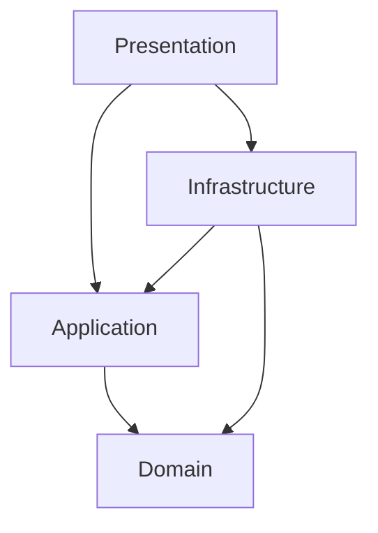
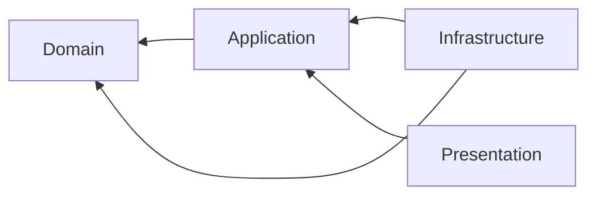
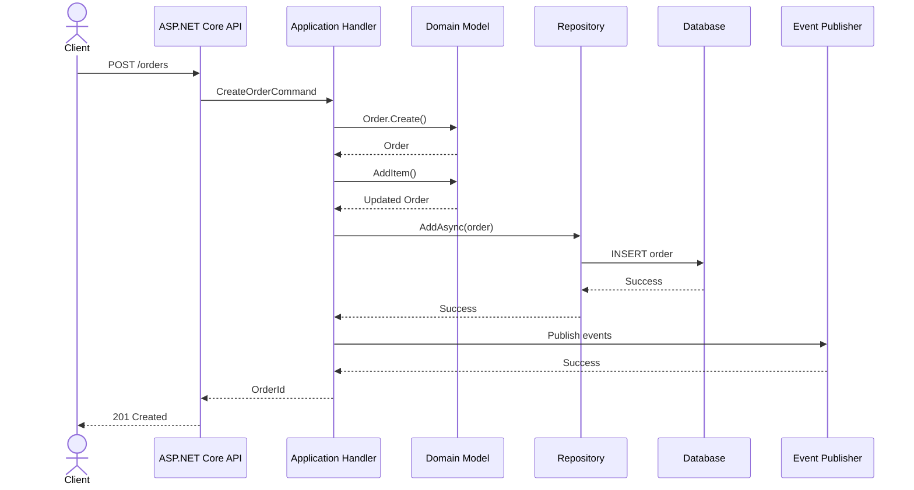
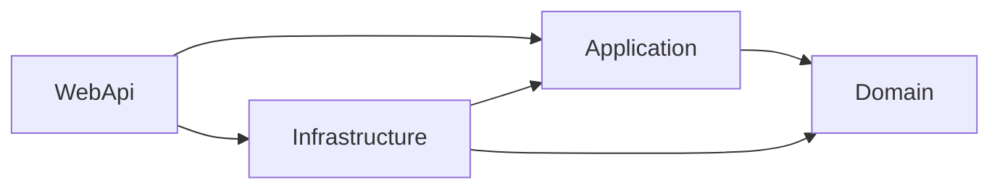
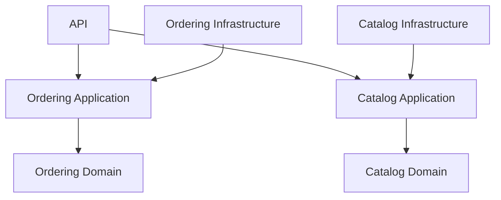
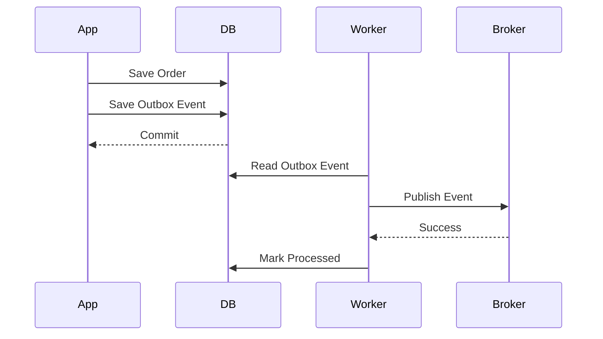
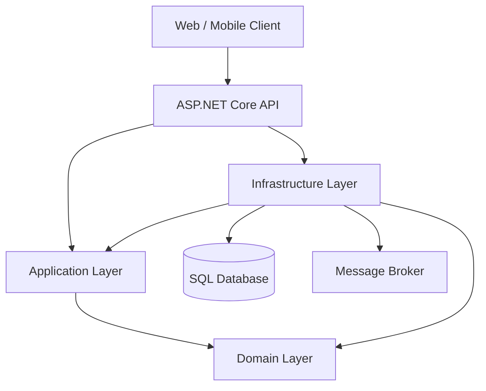

# .NET Clean Architecture: A Complete, Practical, Architect-Level Guide

## Scope and Assumptions

This guide focuses on **Clean Architecture applied to modern .NET applications**, especially:

* ASP.NET Core Web APIs
* .NET 10-style application architecture concepts, while keeping most examples compatible with modern .NET versions
* Entity Framework Core
* Dependency Injection built into ASP.NET Core
* REST-style HTTP APIs
* Unit and integration testing
* Modular enterprise applications

The principles are more important than any particular framework or library. Clean Architecture should survive changes to ASP.NET Core, EF Core, databases, messaging systems, and cloud providers.

---

# 1. Executive Summary

## What is .NET Clean Architecture?

**Clean Architecture** is a way of organizing software so that the most important business rules are independent from implementation details such as:

* Web frameworks
* Databases
* ORMs
* Message brokers
* File systems
* Cloud providers
* UI technologies

In a .NET solution, this commonly results in layers such as:

```text
┌──────────────────────────────────────┐
│ Presentation                         │
│ ASP.NET Core / Controllers / UI      │
├──────────────────────────────────────┤
│ Infrastructure                       │
│ EF Core / External APIs / Email      │
├──────────────────────────────────────┤
│ Application                          │
│ Use Cases / Commands / Queries       │
├──────────────────────────────────────┤
│ Domain                               │
│ Business Rules / Entities / Value    │
│ Objects / Domain Events              │
└──────────────────────────────────────┘
```

However, the **real architecture is defined by dependency direction**, not folder names.

The fundamental rule is:

> Dependencies should point inward, toward business rules.

A simplified dependency graph:



The `Domain` project should ideally know nothing about:

* ASP.NET Core
* EF Core
* SQL Server
* HTTP
* Dependency Injection containers

---

## Why was Clean Architecture created?

Traditional applications often evolve into tightly coupled systems.

For example:

```text
Controller
    ↓
Service
    ↓
Entity Framework DbContext
    ↓
SQL Server
```

Initially this is simple.

Over time, business logic becomes scattered across:

* Controllers
* Services
* EF Core queries
* Stored procedures
* Background jobs
* Message consumers

The business rules become dependent on infrastructure.

Changing infrastructure can then require changing business logic.

Clean Architecture attempts to reverse this relationship.

Instead of:

> Business depends on the database.

It aims for:

> The database depends on the business/application abstractions.

---

## What problem does it solve?

Clean Architecture primarily solves **coupling between business logic and implementation details**.

It helps with:

### 1. Testability

Business rules can often be tested without:

* SQL Server
* HTTP servers
* Azure resources
* Docker
* External APIs

### 2. Replaceability

For example:

```text
Application
    ↓
IOrderRepository
    ↓
┌─────────────────┬──────────────────┐
│ EF Core         │ Future alternative│
│ SQL Server      │ Dapper/PostgreSQL │
└─────────────────┴──────────────────┘
```

The application depends on an abstraction.

Infrastructure provides the implementation.

### 3. Maintainability

Responsibilities are separated.

Instead of one class doing everything:

```csharp
public async Task<IActionResult> CreateOrder(...)
{
    // Validation
    // Business rules
    // Database access
    // Email sending
    // Logging
}
```

The responsibilities are distributed according to architectural boundaries.

### 4. Business-rule protection

The most important logic becomes less dependent on technology.

For example:

```text
Order cannot be shipped before payment.
```

This rule should remain valid whether the application uses:

* SQL Server
* PostgreSQL
* MongoDB
* REST
* gRPC
* A console application

---

## What problems does it not solve?

Clean Architecture is **not a solution to all software problems**.

It does not automatically solve:

* Bad domain modeling
* Poor requirements
* Distributed-system failures
* Incorrect security design
* Slow databases
* Poor API design
* Lack of observability
* Premature microservices
* Poor team communication
* Excessive abstraction

A poorly designed Clean Architecture solution can be more complicated than a simple layered application.

For example:

```text
Interface
    ↓
Service
    ↓
Handler
    ↓
Repository
    ↓
Generic Repository
    ↓
Unit of Work
    ↓
ORM
```

This can be worse than:

```text
Use Case
    ↓
DbContext
```

Architecture should reduce accidental complexity, not create it.

---

## Who uses it, where is it used, and when should I use it?

Clean Architecture is commonly useful in:

* Enterprise applications
* Financial systems
* Healthcare systems
* Insurance systems
* E-commerce platforms
* Logistics systems
* SaaS platforms
* Government systems
* Long-lived business applications

It is especially valuable when:

* Business logic is complex
* The application will live for years
* Multiple developers or teams contribute
* Infrastructure may change
* Testing is important
* There are multiple entry points
* The same business rules are used by APIs, workers, and other interfaces

### It may be unnecessary when:

* The application is a small CRUD tool
* The domain has almost no business logic
* The project is temporary
* The team is very small
* Delivery speed is significantly more important than long-term flexibility

A simpler architecture may be better.

---

## Quick Gist

> **Clean Architecture organizes a system around business capabilities rather than frameworks. The Domain contains core business concepts, the Application layer contains use cases, Infrastructure implements technical concerns, and Presentation exposes the system to users or external clients. Dependencies point inward.**

---

# 2. Core Concepts

## 2.1 Dependency Rule

### Definition

The **Dependency Rule** says that source-code dependencies should point toward higher-level policies and business rules.



The inner layers should not depend on outer layers.

### Why it matters

Suppose the Domain depends directly on EF Core:

```csharp
public class Order
{
    public DbSet<OrderItem> Items { get; set; }
}
```

Now the business model is coupled to EF Core.

This makes the framework part of the domain model.

Instead:

```csharp
public class Order
{
    private readonly List<OrderItem> _items = [];

    public IReadOnlyCollection<OrderItem> Items => _items;

    public void AddItem(ProductId productId, int quantity)
    {
        if (quantity <= 0)
        {
            throw new DomainException(
                "Quantity must be greater than zero.");
        }

        _items.Add(new OrderItem(productId, quantity));
    }
}
```

The domain expresses business behavior without knowing persistence technology.

---

## 2.2 Domain Layer

### Definition

The **Domain layer** contains the most fundamental business concepts and rules.

Typical contents:

* Entities
* Value objects
* Domain services
* Domain events
* Domain exceptions
* Domain rules

### Why it matters

The Domain should answer:

> What does the business mean?

It should not answer:

> How do we save this to SQL Server?

### Example

```csharp
public class Order
{
    public OrderId Id { get; private set; }

    public OrderStatus Status { get; private set; }

    public void Confirm()
    {
        if (Status != OrderStatus.Pending)
        {
            throw new DomainException(
                "Only pending orders can be confirmed.");
        }

        Status = OrderStatus.Confirmed;
    }
}
```

This is a business rule.

It belongs close to the domain concept it protects.

---

## 2.3 Entity

### Definition

An **Entity** is an object defined primarily by its identity rather than its attributes.

Example:

```text
Customer #123
```

Even if the customer's name changes, the customer remains the same entity.

### Example

```csharp
public class Customer
{
    public CustomerId Id { get; private set; }

    public CustomerName Name { get; private set; }
}
```

### Entity versus Value Object

| Entity                     | Value Object               |
| -------------------------- | -------------------------- |
| Has identity               | Defined by its values      |
| Can change over time       | Usually immutable          |
| Equality based on identity | Equality based on contents |
| Example: Order             | Example: Money             |

---

## 2.4 Value Object

### Definition

A **Value Object** represents a meaningful concept defined by its value.

Examples:

* Money
* EmailAddress
* Address
* DateRange

### Example

```csharp
public sealed record Money(decimal Amount, string Currency)
{
    public static Money Create(decimal amount, string currency)
    {
        if (amount < 0)
        {
            throw new DomainException(
                "Amount cannot be negative.");
        }

        return new Money(amount, currency);
    }
}
```

### Why it matters

Value objects prevent primitive obsession.

Instead of:

```csharp
decimal amount;
string currency;
```

Use:

```csharp
Money total;
```

This creates a stronger domain language.

---

## 2.5 Aggregate

### Definition

An **Aggregate** is a consistency boundary containing one or more domain objects.

The main entity is the **Aggregate Root**.

Example:

```text
Order Aggregate
│
├── Order
│
└── OrderItems
```

External code should generally interact with the aggregate through its root.

### Example

```csharp
public class Order
{
    private readonly List<OrderItem> _items = [];

    public IReadOnlyCollection<OrderItem> Items => _items;

    public void AddItem(ProductId productId, int quantity)
    {
        _items.Add(
            new OrderItem(productId, quantity));
    }
}
```

Instead of allowing arbitrary modification:

```csharp
order.Items.Clear();
```

The aggregate root controls the invariant.

An **invariant** is a rule that must always remain true.

---

## 2.6 Application Layer

### Definition

The **Application layer** coordinates use cases.

It answers:

> What can the system do?

Examples:

* Create an order
* Cancel an order
* Register a customer
* Process payment
* Generate a report

### Example

```csharp
public sealed record CreateOrderCommand(
    Guid CustomerId,
    IReadOnlyCollection<CreateOrderItem> Items);
```

Handler:

```csharp
public sealed class CreateOrderHandler
{
    private readonly IOrderRepository _orders;

    public CreateOrderHandler(
        IOrderRepository orders)
    {
        _orders = orders;
    }

    public async Task<Guid> Handle(
        CreateOrderCommand command,
        CancellationToken cancellationToken)
    {
        var order = Order.Create(
            CustomerId.From(command.CustomerId));

        foreach (var item in command.Items)
        {
            order.AddItem(
                ProductId.From(item.ProductId),
                item.Quantity);
        }

        await _orders.AddAsync(
            order,
            cancellationToken);

        return order.Id.Value;
    }
}
```

The handler coordinates the workflow.

The entity protects domain rules.

---

## 2.7 Use Cases

### Definition

A **Use Case** represents an application capability.

Examples:

```text
CreateOrder
CancelOrder
ShipOrder
GetOrderDetails
```

### Why it matters

A common mistake is organizing Application code around technical concepts:

```text
Services
Managers
Helpers
Utilities
```

A use-case-oriented structure is clearer:

```text
Application
└── Orders
    ├── CreateOrder
    ├── CancelOrder
    └── GetOrderDetails
```

This maps architecture directly to business capabilities.

---

## 2.8 CQRS

### Definition

**CQRS**, or Command Query Responsibility Segregation, separates operations into:

* **Commands**: change state
* **Queries**: return information

Example:

```text
CreateOrderCommand
GetOrderDetailsQuery
```

### Command

```csharp
public sealed record CancelOrderCommand(
    Guid OrderId);
```

### Query

```csharp
public sealed record GetOrderDetailsQuery(
    Guid OrderId);
```

### Why it matters

Commands and queries usually have different requirements.

Commands often need:

* Domain rules
* Transactions
* Consistency

Queries often need:

* Efficient projections
* Read models
* Pagination

However:

> CQRS does not require separate databases.

A single database can support CQRS.

---

## 2.9 Dependency Inversion Principle

### Definition

High-level policy should not depend directly on low-level implementation.

Both should depend on abstractions.

Example:

```text
Application
    ↓
IPaymentGateway
    ↑
Infrastructure
```

Interface:

```csharp
public interface IPaymentGateway
{
    Task<PaymentResult> ChargeAsync(
        PaymentRequest request,
        CancellationToken cancellationToken);
}
```

Implementation:

```csharp
public sealed class StripePaymentGateway
    : IPaymentGateway
{
    public Task<PaymentResult> ChargeAsync(
        PaymentRequest request,
        CancellationToken cancellationToken)
    {
        // Stripe implementation

        throw new NotImplementedException();
    }
}
```

The Application layer does not depend on the payment provider.

---

## 2.10 Dependency Injection

### Definition

**Dependency Injection** is a technique where dependencies are supplied from outside an object.

Instead of:

```csharp
public class OrderService
{
    private readonly OrderRepository _repository =
        new OrderRepository();
}
```

Use:

```csharp
public class OrderService
{
    private readonly IOrderRepository _repository;

    public OrderService(
        IOrderRepository repository)
    {
        _repository = repository;
    }
}
```

ASP.NET Core provides the dependency at runtime.

---

## 2.11 Ports and Adapters

Clean Architecture is closely related to **Hexagonal Architecture**.

A **Port** is an abstraction representing an interaction.

An **Adapter** implements that interaction.

Example:

```text
Application Port

IEmailSender
     │
     ├── SMTP Adapter
     │
     ├── SendGrid Adapter
     │
     └── Azure Communication Adapter
```

The Application defines what it needs.

Infrastructure decides how it is implemented.

---

## 2.12 Repository

### Definition

A **Repository** abstracts persistence operations for domain objects.

Example:

```csharp
public interface IOrderRepository
{
    Task<Order?> GetByIdAsync(
        OrderId id,
        CancellationToken cancellationToken);

    Task AddAsync(
        Order order,
        CancellationToken cancellationToken);
}
```

### Important distinction

A repository is not automatically required for every entity.

This is often overengineered:

```text
IGenericRepository<T>
```

A generic repository may merely duplicate EF Core functionality.

Prefer repositories when they represent meaningful domain collection boundaries.

---

## 2.13 Unit of Work

### Definition

A **Unit of Work** coordinates changes as a transaction.

EF Core's `DbContext` already behaves similarly to a Unit of Work.

Therefore, adding this:

```text
GenericRepository
+
GenericUnitOfWork
+
DbContext
```

may introduce unnecessary abstraction.

The question is not:

> Should every Clean Architecture application have a Unit of Work?

The better question is:

> Does this abstraction simplify our application's transaction boundaries?

---

## 2.14 Domain Events

### Definition

A **Domain Event** represents something meaningful that happened in the domain.

Examples:

```text
OrderPlaced
PaymentReceived
OrderCancelled
```

Example:

```csharp
public sealed record OrderPlacedDomainEvent(
    Guid OrderId,
    Guid CustomerId);
```

Domain events can trigger additional behavior.

For example:

```text
Order Placed
     │
     ├── Send confirmation
     ├── Reserve inventory
     └── Notify analytics
```

Be careful with transaction boundaries.

A domain event is not automatically a distributed event.

---

## 2.15 Integration Events

An **Integration Event** communicates between independently deployable systems.

Example:

```text
Order Service
     │
     │ OrderCreatedIntegrationEvent
     ▼
Inventory Service
```

Common transports:

* Azure Service Bus
* RabbitMQ
* Kafka

Important distinction:

| Domain Event            | Integration Event          |
| ----------------------- | -------------------------- |
| Internal business event | Cross-system communication |
| Usually internal        | External contract          |
| Can be synchronous      | Often asynchronous         |
| Domain-oriented         | Integration-oriented       |

Do not expose domain events directly as public integration contracts without deliberate design.

---

# 3. How It Works

Consider this use case:

> A customer creates an order.

## Runtime Flow



---

## Step 1: The client calls the API

Example:

```http
POST /orders
```

Payload:

```json
{
  "customerId": "2b3d...",
  "items": [
    {
      "productId": "8e1f...",
      "quantity": 2
    }
  ]
}
```

The API is responsible for transport concerns.

Examples:

* HTTP
* Authentication
* Serialization
* HTTP status codes

The API should not become the primary location for business rules.

---

## Step 2: Presentation converts input into an application request

```csharp
app.MapPost("/orders", async (
    CreateOrderRequest request,
    ISender sender,
    CancellationToken cancellationToken) =>
{
    var command = new CreateOrderCommand(
        request.CustomerId,
        request.Items.Select(x =>
            new CreateOrderItem(
                x.ProductId,
                x.Quantity))
            .ToList());

    var result = await sender.Send(
        command,
        cancellationToken);

    return Results.Created(
        $"/orders/{result.OrderId}",
        result);
});
```

The HTTP model and Application model may be different.

This is intentional.

---

## Step 3: The Application layer executes the use case

The handler coordinates:

```text
Validate
   ↓
Load required state
   ↓
Execute domain behavior
   ↓
Persist
   ↓
Trigger side effects
```

The Application layer should generally avoid containing rules that naturally belong inside domain objects.

---

## Step 4: Domain objects enforce business rules

Example:

```csharp
order.AddItem(productId, quantity);
```

The domain object validates invariants.

Example:

```csharp
public void AddItem(
    ProductId productId,
    int quantity)
{
    if (Status != OrderStatus.Draft)
    {
        throw new DomainException(
            "Items cannot be changed after confirmation.");
    }

    if (quantity <= 0)
    {
        throw new DomainException(
            "Quantity must be greater than zero.");
    }

    _items.Add(
        new OrderItem(productId, quantity));
}
```

---

## Step 5: Infrastructure persists the result

Infrastructure implements the abstraction.

```csharp
public sealed class OrderRepository
    : IOrderRepository
{
    private readonly ApplicationDbContext _dbContext;

    public OrderRepository(
        ApplicationDbContext dbContext)
    {
        _dbContext = dbContext;
    }

    public async Task AddAsync(
        Order order,
        CancellationToken cancellationToken)
    {
        await _dbContext.Orders.AddAsync(
            order,
            cancellationToken);

        await _dbContext.SaveChangesAsync(
            cancellationToken);
    }
}
```

The Application layer does not know:

* Which database exists
* Whether EF Core is used
* Which SQL dialect is used

---

# 4. Implementation

## Recommended Solution Structure

A practical starting point:

```text
MyApp.sln

src/
├── MyApp.Domain/
│   ├── Entities/
│   ├── ValueObjects/
│   ├── Events/
│   ├── Exceptions/
│   └── Services/
│
├── MyApp.Application/
│   ├── Common/
│   │   ├── Behaviors/
│   │   ├── Interfaces/
│   │   └── Models/
│   │
│   └── Features/
│       ├── Orders/
│       │   ├── CreateOrder/
│       │   ├── CancelOrder/
│       │   └── GetOrderDetails/
│       │
│       └── Customers/
│
├── MyApp.Infrastructure/
│   ├── Persistence/
│   │   ├── Configurations/
│   │   ├── Repositories/
│   │   └── Migrations/
│   │
│   ├── Messaging/
│   ├── Identity/
│   └── ExternalServices/
│
└── MyApp.WebApi/
    ├── Endpoints/
    ├── Middleware/
    └── Program.cs

tests/
├── MyApp.Domain.Tests/
├── MyApp.Application.Tests/
├── MyApp.Infrastructure.Tests/
└── MyApp.WebApi.IntegrationTests/
```

---

## Project References

A healthy dependency structure:



The Domain should not reference:

```text
Application
Infrastructure
WebApi
```

The Application should not reference:

```text
Infrastructure
WebApi
```

---

## Step 1: Domain Entity

```csharp
public sealed class Order
{
    private readonly List<OrderItem> _items = [];

    private Order()
    {
    }

    public OrderId Id { get; private set; }

    public CustomerId CustomerId { get; private set; }

    public OrderStatus Status { get; private set; }

    public IReadOnlyCollection<OrderItem> Items => _items;

    public static Order Create(CustomerId customerId)
    {
        return new Order
        {
            Id = OrderId.New(),
            CustomerId = customerId,
            Status = OrderStatus.Draft
        };
    }

    public void AddItem(
        ProductId productId,
        int quantity)
    {
        if (Status != OrderStatus.Draft)
        {
            throw new DomainException(
                "Order cannot be modified.");
        }

        if (quantity <= 0)
        {
            throw new DomainException(
                "Quantity must be positive.");
        }

        _items.Add(
            new OrderItem(productId, quantity));
    }

    public void Confirm()
    {
        if (_items.Count == 0)
        {
            throw new DomainException(
                "Cannot confirm an empty order.");
        }

        Status = OrderStatus.Confirmed;
    }
}
```

### Design reasoning

The entity controls state changes.

Avoid:

```csharp
order.Status = OrderStatus.Confirmed;
```

Prefer:

```csharp
order.Confirm();
```

This protects invariants.

---

## Step 2: Application Command

```csharp
public sealed record CreateOrderCommand(
    Guid CustomerId,
    IReadOnlyCollection<CreateOrderItem> Items)
    : IRequest<CreateOrderResult>;
```

Result:

```csharp
public sealed record CreateOrderResult(
    Guid OrderId);
```

---

## Step 3: Application Handler

```csharp
public sealed class CreateOrderHandler
    : IRequestHandler<
        CreateOrderCommand,
        CreateOrderResult>
{
    private readonly IOrderRepository _orders;

    public CreateOrderHandler(
        IOrderRepository orders)
    {
        _orders = orders;
    }

    public async Task<CreateOrderResult> Handle(
        CreateOrderCommand request,
        CancellationToken cancellationToken)
    {
        var order = Order.Create(
            CustomerId.From(request.CustomerId));

        foreach (var item in request.Items)
        {
            order.AddItem(
                ProductId.From(item.ProductId),
                item.Quantity);
        }

        order.Confirm();

        await _orders.AddAsync(
            order,
            cancellationToken);

        return new CreateOrderResult(
            order.Id.Value);
    }
}
```

The handler orchestrates.

The entity owns business behavior.

---

## Step 4: Infrastructure Repository

```csharp
public sealed class OrderRepository
    : IOrderRepository
{
    private readonly ApplicationDbContext _db;

    public OrderRepository(
        ApplicationDbContext db)
    {
        _db = db;
    }

    public async Task AddAsync(
        Order order,
        CancellationToken cancellationToken)
    {
        await _db.Orders.AddAsync(
            order,
            cancellationToken);

        await _db.SaveChangesAsync(
            cancellationToken);
    }

    public Task<Order?> GetByIdAsync(
        OrderId id,
        CancellationToken cancellationToken)
    {
        return _db.Orders
            .Include(x => x.Items)
            .SingleOrDefaultAsync(
                x => x.Id == id,
                cancellationToken);
    }
}
```

---

## Step 5: EF Core Configuration

Prefer keeping persistence configuration outside domain entities.

```csharp
public sealed class OrderConfiguration
    : IEntityTypeConfiguration<Order>
{
    public void Configure(
        EntityTypeBuilder<Order> builder)
    {
        builder.ToTable("Orders");

        builder.HasKey(x => x.Id);

        builder.Property(x => x.Status)
            .HasConversion<string>();

        builder.OwnsMany(
            x => x.Items,
            item =>
            {
                item.ToTable("OrderItems");
            });
    }
}
```

This prevents persistence concerns from leaking into the Domain.

---

## Step 6: Dependency Registration

```csharp
public static class DependencyInjection
{
    public static IServiceCollection
        AddInfrastructure(
            this IServiceCollection services,
            IConfiguration configuration)
    {
        services.AddDbContext<ApplicationDbContext>(
            options =>
                options.UseSqlServer(
                    configuration.GetConnectionString(
                        "DefaultConnection")));

        services.AddScoped<
            IOrderRepository,
            OrderRepository>();

        return services;
    }
}
```

`Program.cs`:

```csharp
var builder = WebApplication.CreateBuilder(args);

builder.Services.AddApplication();

builder.Services.AddInfrastructure(
    builder.Configuration);

builder.Services.AddAuthentication();

builder.Services.AddAuthorization();

var app = builder.Build();

app.UseAuthentication();

app.UseAuthorization();

app.MapEndpoints();

app.Run();
```

The Web API becomes the **composition root**.

A composition root is the location where implementations are connected to abstractions.

---

## Validation Strategy

Validation should exist at different levels.

### Transport validation

Examples:

* Missing required JSON field
* Invalid JSON format

### Application validation

Examples:

```text
Quantity must be provided.
Request cannot contain more than 100 items.
```

### Domain validation

Examples:

```text
Order cannot be confirmed without items.
Quantity cannot be negative.
```

Do not assume one validation layer replaces another.

---

## Testing Strategy

### Domain Tests

Fast and isolated.

```csharp
[Fact]
public void Confirm_ShouldThrow_WhenOrderHasNoItems()
{
    var order = Order.Create(
        CustomerId.New());

    var action = () => order.Confirm();

    action.Should()
        .Throw<DomainException>();
}
```

### Application Tests

Mock boundaries.

```csharp
var repository =
    Substitute.For<IOrderRepository>();
```

Test use-case orchestration.

### Infrastructure Tests

Test:

* EF mappings
* Repository behavior
* Database queries

### Integration Tests

Test the actual system:

```text
HTTP
  ↓
Authentication
  ↓
Endpoint
  ↓
Application
  ↓
Database
```

Use integration tests for critical workflows.

---

# 5. Architecture and Design

## How a Solution Architect Evaluates Clean Architecture

A Solution Architect should not start with:

> How many projects should the solution contain?

Start with:

> What are the business boundaries?

For example:

```text
E-Commerce Platform
│
├── Ordering
├── Catalog
├── Payments
├── Inventory
└── Shipping
```

These are business capabilities.

They may eventually become:

* Modules
* Bounded contexts
* Independently deployable services

But they should not automatically become microservices.

---

## Vertical Slice versus Horizontal Organization

### Horizontal organization

```text
Controllers/
Services/
Repositories/
Models/
```

A feature requires modifying many folders.

### Vertical slice organization

```text
Features/
└── Orders/
    └── CreateOrder/
        ├── Command.cs
        ├── Handler.cs
        ├── Validator.cs
        └── Response.cs
```

Vertical slices often work very well inside the Application layer.

---

## Clean Architecture and DDD

**Domain-Driven Design (DDD)** and Clean Architecture solve different problems.

| Clean Architecture         | DDD                            |
| -------------------------- | ------------------------------ |
| Dependency boundaries      | Domain modeling                |
| Framework independence     | Business language              |
| Architectural organization | Business complexity management |

They work well together.

But Clean Architecture does not require full DDD.

A simple CRUD application should not necessarily have:

```text
Aggregates
Domain Events
Domain Services
Specifications
Factories
Repositories
Value Objects
```

for every table.

---

## Clean Architecture and Modular Monoliths

A **Modular Monolith** is a single deployable application with strong internal module boundaries.

Example:

```text
Commerce Application
│
├── Ordering Module
├── Catalog Module
├── Inventory Module
└── Payments Module
```

Each module can internally follow Clean Architecture.



This is often a better starting point than microservices.

---

## Clean Architecture versus Traditional Layered Architecture

Traditional:

```text
Presentation
    ↓
Business Logic
    ↓
Data Access
```

Clean Architecture focuses more strongly on dependency direction.

The Data Access layer should not be architecturally "below" the business layer if the business layer depends directly on its implementation.

Instead:

```text
Business
    ↓ abstraction
Data Access
    ↑ implementation
```

---

## Alternatives and Trade-Offs

### Option 1: Simple ASP.NET Core CRUD

```text
Endpoint
   ↓
DbContext
```

Best for:

* Admin applications
* Simple internal tools
* Low business complexity

Advantages:

* Fast
* Minimal code

Disadvantages:

* Business rules may become scattered

---

### Option 2: Clean Architecture

Best for:

* Medium-to-large systems
* Complex business rules
* Long-lived applications

Advantages:

* Clear boundaries
* Testability
* Flexibility

Disadvantages:

* More concepts
* More files
* More architectural discipline required

---

### Option 3: Full DDD + Clean Architecture

Best for:

* Complex domains
* High business complexity
* Strategic enterprise systems

Advantages:

* Strong domain model
* Explicit invariants

Disadvantages:

* High learning curve
* Easy to overengineer

---

# 6. Production Readiness

## Security

Clean Architecture does not automatically make an application secure.

Security should include:

* Authentication
* Authorization
* Input validation
* Rate limiting where appropriate
* Secret management
* Audit logging
* Secure headers where relevant

---

## Authentication

Authentication answers:

> Who are you?

Examples:

* OpenID Connect
* OAuth 2.0
* JWT bearer tokens
* Cookie authentication

Authentication should generally remain near the application boundary.

The Domain should not depend on JWT claims.

Avoid:

```csharp
public class Order
{
    public void Confirm(JwtSecurityToken token)
    {
    }
}
```

The Domain should receive business-relevant information.

---

## Authorization

Authorization answers:

> Are you allowed to do this?

Application-level authorization can use abstractions such as:

```csharp
public interface ICurrentUser
{
    Guid? UserId { get; }

    bool IsInRole(string role);
}
```

For complex authorization, prefer business-oriented policies.

Instead of:

```text
Role == Manager
```

Sometimes the real rule is:

```text
CanApproveOrder
```

This decouples business capability from organizational role names.

---

## Data Protection

Protect:

* Personally identifiable information
* Secrets
* Credentials
* Financial data

Consider:

* Encryption at rest
* Encryption in transit
* Field-level encryption where required
* Data retention policies
* Data minimization

Do not log:

```text
Passwords
Access tokens
Payment details
Sensitive personal data
```

---

## Scalability

Clean Architecture helps isolate scaling decisions but does not automatically provide scalability.

Potential strategies:

### Horizontal scaling

```text
Load Balancer
    │
    ├── API Instance 1
    ├── API Instance 2
    └── API Instance 3
```

### Caching

Use caching for:

* Frequently read data
* Expensive computations

Do not introduce caching before understanding consistency requirements.

---

## Performance

Common problems:

```text
N+1 database queries
Large object graphs
Unnecessary abstraction
Excessive allocations
Serialization overhead
```

For read-heavy queries, it may be appropriate for Application query handlers to use optimized projections.

Example:

```csharp
var orders = await _db.Orders
    .AsNoTracking()
    .Where(x => x.CustomerId == customerId)
    .Select(x => new OrderSummaryDto(
        x.Id,
        x.Status))
    .ToListAsync(cancellationToken);
```

A query does not always need to reconstruct a complete aggregate.

---

## Reliability

Important techniques:

* Timeouts
* Retries
* Circuit breakers
* Idempotency
* Dead-letter queues
* Health checks

Avoid blind retries.

Retrying a non-idempotent payment request can create duplicate charges.

---

## Idempotency

An operation is **idempotent** if repeating it produces the same effective result.

For example:

```text
POST /payments
Idempotency-Key: abc123
```

If the client retries because of a timeout:

```text
First request
    ↓
Payment processed
    ↓
Response lost

Client retries
```

The server must avoid charging twice.

Store and validate the idempotency key.

---

## Observability

A production system should provide:

### Logs

Structured logging:

```csharp
logger.LogInformation(
    "Order {OrderId} created for customer {CustomerId}",
    orderId,
    customerId);
```

### Metrics

Examples:

* Request latency
* Error rate
* Queue depth
* Database latency

### Tracing

Distributed tracing follows a request across:

```text
API
 ↓
Application
 ↓
Database
 ↓
Message Broker
 ↓
Worker
```

---

## Failure Recovery

Critical workflows should consider:

```text
What happens if the database succeeds but publishing fails?
```

Example:

```text
Database transaction
      │
      ├── Order saved
      │
      └── Event publish fails
```

A common solution is the **Transactional Outbox Pattern**.



The business transaction and event record are persisted together.

Publishing happens separately.

---

# 7. Real-World Usage

## Use Case 1: E-Commerce

Business rules:

```text
Orders
Payments
Inventory
Discounts
Shipping
```

Clean Architecture is useful because business rules are likely to evolve independently from:

* Payment providers
* Databases
* Messaging platforms

---

## Use Case 2: Banking or Financial Operations

Example rules:

```text
Transfers
Account limits
Approval workflows
Transaction rules
Audit requirements
```

A strong Domain layer helps protect critical invariants.

Example:

```text
A transfer cannot exceed the approved daily limit.
```

---

## Use Case 3: Enterprise Workflow System

Examples:

```text
Purchase Requests
Approvals
Escalations
Notifications
```

The Application layer coordinates workflows.

The Domain layer represents business rules.

Infrastructure handles:

* Email
* Messaging
* Persistence
* Identity

---

## When Clean Architecture Is a Good Fit

Use it when:

* Rules matter more than CRUD
* The application will evolve
* Testing business logic is valuable
* Multiple infrastructure technologies exist
* The team needs explicit boundaries

---

## When Another Approach Is Better

A simple CRUD application may benefit from:

```text
Minimal API
   ↓
DbContext
```

Example:

```csharp
app.MapGet(
    "/products",
    async (ApplicationDbContext db) =>
        await db.Products
            .AsNoTracking()
            .ToListAsync());
```

Adding five architectural layers to this may not create value.

---

# 8. Common Mistakes

## Mistake 1: Treating folders as architecture

Warning sign:

```text
Domain/
Application/
Infrastructure/
```

but:

```text
Domain → Infrastructure
```

The project names are correct, but the dependency rule is violated.

---

## Mistake 2: Creating interfaces for everything

Bad:

```text
IOrderService
OrderService
```

when there is only one implementation and no architectural reason for the abstraction.

Interfaces should represent meaningful boundaries.

---

## Mistake 3: Generic Repository Overuse

Example:

```csharp
IGenericRepository<T>
```

Problems:

* Hides useful query capabilities
* Duplicates ORM abstractions
* Forces unrelated entities into the same persistence model

Use repositories intentionally.

---

## Mistake 4: Anemic Domain Models

An **anemic domain model** stores data but contains almost no behavior.

```csharp
public class Order
{
    public OrderStatus Status { get; set; }
}
```

Then business logic becomes scattered:

```text
OrderService
OrderManager
OrderHelper
OrderProcessor
```

When domain complexity justifies it, behavior should live with the domain concepts.

---

## Mistake 5: Putting All Logic in the Domain

Not every rule belongs in an entity.

Example:

```text
Send an email after order confirmation.
```

This is usually an application or infrastructure concern.

The Domain should not become a dumping ground.

---

## Mistake 6: Treating CQRS as a Requirement

You can implement Clean Architecture without:

* Mediation libraries
* Commands
* Queries
* Pipeline behaviors

CQRS is a tool, not a requirement.

---

## Mistake 7: Overusing Domain Events

Do not create events for every property change.

Bad:

```text
CustomerNameChanged
CustomerEmailChanged
CustomerPhoneChanged
```

unless these events have meaningful business significance.

---

## Mistake 8: Infrastructure Leakage

Example:

```csharp
public class Order
{
    public virtual ICollection<OrderItem> Items { get; set; }
}
```

This may introduce ORM concerns into the Domain.

Leakage is sometimes acceptable pragmatically, but it should be a conscious trade-off.

---

## Mistake 9: Too Many Projects

Avoid architecture like:

```text
MyApp.Core
MyApp.Core.Interfaces
MyApp.Core.Models
MyApp.Common
MyApp.Shared
MyApp.Shared.Common
MyApp.Utilities
```

Project boundaries should represent meaningful architectural boundaries.

---

# 9. End-to-End Project

# Project: Order Management System

## Requirements

The system must:

1. Create orders.
2. Add order items.
3. Confirm orders.
4. Cancel orders.
5. Retrieve order details.
6. Publish an event when an order is confirmed.

---

## Architecture



---

## Domain Model

```text
Order
│
├── OrderId
├── CustomerId
├── Status
│
└── OrderItems
     ├── ProductId
     └── Quantity
```

---

## Create Order Flow

```text
HTTP Request
    ↓
CreateOrderCommand
    ↓
Validation
    ↓
Create Aggregate
    ↓
Apply Domain Rules
    ↓
Persist
    ↓
Return Order ID
```

---

## Query Flow

For reads:

```text
HTTP GET
    ↓
GetOrderDetailsQuery
    ↓
Optimized SQL Projection
    ↓
DTO
    ↓
JSON Response
```

Do not force a query to load a full aggregate if a DTO projection is sufficient.

---

## Key Tests

### Domain

```text
✓ Cannot confirm empty order
✓ Cannot modify confirmed order
✓ Quantity must be positive
```

### Application

```text
✓ CreateOrder persists aggregate
✓ CancelOrder returns not found appropriately
✓ Command validation prevents invalid request
```

### Integration

```text
✓ POST /orders creates order
✓ GET /orders/{id} returns details
✓ Authentication is enforced
```

---

## Evolution Path

### Stage 1

```text
Single database
Single API
Modular code
```

### Stage 2

Add:

```text
Background processing
Caching
Transactional outbox
```

### Stage 3

If business and operational boundaries justify it:

```text
Ordering
Inventory
Payments
```

may communicate asynchronously.

Do not split merely because the original architecture diagram looked like microservices.

---

# 10. Final Review

# Quick Gist

The essential model is:

```text
Domain
    Business meaning and rules

Application
    Use cases and orchestration

Infrastructure
    Technology implementations

Presentation
    HTTP/UI and external interaction
```

The critical dependency direction is:

```text
Outer layers → Inner layers
```

The Domain should be protected from unnecessary knowledge of:

* EF Core
* ASP.NET Core
* SQL Server
* Cloud providers
* HTTP

Use abstractions at meaningful boundaries.

Do not abstract everything.

---

# Practical Example

A compact order-confirmation example:

```csharp
public sealed class Order
{
    private readonly List<OrderItem> _items = [];

    public OrderStatus Status { get; private set; }

    public void AddItem(ProductId productId, int quantity)
    {
        if (Status != OrderStatus.Draft)
        {
            throw new DomainException(
                "Order cannot be modified.");
        }

        if (quantity <= 0)
        {
            throw new DomainException(
                "Quantity must be positive.");
        }

        _items.Add(
            new OrderItem(productId, quantity));
    }

    public void Confirm()
    {
        if (_items.Count == 0)
        {
            throw new DomainException(
                "Cannot confirm an empty order.");
        }

        Status = OrderStatus.Confirmed;
    }
}
```

Application orchestration:

```csharp
public async Task<Guid> Handle(
    ConfirmOrderCommand command,
    CancellationToken cancellationToken)
{
    var order = await _repository.GetByIdAsync(
        OrderId.From(command.OrderId),
        cancellationToken);

    if (order is null)
    {
        throw new NotFoundException();
    }

    order.Confirm();

    await _repository.SaveAsync(
        order,
        cancellationToken);

    return order.Id.Value;
}
```

The use case coordinates.

The entity protects the business rule.

Infrastructure persists the result.

---

# Best Practices

## Architecture

* [ ] Keep dependency direction pointing inward.
* [ ] Organize Application code around use cases.
* [ ] Keep Domain independent from web and persistence frameworks.
* [ ] Use vertical slices when they improve feature ownership.
* [ ] Prefer meaningful modules over excessive technical layers.

## Domain

* [ ] Protect important invariants.
* [ ] Use value objects for meaningful concepts.
* [ ] Use aggregates as consistency boundaries.
* [ ] Avoid anemic models when business behavior is significant.
* [ ] Avoid forcing DDD complexity onto simple CRUD.

## Infrastructure

* [ ] Treat databases and external services as implementation details.
* [ ] Use repository abstractions only where they create value.
* [ ] Avoid unnecessary generic repositories.
* [ ] Design explicit transaction boundaries.
* [ ] Use the Outbox Pattern for reliable asynchronous integration where needed.

## Testing

* [ ] Unit test business rules.
* [ ] Unit test use-case orchestration.
* [ ] Integration test infrastructure boundaries.
* [ ] Test critical workflows end-to-end.

## Production

* [ ] Implement authentication and authorization deliberately.
* [ ] Validate input at appropriate layers.
* [ ] Protect secrets.
* [ ] Use structured logging.
* [ ] Add metrics and tracing.
* [ ] Handle timeouts and retries carefully.
* [ ] Design idempotency for retryable operations.
* [ ] Plan failure recovery.

---

# Expert-Level Interview Questions & Answers

## 1. Why is dependency direction more important than the number of layers?

**Answer:**

Layers are organizational constructs. Dependency direction determines coupling.

A system can have:

```text
Domain
Application
Infrastructure
```

and still violate Clean Architecture if:

```text
Domain → EF Core
Application → Infrastructure
```

The important question is:

> Can the business and application logic exist without knowing the implementation details?

If yes, the architecture is closer to Clean Architecture.

---

## 2. Should EF Core repositories always be hidden behind interfaces?

**Answer:**

No.

EF Core's `DbContext` already provides many persistence abstractions.

Adding:

```text
Repository
+
Generic Repository
+
Unit of Work
```

may only wrap existing functionality.

Repository abstractions are useful when:

* They represent domain collection boundaries.
* They isolate persistence decisions.
* They simplify testing or domain interactions.

For simple queries, direct optimized data access in the Application query side can be a better trade-off.

---

## 3. Where should validation live?

**Answer:**

Validation has multiple layers.

| Validation  | Example                    |
| ----------- | -------------------------- |
| Transport   | Invalid JSON               |
| Application | Required command fields    |
| Domain      | Cannot confirm empty order |
| Database    | Unique constraint          |

Do not expect one layer to replace all others.

The Domain should protect critical invariants because callers cannot always be trusted.

---

## 4. How do you prevent a Clean Architecture application from becoming overengineered?

**Answer:**

Apply abstractions when they protect a meaningful boundary.

Avoid creating:

```text
Interfaces for every class
Repositories for every entity
Factories for every object
Domain events for every state change
```

Architecture should match complexity.

Start with the simplest design that preserves important boundaries.

---

## 5. Should every system use CQRS?

**Answer:**

No.

CQRS is useful when read and write concerns have meaningfully different models.

For simple applications, a conventional application service can be easier to understand.

Use CQRS when it simplifies complexity, not because it is fashionable.

---

## 6. How would you handle database success but message publishing failure?

**Answer:**

Use a transactional outbox when reliability requirements justify it.

Within one database transaction:

```text
Save business change
+
Save event record
```

A background process later publishes the event.

This avoids relying on a distributed transaction between the database and message broker.

Consumers should also be idempotent because messages may be delivered more than once.

---

## 7. How would you evolve a Clean Architecture modular monolith into microservices?

**Answer:**

First establish strong module boundaries.

Avoid direct access to another module's internal data.

Define explicit integration contracts.

Then evaluate:

* Independent scaling needs
* Deployment independence
* Team ownership
* Data ownership
* Operational maturity

Only extract services when there is a meaningful organizational or technical boundary.

---

## 8. Where should authorization rules live?

**Answer:**

It depends on the rule.

Technical authorization:

```text
Is authenticated?
Has required claim?
```

usually belongs near application boundaries.

Business authorization:

```text
Can this employee approve an order of this value?
```

may belong in the Application or Domain model depending on how deeply it participates in business rules.

---

## 9. What is the difference between Clean Architecture and Onion Architecture?

**Answer:**

They are closely related.

Both emphasize:

* Dependency inversion
* Protecting business rules
* Infrastructure independence

The terminology and diagrams differ more than the fundamental principle.

The most important practical rule remains:

> Implementation details should depend on business policy, not the reverse.

---

# Further Study

After mastering the basics, study these topics in roughly this order:

## .NET Architecture

1. ASP.NET Core dependency injection lifetimes
2. EF Core tracking and change tracking
3. EF Core transaction behavior
4. Minimal APIs and endpoint organization
5. Modular monolith architecture

## Application Architecture

6. CQRS
7. Vertical Slice Architecture
8. Pipeline behaviors
9. Result and error handling patterns
10. Application-level authorization

## Domain Design

11. Domain-Driven Design
12. Aggregates and consistency boundaries
13. Value objects
14. Domain events
15. Bounded contexts

## Distributed Systems

16. Transactional Outbox Pattern
17. Idempotency
18. Event-driven architecture
19. Saga patterns
20. Eventual consistency

## Production Engineering

21. Structured logging
22. Distributed tracing
23. Metrics and service-level objectives
24. Resilience patterns
25. Containerized deployment and cloud architecture

The ultimate goal is not to produce a solution with the maximum number of projects, interfaces, patterns, or layers.

The goal is to build a system where:

> **Business complexity is explicit, dependencies are controlled, infrastructure remains replaceable where valuable, and the architecture makes future change safer rather than more expensive.**
