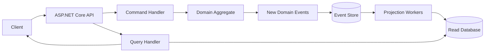
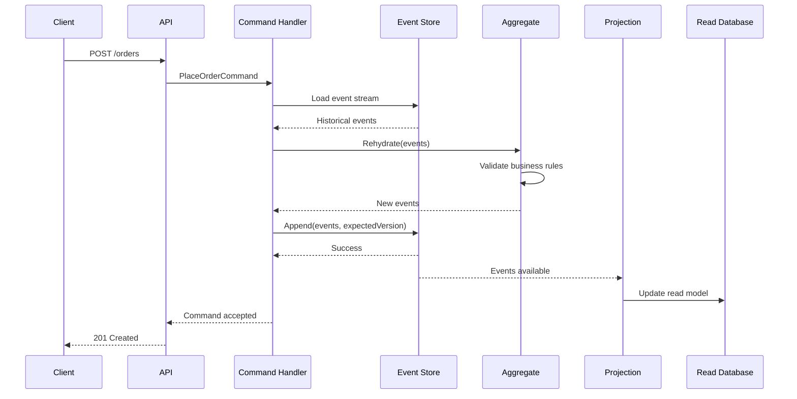
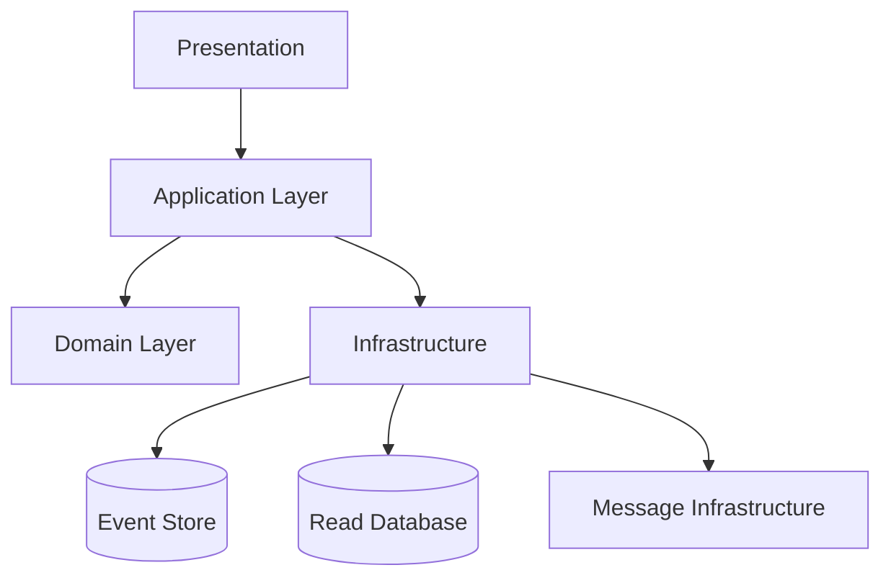
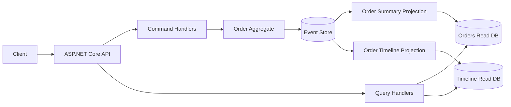

# .NET CQRS & Event Sourcing: A Complete Practical and Architect-Level Guide

## Scope and Assumptions

This guide focuses on building production-oriented CQRS and Event Sourcing systems using modern .NET.

Assumptions:

* **.NET 10 or later concepts**, while most examples are compatible with .NET 8+.
* **ASP.NET Core** for APIs.
* **C#** as the implementation language.
* A relational database or dedicated event store for persistence.
* Examples use simple interfaces rather than binding the architecture to a particular library.
* **CQRS and Event Sourcing are independent patterns**. They are often combined, but neither requires the other.

---

# 1. Executive Summary

## What is CQRS?

**CQRS (Command Query Responsibility Segregation)** is an architectural pattern that separates operations that **change state** from operations that **read state**.

* **Commands** request a state change.
* **Queries** retrieve information.
* A command should not return a rich representation whose purpose is querying.
* A query should not change business state.

Example:

```text
POST /orders
    → PlaceOrderCommand
    → changes state

GET /orders/123
    → GetOrderQuery
    → reads state
```

The fundamental idea is:

> The model optimized for making decisions does not have to be the same model optimized for reading information.

---

## What is Event Sourcing?

**Event Sourcing** is a persistence pattern in which the current state of an entity is derived from a sequence of immutable events representing facts that happened in the past.

Instead of storing:

```text
Order
------
Id: 123
Status: Paid
Total: 500
```

you store:

```text
OrderCreated
OrderItemAdded
OrderItemAdded
OrderSubmitted
PaymentReceived
```

The current order state is reconstructed by replaying those events.

Conceptually:

```text
Current State = Reduce(All Historical Events)
```

For example:

```csharp
var order = new Order();

foreach (var @event in events)
{
    order.Apply(@event);
}
```

---

## Why Were These Patterns Created?

Traditional CRUD systems work extremely well when:

* data is mostly independent,
* reads and writes have similar requirements,
* current state is more important than history,
* transactional consistency is relatively simple.

However, some domains have more complex requirements.

Examples:

* banking,
* trading,
* insurance,
* inventory,
* logistics,
* healthcare workflows,
* subscription systems,
* high-value business processes.

These systems often need to answer questions such as:

> Why is the current state what it is?

> Who changed it?

> What happened before this decision?

> Can we rebuild another representation of the business?

> Can different consumers react independently to business changes?

CQRS separates decision-making from information retrieval.

Event Sourcing preserves business history as first-class data.

---

## What Problem Does CQRS Solve?

CQRS can help solve:

### Different read and write requirements

A write model might require:

```text
Business rules
Validation
Authorization
Transactions
Consistency
Concurrency handling
```

A read model might require:

```text
Fast search
Filtering
Pagination
Denormalized data
Reporting
Different database structures
```

Using one model for both can create unnecessary complexity.

CQRS allows:

```text
Write Model                  Read Model

Order Aggregate              OrderSummary
----------------             -------------------
Business invariants          OrderId
Commands                    CustomerName
Domain logic                 Status
Strong consistency           Total
                             ItemCount
                             Optimized for UI
```

---

## What Problem Does Event Sourcing Solve?

Event Sourcing provides:

### Complete business history

Instead of:

```text
Balance = 1000
```

you know:

```text
AccountOpened
MoneyDeposited: 500
MoneyDeposited: 700
MoneyWithdrawn: 200
```

### Rebuildable state

You can create new projections later.

For example:

```text
Events
  │
  ├── Account Summary
  ├── Audit History
  ├── Customer Timeline
  ├── Fraud Detection Model
  └── Regulatory Report
```

### Better temporal reasoning

You can answer:

```text
What did we know at that time?
What was the account state yesterday?
When did the rule violation occur?
What sequence produced this outcome?
```

---

## What Problems Do CQRS and Event Sourcing Not Solve?

They do **not** automatically solve:

* bad domain modeling,
* poor business requirements,
* distributed transaction problems,
* authorization design,
* data privacy problems,
* event schema evolution,
* operational complexity,
* eventual consistency confusion,
* debugging distributed systems,
* network failures.

Event Sourcing in particular introduces significant complexity.

Do not adopt it simply because:

> "It is more advanced."

Advanced architecture is useful only when the domain justifies the cost.

---

## Who Uses These Patterns?

These patterns are commonly valuable in systems involving:

* financial transactions,
* order processing,
* inventory reservation,
* logistics,
* insurance claims,
* subscriptions,
* workflow engines,
* collaborative systems,
* regulated domains,
* event-driven architectures.

They are particularly useful when **business history itself is valuable data**.

---

## When Should I Use CQRS?

CQRS is a good candidate when:

* reads and writes have very different complexity,
* business logic is complex,
* read models need significant denormalization,
* independent scaling is useful,
* the system has multiple read consumers,
* reporting requirements differ significantly from transactional requirements.

---

## When Should I Use Event Sourcing?

Consider Event Sourcing when:

* history is a core business requirement,
* state transitions matter,
* audit trails must be trustworthy,
* temporal queries matter,
* new projections will likely be added,
* the domain is naturally event-oriented,
* business events are meaningful and stable.

---

## When Should I Avoid Them?

Avoid full CQRS/Event Sourcing when:

```text
Simple CRUD
+
Simple domain rules
+
Current state is sufficient
+
No meaningful event history
=
Usually use conventional persistence
```

For example:

```text
Employee Directory
Blog CMS
Simple Admin Portal
Product Catalog
Internal CRUD Configuration System
```

Event Sourcing would often be unnecessary.

---

## Quick Gist

> **CQRS separates changing state from reading state. Event Sourcing stores facts that happened instead of only storing current state.**

A common architecture is:

```text
Command
   ↓
Domain Aggregate
   ↓
Business Event
   ↓
Event Store
   ↓
Projection
   ↓
Read Model
   ↓
Query
```

Use CQRS when read and write concerns genuinely differ.

Use Event Sourcing when business history is important enough to justify its complexity.

---

# 2. Core Concepts

## 2.1 Command

### Definition

A **command** represents an intention to change the system.

Examples:

```csharp
PlaceOrder
CancelOrder
ReserveInventory
ShipOrder
```

Commands are usually imperative.

```text
DoSomething
```

rather than descriptive:

```text
SomethingWasDone
```

---

### Why It Matters

A command represents a request, not a fact.

This command:

```csharp
PlaceOrder
```

may fail.

The resulting event:

```csharp
OrderPlaced
```

represents something that already happened.

---

### Example

```csharp
public sealed record PlaceOrderCommand(
    Guid OrderId,
    Guid CustomerId,
    IReadOnlyList<OrderItemDto> Items);
```

The command handler decides whether the operation is valid.

---

## 2.2 Event

### Definition

An **event** represents an immutable fact about something that happened.

Examples:

```text
OrderPlaced
OrderCancelled
PaymentReceived
InventoryReserved
```

Events are generally written in the past tense.

---

### Why It Matters

Events become historical records.

A well-designed event should communicate a business fact:

```text
OrderPlaced
```

rather than an implementation detail:

```text
OrderStatusUpdated
```

The first communicates meaning.

The second communicates storage behavior.

---

### Example

```csharp
public sealed record OrderPlaced(
    Guid OrderId,
    Guid CustomerId,
    DateTimeOffset PlacedAtUtc);
```

---

## 2.3 Query

### Definition

A **query** retrieves data without changing business state.

Example:

```csharp
public sealed record GetOrderDetailsQuery(Guid OrderId);
```

Result:

```csharp
public sealed record OrderDetailsDto(
    Guid OrderId,
    string Status,
    decimal Total,
    IReadOnlyList<OrderItemDto> Items);
```

---

### Why It Matters

The query model can be optimized independently.

For example, the domain aggregate might contain:

```text
Rules
State transitions
Validation
Historical reconstruction
```

while the query model contains:

```text
Exactly what the UI needs
```

---

## 2.4 Aggregate

### Definition

An **aggregate** is a consistency boundary in Domain-Driven Design.

It is responsible for protecting business invariants.

Example:

```text
Order Aggregate
```

might enforce:

```text
Cannot submit an empty order
Cannot cancel a shipped order
Cannot add items after submission
```

---

### Why It Matters

The aggregate should make business decisions.

It should not become:

```text
Database table wrapper
```

Its responsibility is:

```text
Given current state
+
Given a requested action
=
Either reject
or produce new domain events
```

---

### Example

```csharp
public void Submit()
{
    if (_items.Count == 0)
        throw new DomainException(
            "An order must contain at least one item.");

    if (_status != OrderStatus.Draft)
        throw new DomainException(
            "Only draft orders can be submitted.");

    Raise(new OrderSubmitted(Id));
}
```

Notice:

```text
Command → decision → event
```

not:

```text
Command → directly mutate database
```

---

## 2.5 Event Stream

### Definition

An **event stream** is an ordered sequence of events belonging to an aggregate.

Example:

```text
Order-123

1 OrderCreated
2 ItemAdded
3 ItemAdded
4 OrderSubmitted
5 PaymentReceived
```

---

### Why It Matters

The aggregate state is reconstructed from the stream.

```text
Event 1
   ↓
State A
   ↓
Event 2
   ↓
State B
   ↓
Event 3
   ↓
State C
```

---

## 2.6 Projection

### Definition

A **projection** transforms events into another representation.

Example:

```text
OrderPlaced
    ↓
OrderSummaryProjection
    ↓
OrdersReadModel
```

---

### Why It Matters

The same events can produce many views.

```text
                    Events
                       │
        ┌──────────────┼──────────────┐
        ↓              ↓              ↓
 Order Summary    Customer History   Analytics
```

---

### Example

```csharp
public sealed class OrderSummaryProjection
{
    public OrderSummary Apply(
        OrderSummary? current,
        IDomainEvent @event)
    {
        return @event switch
        {
            OrderCreated e => new OrderSummary
            {
                OrderId = e.OrderId,
                CustomerId = e.CustomerId,
                Status = "Draft",
                Total = 0
            },

            OrderSubmitted e =>
                current! with
                {
                    Status = "Submitted"
                },

            _ => current!
        };
    }
}
```

---

## 2.7 Read Model

### Definition

A **read model** is a data representation optimized for querying.

Example:

```text
OrderSummary

OrderId
CustomerName
Status
Total
ItemCount
LastUpdated
```

This may not correspond directly to a domain entity.

---

## 2.8 Event Store

### Definition

An **event store** persists ordered immutable events.

Conceptually:

```text
StreamId
Version
EventType
EventData
Metadata
Timestamp
```

Example:

| Stream    | Version | Event          |
| --------- | ------: | -------------- |
| Order-123 |       1 | OrderCreated   |
| Order-123 |       2 | ItemAdded      |
| Order-123 |       3 | OrderSubmitted |

---

## 2.9 Optimistic Concurrency

### Definition

**Optimistic concurrency** assumes conflicts are rare.

The application loads aggregate version:

```text
Expected Version = 5
```

When saving:

```text
Append events only if stream version is still 5
```

If another request changed the stream:

```text
Actual Version = 6
```

the append fails.

---

### Why It Matters

Without concurrency control:

```text
Request A loads version 5
Request B loads version 5

A writes event 6
B writes event 6
```

One update could incorrectly overwrite or violate business assumptions.

---

## 2.10 Snapshot

### Definition

A **snapshot** stores a reconstructed aggregate state at a particular version.

Example:

```text
Events 1 → 1000
        ↓
Snapshot Version 1000
        ↓
Events 1001 → 1010
```

Instead of replaying 1,010 events:

```text
Load Snapshot
+
Replay last 10 events
```

---

### Important Distinction

A snapshot is generally an optimization.

The event stream remains the authoritative history.

---

## 2.11 Eventual Consistency

### Definition

A system is **eventually consistent** when different representations may temporarily differ but converge later.

Example:

```text
Command succeeds
       │
       ▼
Event persisted
       │
       ├── Projection A updated immediately
       │
       └── Projection B updated 500ms later
```

During that interval:

```text
Write model = latest
Read model = temporarily stale
```

---

## 2.12 Domain Event vs Integration Event

These are commonly confused.

### Domain Event

Represents something meaningful inside the domain.

```text
OrderPlaced
```

### Integration Event

Represents a message intended for another system.

```text
OrderPlacedIntegrationEvent
```

They may have similar data, but should not automatically be identical.

Why?

Internal domain events evolve according to domain needs.

External contracts require stability.

---

## Core Concept Comparison

| Concept           | Purpose                                        |
| ----------------- | ---------------------------------------------- |
| Command           | Requests a change                              |
| Aggregate         | Makes and validates business decisions         |
| Domain Event      | Records a fact that occurred                   |
| Event Stream      | Ordered aggregate history                      |
| Event Store       | Persists event streams                         |
| Projection        | Converts events into another model             |
| Read Model        | Optimized representation for queries           |
| Snapshot          | Performance optimization for aggregate loading |
| Integration Event | Communicates with external systems             |

---

# 3. How It Works

## End-to-End Command Flow

Consider:

```text
Place Order
```

The flow is:

1. API receives command.
2. Authentication identifies the caller.
3. Authorization determines whether the caller may perform the action.
4. Command handler loads the aggregate.
5. Aggregate validates business rules.
6. Aggregate produces events.
7. Events are appended using optimistic concurrency.
8. Events are published to projection consumers.
9. Read models are updated.
10. Queries retrieve optimized read models.

---

## Architecture Diagram



---

## Command Sequence



---

## Aggregate Rehydration

Suppose the event stream is:

```text
OrderCreated
ItemAdded
ItemAdded
OrderSubmitted
```

The aggregate starts empty:

```csharp
var order = new Order();
```

Events are replayed:

```csharp
order.Apply(OrderCreated);
order.Apply(ItemAdded);
order.Apply(ItemAdded);
order.Apply(OrderSubmitted);
```

The resulting state becomes:

```text
Status = Submitted
Items = 2
```

---

# 4. Implementation

## Recommended Project Structure

A pragmatic solution:

```text
src/

  Ordering.Api/
    Endpoints/
    Middleware/
    DependencyInjection/

  Ordering.Application/
    Commands/
      PlaceOrder/
      SubmitOrder/
    Queries/
      GetOrder/
    Interfaces/

  Ordering.Domain/
    Orders/
      Order.cs
      OrderItem.cs
      Events/
    Shared/

  Ordering.Infrastructure/
    EventStore/
    Projections/
    Persistence/
    Messaging/

tests/

  Ordering.Domain.Tests/
  Ordering.Application.Tests/
  Ordering.Integration.Tests/
  Ordering.Architecture.Tests/
```

---

## Why This Structure?

### Domain

Contains business logic independent of:

* HTTP,
* databases,
* message brokers,
* ORM frameworks.

### Application

Coordinates use cases.

Example:

```text
Load aggregate
→ execute command
→ persist events
```

### Infrastructure

Contains technical implementations.

Examples:

```text
PostgreSQL
Event store client
Message broker
Redis
```

### API

Translates:

```text
HTTP
↔
Application commands and queries
```

---

# Domain Implementation

## Base Event

```csharp
public interface IDomainEvent
{
    Guid AggregateId { get; }
}
```

---

## Aggregate Base Class

```csharp
public abstract class Aggregate
{
    private readonly List<IDomainEvent> _uncommittedEvents = [];

    public Guid Id { get; protected set; }

    public long Version { get; protected set; }

    public IReadOnlyCollection<IDomainEvent> UncommittedEvents
        => _uncommittedEvents;

    protected void Raise(IDomainEvent @event)
    {
        Apply(@event);
        _uncommittedEvents.Add(@event);
    }

    public void LoadFromHistory(
        IEnumerable<IDomainEvent> events)
    {
        foreach (var @event in events)
        {
            Apply(@event);
            Version++;
        }
    }

    public void ClearUncommittedEvents()
    {
        _uncommittedEvents.Clear();
    }

    protected abstract void Apply(IDomainEvent @event);
}
```

---

# Order Events

```csharp
public sealed record OrderCreated(
    Guid AggregateId,
    Guid CustomerId)
    : IDomainEvent;

public sealed record OrderItemAdded(
    Guid AggregateId,
    Guid ProductId,
    int Quantity,
    decimal UnitPrice)
    : IDomainEvent;

public sealed record OrderSubmitted(
    Guid AggregateId,
    DateTimeOffset SubmittedAtUtc)
    : IDomainEvent;
```

---

# Order Aggregate

```csharp
public sealed class Order : Aggregate
{
    private readonly List<OrderItem> _items = [];

    private OrderStatus _status;

    public Guid CustomerId { get; private set; }

    public IReadOnlyList<OrderItem> Items => _items;

    public static Order Create(
        Guid orderId,
        Guid customerId)
    {
        var order = new Order();

        order.Raise(
            new OrderCreated(
                orderId,
                customerId));

        return order;
    }

    public void AddItem(
        Guid productId,
        int quantity,
        decimal unitPrice)
    {
        if (_status != OrderStatus.Draft)
            throw new DomainException(
                "Items can only be added to a draft order.");

        if (quantity <= 0)
            throw new DomainException(
                "Quantity must be positive.");

        order.Raise(
            new OrderItemAdded(
                Id,
                productId,
                quantity,
                unitPrice));
    }

    public void Submit()
    {
        if (_items.Count == 0)
            throw new DomainException(
                "Cannot submit an empty order.");

        if (_status != OrderStatus.Draft)
            throw new DomainException(
                "Only draft orders can be submitted.");

        Raise(
            new OrderSubmitted(
                Id,
                DateTimeOffset.UtcNow));
    }

    protected override void Apply(IDomainEvent @event)
    {
        switch (@event)
        {
            case OrderCreated e:
                Id = e.AggregateId;
                CustomerId = e.CustomerId;
                _status = OrderStatus.Draft;
                break;

            case OrderItemAdded e:
                _items.Add(
                    new OrderItem(
                        e.ProductId,
                        e.Quantity,
                        e.UnitPrice));
                break;

            case OrderSubmitted:
                _status = OrderStatus.Submitted;
                break;
        }
    }
}
```

---

## Important Design Principle

Notice the distinction:

```text
Apply(event)
```

updates state.

```text
AddItem(...)
Submit(...)
```

makes decisions.

Avoid putting business decisions inside event application methods.

Good:

```text
Command method validates
        ↓
Produces event
        ↓
Apply updates state
```

Bad:

```text
Apply event
    ↓
Runs business decisions
    ↓
May produce more events
```

Replaying historical events should reconstruct state predictably.

---

# Application Layer

## Command

```csharp
public sealed record SubmitOrderCommand(
    Guid OrderId);
```

---

## Event Store Interface

```csharp
public interface IEventStore
{
    Task<IReadOnlyList<IDomainEvent>> LoadAsync(
        Guid aggregateId,
        CancellationToken cancellationToken);

    Task AppendAsync(
        Guid aggregateId,
        long expectedVersion,
        IReadOnlyCollection<IDomainEvent> events,
        CancellationToken cancellationToken);
}
```

---

## Command Handler

```csharp
public sealed class SubmitOrderHandler
{
    private readonly IEventStore _eventStore;

    public SubmitOrderHandler(
        IEventStore eventStore)
    {
        _eventStore = eventStore;
    }

    public async Task Handle(
        SubmitOrderCommand command,
        CancellationToken cancellationToken)
    {
        var events =
            await _eventStore.LoadAsync(
                command.OrderId,
                cancellationToken);

        var order = new Order();

        order.LoadFromHistory(events);

        var expectedVersion = order.Version;

        order.Submit();

        await _eventStore.AppendAsync(
            order.Id,
            expectedVersion,
            order.UncommittedEvents,
            cancellationToken);

        order.ClearUncommittedEvents();
    }
}
```

---

# Event Persistence Model

A generic relational implementation might contain:

```sql
CREATE TABLE events
(
    event_id UUID PRIMARY KEY,
    stream_id UUID NOT NULL,
    version BIGINT NOT NULL,
    event_type TEXT NOT NULL,
    event_data JSONB NOT NULL,
    metadata JSONB,
    occurred_at TIMESTAMPTZ NOT NULL,

    UNIQUE(stream_id, version)
);
```

The unique constraint:

```text
(stream_id, version)
```

is important for ordering and optimistic concurrency.

---

## Event Envelope

Do not treat raw serialized events as sufficient production metadata.

Use an envelope.

```csharp
public sealed record EventEnvelope(
    Guid EventId,
    Guid StreamId,
    long Version,
    string EventType,
    object Data,
    DateTimeOffset OccurredAtUtc,
    EventMetadata Metadata);
```

Metadata might include:

```text
CorrelationId
CausationId
UserId
TenantId
SchemaVersion
```

Be careful with personally identifiable information.

---

# Query Side

## Query

```csharp
public sealed record GetOrderQuery(
    Guid OrderId);
```

---

## Read Model

```csharp
public sealed record OrderSummary(
    Guid OrderId,
    Guid CustomerId,
    string Status,
    decimal Total,
    int ItemCount);
```

---

## Query Handler

```csharp
public sealed class GetOrderHandler
{
    private readonly IOrderReadRepository _repository;

    public GetOrderHandler(
        IOrderReadRepository repository)
    {
        _repository = repository;
    }

    public Task<OrderSummary?> Handle(
        GetOrderQuery query,
        CancellationToken cancellationToken)
    {
        return _repository.GetAsync(
            query.OrderId,
            cancellationToken);
    }
}
```

The query does not need to load the aggregate.

That is one of the important benefits.

---

# Projection

```csharp
public sealed class OrderProjection
{
    public async Task Handle(
        IDomainEvent @event,
        CancellationToken cancellationToken)
    {
        switch (@event)
        {
            case OrderCreated e:
                await CreateOrder(e);
                break;

            case OrderItemAdded e:
                await AddItem(e);
                break;

            case OrderSubmitted e:
                await MarkSubmitted(e);
                break;
        }
    }
}
```

A production projection must generally be:

```text
Idempotent
Restartable
Replayable
Observable
```

---

# Dependencies

The architecture should depend on abstractions rather than blindly depending on a specific framework.

Typical categories include:

```text
Event persistence
Message transport
Relational persistence
Validation
Observability
Authentication
Authorization
```

Common implementation choices vary depending on requirements.

For example:

| Concern           | Possible Choice                              |
| ----------------- | -------------------------------------------- |
| Event persistence | Dedicated event store or relational database |
| Read models       | PostgreSQL, SQL Server, Elasticsearch, etc.  |
| Messaging         | Broker or cloud messaging service            |
| Validation        | Application-level validation pipeline        |
| Observability     | OpenTelemetry-compatible telemetry           |
| API               | ASP.NET Core                                 |

The important architectural decision is not the brand of technology.

It is understanding the consistency, reliability, operational, and scaling characteristics of each choice.

---

# Testing Strategy

## Domain Tests

Test business behavior directly.

```csharp
[Fact]
public void Submit_WithItems_RaisesOrderSubmitted()
{
    var order = Order.Create(
        Guid.NewGuid(),
        Guid.NewGuid());

    order.AddItem(
        Guid.NewGuid(),
        1,
        100);

    order.Submit();

    order.UncommittedEvents
        .Should()
        .ContainSingle(
            e => e is OrderSubmitted);
}
```

The most valuable tests often look like:

```text
Given historical events
When command/action occurs
Then expected events are produced
```

Example:

```text
Given:
    OrderCreated
    ItemAdded

When:
    Submit

Then:
    OrderSubmitted
```

---

## Application Tests

Test:

```text
Command
→ handler
→ repository/event store interaction
```

Mock only boundaries where appropriate.

---

## Integration Tests

Test:

```text
Real database
Real event serialization
Optimistic concurrency
Projection processing
Failure recovery
```

Event Sourcing bugs often hide in serialization and replay, so integration tests are important.

---

# 5. Architecture and Design

## A Solution Architect's First Question

Do not begin with:

> Which event store should we use?

Begin with:

> What business problem requires CQRS or Event Sourcing?

---

## Domain Evaluation

Ask:

### Does history matter?

```text
Current status?
```

or:

```text
Every transition that produced the status?
```

### Are state transitions important?

For example:

```text
Draft
→ Submitted
→ Approved
→ Shipped
→ Delivered
```

### Are business decisions complex?

Example:

```text
Inventory reservation rules
Credit rules
Pricing rules
Cancellation rules
```

### Are reads significantly different from writes?

If yes, CQRS may be valuable independently of Event Sourcing.

---

# Consistency Boundaries

A major architectural principle:

> Strong consistency is easiest inside a single aggregate boundary.

Example:

```text
Order Aggregate
```

may guarantee:

```text
An order cannot be submitted without items.
```

But cross-aggregate consistency is harder.

Example:

```text
Order
+
Inventory
+
Payment
```

cannot always participate in one atomic transaction in distributed architectures.

This often leads to:

```text
Order Submitted
       ↓
Request Inventory Reservation
       ↓
Inventory Reserved
       ↓
Request Payment
       ↓
Payment Completed
```

This is often modeled using:

```text
Saga
Process Manager
Workflow
Orchestration
```

depending on the design.

---

# CQRS Architecture Options

## Option 1: Logical CQRS

```text
Same Database

Commands
    ↓
Write Tables

Queries
    ↓
Read Tables
```

Good for:

* moderate complexity,
* simpler deployment,
* incremental adoption.

---

## Option 2: Separate Read Models

```text
Commands
    ↓
Write Store
    ↓
Events
    ↓
Projection
    ↓
Separate Read Store
```

Good when:

* read scale differs,
* read structure differs significantly,
* independent consumers exist.

---

## Option 3: Full Event Sourcing

```text
Commands
    ↓
Aggregate
    ↓
Event Store
    ↓
Projections
    ↓
Multiple Read Models
```

Highest flexibility.

Also highest complexity.

---

# Decision Matrix

| Requirement             | CRUD      | CQRS      | Event Sourcing |
| ----------------------- | --------- | --------- | -------------- |
| Simple forms            | Excellent | Overkill  | Overkill       |
| Complex domain rules    | Moderate  | Strong    | Strong         |
| Audit history           | Limited   | Moderate  | Excellent      |
| Temporal reconstruction | Weak      | Weak      | Strong         |
| Different read models   | Moderate  | Excellent | Excellent      |
| Operational simplicity  | Excellent | Moderate  | Complex        |
| Replayability           | No        | Optional  | Core feature   |

---

# Architecture Boundaries

A useful architecture:



Dependency direction should generally protect the domain.

The domain should not know:

```text
HTTP
SQL
Kafka
RabbitMQ
ASP.NET Core
```

unless there is a deliberate reason.

---

# Integration Strategy

Avoid directly publishing external messages from inside the aggregate.

Better:

```text
Aggregate produces domain event
        ↓
Event persisted
        ↓
Reliable publication mechanism
        ↓
Integration event
        ↓
External system
```

This reduces the risk:

```text
External event published
+
Database transaction fails
```

or:

```text
Database succeeds
+
External publish fails
```

---

# Outbox Pattern

When using relational persistence, the **Outbox Pattern** can store outgoing messages in the same transaction as application state changes.

Conceptually:

```text
Transaction

Persist Domain Change
Persist Outbox Message

Commit
```

A background worker later publishes the message.

This improves reliability but does not magically create exactly-once distributed processing.

Consumers should still generally be idempotent.

---

# 6. Production Readiness

## Security

### Authentication

Authentication answers:

```text
Who is calling?
```

Commands should receive an authenticated identity.

---

### Authorization

Authorization answers:

```text
May this caller perform this action?
```

Example:

```text
Can user cancel this order?
```

Authorization can involve:

```text
Role
Tenant
Ownership
Business policy
```

Do not assume authorization belongs only at the HTTP layer.

Sensitive domain actions may require defense at multiple boundaries.

---

# Data Protection

Events are difficult to modify because historical immutability is valuable.

Therefore:

> Do not casually place unnecessary sensitive information directly into events.

Instead of:

```json
{
  "customerName": "...",
  "creditCardNumber": "..."
}
```

prefer identifiers and carefully controlled references.

Potential strategies include:

```text
Encryption
Tokenization
Reference data
PII separation
Cryptographic key destruction where legally appropriate
```

Data deletion requirements must be designed before adopting Event Sourcing.

---

# Scalability

## Command Side

Commands for one aggregate must preserve ordering.

A common scaling strategy is:

```text
Partition by AggregateId
```

This allows independent aggregates to scale while preserving per-stream order.

---

## Read Side

Read models can often scale independently.

Example:

```text
Event Stream
    │
    ├── SQL Read Model
    ├── Search Index
    ├── Analytics Store
    └── Cache
```

---

# Performance

## Common Bottleneck: Event Replay

An aggregate with:

```text
1,000,000 events
```

may become expensive to load repeatedly.

Possible mitigations:

```text
Snapshots
Aggregate redesign
Shorter aggregate lifetime
Archival strategies
Caching where appropriate
```

Do not introduce snapshots prematurely.

Measure first.

---

# Reliability

A production event-driven system should tolerate:

```text
Duplicate messages
Out-of-order delivery where infrastructure permits it
Consumer crashes
Partial failures
Retries
Poison messages
Temporary network failure
```

---

## Idempotency

An operation is **idempotent** when repeating it does not incorrectly change the result.

Example:

```text
PaymentReceived event processed twice
```

The read model should not double the balance.

Strategies include:

```text
Processed event IDs
Projection checkpoints
Unique constraints
Version tracking
Inbox tables
```

---

# Observability

Track:

```text
CorrelationId
CausationId
TraceId
AggregateId
EventId
StreamVersion
ProjectionName
ConsumerLag
```

A useful correlation chain:

```text
HTTP Request
   ↓
Command
   ↓
OrderSubmitted
   ↓
PaymentRequested
   ↓
PaymentCompleted
```

All should be traceable.

---

## Useful Metrics

```text
Command latency
Event append latency
Concurrency conflicts
Projection lag
Projection failures
Dead-letter count
Retry count
Event processing throughput
Read model freshness
```

---

# Failure Recovery

A major Event Sourcing advantage is projection recovery.

If:

```text
Read database becomes corrupted
```

you may be able to:

```text
Delete projection
        ↓
Replay events
        ↓
Rebuild read model
```

However, this assumes:

* events are available,
* event schemas remain interpretable,
* projections are deterministic,
* external side effects are handled carefully.

---

# 7. Real-World Usage

## Example 1: Banking Ledger

Events:

```text
AccountOpened
MoneyDeposited
MoneyWithdrawn
TransferInitiated
TransferCompleted
```

Why Event Sourcing fits:

```text
History is essential
Auditability matters
Temporal reconstruction matters
```

Important caution:

A financial system requires much more than simply storing events.

You still need:

```text
Correct accounting semantics
Authorization
Regulatory controls
Reconciliation
Data governance
Operational controls
```

---

## Example 2: E-Commerce Ordering

Events:

```text
OrderCreated
ItemAdded
OrderSubmitted
InventoryReserved
PaymentAuthorized
OrderShipped
```

CQRS is useful because:

```text
Write model:
Business invariants

Read model:
Customer order history
Admin dashboard
Shipping dashboard
Analytics
```

---

## Example 3: Insurance Claims

Events:

```text
ClaimCreated
ClaimDocumentsReceived
ClaimAssessed
ClaimApproved
ClaimRejected
PaymentIssued
```

Benefits:

```text
Historical timeline
Auditability
Workflow reconstruction
Regulatory reporting
```

---

## Example 4: Inventory

Events:

```text
StockReceived
StockReserved
ReservationExpired
StockReleased
StockShipped
```

This can be useful when inventory transitions matter.

However, high-contention inventory can be difficult.

You must carefully design:

```text
Aggregate boundaries
Concurrency strategy
Reservation lifecycle
Overselling policy
```

---

## When Another Approach Is Better

Use conventional CRUD when:

```text
Business state is simple
History is not important
Reads and writes are similar
A relational model is sufficient
```

Use CQRS without Event Sourcing when:

```text
Complex reads
+
Complex writes
+
No requirement for full historical event persistence
```

Use Event Sourcing only when history and state transitions provide enough business value.

---

# 8. Common Mistakes

## Mistake 1: Treating Every Database Change as an Event

Bad:

```text
CustomerNameUpdated
CustomerColumnChanged
RowModified
```

These are often persistence events, not business events.

Prefer meaningful facts:

```text
CustomerAddressChanged
SubscriptionCancelled
InvoiceIssued
```

---

## Mistake 2: Using Event Sourcing for Simple CRUD

Warning sign:

```text
Aggregate has no meaningful business rules.
```

If the only behavior is:

```text
Set property
Save property
```

Event Sourcing may add cost without benefit.

---

## Mistake 3: Giant Aggregates

Bad:

```text
Company Aggregate
```

containing:

```text
Employees
Orders
Invoices
Inventory
Customers
```

Consequences:

```text
Huge event streams
High contention
Slow replay
Poor scalability
```

Find true consistency boundaries.

---

## Mistake 4: Cross-Aggregate Transactions Everywhere

If your architecture constantly requires:

```text
Aggregate A
+
Aggregate B
+
Aggregate C
=
One synchronous transaction
```

your aggregate boundaries may be wrong.

Consider:

```text
Events
Process managers
Compensation
Reservations
```

---

## Mistake 5: Mutable Events

Events should generally represent immutable facts.

Avoid:

```csharp
public class OrderPlaced
{
    public string Status { get; set; }
}
```

Prefer immutable records.

```csharp
public sealed record OrderPlaced(
    Guid OrderId,
    DateTimeOffset OccurredAt);
```

---

## Mistake 6: No Event Versioning Strategy

Events become long-lived contracts.

Eventually:

```text
OrderPlaced v1
```

may no longer contain everything new projections require.

Plan for:

```text
Schema versions
Upcasters or transformation layers
Backward-compatible consumers
Migration strategy
```

---

## Mistake 7: Publishing Before Persistence

Never casually do:

```text
Publish event
    ↓
Persist event
```

If persistence fails:

```text
External systems believe
something happened
```

but it did not become authoritative history.

Prefer persistence first, then reliable publication.

---

## Mistake 8: Assuming Exactly Once Processing

Distributed systems usually require reasoning about:

```text
At least once delivery
Retries
Duplicates
Idempotency
```

Design consumers accordingly.

---

## Mistake 9: No Projection Monitoring

A stale projection can silently cause incorrect user experiences.

Monitor:

```text
Checkpoint
Lag
Failure rate
Last processed event
```

---

# 9. End-to-End Project

# Project: Order Management Platform

## Requirements

Customers can:

```text
Create orders
Add items
Submit orders
View order status
```

Administrators can:

```text
View order summaries
Monitor order history
```

The system must:

```text
Preserve order history
Enforce order invariants
Support future projections
```

---

# Architecture



---

# Key Commands

```text
CreateOrder
AddOrderItem
SubmitOrder
```

---

# Key Events

```text
OrderCreated
OrderItemAdded
OrderSubmitted
```

---

# Business Rules

```text
Order must have a customer
Quantity must be positive
Order must contain at least one item before submission
Submitted orders cannot be modified
```

---

# Command Example

```csharp
public sealed record AddOrderItemCommand(
    Guid OrderId,
    Guid ProductId,
    int Quantity,
    decimal UnitPrice);
```

---

# Handler Flow

```text
Load event stream
        ↓
Rehydrate aggregate
        ↓
Execute business method
        ↓
Collect events
        ↓
Append with expected version
```

---

# Projection

```text
OrderCreated
    ↓
Create read row

OrderItemAdded
    ↓
Increase ItemCount
Recalculate Total

OrderSubmitted
    ↓
Status = Submitted
```

---

# Tests

## Domain Test

```text
Given:
OrderCreated

When:
AddItem

Then:
OrderItemAdded
```

---

## Concurrency Test

```text
Request A loads version 10
Request B loads version 10

A appends successfully

B attempts append
    ↓
Concurrency exception
```

---

## Projection Recovery Test

```text
Create events
    ↓
Build projection
    ↓
Delete projection
    ↓
Replay events
    ↓
Verify same result
```

---

# Evolution Strategy

## Stage 1: Simple System

```text
Single API
Single event store
Single read database
```

---

## Stage 2: Increased Read Complexity

Add:

```text
Dedicated read projections
Search projection
Reporting projection
```

---

## Stage 3: Integration

Add:

```text
Reliable message publication
Integration events
External consumers
```

---

## Stage 4: Scale

Add:

```text
Projection workers
Partitioning
Snapshots where measured
Independent read-store scaling
```

Do not begin at Stage 4.

Architecture should evolve with demonstrated requirements.

---

# 10. Final Review

# Quick Gist

The core mental model is:

```text
Command
   ↓
Can this action happen?
   ↓
Aggregate
   ↓
What facts happened?
   ↓
Events
   ↓
Persist history
   ↓
Build projections
   ↓
Queries
```

Remember:

### CQRS

Separates:

```text
Changing state
```

from:

```text
Reading state
```

### Event Sourcing

Stores:

```text
What happened
```

instead of only:

```text
What is currently true
```

### Aggregate

Protects business invariants.

### Events

Are immutable facts.

### Projections

Create useful representations from events.

### Read Models

Are optimized for consumers, not necessarily for domain behavior.

---

# Practical Example

Consider a shopping cart/order lifecycle.

```text
CreateOrder
    ↓
OrderCreated

AddItem
    ↓
OrderItemAdded

AddItem
    ↓
OrderItemAdded

SubmitOrder
    ↓
OrderSubmitted
```

The aggregate state is derived from:

```text
OrderCreated
+
OrderItemAdded
+
OrderItemAdded
+
OrderSubmitted
```

The same events can produce:

```text
Customer Order Page
Admin Dashboard
Order Timeline
Analytics Dataset
```

That is the architectural power of Event Sourcing.

---

# Best Practices

## Domain

* Keep aggregates focused on real consistency boundaries.
* Model meaningful business events.
* Test behavior using Given/When/Then.
* Keep event application deterministic.
* Avoid infrastructure dependencies in domain logic.

## Event Storage

* Use immutable events.
* Preserve stream ordering.
* enforce optimistic concurrency.
* Include correlation and causation metadata.
* Plan event evolution before production.

## Projections

* Make consumers idempotent.
* Track checkpoints.
* Support restart and replay.
* Monitor projection lag.
* Separate external side effects from simple projections.

## Integration

* Persist authoritative events before publishing external effects.
* Use reliable publication mechanisms.
* Design for duplicate delivery.
* Keep domain events separate from external contracts where appropriate.

## Operations

* Trace requests across commands and events.
* Monitor failures and lag.
* Test concurrency.
* Test replay.
* Practice recovery procedures.
* Protect sensitive data before it enters long-lived event history.

---

# Expert-Level Interview Questions & Answers

## 1. Should CQRS always be combined with Event Sourcing?

**No.**

CQRS solves the problem of separating read and write responsibilities.

Event Sourcing solves the problem of persisting historical state transitions as events.

You can have:

```text
CQRS without Event Sourcing
```

by storing current state normally and building specialized read models.

You can also conceptually use Event Sourcing with relatively simple querying.

Combine them when both sets of benefits justify the operational complexity.

---

## 2. Why is optimistic concurrency important in Event Sourcing?

An aggregate makes decisions based on a specific historical state.

Suppose:

```text
Aggregate version = 10
```

Two requests independently make decisions.

Both assume version 10.

If both append events without protection, one decision may have been made using stale state.

Optimistic concurrency ensures:

```text
Append only if expected version matches actual version.
```

If not, the application must reload and decide how to handle the conflict.

---

## 3. How do you handle event schema evolution?

Do not assume events never change.

Use a deliberate strategy such as:

```text
Versioned event types
Backward-compatible schemas
Transformation during read
Upcasters
New event types instead of mutating old history
```

The best choice depends on:

```text
Event lifetime
Number of consumers
External contracts
Regulatory requirements
Operational constraints
```

A critical principle is:

> Historical events must remain interpretable.

---

## 4. When should you use snapshots?

Use snapshots when aggregate reconstruction becomes a measured performance problem.

Snapshots trade:

```text
Storage and complexity
```

for:

```text
Faster aggregate loading
```

Do not introduce them automatically.

First determine:

```text
How many events are replayed?
How often is the aggregate loaded?
Where is latency actually spent?
```

---

## 5. How do you handle a business process spanning multiple aggregates?

Do not attempt to create a giant aggregate merely to obtain one transaction.

Instead consider:

```text
Domain events
Process managers
Sagas
Reservations
Compensating actions
```

Example:

```text
Order Submitted
    ↓
Reserve Inventory
    ↓
Inventory Reserved
    ↓
Authorize Payment
```

Each step has independent failure behavior.

The architecture must explicitly model:

```text
Timeouts
Retries
Failure
Compensation
Idempotency
```

---

## 6. Can Event Sourcing provide exactly-once processing?

Not by itself.

Exactly-once behavior across distributed systems is usually an end-to-end design problem involving:

```text
Storage semantics
Message delivery
Retries
Consumer idempotency
Deduplication
External side effects
```

A safer production assumption is:

> Messages may be delivered more than once, so consumers must tolerate duplicates.

---

## 7. How do you delete personal data from an immutable event stream?

This is one of Event Sourcing's hardest architectural problems.

Do not treat it as an implementation detail discovered later.

Strategies may include:

```text
Avoid storing unnecessary PII
Store references instead of sensitive values
Separate sensitive data from event history
Encrypt sensitive data with managed keys
Use legally appropriate cryptographic deletion strategies
```

The correct approach depends on legal, regulatory, and business requirements.

This should involve security and compliance stakeholders.

---

## 8. What is the biggest mistake architects make with Event Sourcing?

Often:

> Treating Event Sourcing as a persistence technology rather than a domain modeling decision.

The first question should be:

```text
Is the sequence of business facts valuable?
```

If the answer is no, conventional persistence may be better.

---

## Further Study

After mastering CQRS and Event Sourcing, study:

### Domain Modeling

* Domain-Driven Design
* Aggregates
* Value Objects
* Domain Services
* Bounded Contexts
* Ubiquitous Language

### Distributed Systems

* Sagas
* Process Managers
* Idempotency
* Retries
* Backoff
* Dead-letter handling
* Distributed consistency

### Event Architecture

* Event versioning
* Event contracts
* Integration events
* Event-driven architecture
* Stream processing
* Projection design

### Reliability

* Transactional Outbox
* Inbox pattern
* Consumer deduplication
* Optimistic concurrency
* Disaster recovery

### .NET Architecture

* ASP.NET Core middleware
* Dependency Injection
* Background services
* OpenTelemetry
* Structured logging
* Integration testing
* Architecture testing

### Recommended Progression

```text
1. Build a conventional CRUD system
        ↓
2. Introduce logical CQRS
        ↓
3. Build separate read models
        ↓
4. Implement an event-sourced aggregate
        ↓
5. Add projections
        ↓
6. Add optimistic concurrency
        ↓
7. Add integration events
        ↓
8. Add reliable message publication
        ↓
9. Design replay and recovery
        ↓
10. Design a multi-aggregate workflow
```

The most important architect-level lesson is:

> **CQRS is primarily about separating responsibilities. Event Sourcing is primarily about preserving and modeling history. Neither is automatically a sign of good architecture. Good architecture chooses them only when their benefits are worth their complexity.**
