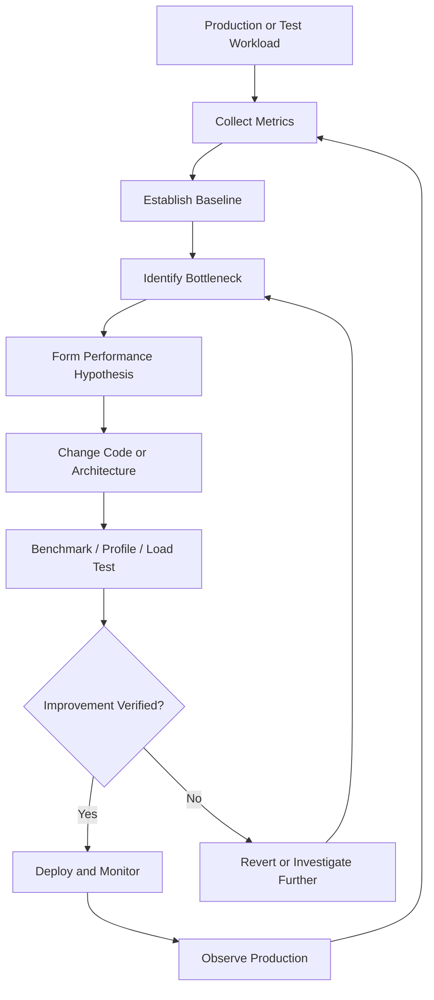
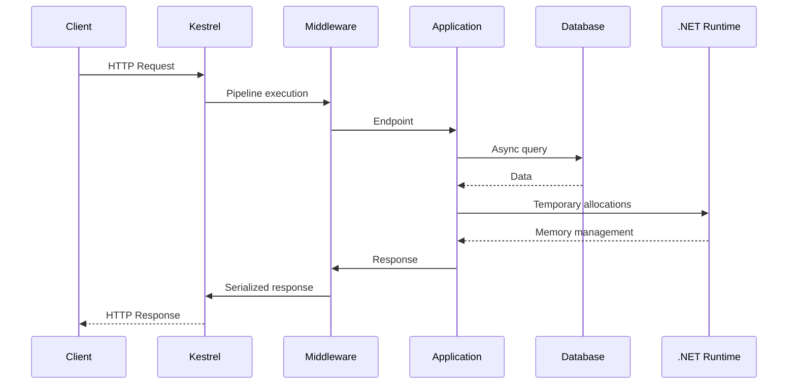
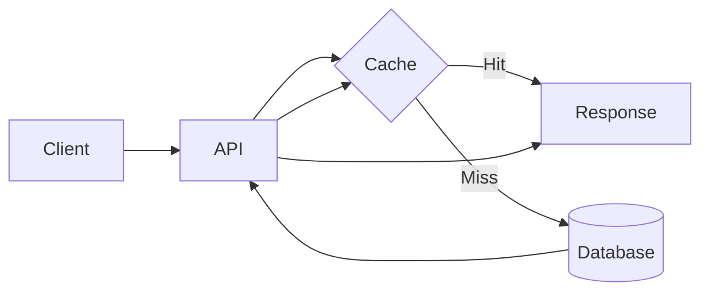
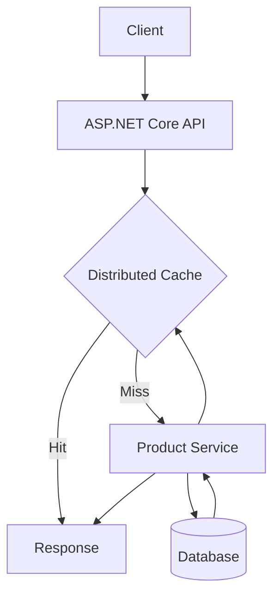

# .NET Performance Optimization: A Complete Practical and Architect-Level Guide

> **Scope and assumptions:** This guide focuses on modern .NET, especially .NET 8+ and concepts that remain applicable across modern .NET releases. Examples use C#, ASP.NET Core, Entity Framework Core, and common .NET tooling. Exact runtime behavior, APIs, and performance characteristics can vary between .NET versions, operating systems, CPU architectures, workloads, and deployment environments.

# 1. Executive Summary

## What is .NET Performance Optimization?

**.NET performance optimization** is the systematic process of measuring, understanding, and improving the efficiency of applications running on the .NET platform.

Performance optimization can target several dimensions:

* Lower response latency
* Higher throughput
* Lower CPU consumption
* Lower memory consumption
* Fewer allocations
* Reduced garbage collection overhead
* Faster startup
* Better scalability
* Lower cloud infrastructure cost
* More predictable tail latency

Performance optimization is not simply "making code faster."

A production system can have fast individual methods but still perform poorly because of:

* Database latency
* Excessive network calls
* Thread pool starvation
* Lock contention
* Garbage collection pressure
* Inefficient serialization
* Excessive logging
* Poor caching
* Slow external dependencies
* Incorrect architecture

The central discipline is therefore:

> **Measure the real bottleneck, understand why it exists, change the system deliberately, and measure again.**

---

## Why Was .NET Performance Optimization Created?

Performance optimization is not a single .NET feature that was "created." It is an engineering discipline supported by the .NET runtime, compiler, libraries, diagnostics ecosystem, and application architecture.

Modern .NET provides runtime capabilities that make high-performance applications practical:

* Just-In-Time compilation
* Ahead-of-Time compilation options
* Generational garbage collection
* Thread pooling
* Asynchronous I/O
* SIMD and hardware intrinsics
* Spans and memory abstractions
* Array pooling
* High-performance networking
* Runtime profiling and tracing
* Benchmarking frameworks

The goal is to allow developers to write productive managed code while still having access to performance-sensitive techniques when necessary.

---

## What Problem Does It Solve?

Performance optimization helps solve problems such as:

| Problem                | Typical Optimization Area                   |
| ---------------------- | ------------------------------------------- |
| Slow API responses     | Database, I/O, allocations, serialization   |
| High CPU usage         | Algorithms, LINQ, parsing, contention       |
| Excessive memory usage | Object lifetime, allocations, caching       |
| Frequent GC pauses     | Allocation reduction, pooling               |
| Low request throughput | Async I/O, contention, database efficiency  |
| Thread pool starvation | Async correctness, blocking removal         |
| High cloud cost        | Resource efficiency and scaling             |
| Slow startup           | AOT, trimming, dependency reduction         |
| Unpredictable latency  | Tail-latency analysis, dependency isolation |
| Slow data processing   | SIMD, batching, efficient data structures   |

---

## What Problems Does It Not Solve?

Optimization does **not** automatically solve:

* Incorrect business logic
* Poor product requirements
* Network latency caused by physical distance
* Fundamentally slow external dependencies
* Poor algorithms without redesign
* Capacity shortages without scaling
* Database schema problems
* Distributed-system consistency problems
* Security vulnerabilities

Optimization can also make a system worse if applied incorrectly.

For example:

```csharp
// Hard to read and probably unnecessary.
var result = new Dictionary<int, string>(items.Count);

for (var i = 0; i < items.Count; i++)
{
    result.Add(items[i].Id, items[i].Name);
}
```

may be faster than:

```csharp
var result = items.ToDictionary(x => x.Id, x => x.Name);
```

in some workloads.

But if the operation occurs once during application startup, the optimization may have essentially zero business value.

---

## Who Uses It?

.NET performance optimization is important for:

* Backend API teams
* Cloud application teams
* Financial systems
* E-commerce platforms
* Gaming and real-time systems
* Data-processing platforms
* Microservice platforms
* IoT applications
* Desktop applications
* High-volume enterprise systems

It is especially valuable when:

* Requests are measured in thousands or millions
* Infrastructure costs are significant
* Latency directly affects users or revenue
* Memory limits are constrained
* Workloads are CPU-intensive
* Tail latency matters

---

## When Should You Optimize?

Use this order:

```text
Observe
   ↓
Measure
   ↓
Identify bottleneck
   ↓
Form hypothesis
   ↓
Change implementation
   ↓
Measure again
   ↓
Keep or revert
```

Do **not** optimize merely because code "looks inefficient."

---

## Quick Gist

> .NET performance optimization is a measurement-driven engineering discipline. Start with the system's real bottleneck, establish a baseline, use profiling and benchmarking to understand behavior, optimize the highest-value constraint, and verify the improvement under realistic production conditions.

---

# 2. Core Concepts

# 2.1 Performance Metrics

Different systems require different performance metrics.

## Latency

**Latency** is the time required to complete an operation.

Example:

```text
HTTP Request
    ↓
Database query
    ↓
Business processing
    ↓
Response

Total latency = 250 ms
```

Latency is often expressed using percentiles.

### Percentiles

| Metric | Meaning                    |
| ------ | -------------------------- |
| P50    | Median latency             |
| P90    | 90% of requests are faster |
| P95    | 95% of requests are faster |
| P99    | 99% of requests are faster |
| P99.9  | Extreme tail latency       |

Example:

```text
P50 = 20 ms
P95 = 100 ms
P99 = 2 seconds
```

The system may appear fast in average metrics while still producing unacceptable experiences for some users.

### Why averages can mislead

```text
99 requests × 10 ms = 990 ms
1 request × 10,000 ms = 10,000 ms

Average ≈ 110 ms
```

The average looks reasonable.

One request took 10 seconds.

Therefore production systems often need percentile-based monitoring.

---

# 2.2 Throughput

**Throughput** is the amount of work completed per unit of time.

Examples:

* Requests per second
* Messages per second
* Transactions per second
* Records processed per second

Example:

```text
Before optimization: 5,000 requests/second
After optimization: 8,000 requests/second
```

Higher throughput is not automatically better.

A system may increase throughput by increasing concurrency while making individual requests slower.

---

# 2.3 CPU-Bound vs I/O-Bound Work

This distinction is fundamental.

## CPU-Bound

The application spends most of its time performing computation.

Examples:

* Image processing
* Encryption
* Compression
* Large calculations
* JSON processing
* Machine-learning inference

Example:

```csharp
var result = ExpensiveCalculation(data);
```

Optimization strategies include:

* Better algorithms
* Reduced computation
* Parallelism
* SIMD
* Hardware acceleration

---

## I/O-Bound

The application spends most of its time waiting.

Examples:

* Database queries
* HTTP calls
* File access
* Message queues

Example:

```csharp
var response = await httpClient.GetAsync(url);
```

Optimization strategies include:

* Async I/O
* Batching
* Caching
* Reducing round trips
* Connection reuse

---

# 2.4 Big O Complexity

Algorithmic complexity often matters more than micro-optimization.

Consider:

```csharp
foreach (var order in orders)
{
    foreach (var customer in customers)
    {
        if (order.CustomerId == customer.Id)
        {
            Process(order, customer);
        }
    }
}
```

Approximate complexity:

```text
O(orders × customers)
```

Use a dictionary:

```csharp
var customersById = customers.ToDictionary(x => x.Id);

foreach (var order in orders)
{
    if (customersById.TryGetValue(order.CustomerId, out var customer))
    {
        Process(order, customer);
    }
}
```

Approximate complexity becomes:

```text
O(customers + orders)
```

This architectural and algorithmic improvement can dwarf low-level optimizations.

---

# 2.5 Allocation

An **allocation** occurs when the runtime reserves memory for an object.

Example:

```csharp
var person = new Person();
```

Frequent allocations increase garbage collection work.

Consider:

```csharp
for (var i = 0; i < 1_000_000; i++)
{
    var value = new StringBuilder();
}
```

The application may spend significant time allocating and collecting objects.

The goal is not:

> "Allocate nothing."

The goal is:

> "Avoid unnecessary allocations on performance-critical paths."

---

# 2.6 Garbage Collection

The **Garbage Collector (GC)** automatically reclaims memory occupied by objects that are no longer reachable.

Modern .NET uses a generational model.

Conceptually:

```text
New Objects
    │
    ▼
Generation 0
    │ survive
    ▼
Generation 1
    │ survive
    ▼
Generation 2
```

Most short-lived objects are collected in early generations.

This is efficient.

Problems appear when an application creates unnecessary allocations at high frequency.

Example:

```text
1 request = 100 KB allocations

10,000 requests/second

≈ 1 GB allocations/second
```

Even if memory is eventually collected, the allocation rate can become a major CPU and latency problem.

---

# 2.7 Working Set vs Allocation Rate

These are commonly confused.

## Working Set

The memory actively held by the process.

## Allocation Rate

The amount of new memory created over time.

Example:

```text
Working set: 500 MB
Allocation rate: 2 GB/minute
```

A stable working set does not necessarily mean the application is allocation-efficient.

---

# 2.8 Async and Concurrency

`async` does not make work inherently faster.

Instead, asynchronous programming allows threads to perform other work while an operation waits for I/O.

Bad:

```csharp
var result = client.GetAsync(url).Result;
```

Better:

```csharp
var result = await client.GetAsync(url);
```

Blocking asynchronous work can consume thread-pool threads unnecessarily.

At high load:

```text
Requests waiting for I/O
        ↓
Threads blocked
        ↓
Thread pool becomes saturated
        ↓
New requests wait for threads
        ↓
Latency increases
```

---

# 2.9 Thread Pool

The .NET thread pool manages reusable worker threads.

Creating dedicated threads unnecessarily:

```csharp
new Thread(() =>
{
    Process();
}).Start();
```

is usually inferior for ordinary application work.

Prefer:

```csharp
await ProcessAsync();
```

or appropriate task-based concurrency.

However, blindly creating tasks can also create overload.

---

# 2.10 Contention

**Contention** occurs when multiple execution paths compete for a resource.

Example:

```csharp
private readonly object _lock = new();

public void Update()
{
    lock (_lock)
    {
        ExpensiveWork();
    }
}
```

Under concurrency:

```text
Thread A ── working
Thread B ── waiting
Thread C ── waiting
Thread D ── waiting
```

Potential solutions:

* Reduce shared state
* Reduce lock duration
* Partition data
* Use concurrent collections where appropriate
* Change architecture

Do not automatically replace locks with complicated lock-free code.

Correctness comes first.

---

# 2.11 Caching

Caching trades:

```text
Memory + complexity
```

for:

```text
Lower latency + reduced dependency load
```

Example:

```text
Request
  ↓
Cache hit?
  ├── Yes → return cached value
  └── No  → database → store → return
```

Caching introduces problems:

* Stale data
* Invalidations
* Memory pressure
* Cache stampedes
* Distributed consistency

The famous engineering difficulty is often summarized as:

> Cache invalidation is hard.

Therefore caching should solve a measured problem.

---

# 2.12 Benchmarking vs Profiling

These tools answer different questions.

| Tool                  | Main Question                                     |
| --------------------- | ------------------------------------------------- |
| Benchmark             | Which implementation performs better?             |
| Profiler              | Where is the application spending time/resources? |
| Load test             | How does the system behave under concurrency?     |
| Production monitoring | What is actually happening in production?         |

Example:

```text
Benchmark:
Method A vs Method B
```

versus:

```text
Profiler:
Why is API latency 500 ms?
```

Do not use a microbenchmark to conclude that an entire distributed application became faster.

---

# 2.13 Commonly Confused Concepts

## Faster vs More Scalable

Faster:

```text
One request: 100 ms → 50 ms
```

More scalable:

```text
System handles:
1,000 concurrent requests → 10,000 concurrent requests
```

They may overlap but are not identical.

---

## Parallelism vs Concurrency

### Concurrency

Multiple tasks make progress over overlapping periods.

### Parallelism

Multiple computations execute simultaneously on multiple processing resources.

Example:

```csharp
await Task.WhenAll(
    GetCustomerAsync(),
    GetOrdersAsync());
```

This introduces concurrency.

CPU-bound parallel work might use:

```csharp
Parallel.ForEach(items, item =>
{
    Compute(item);
});
```

These require different optimization strategies.

---

# 3. How It Works

# The Performance Optimization Lifecycle



---

# Step 1: Define the Workload

Performance has no meaning without a workload.

Bad requirement:

> Make the API faster.

Better requirement:

```text
Endpoint: POST /orders

Current:
P50: 120 ms
P95: 800 ms
P99: 2.5 seconds

Target:
P95 < 300 ms
P99 < 750 ms

Expected load:
2,000 requests/second
```

---

# Step 2: Establish a Baseline

Capture:

* Latency percentiles
* Throughput
* CPU
* Memory
* Allocation rate
* GC collections
* Database duration
* External dependency latency

Without a baseline, you cannot reliably prove improvement.

---

# Step 3: Find the Bottleneck

Suppose an API takes:

```text
Total: 500 ms

Database:       400 ms
Business logic:  20 ms
Serialization:   30 ms
Other:           50 ms
```

Optimizing business logic by 50% saves:

```text
10 ms
```

Optimizing the database by 50% saves:

```text
200 ms
```

The architectural decision is obvious.

---

# Step 4: Apply Amdahl's Law

Amdahl's Law explains why optimizing a small portion of a system has limited overall benefit.

Suppose:

```text
Database = 80% of execution time
Application code = 20%
```

Making application code infinitely fast still leaves:

```text
80% of original execution time
```

This is why profiling is essential.

---

# Step 5: Validate Under Realistic Conditions

A change may perform well in:

```text
Single-threaded benchmark
```

but fail under:

```text
500 concurrent requests
```

because of:

* Lock contention
* Database connection exhaustion
* Thread starvation
* Memory pressure

---

# Operational Flow of a Typical ASP.NET Core Request



Performance issues can occur at every stage.

For example:

| Stage         | Typical Problem                  |
| ------------- | -------------------------------- |
| Kestrel       | Connection overload              |
| Middleware    | Expensive unnecessary middleware |
| Application   | CPU-heavy algorithms             |
| Database      | Slow query or missing index      |
| GC            | Excessive allocation             |
| Serialization | Large object graphs              |
| Network       | Large payloads                   |

---

# 4. Implementation

# Assumed Technology Stack

This implementation uses:

```text
.NET 8+
C#
ASP.NET Core
Entity Framework Core
BenchmarkDotNet
OpenTelemetry-compatible observability
```

The principles apply beyond this exact stack.

---

# Recommended Project Structure

```text
PerformanceSample.sln
│
├── src
│   ├── PerformanceSample.Api
│   │   ├── Endpoints
│   │   ├── Services
│   │   ├── Data
│   │   └── Program.cs
│   │
│   └── PerformanceSample.Application
│       ├── DTOs
│       └── Contracts
│
├── benchmarks
│   └── PerformanceSample.Benchmarks
│       ├── StringBenchmarks.cs
│       └── CollectionBenchmarks.cs
│
└── tests
    ├── PerformanceSample.UnitTests
    └── PerformanceSample.IntegrationTests
```

Keep benchmarks separate from production code.

This prevents benchmarking dependencies and benchmark-only configuration from leaking into the production application.

---

# 4.1 Benchmarking with BenchmarkDotNet

A microbenchmark should compare alternatives under controlled conditions.

Example:

```csharp
using BenchmarkDotNet.Attributes;
using BenchmarkDotNet.Running;

public class LookupBenchmarks
{
    private Dictionary<int, string> _dictionary = null!;
    private List<KeyValuePair<int, string>> _list = null!;

    [GlobalSetup]
    public void Setup()
    {
        _dictionary = Enumerable
            .Range(1, 10_000)
            .ToDictionary(x => x, x => $"Value{x}");

        _list = _dictionary.ToList();
    }

    [Benchmark]
    public string? DictionaryLookup()
    {
        _dictionary.TryGetValue(9000, out var value);
        return value;
    }

    [Benchmark]
    public string? ListLookup()
    {
        foreach (var item in _list)
        {
            if (item.Key == 9000)
                return item.Value;
        }

        return null;
    }
}

public class Program
{
    public static void Main()
    {
        BenchmarkRunner.Run<LookupBenchmarks>();
    }
}
```

The purpose is not merely to prove:

> Dictionaries are faster.

The important question is:

> Is this lookup pattern actually on a hot path where the difference matters?

---

# 4.2 Avoiding Misleading Benchmarks

Do not benchmark:

```csharp
var stopwatch = Stopwatch.StartNew();

Method();

stopwatch.Stop();

Console.WriteLine(stopwatch.Elapsed);
```

as your primary method for tiny operations.

Problems include:

* JIT warm-up
* Measurement overhead
* CPU frequency changes
* Insufficient iterations
* Dead-code elimination
* Garbage collection interference

Use a dedicated benchmarking framework for microbenchmarks.

---

# 4.3 Allocation-Aware Code

Consider:

```csharp
public string Normalize(string value)
{
    return value.Trim().ToLowerInvariant();
}
```

Depending on input and workload, intermediate strings can create allocations.

For an occasional request, this may be perfectly acceptable.

For a high-frequency processing pipeline, investigate whether allocation reduction matters.

The decision process should be:

```text
Is this code hot?
    ↓
Are allocations measurable?
    ↓
Is GC a bottleneck?
    ↓
Would a more complex implementation materially help?
```

---

# 4.4 StringBuilder

Repeated string concatenation can create unnecessary intermediate strings.

Potentially inefficient:

```csharp
var result = "";

foreach (var item in items)
{
    result += item.Name;
}
```

Often better:

```csharp
var builder = new StringBuilder();

foreach (var item in items)
{
    builder.Append(item.Name);
}

var result = builder.ToString();
```

However, do not mechanically use `StringBuilder` everywhere.

For a small number of concatenations, ordinary string operations may be simpler and sufficiently efficient.

---

# 4.5 Efficient Collections

Choose collections based on access patterns.

| Requirement          | Possible Collection                      |
| -------------------- | ---------------------------------------- |
| Indexed access       | `List<T>`                                |
| Key lookup           | `Dictionary<TKey, TValue>`               |
| Unique values        | `HashSet<T>`                             |
| FIFO                 | `Queue<T>`                               |
| LIFO                 | `Stack<T>`                               |
| Concurrent scenarios | Concurrent collections where appropriate |

Example:

Bad for repeated membership checks:

```csharp
var ids = new List<int>();

if (ids.Contains(id))
{
}
```

Potentially better:

```csharp
var ids = new HashSet<int>();

if (ids.Contains(id))
{
}
```

The best choice depends on collection size and workload.

---

# 4.6 Avoid Repeated Enumeration

Consider:

```csharp
if (items.Any())
{
    var count = items.Count();
    var first = items.First();
}
```

If `items` is an expensive enumerable, this can cause multiple enumerations.

Better:

```csharp
var materialized = items.ToList();

if (materialized.Count > 0)
{
    var count = materialized.Count;
    var first = materialized[0];
}
```

But materialization also costs memory.

The correct decision depends on:

* Enumeration cost
* Number of enumerations
* Collection size
* Memory constraints

---

# 4.7 Efficient Async I/O

Bad:

```csharp
public string GetData()
{
    return _client.GetStringAsync("https://example.com").Result;
}
```

Better:

```csharp
public async Task<string> GetDataAsync(
    CancellationToken cancellationToken)
{
    return await _client.GetStringAsync(
        "https://example.com",
        cancellationToken);
}
```

The important benefit is scalability under concurrent I/O.

---

# 4.8 Avoiding Fake Async

Bad:

```csharp
public async Task<int> CalculateAsync()
{
    return await Task.Run(() => Calculate());
}
```

For server applications, wrapping ordinary CPU work in `Task.Run` does not make the work cheaper.

It can:

* Consume thread-pool resources
* Add scheduling overhead
* Complicate overload behavior

Use `Task.Run` deliberately, not as a universal async conversion tool.

---

# 4.9 Parallelizing Independent I/O

Sequential:

```csharp
var customer = await GetCustomerAsync(id);
var orders = await GetOrdersAsync(id);
```

If independent:

```csharp
var customerTask = GetCustomerAsync(id);
var ordersTask = GetOrdersAsync(id);

await Task.WhenAll(customerTask, ordersTask);

var customer = await customerTask;
var orders = await ordersTask;
```

Potential benefit:

```text
Sequential:
100 ms + 100 ms = ~200 ms

Concurrent:
max(100 ms, 100 ms) = ~100 ms
```

But concurrency can overload dependencies.

For example:

```text
1,000 requests
×
10 parallel database operations
=
10,000 simultaneous database operations
```

Optimization can become overload.

Use bounded concurrency when appropriate.

---

# 4.10 Entity Framework Core Performance

## Project Only What You Need

Potentially inefficient:

```csharp
var customers = await context.Customers
    .Include(x => x.Orders)
    .ToListAsync();
```

If the endpoint only requires:

```text
Customer Id
Customer Name
Order Count
```

Project explicitly:

```csharp
var customers = await context.Customers
    .Select(x => new CustomerSummary(
        x.Id,
        x.Name,
        x.Orders.Count))
    .ToListAsync();
```

Benefits may include:

* Less data transferred
* Less memory
* Less object materialization

---

## Use No-Tracking for Read-Only Queries

For queries where change tracking is unnecessary:

```csharp
var customers = await context.Customers
    .AsNoTracking()
    .Where(x => x.IsActive)
    .ToListAsync();
```

This can reduce change-tracking overhead.

Do not use it blindly when entities must subsequently participate in tracked updates.

---

## Watch for N+1 Queries

Example conceptual problem:

```csharp
var orders = await context.Orders.ToListAsync();

foreach (var order in orders)
{
    var customer = await context.Customers
        .FindAsync(order.CustomerId);
}
```

Potential behavior:

```text
1 query for orders
+
N queries for customers
```

This can become a severe production bottleneck.

Measure generated SQL and database behavior rather than assuming ORM code is cheap.

---

# 4.11 HTTP Client Reuse

Avoid repeatedly creating HTTP client infrastructure per request.

Use managed client lifetimes and centralized configuration.

Example conceptually:

```csharp
builder.Services.AddHttpClient<PaymentClient>(client =>
{
    client.Timeout = TimeSpan.FromSeconds(5);
});
```

Benefits include appropriate connection reuse and centralized policies.

Performance and reliability are closely connected here.

---

# 4.12 Caching

Example:

```csharp
public async Task<ProductDto?> GetProductAsync(
    int id,
    CancellationToken cancellationToken)
{
    var cacheKey = $"product:{id}";

    if (_cache.TryGetValue<ProductDto>(
        cacheKey,
        out var cached))
    {
        return cached;
    }

    var product = await _repository.GetAsync(
        id,
        cancellationToken);

    if (product is null)
        return null;

    _cache.Set(
        cacheKey,
        product,
        TimeSpan.FromMinutes(5));

    return product;
}
```

Before adding caching, answer:

1. Is the underlying operation expensive?
2. Is the data requested repeatedly?
3. Can slightly stale data be tolerated?
4. What invalidates the cache?
5. What happens when the cache is cold?

---

# 4.13 Testing Strategy

Use multiple test types.

```text
                 Production Monitoring
                         ▲
                    Load Testing
                         ▲
                 Integration Tests
                         ▲
                  Unit Tests
                         ▲
                  Microbenchmarks
```

Each answers a different question.

## Unit Tests

Verify correctness.

## Integration Tests

Verify real infrastructure behavior.

## Microbenchmarks

Compare small implementations.

## Load Tests

Measure concurrency and system limits.

## Production Monitoring

Verify real workloads.

---

# 5. Architecture and Design

# 5.1 Performance Is an Architectural Property

A slow system is often not solved by optimizing a method.

Example:

```text
API
 ↓
Service A
 ↓ HTTP
Service B
 ↓ HTTP
Service C
 ↓
Database
```

A single user request may involve:

```text
3 network hops
3 serializations
3 connection pools
multiple queues
multiple retries
```

The architecture may dominate performance.

---

# 5.2 Establish Performance Requirements

Architects should define explicit objectives.

Example:

```text
Checkout API

P95 latency: < 300 ms
P99 latency: < 800 ms

Availability: 99.9%

Peak throughput:
5,000 requests/second
```

Without measurable requirements, "fast" is not an engineering requirement.

---

# 5.3 Performance Budgeting

Divide a latency target.

Example:

```text
Total P95 budget: 300 ms

Gateway:           20 ms
Application:       50 ms
Database:         150 ms
External service:  50 ms
Serialization:     30 ms
```

This creates accountability across system boundaries.

---

# 5.4 Synchronous vs Asynchronous Architecture

## Synchronous

```text
Request
  ↓
Process
  ↓
External Service
  ↓
Response
```

Advantages:

* Simpler mental model
* Immediate result

Disadvantages:

* Latency accumulates
* Dependency failures affect requests

---

## Asynchronous

```text
Request
  ↓
Queue
  ↓
Worker
  ↓
Process
```

Advantages:

* Better load smoothing
* Decoupling
* Background processing

Disadvantages:

* Eventual consistency
* Operational complexity

Do not introduce messaging solely because it sounds more scalable.

---

# 5.5 Caching Architecture



Architectural decisions include:

* Local cache vs distributed cache
* TTL
* Invalidation
* Cache warming
* Stampede prevention

---

# 5.6 Scale Up vs Scale Out

## Scale Up

Increase resources per machine.

```text
More CPU
More memory
```

## Scale Out

Add instances.

```text
Instance 1
Instance 2
Instance 3
```

Scale-out applications require attention to:

* Shared state
* Distributed caching
* Session storage
* Database contention

---

# 5.7 Backpressure

A system should not accept unlimited work.

Without backpressure:

```text
Incoming load
     ↓
Queue grows
     ↓
Memory grows
     ↓
Latency grows
     ↓
Timeouts
     ↓
Retries
     ↓
More load
     ↓
Failure cascade
```

Architectural controls include:

* Queue limits
* Rate limiting
* Bounded concurrency
* Request rejection
* Load shedding

---

# 6. Production Readiness

# 6.1 Performance and Security

Security controls have performance costs.

Examples:

* Encryption
* Authentication
* Authorization
* Input validation
* Rate limiting

The correct approach is not removing security for speed.

Instead:

```text
Measure security overhead
     ↓
Optimize implementation
     ↓
Preserve security guarantees
```

---

# 6.2 Data Protection

Performance-sensitive systems should still:

* Protect secrets
* Encrypt sensitive data
* Avoid exposing cached private data
* Control memory retention where possible
* Secure telemetry

Never cache sensitive information without understanding access boundaries and expiration.

---

# 6.3 Scalability

Measure:

* CPU saturation
* Memory growth
* Request queues
* Connection pool usage
* Database saturation

Scaling application instances does not solve every bottleneck.

Example:

```text
10 API instances
        ↓
1 overloaded database
```

The database remains the bottleneck.

---

# 6.4 Reliability

Timeouts are performance features.

Without explicit timeouts:

```text
Request
  ↓
Dependency hangs
  ↓
Thread/task remains occupied
  ↓
More requests accumulate
```

Use:

* Timeouts
* Cancellation tokens
* Retries where safe
* Circuit breakers
* Bulkheads

Retries must be carefully controlled.

Unbounded retries can amplify an outage.

---

# 6.5 Observability

Monitor:

## Application

* Request latency
* Throughput
* Error rate

## Runtime

* CPU
* Heap size
* Allocation rate
* GC activity
* Thread pool metrics

## Dependencies

* Database duration
* HTTP dependency duration
* Queue depth
* Cache hit rate

Observability connects performance symptoms to root causes.

---

# 6.6 Deployment

Performance validation should include:

```text
Development
   ↓
CI Benchmarking
   ↓
Integration Environment
   ↓
Load Testing
   ↓
Production Monitoring
```

Do not assume a benchmark machine behaves like production.

Differences include:

* CPU architecture
* Container limits
* Network latency
* Database location
* Production concurrency

---

# 6.7 Failure Recovery

Performance incidents should have:

* Dashboards
* Alerts
* Runbooks
* Rollback procedures
* Capacity plans

Example runbook:

```text
P99 latency alert
     ↓
Check error rate
     ↓
Check CPU
     ↓
Check allocation rate
     ↓
Check database duration
     ↓
Check thread pool behavior
     ↓
Check dependency latency
```

---

# 7. Real-World Usage

# Example 1: High-Volume E-Commerce API

## Problem

```text
Product API
P95 = 1.2 seconds
```

Investigation shows:

```text
Database = 900 ms
Application = 100 ms
Serialization = 200 ms
```

Optimization priorities:

1. Database query optimization
2. Projection
3. Reduce response payload
4. Add caching if data permits

Micro-optimizing loops would have little value.

---

# Example 2: Financial Data Processing

## Problem

Millions of records must be processed.

Likely optimization priorities:

* Algorithmic complexity
* Memory locality
* Allocation rate
* Batching
* SIMD where appropriate

This is a good fit for deeper runtime-level optimization.

---

# Example 3: Microservice Platform

## Problem

P99 latency is high.

Individual services are fast.

Trace reveals:

```text
Gateway       20 ms
Service A     30 ms
Service B     40 ms
Service C     50 ms

Total network and orchestration overhead:
250+ ms
```

Potential architectural solutions:

* Reduce synchronous call chains
* Aggregate data
* Parallelize independent requests
* Introduce asynchronous workflows

---

# When .NET Optimization Is a Good Fit

Use deep optimization when:

* Profiling identifies CPU or allocation bottlenecks
* Load tests reveal scalability limits
* Infrastructure costs are material
* Latency is a business requirement

---

# When Another Approach Is Better

Choose architectural redesign when:

* The database is the bottleneck
* Too many network calls dominate latency
* An algorithm has poor complexity
* The workload should be asynchronous
* The system lacks backpressure

---

# 8. Common Mistakes

# 8.1 Premature Optimization

Bad process:

```text
See code
 ↓
Guess it is slow
 ↓
Rewrite it
```

Better:

```text
Measure
 ↓
Find bottleneck
 ↓
Optimize
 ↓
Measure again
```

---

# 8.2 Optimizing Microseconds While Waiting Seconds for I/O

Warning sign:

```text
Method optimization saves 2 microseconds
Database query takes 800 milliseconds
```

Focus on the dominant cost.

---

# 8.3 Using `.Result` and `.Wait()`

Potential problems:

* Blocking
* Thread pool pressure
* Reduced scalability

Prefer asynchronous composition.

---

# 8.4 Overusing `Task.Run`

Do not turn every method into:

```csharp
await Task.Run(() => Work());
```

Understand whether the workload is CPU-bound or I/O-bound.

---

# 8.5 Ignoring Allocation Rate

A stable memory graph does not prove efficient memory behavior.

Monitor allocation rate and GC activity.

---

# 8.6 Assuming LINQ Is Always Slow

LINQ can be:

* Clear
* Correct
* Fast enough

Avoid replacing readable LINQ with loops unless measurement demonstrates a meaningful bottleneck.

---

# 8.7 Ignoring Database Performance

Application developers sometimes profile only application code.

For many systems:

```text
Database time > application time
```

Measure SQL, indexes, query plans, row counts, and network costs.

---

# 8.8 Excessive Parallelism

Bad:

```csharp
await Task.WhenAll(
    items.Select(ProcessAsync));
```

For an extremely large collection, this may create excessive concurrent work.

Use bounded concurrency.

---

# 8.9 Treating Caching as a Universal Solution

Caching can hide inefficient queries while creating:

* Stale data
* Memory pressure
* Operational complexity

Measure first.

---

# 8.10 Trusting a Single Benchmark

One benchmark configuration cannot represent every production workload.

Test:

* Different input sizes
* Different concurrency levels
* Cold vs warm behavior
* Memory pressure
* Real infrastructure

---

# 9. End-to-End Project

# Project: High-Performance Product Catalog API

## Requirements

The API must:

* Return product summaries
* Support high read traffic
* Maintain acceptable tail latency
* Avoid unnecessary database load
* Support future scaling

---

# Architecture



---

# Data Model

```csharp
public sealed class Product
{
    public int Id { get; init; }

    public required string Name { get; init; }

    public decimal Price { get; init; }

    public bool IsActive { get; init; }
}
```

DTO:

```csharp
public sealed record ProductSummary(
    int Id,
    string Name,
    decimal Price);
```

Use DTOs to avoid unnecessarily serializing the complete persistence model.

---

# Query

```csharp
public async Task<IReadOnlyList<ProductSummary>>
    GetProductsAsync(CancellationToken cancellationToken)
{
    return await _context.Products
        .AsNoTracking()
        .Where(x => x.IsActive)
        .Select(x => new ProductSummary(
            x.Id,
            x.Name,
            x.Price))
        .ToListAsync(cancellationToken);
}
```

Design reasoning:

* Read-only query
* Projection
* Avoid unnecessary entity graph loading

---

# Endpoint

```csharp
app.MapGet(
    "/products",
    async (
        ProductService service,
        CancellationToken cancellationToken) =>
    {
        var products =
            await service.GetProductsAsync(cancellationToken);

        return Results.Ok(products);
    });
```

---

# Testing

## Correctness

```text
Unit tests
```

Verify business rules.

## Database

```text
Integration tests
```

Verify query behavior.

## Microbenchmark

Measure hot transformations if necessary.

## Load Test

Simulate:

```text
100 users
1,000 users
5,000 users
```

Measure:

* P50
* P95
* P99
* CPU
* Memory
* Errors

---

# Evolution

## Phase 1

```text
Single API
Single database
```

## Phase 2

```text
Add caching
```

when database reads become dominant.

## Phase 3

```text
Multiple API instances
Distributed cache
```

when application capacity requires scale-out.

## Phase 4

```text
Read replicas
Asynchronous workflows
CQRS
```

only when requirements justify the added complexity.

---

# 10. Final Review

# Quick Gist

The most important .NET performance principles are:

1. **Measure before optimizing.**
2. **Define the workload and performance target.**
3. **Optimize bottlenecks, not suspicious-looking code.**
4. **Prefer algorithmic and architectural improvements over micro-optimizations.**
5. **Distinguish CPU-bound from I/O-bound workloads.**
6. **Understand allocations and garbage collection.**
7. **Use async I/O to improve scalability, not to magically speed up computation.**
8. **Measure tail latency, not only averages.**
9. **Use microbenchmarks, profilers, load tests, and production telemetry for different purposes.**
10. **Verify every optimization after implementation.**

The practical optimization hierarchy is:

```text
Requirements
    ↓
Architecture
    ↓
Algorithms
    ↓
I/O and Database
    ↓
Concurrency
    ↓
Allocation
    ↓
Micro-optimization
```

---

# Practical Example

Suppose this endpoint is slow:

```csharp
public async Task<List<OrderDto>> GetOrdersAsync()
{
    var orders = await _context.Orders.ToListAsync();

    return orders
        .Select(order => new OrderDto(
            order.Id,
            order.Customer.Name,
            order.Total))
        .ToList();
}
```

Investigation should ask:

```text
Does generated SQL load unnecessary columns?
Are navigation properties causing additional queries?
How much data is returned?
How long does the database query take?
How many allocations occur?
```

A better query might be:

```csharp
public async Task<List<OrderDto>> GetOrdersAsync(
    CancellationToken cancellationToken)
{
    return await _context.Orders
        .AsNoTracking()
        .Select(order => new OrderDto(
            order.Id,
            order.Customer.Name,
            order.Total))
        .ToListAsync(cancellationToken);
}
```

The key lesson is not:

> Always use `AsNoTracking` and projection.

The key lesson is:

> Shape the implementation around the actual workload and verify the result with measurement.

---

# Best Practices

## Production Checklist

### Measurement

* [ ] Define latency and throughput targets.
* [ ] Record a baseline.
* [ ] Measure P50, P95, and P99.
* [ ] Monitor CPU and memory.
* [ ] Measure allocation rate and GC behavior.

### Code

* [ ] Use appropriate algorithms and data structures.
* [ ] Avoid unnecessary allocations on hot paths.
* [ ] Avoid unnecessary blocking.
* [ ] Use async for asynchronous I/O.
* [ ] Control concurrency.

### Database

* [ ] Inspect generated SQL.
* [ ] Avoid unnecessary data loading.
* [ ] Prevent N+1 queries.
* [ ] Verify indexes and query plans.
* [ ] Measure database latency independently.

### Architecture

* [ ] Minimize unnecessary network hops.
* [ ] Define performance budgets.
* [ ] Apply caching deliberately.
* [ ] Implement backpressure.
* [ ] Protect dependencies from overload.

### Validation

* [ ] Benchmark isolated hot paths.
* [ ] Load test realistic scenarios.
* [ ] Monitor production behavior.
* [ ] Compare before and after.
* [ ] Revert optimizations that add complexity without meaningful benefit.

---

# Expert-Level Interview Questions & Answers

## 1. An API has low average latency but poor P99 latency. How would you investigate?

**Answer:**

I would avoid optimizing based on the average because averages hide outliers.

I would:

1. Examine distributed traces for slow requests.
2. Compare P99 traces against P50 traces.
3. Check dependency latency.
4. Examine GC activity.
5. Check thread-pool behavior.
6. Investigate lock contention.
7. Look for retries, queueing, or connection exhaustion.
8. Correlate spikes with deployment or traffic patterns.

Common causes include:

* GC pauses
* Database contention
* Dependency timeouts
* Thread starvation
* Lock contention

The architecture should optimize the dominant source of tail latency rather than the average execution path.

---

## 2. How would you determine whether excessive allocations are actually a problem?

**Answer:**

I would measure:

* Allocation rate
* GC frequency
* CPU spent in GC
* Request latency during collections
* Heap growth

High allocation is not automatically a problem.

If the GC handles allocations efficiently and application targets are met, optimization may not be justified.

If allocation pressure causes CPU cost or latency degradation, I would identify hot allocation sources before considering pooling or lower-level memory techniques.

---

## 3. When would you use `ArrayPool<T>`?

**Answer:**

I would consider pooling when:

* Arrays are frequently allocated.
* Arrays are relatively large.
* Allocation pressure is measurable.
* Buffer lifetime is controlled.

I would avoid pooling when:

* The code becomes significantly more error-prone.
* Buffers escape unexpectedly.
* The workload is not allocation-sensitive.

Pooling trades allocation reduction for lifecycle complexity.

---

## 4. Why can increasing parallelism reduce performance?

**Answer:**

Parallelism introduces:

* Scheduling overhead
* Context switching
* Memory pressure
* Cache contention
* Dependency overload

For I/O:

```text
More parallel requests
→ more database connections
→ database contention
→ slower requests
```

The optimal concurrency level is workload-dependent.

---

## 5. How would you optimize a database-heavy .NET application?

**Answer:**

I would start with measurement outside the application code.

I would examine:

1. Query duration
2. Query count
3. Query plans
4. Indexes
5. Returned row counts
6. Network latency
7. ORM materialization

Only after understanding those would I optimize application-level code.

Typical high-value improvements include:

* Correct indexes
* Better query shapes
* Projection
* Eliminating N+1 queries
* Batching

---

## 6. Is `async/await` a performance optimization?

**Answer:**

Not inherently.

For CPU-bound work, `async` does not make computation faster.

For I/O-bound server workloads, asynchronous I/O can improve scalability by allowing threads to perform other work while operations wait.

The decision depends on the workload.

---

## 7. How would you prevent a performance regression?

**Answer:**

I would combine:

```text
Benchmarks
+
Automated tests
+
Load testing
+
Production observability
```

For critical paths, I would maintain representative benchmarks and compare changes over time.

However, benchmark thresholds should be managed carefully because noisy environments can produce false regressions.

---

# Further Study

To progress from strong .NET developer to performance-focused architect, study:

## .NET Runtime

* JIT compilation
* Tiered compilation
* Garbage collection
* Thread pool internals
* Execution contexts

## Memory

* `Span<T>`
* `ReadOnlySpan<T>`
* `Memory<T>`
* `ArrayPool<T>`
* Object pooling
* Allocation profiling

## CPU Optimization

* SIMD
* Hardware intrinsics
* Data locality
* Cache behavior
* Branch prediction

## Concurrency

* Thread pool behavior
* Lock contention
* Channels
* Bounded concurrency
* Backpressure

## Diagnostics

* CPU profiling
* Allocation profiling
* Runtime tracing
* Distributed tracing
* Production performance analysis

## Architecture

* Performance budgets
* Capacity planning
* Queueing
* Load shedding
* Caching strategies
* Dependency isolation

The highest-level principle remains:

> **A fast .NET application is not created by collecting optimization tricks. It is created by understanding workloads, measuring reality, finding constraints, making targeted changes, and continuously validating that the system meets its business requirements.**
