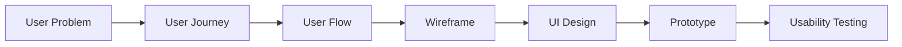
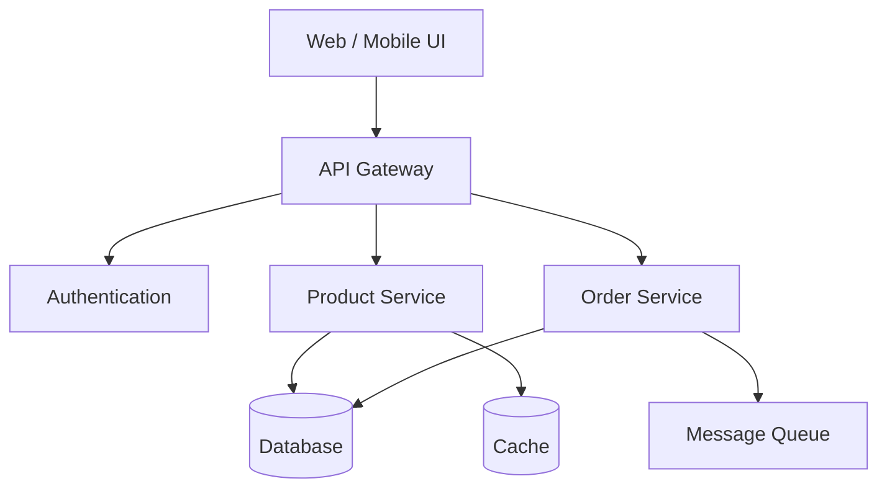
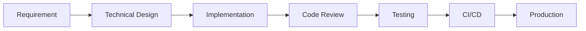
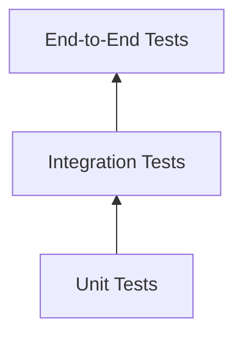
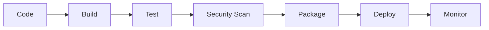
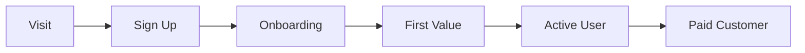
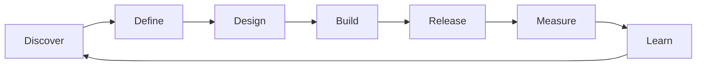

# End-to-End Product Development Responsibilities

End-to-end product development means taking responsibility for the **entire journey from an idea or problem to a production product and continuous improvement**.

For a software engineer, architect, product engineer, or AI-assisted development team, responsibilities typically span the following areas.

---

## 1. Product Discovery

Understand **what problem should be solved and for whom**.

### Responsibilities

* Understand business goals.
* Identify user problems and pain points.
* Define target users and personas.
* Gather stakeholder requirements.
* Analyze competitors and existing solutions.
* Validate assumptions.
* Identify technical and business constraints.
* Define product vision.

### Key Questions

```text
Who is the user?
What problem are we solving?
Why is this problem important?
How are users solving it today?
What would success look like?
Is the problem worth solving?
```

### Outputs

* Product vision
* Problem statement
* User personas
* User journeys
* Opportunity analysis
* Success metrics

---

# 2. Product Strategy

Convert the discovered problem into a **business and technology strategy**.

### Responsibilities

* Define product goals.
* Define target market.
* Prioritize opportunities.
* Define MVP scope.
* Build product roadmap.
* Define KPIs and OKRs.
* Identify risks.
* Make build vs buy decisions.

### Example

```text
Vision
   ↓
Business Goals
   ↓
User Problems
   ↓
Product Strategy
   ↓
MVP Definition
   ↓
Roadmap
```

### Typical Decisions

| Decision     | Example                             |
| ------------ | ----------------------------------- |
| MVP scope    | Which features are essential?       |
| Market       | Enterprise or consumer?             |
| Monetization | Subscription, usage-based, license? |
| Technology   | Build internally or use SaaS?       |
| Timeline     | What should be delivered first?     |
| Risk         | What assumptions must be validated? |

---

# 3. Requirements Engineering

Translate business and user needs into **clear, implementable requirements**.

### Responsibilities

* Gather functional requirements.
* Gather non-functional requirements.
* Write user stories.
* Define acceptance criteria.
* Identify edge cases.
* Define business rules.
* Resolve ambiguous requirements.
* Maintain requirements traceability.

### Example User Story

```text
As a customer,
I want to reset my password,
so that I can regain access to my account.
```

### Acceptance Criteria

```text
Given a registered email address
When the user requests password reset
Then a secure reset link should be sent

Given an invalid email
When the user submits the request
Then the system should return an appropriate response
without exposing whether the account exists.
```

---

# 4. UX and Product Design

Design how users **experience and interact with the product**.

## Responsibilities

* User flows
* Information architecture
* Wireframes
* UI design
* Design systems
* Accessibility
* Responsive design
* Interaction design
* Usability testing

### Flow



### Key Responsibilities

A product-focused engineer should understand:

* Why a screen exists.
* What the user is trying to accomplish.
* What happens when something fails.
* How the experience works on mobile.
* How accessibility affects implementation.

---

# 5. Solution Architecture

Define **how the product should technically work**.

### Responsibilities

* Choose architecture style.
* Define system boundaries.
* Identify services and modules.
* Design APIs.
* Design data flows.
* Define integration strategy.
* Define security architecture.
* Define scalability strategy.
* Define observability requirements.

### Typical Architecture



### Architecture Decisions

| Area        | Decisions                 |
| ----------- | ------------------------- |
| Application | Monolith vs microservices |
| API         | REST vs GraphQL vs gRPC   |
| Data        | SQL vs NoSQL              |
| Hosting     | Cloud vs hybrid           |
| Async       | Queue vs event streaming  |
| Security    | OAuth, OIDC, RBAC         |
| Scaling     | Horizontal vs vertical    |
| Deployment  | Containers vs serverless  |

---

# 6. Technical Design

Break architecture into **implementable components**.

### Responsibilities

* Class/module design
* Database schema
* API contracts
* Domain models
* Error handling
* Validation
* Caching strategy
* Retry policies
* Logging
* Configuration

### Example

```text
Feature
  ↓
Domain Model
  ↓
Application Service
  ↓
Repository / Data Access
  ↓
API Endpoint
  ↓
UI Component
```

This is where architectural ideas become **engineering tasks**.

---

# 7. Development and Implementation

Build the actual product.

### Responsibilities

* Frontend development
* Backend development
* Database development
* API development
* Integration development
* Infrastructure automation
* Code review
* Refactoring
* Documentation

### Engineering Principles

```text
Readable
Maintainable
Testable
Secure
Observable
Scalable
Performant
```

### Modern Development Workflow



---

# 8. AI-Assisted Development

Modern product development increasingly includes AI tools throughout the lifecycle.

### Responsibilities

Use AI for:

* Requirement analysis
* Architecture exploration
* UI generation
* Code generation
* Refactoring
* Test generation
* Documentation
* Code review
* Security analysis
* Debugging

### Example Workflow

```text
Product Requirement
       ↓
AI Requirement Analysis
       ↓
Architecture Proposal
       ↓
Technical Design
       ↓
AI-Assisted Implementation
       ↓
Automated Testing
       ↓
AI Code Review
       ↓
Deployment
```

Tools such as Anthropic's Claude Code can fit into this workflow as an engineering agent, but architecture, requirements, validation, and production decisions should remain explicit responsibilities of the development team.

---

# 9. Quality Engineering

Quality is not just the responsibility of QA.

### Responsibilities

* Unit testing
* Integration testing
* API testing
* End-to-end testing
* Performance testing
* Security testing
* Accessibility testing
* Regression testing

### Testing Pyramid



### Quality Questions

```text
Does it work?

Does it work under load?

Does it work when dependencies fail?

Is it secure?

Is it accessible?

Can we detect failures?

Can we safely roll back?
```

---

# 10. Security Engineering

Security must be included from the beginning.

### Responsibilities

* Authentication
* Authorization
* Input validation
* Secrets management
* Encryption
* API security
* Dependency scanning
* Vulnerability management
* Threat modeling
* Security monitoring

### Secure Development Lifecycle

```text
Requirements
     ↓
Threat Modeling
     ↓
Secure Design
     ↓
Secure Coding
     ↓
Security Testing
     ↓
Deployment
     ↓
Monitoring
```

---

# 11. DevOps and Platform Engineering

Ensure developers can **reliably build, deploy, and operate the product**.

### Responsibilities

* CI/CD pipelines
* Infrastructure as Code
* Environment management
* Containerization
* Deployment automation
* Secrets management
* Monitoring
* Logging
* Alerting
* Disaster recovery

### Typical Pipeline



---

# 12. Release Management

Move features safely into production.

### Responsibilities

* Release planning
* Feature flags
* Versioning
* Deployment strategy
* Rollback strategy
* Release notes
* Production validation

### Deployment Strategies

| Strategy     | Description                         |
| ------------ | ----------------------------------- |
| Rolling      | Gradually replace instances         |
| Blue-Green   | Switch between two environments     |
| Canary       | Release to a small percentage first |
| Feature Flag | Deploy code but control activation  |

---

# 13. Production Operations

The responsibility does **not end after deployment**.

### Responsibilities

* Monitor applications.
* Investigate incidents.
* Manage alerts.
* Analyze logs.
* Perform root-cause analysis.
* Fix production issues.
* Improve reliability.
* Reduce operational cost.

### Core Observability

```text
Logs
  +
Metrics
  +
Traces
  =
Observability
```

### Important Metrics

* Availability
* Error rate
* Latency
* Throughput
* CPU and memory
* Database performance
* Cost
* User impact

---

# 14. Product Analytics

Understand whether users are actually getting value.

### Responsibilities

* Define product metrics.
* Track user behavior.
* Measure feature adoption.
* Analyze funnels.
* Identify drop-offs.
* Run experiments.
* Validate product assumptions.

### Example Funnel



### Key Metrics

| Category    | Example                    |
| ----------- | -------------------------- |
| Acquisition | New users                  |
| Activation  | Users reaching first value |
| Engagement  | Feature usage              |
| Retention   | Returning users            |
| Revenue     | MRR / ARR                  |
| Reliability | Error rate                 |
| Performance | Response time              |

---

# 15. Customer Feedback and Iteration

Continuously improve based on reality.

### Inputs

```text
Customer Feedback
Support Tickets
Product Analytics
Sales Feedback
Production Incidents
User Research
Market Changes
```

### Product Loop



This loop is the essence of end-to-end product development.

---

# Complete Responsibility Matrix

| Stage            | Primary Responsibility     |
| ---------------- | -------------------------- |
| Discovery        | Understand the problem     |
| Strategy         | Decide what to build       |
| Requirements     | Define expected behavior   |
| UX               | Design the user experience |
| Architecture     | Design the system          |
| Technical Design | Define implementation      |
| Development      | Build the product          |
| Testing          | Validate quality           |
| Security         | Protect the product        |
| DevOps           | Deploy reliably            |
| Release          | Deliver safely             |
| Operations       | Keep it running            |
| Analytics        | Measure value              |
| Iteration        | Improve continuously       |

---

# The Modern Product Engineer Model

A modern software engineer increasingly operates across this chain:

```text
Business Problem
      ↓
Product Understanding
      ↓
Requirements
      ↓
UX Awareness
      ↓
Architecture
      ↓
Technical Design
      ↓
Implementation
      ↓
Testing
      ↓
Deployment
      ↓
Observability
      ↓
Analytics
      ↓
Product Improvement
```

You do **not necessarily need to be an expert in every discipline**.

But for architect-level or senior-level product ownership, you should understand enough of the entire lifecycle to make good trade-offs.

---

# Recommended Skill Stack for You as a Developer

Based on your interest in **Claude Code, AI agents, architecture, RAG, CQRS/Event Sourcing, and .NET**, a strong end-to-end skill progression would be:

```text
1. Product Thinking
        ↓
2. Requirements Engineering
        ↓
3. UX / System Design
        ↓
4. Software Architecture
        ↓
5. Backend + Frontend Development
        ↓
6. AI-Assisted Development
        ↓
7. Testing & Quality Engineering
        ↓
8. Cloud + DevOps
        ↓
9. Observability
        ↓
10. Product Analytics
        ↓
11. Technical Leadership
```

## The ultimate goal

Become someone who can take:

> **"We have this business problem"**

and reliably transform it into:

> **A validated, designed, secure, scalable, tested, deployed, observable, and continuously improving product.**

That is **true end-to-end product development responsibility**.
