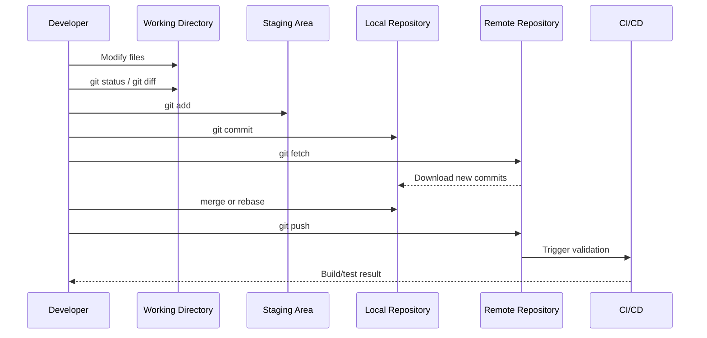
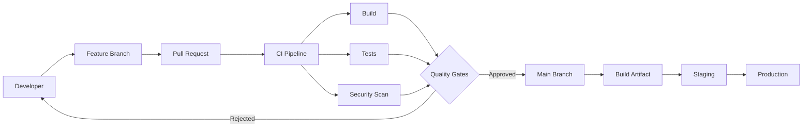
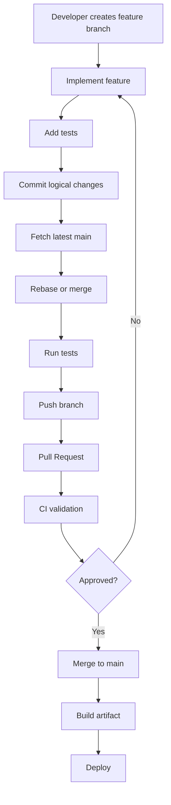

# Git: A Complete, Practical, and Architect-Level Guide

> **Scope and assumption:** This guide focuses on modern Git concepts and workflows used by software engineering teams. Examples assume a command-line Git installation and a typical application repository. The principles apply across languages and frameworks.

---

# 1. Executive Summary

## What is Git?

**Git** is a **distributed version control system (DVCS)** used to track changes to files over time.

It allows developers to:

* Record the history of a project.
* Work independently without constant network access.
* Create isolated lines of development.
* Combine changes from multiple developers.
* Recover previous versions.
* Review and audit changes.
* Coordinate software development across teams.

Git primarily tracks the **content and history of files**.

A Git repository can be thought of as a graph of immutable historical snapshots.

---

## Why was Git created?

Git was created to support large-scale, distributed software development.

Traditional centralized version control systems typically rely on a central server as the primary source of history. Git instead gives each developer a complete local copy of the repository's history.

This provides:

* Faster local operations.
* Offline development.
* Strong branching capabilities.
* Distributed collaboration.
* Efficient handling of large source histories.

Git was designed around the idea that source code development involves many concurrent changes that must eventually be integrated safely.

---

## What problem does Git solve?

Git solves the problem of **coordinating change over time**.

Suppose five developers modify the same system:

```text
Developer A → Adds authentication
Developer B → Fixes payment bug
Developer C → Refactors database layer
Developer D → Adds reporting
Developer E → Updates dependencies
```

Without version control, teams quickly encounter questions such as:

* Which version is the latest?
* Who changed this code?
* Why was this change made?
* How do we combine independent changes?
* How do we undo a broken release?
* How do we test an experimental feature safely?
* How do we compare two versions?

Git provides mechanisms for all of these.

---

## What problems does Git not solve?

Git is extremely useful, but it is not a complete software engineering solution.

Git does **not automatically solve**:

| Problem                   | Git Limitation                                                         |
| ------------------------- | ---------------------------------------------------------------------- |
| Code quality              | Git stores bad code as effectively as good code                        |
| Architecture              | Git does not enforce good system design                                |
| Testing                   | Git does not prove software correctness                                |
| Deployment                | Git is not a deployment platform                                       |
| Project management        | Git does not replace issue tracking                                    |
| Secrets management        | Git should generally not store secrets                                 |
| Binary asset management   | Large binary workflows require additional tooling                      |
| Merge conflict prevention | Git provides tools to resolve conflicts but cannot always prevent them |
| Team communication        | Git records changes but does not replace collaboration                 |

A repository can have a perfectly clean Git history and still contain poorly designed software.

---

## Who uses Git?

Git is used by:

* Individual developers.
* Startups.
* Enterprise engineering organizations.
* Open-source communities.
* DevOps teams.
* Platform engineering teams.
* Infrastructure teams.
* Data engineering teams.
* Documentation teams.

Git can manage much more than source code:

```text
Application code
Infrastructure-as-Code
Configuration
Documentation
API definitions
Database migration scripts
CI/CD pipelines
Kubernetes manifests
Architecture decision records
```

---

## When should I use Git?

Use Git when you need:

* Change history.
* Collaboration.
* Reproducibility.
* Reviewable changes.
* Parallel development.
* Controlled releases.
* Auditability.
* Rollback capability.

For software engineering, Git is effectively foundational infrastructure.

---

## Quick Gist

> **Git stores project history as a graph of snapshots called commits. Developers work locally, create branches for independent work, integrate changes through merging or rebasing, and synchronize repositories through remotes such as Git hosting platforms.**

---

# 2. Core Concepts

# 2.1 Repository

A **repository**, often called a **repo**, is a project and its version history.

Example:

```text
ecommerce-platform/
├── src/
├── tests/
├── docs/
├── .gitignore
└── README.md
```

The `.git` directory contains Git's internal database.

Conceptually:

```text
Project Files
     │
     ▼
Working Directory
     │
     ▼
.git
├── commits
├── branches
├── tags
└── metadata
```

### Why it matters

The repository is the boundary within which Git tracks history.

---

# 2.2 Working Directory

The **working directory** is the current set of files you edit.

Example:

```text
src/
    PaymentService.cs
    OrderService.cs
```

You modify:

```text
PaymentService.cs
```

Git detects that the working copy differs from the last committed version.

Command:

```bash
git status
```

Possible output conceptually:

```text
modified: PaymentService.cs
```

### Why it matters

The working directory represents changes that are not necessarily ready to commit.

---

# 2.3 Commit

A **commit** is an immutable snapshot of repository content plus metadata.

Conceptually:

```text
Commit
├── Snapshot of files
├── Author
├── Timestamp
├── Commit message
└── Parent commit(s)
```

Example:

```bash
git commit -m "Add payment validation"
```

A commit receives an identifier based on its content and metadata.

Conceptually:

```text
a1b2c3d
```

A history might look like:

```text
A → B → C → D
```

Where each letter is a commit.

### Why it matters

Commits are Git's fundamental historical unit.

A good commit should ideally represent a coherent change.

Bad:

```text
"changes"
```

Better:

```text
"Validate payment currency before authorization"
```

---

# 2.4 Snapshot vs Delta

A common misconception is that Git conceptually stores every commit merely as a file-by-file diff.

A useful mental model is:

> A commit represents a snapshot of the project.

For example:

```text
Commit A

OrderService.cs → Version 1
PaymentService.cs → Version 1
```

Then:

```text
Commit B

OrderService.cs → Version 2
PaymentService.cs → Version 1
```

Git internally stores and optimizes objects efficiently, but architecturally you should think in terms of a commit graph of snapshots.

### Why it matters

This explains why:

* Branches are lightweight.
* Commits have parents.
* Merging combines histories.
* Tags can identify exact historical states.

---

# 2.5 The Three Areas

One of Git's most important concepts is its separation into three areas.

```text
┌─────────────────────┐
│ Working Directory   │
│                     │
│ Files you edit      │
└──────────┬──────────┘
           │ git add
           ▼
┌─────────────────────┐
│ Staging Area        │
│                     │
│ Next commit content │
└──────────┬──────────┘
           │ git commit
           ▼
┌─────────────────────┐
│ Local Repository    │
│                     │
│ Commit history      │
└─────────────────────┘
```

## Working Directory

Your current changes.

## Staging Area

The exact changes selected for the next commit.

## Local Repository

The committed history.

---

## Example

Modify two files:

```text
PaymentService.cs
OrderService.cs
```

Stage only one:

```bash
git add PaymentService.cs
```

Then commit:

```bash
git commit -m "Add payment validation"
```

`OrderService.cs` remains uncommitted.

### Why it matters

The staging area allows developers to create logical commits from a larger set of working changes.

---

# 2.6 Branch

A **branch** is a movable reference to a commit.

Conceptually:

```text
A → B → C
          ↑
        main
```

Create a feature branch:

```bash
git switch -c feature/payment-validation
```

Then:

```text
        D → E
       /
A → B → C
          ↑
        main
```

Later:

```text
        D → E
       /
A → B → C
          ↑
        main
```

The feature branch points to `E`.

### Why it matters

Branches allow independent work without immediately affecting the primary development line.

---

# 2.7 HEAD

`HEAD` represents your current position in Git.

Example:

```text
A → B → C
          ↑
        main
          ↑
         HEAD
```

When you make a commit:

```text
A → B → C → D
              ↑
            main
              ↑
             HEAD
```

`HEAD` normally points to a branch, which points to a commit.

---

# 2.8 Detached HEAD

A **detached HEAD** occurs when `HEAD` points directly to a commit instead of a branch.

```text
A → B → C → D
      ↑
     HEAD
```

This can be useful for:

* Inspecting historical versions.
* Testing old commits.
* Debugging regressions.

However, new commits created here may become difficult to reference unless a branch is created.

---

# 2.9 Remote

A **remote** is a named reference to another repository.

Commonly:

```text
origin
```

Example:

```bash
git remote -v
```

Conceptually:

```text
Local Repository
      │
      │ push / fetch
      ▼
Remote Repository
```

A remote might be hosted by a Git hosting service or an internal enterprise Git server.

---

# 2.10 Clone

Cloning creates a local repository from another repository.

```bash
git clone <repository>
```

Conceptually:

```text
Remote Repository
        │
        │ clone
        ▼
Local Repository
```

Unlike a simple file download, cloning gives you Git history and repository metadata.

---

# 2.11 Fetch

`fetch` downloads changes from a remote without automatically integrating them into your current branch.

```bash
git fetch origin
```

Conceptually:

```text
Remote:
A → B → C → D

Local:
A → B → C
```

After fetch:

```text
origin/main → D

Local main → C
```

Your working branch remains unchanged.

### Why it matters

Fetching separates:

```text
Download remote changes
```

from:

```text
Integrate remote changes
```

---

# 2.12 Pull

`pull` generally combines:

```text
git fetch
+
integration
```

The integration may involve merging or rebasing depending on configuration and command options.

Example:

```bash
git pull
```

Architecturally, explicit operations are often easier to reason about:

```bash
git fetch
git merge
```

or:

```bash
git fetch
git rebase
```

---

# 2.13 Push

`push` sends local commits to a remote.

```bash
git push origin main
```

Conceptually:

```text
Local:
A → B → C → D

Remote:
A → B → C
```

After pushing:

```text
Remote:
A → B → C → D
```

---

# 2.14 Merge

A **merge** combines histories.

Example:

```text
main:

A → B → C
         \
feature:  D → E
```

After merging:

```text
A → B → C ─── M
         \     /
          D → E
```

`M` is a merge commit with multiple parents.

### Why it matters

Merging preserves the topology of parallel development.

---

# 2.15 Rebase

**Rebasing** moves commits so they appear to have been created on top of another commit.

Before:

```text
main:

A → B → C

feature:

A → B → D → E
```

Suppose main advances:

```text
main:

A → B → C → F

feature:

A → B → D → E
```

After rebasing feature:

```text
A → B → C → F → D' → E'
```

The commits `D` and `E` are recreated as new commits.

### Critical principle

> Rebasing changes commit identities.

Therefore, avoid casually rebasing commits that other developers are already depending on.

---

# 2.16 Merge vs Rebase

| Aspect                     | Merge           | Rebase      |
| -------------------------- | --------------- | ----------- |
| Preserves original history | Yes             | No          |
| Creates merge commit       | Often           | No          |
| Rewrites commits           | No              | Yes         |
| Shows branch topology      | Yes             | Usually no  |
| Produces linear history    | Not necessarily | Usually     |
| Good for shared branches   | Yes             | Often risky |

A common team policy:

```text
Local feature work → Rebase if useful
Shared integration branches → Avoid rewriting history
```

This is not universal. The correct policy depends on team workflow.

---

# 2.17 Conflict

A **merge conflict** occurs when Git cannot automatically determine how two changes should be combined.

Example:

Developer A:

```text
timeout = 30
```

Developer B:

```text
timeout = 60
```

Git may produce:

```text
<<<<<<< HEAD
timeout = 30
=======
timeout = 60
>>>>>>> feature/config
```

A developer must decide the intended result.

### Important insight

A conflict is not merely a technical problem.

It is often a **design decision requiring domain understanding**.

---

# 2.18 Tag

A **tag** is a named reference to a specific commit.

Example:

```text
A → B → C → D
          ↑
        v1.0.0
```

Tags are useful for:

```text
Release versions
Production deployments
Milestones
Important snapshots
```

Example:

```bash
git tag v1.0.0
```

---

# 2.19 `.gitignore`

`.gitignore` specifies files Git should generally ignore.

Example:

```gitignore
node_modules/
bin/
obj/
.env
*.log
```

### Important limitation

Ignoring a file does not automatically remove it if it was already tracked.

---

# 2.20 Git Object Model

At an advanced level, Git is a content-addressed object database.

The major conceptual objects are:

```text
Blob
Tree
Commit
Tag
```

## Blob

Stores file content.

```text
PaymentService.cs content
```

## Tree

Represents directories and references to blobs and other trees.

```text
src/
├── services/
└── models/
```

## Commit

References:

* A tree.
* Parent commit(s).
* Metadata.

## Tag object

Can provide an annotated reference to another object.

Conceptually:

```text
Commit
   │
   ▼
Tree
   │
   ├── Blob
   ├── Blob
   └── Tree
```

### Why it matters

Understanding the object model helps explain:

* Immutability.
* Hash-based identities.
* Branch behavior.
* Garbage collection.
* History rewriting.

---

# 3. How Git Works

## The Operational Flow

A typical development workflow is:

```text
1. Checkout repository
2. Create branch
3. Modify files
4. Inspect changes
5. Stage selected changes
6. Commit
7. Synchronize remote changes
8. Integrate upstream changes
9. Push branch
10. Review
11. Merge
12. Release
```

---

## Mermaid Workflow



---

## Step 1: Modify Files

Example:

```text
src/PaymentService.cs
```

Change:

```csharp
ValidatePayment(request);
```

---

## Step 2: Inspect Changes

```bash
git status
```

View differences:

```bash
git diff
```

---

## Step 3: Stage Changes

```bash
git add src/PaymentService.cs
```

Git places the selected version into the staging area.

---

## Step 4: Commit

```bash
git commit -m "Validate payment requests"
```

The staged snapshot becomes a new commit.

---

## Step 5: Fetch Remote Changes

```bash
git fetch origin
```

This updates your knowledge of the remote repository.

---

## Step 6: Integrate Changes

You may merge:

```bash
git merge origin/main
```

Or rebase:

```bash
git rebase origin/main
```

---

## Step 7: Push

```bash
git push origin feature/payment-validation
```

---

# 4. Implementation

## Assumption

This example uses a typical backend application repository, but the Git architecture applies to any technology stack.

---

# Recommended Repository Structure

```text
ecommerce-platform/
│
├── src/
│   ├── Ecommerce.Api/
│   ├── Ecommerce.Application/
│   ├── Ecommerce.Domain/
│   └── Ecommerce.Infrastructure/
│
├── tests/
│   ├── Ecommerce.UnitTests/
│   └── Ecommerce.IntegrationTests/
│
├── docs/
│   ├── architecture/
│   └── decisions/
│
├── infrastructure/
│   ├── terraform/
│   └── kubernetes/
│
├── scripts/
│
├── .gitignore
├── README.md
├── CODEOWNERS
└── LICENSE
```

Git does not require this structure. This is an architectural convention.

---

## Initialize

```bash
git init
```

Check status:

```bash
git status
```

---

## Initial Commit

```bash
git add .
git commit -m "Initial project structure"
```

Avoid blindly using `git add .` in repositories containing:

* Secrets.
* Generated artifacts.
* Large files.
* Local configuration.

---

# Example `.gitignore`

```gitignore
# Build output
bin/
obj/

# Node dependencies
node_modules/

# Environment files
.env
.env.*

# Logs
*.log

# IDE files
.vs/
.idea/

# OS files
.DS_Store
Thumbs.db
```

---

# Branch Strategy Example

A simple modern model:

```text
main
 │
 ├── feature/payment-validation
 │
 ├── feature/order-export
 │
 └── fix/payment-timeout
```

Workflow:

```bash
git switch main
git pull

git switch -c feature/payment-validation
```

Work:

```bash
git add .
git commit -m "Add payment validation"
```

Synchronize:

```bash
git fetch origin
git rebase origin/main
```

Push:

```bash
git push -u origin feature/payment-validation
```

---

# Commit Design

Prefer commits that represent logical units.

Poor:

```text
Fix stuff
```

Better:

```text
Add validation for unsupported payment currencies
```

Excellent commits answer:

```text
What changed?
Why did it change?
What logical behavior does this commit introduce?
```

---

# Testing Strategy

Git itself does not test code, so repositories should integrate validation into the workflow.

Typical pipeline:

```text
Push
 │
 ▼
Build
 │
 ▼
Unit Tests
 │
 ▼
Static Analysis
 │
 ▼
Security Scan
 │
 ▼
Integration Tests
 │
 ▼
Artifact Build
```

Locally:

```bash
run-tests
git add
git commit
```

Server-side:

```text
Pull Request
    │
    ▼
Automated Validation
    │
    ├── Tests
    ├── Linting
    ├── Security checks
    └── Build
```

---

# 5. Architecture and Design

A Solution Architect should treat Git as part of the engineering platform rather than merely a developer tool.

---

# 5.1 Repository Architecture

A key decision is:

```text
One repository?
or
Multiple repositories?
```

---

## Monorepo

A **monorepo** stores multiple related applications or components in one repository.

Example:

```text
platform/
├── frontend/
├── backend/
├── mobile/
├── infrastructure/
└── shared/
```

### Advantages

* Atomic cross-project changes.
* Easier refactoring across boundaries.
* Unified dependency visibility.
* Simplified shared code coordination.

### Disadvantages

* Large repository complexity.
* More complicated CI optimization.
* Access control can be difficult.
* Unrelated teams may be tightly coupled.

---

## Multi-Repository Architecture

```text
payment-service
order-service
identity-service
frontend
infrastructure
```

### Advantages

* Independent ownership.
* Independent release cycles.
* Clearer security boundaries.
* Smaller repositories.

### Disadvantages

* Cross-repository changes are harder.
* Dependency management increases.
* Version compatibility becomes important.

---

## Decision Criteria

| Factor                       | Monorepo      | Multi-Repo  |
| ---------------------------- | ------------- | ----------- |
| Atomic cross-service changes | Strong        | Difficult   |
| Independent teams            | Moderate      | Strong      |
| Independent releases         | Moderate      | Strong      |
| Shared code visibility       | Strong        | Moderate    |
| CI complexity                | High at scale | Distributed |
| Access isolation             | Harder        | Easier      |

There is no universally correct choice.

---

# 5.2 Branching Architecture

Common models include:

## Trunk-Based Development

```text
main
 │
 ├─ short-lived feature
 ├─ short-lived feature
 └─ short-lived feature
```

Characteristics:

* Small changes.
* Frequent integration.
* Short-lived branches.
* Strong automation.

Best when:

* CI is reliable.
* Teams integrate frequently.
* Feature flags are available.

---

## Long-Lived Branching

Example:

```text
main
release
develop
feature/*
hotfix/*
```

Can be useful when:

* Multiple release lines must be supported.
* Release processes are heavily controlled.
* Legacy systems require stabilization periods.

Risks:

* Merge complexity.
* Branch divergence.
* Integration delays.

---

# 5.3 Pull Requests as Architecture Boundaries

A pull request should not merely ask:

> Does this code compile?

It should also evaluate:

* Architectural boundaries.
* Security implications.
* Backward compatibility.
* Operational consequences.
* Test coverage.
* Migration strategy.

A good review asks:

```text
Does this change belong here?
Does it introduce coupling?
Can it be rolled back?
Is the deployment safe?
Does it change public behavior?
```

---

# 5.4 Git and CI/CD Architecture



---

# 5.5 Git Is Not the Deployment System

An important architectural distinction:

```text
Git commit ≠ Production deployment
```

A commit may:

* Trigger a deployment.
* Be associated with an artifact.
* Be referenced by a release.

But Git itself does not guarantee that the commit is deployed.

A stronger architecture tracks:

```text
Commit SHA
      │
      ▼
Build Artifact
      │
      ▼
Container Image
      │
      ▼
Deployment
```

Example:

```text
Commit: abc123

Artifact:
my-service:1.8.0

Container:
registry/service@digest:...

Deployment:
production
```

This improves traceability.

---

# 6. Production Readiness

# 6.1 Security

## Never commit secrets

Do not store:

```text
Passwords
API keys
Private keys
Database credentials
Tokens
Certificates
```

Use:

* Secret management systems.
* Environment-specific configuration.
* CI/CD secret stores.

A `.gitignore` file helps, but it is not sufficient security protection.

---

## Important Rule

If a secret has been committed:

```text
Deleting the file is not enough.
```

The secret may exist in history.

The proper response often includes:

1. Revoke or rotate the secret.
2. Remove exposure from current code.
3. Consider history remediation.
4. Investigate repository access and downstream copies.

---

# 6.2 Access Control

Production repositories should generally implement:

```text
Developer
    ↓
Feature Branch

Pull Request
    ↓
Automated Checks
    ↓
Review Approval
    ↓
Protected Main Branch
```

Avoid unrestricted direct pushes to critical branches.

---

# 6.3 Branch Protection

Typical policies:

```text
Require pull requests
Require review approval
Require successful CI
Require security checks
Restrict force pushes
Restrict branch deletion
```

---

# 6.4 Data Protection

Repositories may contain sensitive business information.

Consider:

* Repository access permissions.
* Backup strategy.
* Audit logging.
* Data classification.
* Dependency source integrity.
* Third-party contributor controls.

---

# 6.5 Performance and Scale

Git performance may degrade with:

* Extremely large repositories.
* Massive binary assets.
* Huge histories.
* Very large working trees.

Possible strategies:

```text
Git LFS
Partial clone
Sparse checkout
Repository splitting
Artifact repositories
```

Git is optimized primarily for source-oriented content rather than arbitrary large binary storage.

---

# 6.6 Reliability

A reliable engineering workflow should support:

```text
Developer laptop failure
Remote outage
Bad deployment
Bad merge
Accidental deletion
Broken commit
```

Git helps with history recovery, but production reliability also requires:

* Remote backups.
* Protected branches.
* Immutable artifacts.
* Deployment rollback.
* Disaster recovery.

---

# 6.7 Observability

Git metadata can become part of operational observability.

A mature system may correlate:

```text
Production Error
       │
       ▼
Application Version
       │
       ▼
Container Image
       │
       ▼
Build
       │
       ▼
Commit SHA
       │
       ▼
Pull Request
```

This creates strong traceability.

---

# 6.8 Failure Recovery

Useful recovery mechanisms include:

```bash
git log
git reflog
git restore
git revert
git reset
```

These have different semantics.

---

## `git restore`

Restore working files.

Useful for:

```text
Discarding uncommitted changes.
```

---

## `git revert`

Creates a new commit that reverses an earlier commit.

Useful for shared history:

```text
A → B → C → D
```

Revert `C`:

```text
A → B → C → D → R
```

History remains intact.

---

## `git reset`

Moves branch references and can modify staging and working state.

Potentially dangerous.

Common conceptual modes:

```text
soft
mixed
hard
```

A hard reset can discard local changes.

---

## `git reflog`

Records reference movement locally.

It can help recover commits that are no longer reachable from ordinary branch references.

Example use case:

```text
Accidentally reset branch
        │
        ▼
Use reflog
        │
        ▼
Find previous commit
        │
        ▼
Restore branch
```

---

# 7. Real-World Usage

# Use Case 1: Enterprise Backend Platform

Architecture:

```text
main
│
├── feature/order-api
├── feature/payment-retry
├── fix/tax-calculation
└── infrastructure-update
```

Workflow:

```text
Feature Branch
    │
    ▼
Pull Request
    │
    ▼
Automated Tests
    │
    ▼
Security Validation
    │
    ▼
Code Review
    │
    ▼
Merge
```

Git is a strong fit because multiple teams modify related systems concurrently.

---

# Use Case 2: Infrastructure as Code

Example:

```text
infrastructure/
├── modules/
├── environments/
│   ├── development/
│   ├── staging/
│   └── production/
```

Git provides:

* Infrastructure history.
* Code review.
* Rollback traceability.
* Change approval.

This approach is commonly called **GitOps** when Git-based desired state becomes a central mechanism for driving infrastructure reconciliation.

---

# Use Case 3: Regulated Enterprise Software

Requirements:

```text
Who changed the system?
Who reviewed the change?
What code version was released?
What artifact was deployed?
When was it deployed?
```

Git can contribute strong source-level traceability.

However:

> Git history alone is not necessarily a complete compliance or audit system.

Organizations may need additional controls around identity, approvals, artifact retention, and deployment records.

---

# Use Case 4: Open-Source Development

Git is particularly effective for distributed contribution:

```text
Fork
 │
 ▼
Feature Branch
 │
 ▼
Pull Request
 │
 ▼
Review
 │
 ▼
Merge
```

Contributors can work independently and synchronize through shared repositories.

---

# When Git Is a Good Fit

Git is excellent for:

```text
Source code
Text configuration
Documentation
Infrastructure definitions
Structured text assets
```

---

# When Another Approach May Be Better

Git alone is often not ideal for:

```text
Large binary media archives
Frequently changing massive datasets
High-volume generated artifacts
Secrets
Database backups
Build artifacts
```

Use specialized storage systems where appropriate.

---

# 8. Common Mistakes

# Mistake 1: Treating Git as a Backup Button

Bad workflow:

```bash
git add .
git commit -m "backup"
```

Git should represent meaningful history.

Better:

```text
Commit logical changes with meaningful messages.
```

---

# Mistake 2: Huge Commits

Warning signs:

```text
500 files changed
10 unrelated features
Refactoring + bug fix + dependency upgrade
```

Better:

```text
Separate logically independent changes.
```

---

# Mistake 3: Long-Lived Feature Branches

A branch active for months tends to accumulate:

* Merge conflicts.
* Architectural divergence.
* Integration risk.

Prefer smaller, incremental integration where possible.

---

# Mistake 4: Force Pushing Shared History

Dangerous:

```bash
git push --force
```

Potential consequences:

```text
Other developers lose expected history.
```

If rewriting your own feature branch is intentional, teams often use safer force semantics where appropriate, such as lease-based protection, but shared branch policies should be explicit.

---

# Mistake 5: Committing Secrets

Example:

```text
.env
production-key.pem
database-password.txt
```

Prevention:

```text
Secret scanning
Pre-commit checks
CI scanning
Repository policies
Developer education
```

---

# Mistake 6: Confusing Pull with Sync

Developers sometimes run:

```bash
git pull
```

without understanding whether the result involves:

* A merge.
* A rebase.
* Conflicts.

Understand the configured behavior.

---

# Mistake 7: Using Reset Instead of Revert on Shared History

For shared production history:

```text
Prefer creating corrective commits when history must remain stable.
```

Use history rewriting deliberately and according to team policy.

---

# Mistake 8: Ignoring Generated Files

Repositories become noisy when they include:

```text
Build output
Temporary files
IDE caches
Dependency caches
Logs
```

Maintain `.gitignore`.

---

# Mistake 9: Treating Merge Conflicts as Mechanical

Conflict:

```text
Version A
Version B
```

The correct answer might be:

```text
Neither.
```

Understand the intended behavior before resolving.

---

# 9. End-to-End Project

# Project: Payment Processing Service

## Requirements

Build a service capable of:

```text
Create payment
Validate payment
Authorize payment
Record transaction
Expose payment status
```

---

# Repository Structure

```text
payment-service/
├── src/
│   ├── api/
│   ├── application/
│   ├── domain/
│   └── infrastructure/
│
├── tests/
│   ├── unit/
│   └── integration/
│
├── docs/
│   └── architecture/
│
├── infrastructure/
│
├── scripts/
│
├── .gitignore
└── README.md
```

---

# Initial History

```text
Commit 1
"Initialize payment service"

Commit 2
"Add domain payment model"

Commit 3
"Add payment validation"

Commit 4
"Add payment authorization"
```

---

# Feature Development

Create:

```bash
git switch -c feature/payment-validation
```

Implement:

```text
PaymentValidator
```

Tests:

```text
PaymentValidatorTests
```

Commit:

```bash
git add src tests
git commit -m "Validate payment amount and currency"
```

---

# Integration Flow



---

# Tests

## Unit Tests

Test:

```text
Invalid amount
Unsupported currency
Missing customer
Valid payment
```

## Integration Tests

Test:

```text
Database persistence
Payment provider communication
API endpoints
```

## Git Workflow Validation

Automation should validate:

```text
Repository builds
Tests pass
Formatting rules pass
Static analysis passes
Security checks pass
```

---

# Evolution as Requirements Grow

## Phase 1: Small Team

```text
main
feature/*
```

## Phase 2: Multiple Teams

Add:

```text
CODEOWNERS
Mandatory reviews
Branch protection
CI quality gates
Release tags
```

## Phase 3: Multiple Services

Architectural decisions:

```text
Monorepo?
Multiple repositories?
Shared libraries?
Independent releases?
```

## Phase 4: Enterprise Platform

Add:

```text
Artifact traceability
SBOM generation
Security scanning
Automated dependency updates
Release automation
Deployment provenance
```

---

# 10. Final Review

# Quick Gist

Git is fundamentally a system for managing a graph of immutable project snapshots.

The essential model is:

```text
Edit
 ↓
Working Directory
 ↓ git add
Staging Area
 ↓ git commit
Local Repository
 ↓ git push
Remote Repository
```

The most important concepts are:

```text
Repository → Project history

Commit → Immutable historical snapshot

Branch → Movable reference to a commit

HEAD → Current Git position

Merge → Combine histories

Rebase → Recreate commits on another base

Remote → Another repository

Tag → Named historical version
```

The most important architectural principle is:

> Git is a source-of-change system, not a complete software delivery platform.

A production architecture combines Git with:

```text
Code Review
CI
Security Scanning
Artifact Management
CD
Observability
Secret Management
```

---

# Practical Example

```bash
# Start from the main branch
git switch main
git pull

# Create isolated work
git switch -c feature/payment-validation

# Make changes
git status
git diff

# Stage specific files
git add src/PaymentValidator.cs
git add tests/PaymentValidatorTests.cs

# Create logical commit
git commit -m "Validate payment amount and currency"

# Synchronize with upstream
git fetch origin
git rebase origin/main

# Push feature
git push -u origin feature/payment-validation
```

Then:

```text
Pull Request
    ↓
Automated Tests
    ↓
Code Review
    ↓
Merge
    ↓
Build Artifact
    ↓
Deployment
```

---

# Best Practices

## Repository

* Keep repositories focused.
* Avoid committing generated artifacts.
* Maintain `.gitignore`.
* Document repository conventions.

## Commits

* Make commits logically coherent.
* Write meaningful commit messages.
* Avoid unrelated changes in the same commit.

## Branches

* Keep feature branches short-lived where practical.
* Define explicit branch policies.
* Protect important branches.

## Collaboration

* Review code before merging.
* Use automated validation.
* Synchronize frequently.
* Resolve conflicts using domain understanding.

## Security

* Never intentionally commit secrets.
* Rotate exposed credentials immediately.
* Use secret scanning.
* Restrict repository access.

## Architecture

* Trace deployments back to commits.
* Tag important releases.
* Treat CI/CD policies as part of the engineering platform.
* Choose monorepo versus multi-repo based on organizational constraints.

---

# Expert-Level Interview Questions & Answers

## 1. Why are Git branches considered lightweight?

A branch is fundamentally a movable reference to a commit rather than a complete copy of the repository.

Conceptually:

```text
main ───────► Commit C
feature ────► Commit E
```

Creating a branch does not normally duplicate all project files. Both histories share common commits until they diverge.

This makes frequent branching practical.

---

## 2. What is the architectural difference between merge and rebase?

A merge combines histories while preserving their original topology.

```text
A → B → C ─── M
         \     /
          D → E
```

A rebase recreates commits on a new base:

```text
A → B → C → D' → E'
```

The architectural trade-off is:

```text
Merge
Preserves historical topology

Rebase
Produces a simpler linear history but rewrites commit identities
```

For shared integration history, preserving stable commit references is often more important than visual linearity.

---

## 3. Why is force pushing dangerous?

A force push can replace remote history.

Suppose:

```text
Remote:
A → B → C → D
```

A rewritten push may produce:

```text
Remote:
A → B → X → Y
```

Developers depending on `C` and `D` may experience broken assumptions.

A Solution Architect should define:

* Which branches can be rewritten.
* Who can rewrite them.
* Whether force pushing is prohibited on protected branches.

---

## 4. How should Git integrate with CI/CD?

Git should provide the source version identity.

A robust chain is:

```text
Commit SHA
    ↓
Build
    ↓
Artifact
    ↓
Container Image
    ↓
Deployment
```

The production system should be traceable backward.

When an incident occurs:

```text
Production Version
    ↓
Artifact
    ↓
Build
    ↓
Commit
    ↓
Pull Request
```

This improves debugging and auditing.

---

## 5. How do you choose between a monorepo and multiple repositories?

Evaluate:

* Team boundaries.
* Release independence.
* Shared code.
* Cross-service changes.
* Access control.
* CI performance.
* Build tooling.

Use a monorepo when coordinated changes and shared development outweigh centralized complexity.

Use multiple repositories when services have strong autonomy and independent ownership.

The architecture should optimize for organizational and operational reality rather than ideology.

---

## 6. What is the difference between reverting and resetting?

A revert:

```text
Creates new history.
```

A reset:

```text
Moves history references.
```

For shared history, reverting is often safer because other developers' commit references remain valid.

Resetting is powerful for local history management but must be used carefully.

---

## 7. How should an architect handle a secret committed to Git?

Do not assume deleting the file solves the problem.

The response should generally include:

1. Treat the secret as compromised.
2. Revoke or rotate it.
3. Remove it from active configuration.
4. Assess repository history exposure.
5. Determine whether history remediation is required.
6. Add scanning and prevention controls.

The most important action is usually:

> **Invalidate the exposed credential.**

---

## 8. What makes a healthy Git workflow at enterprise scale?

A healthy workflow usually has:

```text
Small changes
Frequent integration
Automated validation
Protected critical branches
Clear ownership
Reliable CI
Secure credential handling
Traceable releases
Recoverable deployments
```

Git alone does not create this system.

The surrounding engineering practices do.

---

# Further Study

## Git Internals

Study:

```text
Objects
Blobs
Trees
Commits
Refs
HEAD
Packfiles
Garbage collection
Reflog
```

---

## Advanced History Management

Learn:

```bash
git rebase -i
git cherry-pick
git bisect
git reflog
git worktree
```

---

## Advanced Collaboration

Study:

```text
Trunk-based development
Pull request workflows
Merge queues
Branch protection
CODEOWNERS
Release management
```

---

## Software Supply Chain

Learn how Git connects to:

```text
CI/CD
Artifact repositories
SBOMs
Dependency scanning
Secret scanning
Build provenance
Signed artifacts
```

---

## Infrastructure Practices

Explore:

```text
GitOps
Infrastructure as Code
Immutable infrastructure
Declarative deployment
Configuration reconciliation
```

---

## The Architect-Level Mental Model

The most useful way to think about Git is:

```text
Git
=
Change History
+
Distributed Collaboration
+
Immutable Commit Graph
+
Branching and Integration
```

At enterprise scale:

```text
Git
        │
        ├── Code Review
        ├── CI
        ├── Security
        ├── Artifact Management
        ├── Deployment Automation
        └── Operational Traceability
```

Mastering Git commands is useful.

Understanding **Git's data model, history semantics, collaboration workflows, and architectural trade-offs** is what enables you to make sound production and Solution Architect-level decisions.
