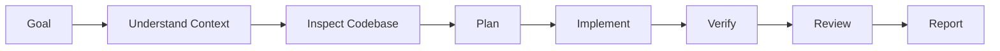
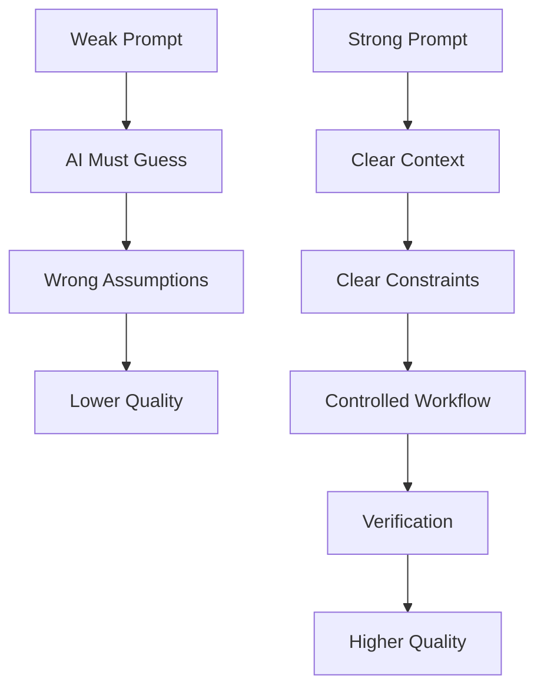

# How to Turn a Weak Prompt into a Strong Prompt

A **weak prompt** usually tells the AI only *what* you want.

A **strong prompt** tells the AI:

> **What you want + why + context + constraints + expected output + quality standard**

---

# 1. Weak vs Strong Prompt

### ❌ Weak Prompt

> Explain RAG.

The AI has to guess:

* Your knowledge level
* Why you need RAG
* How detailed the explanation should be
* Whether you want theory or implementation
* Which programming language
* Whether you need architecture
* Whether you need production guidance

### ✅ Strong Prompt

> Teach me Retrieval-Augmented Generation (RAG) as a complete, practical, and architect-level guide.
>
> Assume I am a software engineer building production AI applications.
>
> Start with fundamentals and progressively move toward advanced concepts.
>
> Cover:
>
> * Core RAG architecture
> * Document ingestion
> * Chunking strategies
> * Embeddings
> * Vector databases
> * Retrieval strategies
> * Reranking
> * Context construction
> * Prompt engineering
> * Evaluation
> * Observability
> * Security
> * Production architecture
>
> Use practical examples, architecture diagrams, tables, and code examples.
>
> Explain unfamiliar concepts when they first appear.
>
> End with production best practices, common mistakes, and an implementation roadmap.

Now the AI has much less ambiguity.

---

# 2. The Strong Prompt Formula

A useful formula is:

```text
ROLE
+
GOAL
+
CONTEXT
+
TASK
+
CONSTRAINTS
+
OUTPUT FORMAT
+
QUALITY CRITERIA
```

## Template

```text
You are a [ROLE].

My goal is [GOAL].

Context:
[CONTEXT]

Your task:
[TASK]

Requirements:
- [Requirement 1]
- [Requirement 2]
- [Requirement 3]

Constraints:
- [Constraint 1]
- [Constraint 2]

Output format:
[FORMAT]

Quality requirements:
- [Quality standard]
- [Depth]
- [Examples]
- [Validation]
```

---

# 3. The Prompt Upgrade Process

When you have a weak prompt, improve it by asking these questions.

## Step 1: Define the Goal

Weak:

```text
Teach me Docker.
```

Better:

```text
Teach me Docker so I can containerize and deploy production applications.
```

The goal changes the answer.

---

## Step 2: Add Your Context

```text
I am a .NET backend developer with experience in APIs and cloud applications.
```

Now the AI can adapt examples.

---

## Step 3: Define the Scope

```text
Cover:
- Images
- Containers
- Dockerfiles
- Volumes
- Networking
- Docker Compose
- Multi-stage builds
- Production deployment
```

Without scope, AI may omit important topics.

---

## Step 4: Define the Depth

```text
Start from fundamentals and progress to architect-level understanding.
```

Possible depth levels:

| Level        | Prompt                                                 |
| ------------ | ------------------------------------------------------ |
| Beginner     | Explain simply with examples                           |
| Intermediate | Focus on practical implementation                      |
| Advanced     | Focus on optimization and architecture                 |
| Architect    | Focus on trade-offs, scalability, security, production |
| Expert       | Focus on internals, limitations, alternatives          |

---

## Step 5: Define the Output Format

Instead of:

```text
Explain microservices.
```

Use:

```text
Return the answer using:

- Clear headings
- Tables
- Bullet points
- Architecture diagrams
- Code examples
- Decision matrices
- Production checklist
```

The output becomes much more usable.

---

# 4. The Most Powerful Transformation

## Weak Prompt

```text
Explain microservices.
```

## Strong Prompt

```text
Teach me Microservices Architecture as a complete, practical,
and architect-level guide.

Assume I am a backend software engineer building enterprise
production systems.

Start from the fundamentals and progressively move toward
advanced architecture decisions.

Cover:

1. What microservices are
2. When to use microservices
3. When NOT to use microservices
4. Service boundaries
5. Domain-Driven Design
6. API Gateway
7. Service discovery
8. Inter-service communication
9. Synchronous vs asynchronous communication
10. Event-driven architecture
11. Data ownership
12. Distributed transactions
13. Saga pattern
14. CQRS
15. Event sourcing
16. Observability
17. Security
18. Resilience
19. Deployment
20. Scaling
21. Testing
22. Production architecture

For every major concept:

- Explain what it is
- Explain why it exists
- Explain when to use it
- Explain trade-offs
- Provide a practical example
- Show common mistakes

Use:

- Markdown
- Tables
- Mermaid diagrams
- Architecture examples
- Decision matrices

End with:

- Best practices
- Anti-patterns
- Architecture decision checklist
- Learning roadmap
```

This is **10× more likely** to produce the answer you actually need.

---

# 5. A Practical Prompt Framework: G-C-T-C-O

Use this simple framework.

## G — Goal

What do you want?

```text
I want to design a production RAG system.
```

## C — Context

Who are you and what environment are you working in?

```text
I am a .NET developer building enterprise applications.
```

## T — Task

What exactly should AI do?

```text
Design the architecture and explain every component.
```

## C — Constraints

What should AI avoid or follow?

```text
Avoid unnecessary theory.
Focus on production implementation.
```

## O — Output

How should the result look?

```text
Use Markdown, diagrams, tables, and code examples.
```

### Complete Example

```text
Goal:
Learn how to build a production RAG system.

Context:
I am a .NET backend developer with experience building APIs.

Task:
Teach me the complete RAG architecture from document ingestion
to production deployment.

Constraints:
Focus on practical and production-ready implementation.
Explain trade-offs and avoid unnecessary academic theory.

Output:
Use Markdown, diagrams, tables, architecture examples,
and code examples.
```

---

# 6. The Biggest Prompt Improvement: Add "Decision Criteria"

Weak prompts ask:

> What is X?

Strong prompts ask:

> When should I use X instead of Y?

Example:

### Weak

```text
Explain Redis.
```

### Strong

```text
Explain Redis for a backend architect.

Cover:

- What Redis is
- Why Redis exists
- When Redis is appropriate
- When Redis is NOT appropriate
- Redis vs database caching
- Redis vs Memcached
- Redis vs distributed cache
- Trade-offs
- Scalability limitations
- Failure scenarios
- Production architecture
```

This produces **decision-making knowledge**, not just definitions.

---

# 7. Add Explicit Quality Requirements

You can tell the AI how to think about the answer.

```text
Do not just list concepts.

For every important recommendation:

1. Explain why it is recommended
2. Explain alternatives
3. Explain trade-offs
4. Explain failure scenarios
5. Explain when the recommendation should NOT be used
```

This is extremely powerful for architecture questions.

---

# 8. Strong Prompt Template for Learning Technical Topics

Since you are learning software architecture, AI development, Claude Code, RAG, and agent systems, this template will work well for you.

```text
Teach me [TOPIC] as a complete, practical, and architect-level guide.

Assume I am a software engineer who wants:

- Strong fundamentals
- Practical implementation skills
- Production experience
- Architecture decision-making ability

Start with fundamentals and progressively move toward
advanced and architect-level concepts.

For every major concept:

1. What it is
2. Why it exists
3. How it works
4. When to use it
5. When NOT to use it
6. Advantages
7. Disadvantages
8. Trade-offs
9. Common mistakes
10. Production considerations

Cover:

[TOPICS]

Use:

- Clear headings
- Tables
- Bullet points
- Practical examples
- Code examples where useful
- Mermaid architecture diagrams
- Decision matrices

Explain unfamiliar terms the first time they appear.

Do not assume I already understand advanced concepts.

Focus on:

- Real-world implementation
- Production architecture
- Scalability
- Reliability
- Security
- Performance
- Maintainability

End with:

1. Best practices
2. Common anti-patterns
3. Architecture decision checklist
4. Practical project ideas
5. Learning roadmap
```

---

# 9. Strong Prompt Template for Coding

### Weak

```text
Create an API.
```

### Strong

```text
Act as a senior backend engineer.

Build a production-ready REST API for [DOMAIN].

Technology:

- .NET
- ASP.NET Core
- PostgreSQL
- Entity Framework Core

Requirements:

- Clean Architecture
- Dependency Injection
- Repository pattern only where appropriate
- CQRS where justified
- Validation
- Global exception handling
- Logging
- Authentication
- Authorization
- Unit tests
- Integration tests
- Docker support

Before writing code:

1. Explain the architecture
2. Identify important design decisions
3. Explain trade-offs

Then:

1. Generate the project structure
2. Implement the solution incrementally
3. Explain each major component
4. Provide tests
5. Provide Docker configuration

Follow production best practices.
Avoid unnecessary abstractions.
```

---

# 10. Strong Prompt Template for AI Coding Tools

For Claude Code, Cursor, Codex, or similar agents:

```text
First understand the repository before making changes.

Your workflow:

1. Inspect the project structure
2. Identify relevant files
3. Understand existing architecture
4. Identify dependencies
5. Create an implementation plan
6. Show the plan before making major changes
7. Implement the smallest safe change
8. Run tests
9. Run linting and validation
10. Review the changes

Constraints:

- Do not modify unrelated files
- Follow existing project conventions
- Reuse existing patterns where appropriate
- Avoid unnecessary dependencies
- Do not introduce breaking changes
- Keep changes minimal

After implementation:

- Summarize changed files
- Explain architectural decisions
- List risks
- List follow-up improvements
```

This is much stronger than:

```text
Fix this bug.
```

---

# 11. Use "Before You Answer" Instructions

A useful pattern is:

```text
Before producing the final answer:

1. Identify ambiguous requirements
2. State important assumptions
3. Break the problem into components
4. Check for missing requirements
5. Choose the simplest appropriate solution
```

For coding agents:

```text
Before changing code:

- Inspect the relevant files
- Understand existing patterns
- Identify dependencies
- Create a plan
- Verify assumptions against the codebase
```

This reduces random or incorrect changes.

---

# 12. Weak → Strong Conversion Formula

You can transform almost any prompt like this:

### Original

```text
[DO SOMETHING]
```

### Improved

```text
Act as [EXPERT ROLE].

My goal is:
[GOAL]

Context:
[BACKGROUND]

Task:
[EXACT TASK]

Scope:
- [AREA 1]
- [AREA 2]
- [AREA 3]

Requirements:
- [REQUIREMENT 1]
- [REQUIREMENT 2]

Constraints:
- [CONSTRAINT 1]
- [CONSTRAINT 2]

For important decisions, explain:
- Why
- Alternatives
- Trade-offs
- Risks

Output format:
[FORMAT]

Quality standard:
[EXPECTED QUALITY]
```

---

# 13. The Prompt Quality Ladder

Think of prompts as levels.

## Level 1 — Command

```text
Explain Kubernetes.
```

## Level 2 — Goal

```text
Explain Kubernetes so I can deploy applications.
```

## Level 3 — Context

```text
Explain Kubernetes to a .NET backend developer.
```

## Level 4 — Scope

```text
Explain Kubernetes, including pods, services,
deployments, networking, and scaling.
```

## Level 5 — Constraints

```text
Focus on production use cases.
Avoid unnecessary theory.
```

## Level 6 — Output Specification

```text
Use diagrams, tables, examples, and YAML.
```

## Level 7 — Quality Requirements

```text
Explain trade-offs, failure scenarios,
and when not to use each pattern.
```

**Level 7 prompts usually produce significantly better results.**

---

# 14. My Recommended Universal Prompt

You can reuse this almost everywhere:

```text
Help me with [TASK].

Context:
[MY BACKGROUND / PROJECT CONTEXT]

Goal:
[WHAT I WANT TO ACHIEVE]

Requirements:
- [REQUIREMENT 1]
- [REQUIREMENT 2]
- [REQUIREMENT 3]

Constraints:
- [CONSTRAINT 1]
- [CONSTRAINT 2]

Before giving the final answer:

- Identify important assumptions
- Break the problem into logical parts
- Consider alternatives where relevant
- Prefer the simplest practical solution

For major recommendations, explain:

- Why
- Alternatives
- Trade-offs
- Risks
- When not to use it

Return the result using:

- Clear headings
- Tables where useful
- Practical examples
- Step-by-step guidance
- Production considerations

Focus on accuracy, practicality, maintainability,
and real-world implementation.
```

---

# The Most Important Rule

**A strong prompt does not mean a long prompt.**

The real goal is:

> **Remove ambiguity without adding unnecessary instructions.**

A short, strong prompt:

```text
Act as a senior .NET architect.

Design a production-ready RAG service for an enterprise application.

Context:
ASP.NET Core, PostgreSQL, Azure, and OpenAI-compatible models.

Focus on:
- Architecture
- Scalability
- Security
- Observability
- Cost

For each major design decision, explain alternatives and trade-offs.

Return:
- Architecture diagram
- Component responsibilities
- Data flow
- Technology recommendations
- Production checklist
```

That is often better than a 2,000-word prompt with repeated instructions.

## Best mental model

> **Weak prompt = AI has to guess.**
> **Strong prompt = AI has clear instructions and decision boundaries.**

If you want, I can also give you a **"Weak Prompt → Strong Prompt" framework specifically for Claude Code, AI coding agents, architecture, learning, debugging, and code review**.

# Weak Prompt → Strong Prompt Framework for Claude Code, AI Coding Agents, Architecture, Learning, Debugging & Code Review

The biggest difference between a weak and strong prompt for AI coding agents is this:

> **Weak prompt = tells the agent what to do.**
> **Strong prompt = tells the agent how to understand, decide, execute, verify, and report.**

For tools such as [Claude Code](https://docs.anthropic.com/en/docs/claude-code/overview?utm_source=chatgpt.com) and other AI coding agents, a good prompt should usually control this workflow:



---

# 1. The Universal AI Coding Agent Framework

Use this as the foundation for almost every coding task.

## Weak Prompt

```text
Add authentication.
```

## Strong Prompt

```text
# Goal

Implement authentication for this application.

# Context

This is an existing codebase.
Do not assume the architecture before inspecting the repository.

# Workflow

Before making changes:

1. Inspect the repository structure.
2. Identify the application architecture.
3. Find existing authentication, authorization, user, and configuration code.
4. Identify relevant dependencies.
5. Follow existing project conventions.
6. Identify potential security implications.

# Planning

Before implementation:

1. Describe the files and components that need to change.
2. Explain the proposed approach.
3. Identify alternatives and trade-offs.
4. Prefer the simplest solution compatible with the existing architecture.

# Implementation

- Modify only relevant files.
- Reuse existing patterns where appropriate.
- Avoid unnecessary abstractions.
- Avoid unnecessary dependencies.
- Maintain backward compatibility unless explicitly required otherwise.

# Verification

After implementation:

1. Build the project.
2. Run relevant tests.
3. Run linting or static analysis if configured.
4. Check for security issues.
5. Review the final diff for unintended changes.

# Final Report

Provide:

- Summary of changes
- Files changed
- Important design decisions
- Tests executed
- Risks or limitations
- Recommended follow-up improvements
```

---

# 2. The CORE Framework

I recommend remembering this simple model:

## C — Context

What does the agent need to know?

## O — Objective

What outcome do you want?

## R — Rules

What constraints must the agent follow?

## E — Execution

How should the agent work?

---

## Template

```text
# Context

[Project information]
[Technology stack]
[Relevant architecture]
[Current problem]

# Objective

[Exact outcome required]

# Rules

- [Constraint]
- [Constraint]
- [Constraint]

# Execution

1. Understand the existing implementation.
2. Identify relevant files.
3. Create a plan.
4. Implement incrementally.
5. Verify the result.
6. Review the changes.
7. Report the outcome.
```

This works for almost every AI coding task.

---

# 3. Framework for Claude Code and AI Coding Agents

## ❌ Weak

```text
Add a new payment feature.
```

The agent must guess:

* Where payment logic belongs
* Existing architecture
* Existing providers
* Database structure
* Error handling
* Testing strategy
* Security requirements

## ✅ Strong

```text
# Task

Implement the requested payment feature.

# Repository Understanding

Before changing code:

1. Inspect the repository structure.
2. Identify the architecture and application layers.
3. Find existing payment, order, billing, and transaction code.
4. Identify existing patterns for:
   - Dependency injection
   - Error handling
   - Logging
   - Validation
   - Database access
   - External APIs

Do not make architectural assumptions without checking the codebase.

# Design

Before implementation:

1. Identify the minimum required changes.
2. Reuse existing abstractions where appropriate.
3. Avoid introducing duplicate concepts.
4. Prefer existing libraries and patterns.
5. Identify security and data consistency concerns.

# Implementation Rules

- Keep the change focused.
- Do not modify unrelated files.
- Do not refactor unrelated code.
- Do not introduce unnecessary dependencies.
- Preserve backward compatibility.
- Follow existing naming and coding conventions.

# Verification

Run:

1. Build
2. Relevant unit tests
3. Relevant integration tests
4. Static analysis if available

# Final Response

Provide:

- What changed
- Why it changed
- Files modified
- Tests run
- Remaining limitations
```

---

# 4. Framework for Architecture Tasks

Architecture prompts should force the AI to discuss **trade-offs**, not just generate diagrams.

## ❌ Weak

```text
Design a microservices architecture.
```

## ✅ Strong

```text
Act as a software architect.

# Goal

Design a production-ready architecture for [SYSTEM].

# Context

Users:
[SCALE]

Traffic:
[EXPECTED TRAFFIC]

Technology:
[TECH STACK]

Deployment:
[CLOUD / ON-PREMISE / HYBRID]

# Requirements

Functional:

- [Requirement]

Non-functional:

- Scalability
- Reliability
- Security
- Observability
- Maintainability
- Cost efficiency

# Architecture Process

Before recommending an architecture:

1. Identify the major system components.
2. Identify critical data flows.
3. Identify integration points.
4. Identify scaling bottlenecks.
5. Identify failure scenarios.
6. Identify security boundaries.

# Decision Making

For every major architectural decision:

- Explain the problem being solved.
- Explain the chosen approach.
- Explain alternatives.
- Explain trade-offs.
- Explain when the approach should NOT be used.

# Deliverables

Provide:

1. High-level architecture
2. Component responsibilities
3. Data flow
4. API and communication patterns
5. Data architecture
6. Security architecture
7. Scalability strategy
8. Failure handling strategy
9. Observability strategy
10. Deployment architecture

Use Mermaid diagrams where useful.

End with:

- Architecture Decision Records
- Risks
- Assumptions
- Future evolution strategy
```

---

# 5. Architecture Decision Prompt

This is one of the most useful prompts for senior engineers.

## Weak

```text
Should I use microservices?
```

## Strong

```text
Help me make an architecture decision.

# Decision

Should this system use:

- Modular monolith
- Microservices
- Hybrid architecture

# Context

[PROJECT DETAILS]

# Evaluation Criteria

Evaluate each option based on:

- Team size
- Domain complexity
- Deployment requirements
- Scalability
- Operational complexity
- Data consistency
- Development speed
- Cost
- Observability
- Failure isolation

# Output

Provide:

1. Decision matrix
2. Recommended option
3. Why it is recommended
4. Alternatives considered
5. Trade-offs
6. Risks
7. Conditions that would cause the recommendation to change
```

This is much better than asking:

> Which architecture is best?

Because **"best" depends on constraints**.

---

# 6. Framework for Learning Technical Topics

## ❌ Weak

```text
Teach me Kubernetes.
```

## ✅ Strong

```text
Teach me Kubernetes as a complete, practical,
and architect-level guide.

# My Goal

I want to understand Kubernetes deeply enough to:

- Build applications for Kubernetes
- Deploy production workloads
- Troubleshoot problems
- Make architecture decisions

# Learning Path

Teach in this order:

1. Fundamentals
2. Core concepts
3. Internal architecture
4. Application deployment
5. Networking
6. Storage
7. Scaling
8. Security
9. Observability
10. Troubleshooting
11. Production architecture

# For Every Major Concept

Explain:

1. What it is
2. Why it exists
3. How it works
4. When to use it
5. When not to use it
6. Trade-offs
7. Common mistakes

# Teaching Style

- Start simple.
- Increase complexity gradually.
- Define unfamiliar terms.
- Use practical examples.
- Connect concepts together.
- Explain real production scenarios.

# Output

Use:

- Markdown
- Tables
- Diagrams
- Examples
- YAML where relevant
- Decision matrices

End with:

- Production checklist
- Common anti-patterns
- Troubleshooting guide
- Hands-on learning roadmap
```

---

# 7. The Progressive Learning Prompt

Instead of asking AI to teach everything randomly:

```text
Teach me everything about RAG.
```

Use:

```text
Teach me [TOPIC] progressively.

Level 1:
Build intuition.

Level 2:
Explain the core components.

Level 3:
Show practical implementation.

Level 4:
Explain production architecture.

Level 5:
Explain advanced optimization.

Level 6:
Explain architect-level trade-offs.

After each major level:

- Summarize the key concepts.
- Explain how the concepts connect.
- Identify common misunderstandings.
- Provide a practical exercise.
```

This prevents **information overload**.

---

# 8. Framework for Debugging

Debugging prompts should prevent the AI from immediately guessing the solution.

## ❌ Weak

```text
Fix this bug.
```

## ❌ Also Weak

```text
Why is my API slow?
```

## ✅ Strong Debugging Prompt

```text
Act as a senior software engineer debugging a production issue.

# Problem

[DESCRIBE THE PROBLEM]

# Observed Behavior

[WHAT HAPPENS]

# Expected Behavior

[WHAT SHOULD HAPPEN]

# Context

[TECH STACK]

# Evidence

[ERROR LOGS]
[STACK TRACE]
[METRICS]
[RECENT CHANGES]

# Debugging Process

Do not immediately assume the root cause.

Follow this process:

1. Restate the problem.
2. Identify possible causes.
3. Rank hypotheses by likelihood.
4. Identify evidence supporting each hypothesis.
5. Identify missing information.
6. Suggest the minimum diagnostic steps.
7. Narrow down the root cause.
8. Recommend the smallest safe fix.

# Important

Separate clearly:

- Facts
- Assumptions
- Hypotheses

Do not present an assumption as a fact.

# After Identifying the Cause

Provide:

1. Root cause
2. Why it happened
3. Minimal fix
4. Alternative fixes
5. Regression risks
6. Tests to prevent recurrence
7. Monitoring or logging improvements
```

---

# 9. The Hypothesis-Driven Debugging Prompt

This is especially powerful for complex systems.

```text
Debug this issue using hypothesis-driven investigation.

For each hypothesis provide:

- Hypothesis
- Why it is plausible
- Evidence supporting it
- Evidence against it
- How to verify it
- Expected verification result

Do not recommend a production fix until the most likely
root cause has sufficient evidence.
```

Example structure:

| Hypothesis                     | Probability | Evidence               | Verification       |
| ------------------------------ | ----------: | ---------------------- | ------------------ |
| Database connection exhaustion |        High | Connection pool errors | Check pool metrics |
| Slow query                     |      Medium | High DB latency        | Analyze query plan |
| Network latency                |         Low | No network errors      | Check tracing      |

This is far better than allowing an AI agent to randomly edit code.

---

# 10. Framework for Code Review

## ❌ Weak

```text
Review my code.
```

## ✅ Strong

```text
Act as a senior engineer performing a production code review.

Review the code for:

# Correctness

- Logical errors
- Edge cases
- Null handling
- Error handling
- Concurrency issues

# Security

- Authentication
- Authorization
- Input validation
- Injection vulnerabilities
- Secrets exposure
- Sensitive data handling

# Performance

- Database queries
- N+1 queries
- Memory usage
- Network calls
- Unnecessary computation

# Maintainability

- Code duplication
- Coupling
- Cohesion
- Naming
- Complexity
- Testability

# Architecture

- Layer violations
- Dependency direction
- Incorrect abstractions
- Responsibility boundaries

# Testing

- Missing tests
- Weak assertions
- Missing edge cases
- Integration risks

# Output Format

For every issue provide:

1. Severity:
   - Critical
   - High
   - Medium
   - Low

2. Location

3. Problem

4. Why it matters

5. Recommended fix

6. Example implementation where useful

Do not suggest changes for purely stylistic preferences
unless they materially improve maintainability.
```

---

# 11. Better Code Review: Prioritize Issues

AI reviews often produce too many low-value comments.

Use this:

```text
Prioritize findings by production impact.

Only report an issue if it:

- Can cause a bug
- Creates a security risk
- Causes significant performance problems
- Violates architecture boundaries
- Creates meaningful maintenance risk

Do not fill the review with minor style suggestions.

Focus first on:

Critical correctness and security issues.

Then:

Reliability and data consistency.

Then:

Performance and maintainability.
```

---

# 12. Framework for Implementing Features

## Weak

```text
Add user profiles.
```

## Strong

```text
Implement the user profile feature.

# Repository First

Before implementation:

- Inspect the relevant architecture.
- Find existing user and authentication models.
- Find API conventions.
- Find database migration patterns.
- Find validation patterns.
- Find testing patterns.

# Feature Requirements

[FEATURE REQUIREMENTS]

# Implementation Strategy

Prefer:

1. Existing patterns
2. Existing abstractions
3. Minimal changes

Avoid:

- Duplicate abstractions
- Unnecessary new frameworks
- Large refactoring
- Changes unrelated to the feature

# Implementation

Work in logical steps:

1. Domain changes
2. Data changes
3. Application logic
4. API changes
5. Validation
6. Tests

# Verification

After implementation:

- Build
- Run tests
- Check database migrations
- Test important error paths
- Review changed files

# Final Report

Explain:

- What changed
- Why
- How the feature works
- Risks
- Future improvements
```

---

# 13. Framework for Refactoring

## Weak

```text
Refactor this code.
```

## Strong

```text
Refactor this code with minimal behavioral risk.

# Objective

Improve:

- Readability
- Maintainability
- Testability

Do NOT change:

- External behavior
- Public API contracts
- Business rules

# Process

Before changing code:

1. Identify code smells.
2. Identify duplicated logic.
3. Identify responsibilities.
4. Identify risky areas.
5. Identify existing tests.

# Refactoring Rules

- Make small changes.
- Preserve behavior.
- Avoid unnecessary abstractions.
- Do not combine refactoring with feature changes.
- Prefer incremental improvements.

# Verification

After each significant change:

- Build
- Run relevant tests
- Check behavior remains unchanged

# Final Report

Provide:

- Problems found
- Refactoring performed
- Why it improves the code
- Behavioral risks
- Tests executed
```

---

# 14. Framework for Writing Tests

## Weak

```text
Write tests.
```

## Strong

```text
Write tests for this functionality.

Before writing tests:

1. Understand the behavior.
2. Identify the public contract.
3. Identify dependencies.
4. Identify failure modes.

Cover:

# Happy Paths

- Normal expected behavior

# Edge Cases

- Boundary values
- Empty values
- Null values where valid

# Failure Cases

- Invalid input
- Dependency failures
- Timeout scenarios
- Unexpected responses

# Test Quality

Tests should:

- Test behavior, not implementation details
- Be deterministic
- Be independent
- Use meaningful names
- Avoid unnecessary mocking
- Clearly communicate intent

After writing tests:

- Explain what behavior is covered
- Identify remaining coverage gaps
```

---

# 15. Framework for AI Agent Planning

One of the most useful prompt patterns:

```text
Do not start implementation immediately.

First:

1. Inspect the relevant codebase.
2. Understand the existing implementation.
3. Identify affected components.
4. Identify dependencies.
5. Identify risks.
6. Create an implementation plan.

The plan should include:

- Steps
- Files likely to change
- Architecture impact
- Risks
- Verification strategy

After the plan, proceed with implementation only when
the approach is sufficiently clear.
```

This is useful for larger tasks.

---

# 16. The Repository-Aware Prompt

Use this frequently with Claude Code.

```text
Before answering or changing code, understand the repository.

Inspect:

- Project structure
- README and documentation
- Architecture
- Build configuration
- Dependencies
- Existing patterns
- Relevant tests

When implementing:

- Follow existing conventions.
- Prefer existing utilities.
- Avoid duplicating functionality.
- Respect dependency boundaries.
- Keep the change minimal.

Do not redesign the system unless explicitly requested.
```

This solves many AI coding problems.

---

# 17. The "Do Not Guess" Prompt

AI agents can confidently invent details.

Use:

```text
Do not guess about the codebase.

If information is required to make a decision:

1. Search the repository.
2. Inspect relevant files.
3. Verify the assumption.

Clearly distinguish between:

- Verified facts
- Reasonable assumptions
- Unknown information
```

This is especially valuable for large repositories.

---

# 18. The Verification Framework

Never end an AI coding prompt with only:

```text
Implement the feature.
```

Add:

```text
After implementation, verify the result.

Verification should include:

1. Build the project.
2. Run relevant tests.
3. Run static analysis if configured.
4. Check error paths.
5. Review the diff.
6. Confirm unrelated files were not modified.

Do not claim the implementation is complete if verification fails.

Clearly report:

- Passed checks
- Failed checks
- Checks that could not be run
```

This is critical for reliable agent workflows.

---

# 19. The Production-Ready Prompt Add-On

You can append this to important tasks:

```text
Consider production requirements:

- Security
- Reliability
- Scalability
- Performance
- Observability
- Failure handling
- Data consistency
- Backward compatibility

Do not add unnecessary complexity.

For every production concern identified, explain whether:

- It must be addressed now
- It can be deferred
- It is not relevant to this system
```

This prevents both:

* **Underengineering**
* **Overengineering**

---

# 20. The Architect-Level Prompt Add-On

Use this when you don't just want code.

```text
Think beyond implementation.

For important decisions, evaluate:

- Problem being solved
- Constraints
- Alternatives
- Trade-offs
- Failure modes
- Scalability
- Operational complexity
- Cost
- Long-term maintainability

Do not recommend a pattern simply because it is popular.

Recommend the simplest solution that satisfies the requirements.
```

---

# 21. Master Prompt for Claude Code / AI Coding Agents

This is the most reusable version.

```text
# Role

Act as a senior software engineer and software architect.

# Goal

[DESCRIBE THE DESIRED OUTCOME]

# Context

This is an existing codebase.

Technology stack:
[TECH STACK]

Relevant context:
[PROJECT DETAILS]

# Repository Understanding

Before making changes:

1. Inspect the repository structure.
2. Understand the existing architecture.
3. Identify relevant components and dependencies.
4. Find existing patterns and conventions.
5. Find relevant tests and documentation.

Do not guess when repository evidence is available.

# Analysis

Before implementation:

1. Restate the problem.
2. Identify affected components.
3. Identify constraints.
4. Identify risks.
5. Consider alternatives.
6. Choose the simplest appropriate approach.

# Implementation

- Make focused changes.
- Modify only relevant files.
- Follow existing conventions.
- Reuse existing patterns.
- Avoid unnecessary abstractions.
- Avoid unnecessary dependencies.
- Preserve backward compatibility where possible.
- Do not refactor unrelated code.

# Quality

Consider:

- Correctness
- Security
- Reliability
- Performance
- Maintainability
- Testability
- Observability

# Verification

After implementation:

1. Build the project.
2. Run relevant tests.
3. Run static analysis where available.
4. Check important error paths.
5. Review the final diff.
6. Confirm no unrelated changes were introduced.

# Final Report

Provide:

## Summary
What was implemented.

## Changes
Files and components changed.

## Decisions
Important design decisions and trade-offs.

## Verification
Tests and checks performed.

## Risks
Remaining risks or limitations.

## Next Steps
Optional improvements that were intentionally not included.
```

---

# 22. Quick Prompt Cheatsheet

| Task         | Weak Prompt   | Strong Direction                                     |
| ------------ | ------------- | ---------------------------------------------------- |
| Feature      | Add feature X | Inspect → plan → implement → test                    |
| Bug          | Fix bug       | Evidence → hypotheses → verify → fix                 |
| Architecture | Design X      | Requirements → alternatives → trade-offs             |
| Code Review  | Review code   | Correctness → security → performance → severity      |
| Refactoring  | Clean code    | Preserve behavior → small changes → tests            |
| Learning     | Teach X       | Fundamentals → implementation → architecture         |
| Testing      | Write tests   | Happy → edge → failure → coverage                    |
| Performance  | Optimize X    | Measure → identify bottleneck → optimize → benchmark |
| Security     | Secure this   | Threats → attack surface → mitigation → verification |

---

# 23. The Ultimate Prompt Upgrade Formula

Whenever you have a weak prompt:

```text
[DO SOMETHING]
```

Convert it to:

```text
# Goal
What outcome do I actually want?

# Context
What does the AI need to know?

# Scope
What should be included and excluded?

# Process
How should the AI approach the work?

# Constraints
What rules must it follow?

# Decision Criteria
How should alternatives be evaluated?

# Verification
How should success be proven?

# Output
What should the final result contain?
```

## The key mental model



# Final Rule

For **AI coding agents**, the strongest prompts usually don't try to micromanage every line of code.

Instead, they define:

> **Goal + Context + Constraints + Workflow + Verification**

That gives the agent enough freedom to solve the problem while preventing it from making uncontrolled assumptions or changes.
