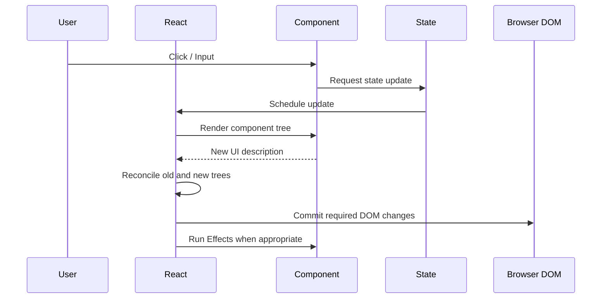
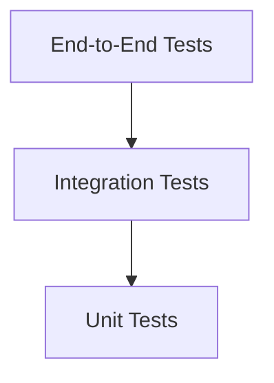
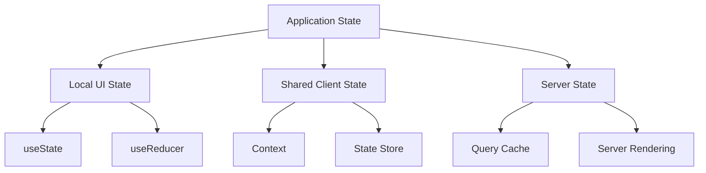
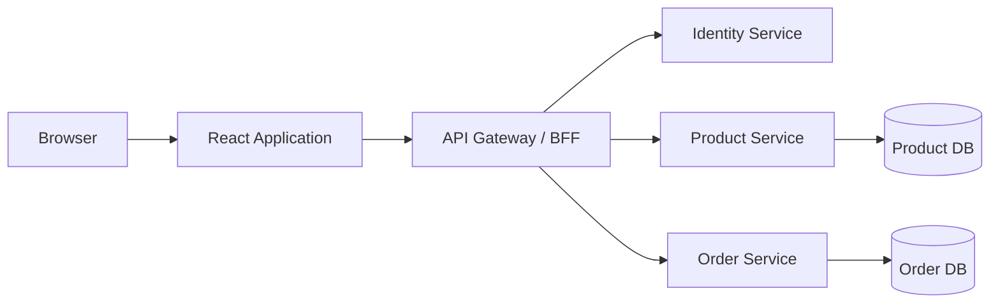
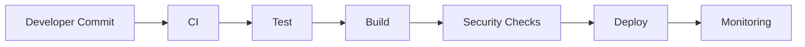
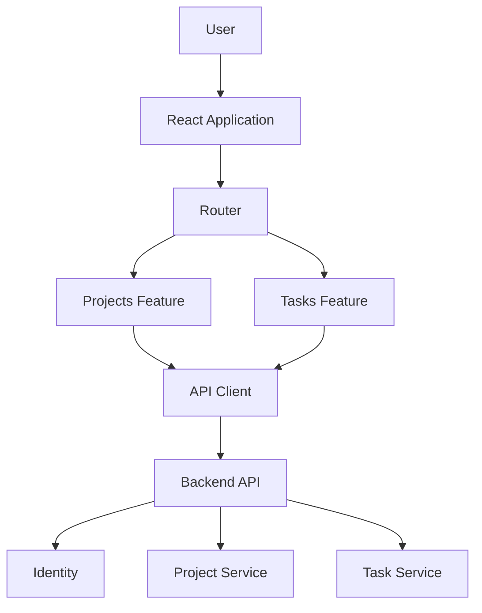

# React: A Complete, Practical, Architect-Level Guide

**Scope and assumptions:** This guide teaches modern React for production web applications, assuming **React 19.2**, **TypeScript**, and modern JavaScript tooling. React itself is a UI library; where a complete application needs routing, server rendering, data loading, authentication, or deployment infrastructure, this guide explains how React fits into those concerns.

React's current documentation identifies **19.2 as the latest version** at the time of writing. ([React][1])

---

# 1. Executive Summary

## What is React?

**React is a declarative JavaScript library for building user interfaces.**

Instead of manually telling the browser:

> Create this element, update that text, hide this button, then add this class.

You describe:

> Given this application state, the UI should look like this.

React determines what needs to change in the rendered interface.

```tsx
function Counter() {
  const [count, setCount] = useState(0);

  return (
    <button onClick={() => setCount(count + 1)}>
      Count: {count}
    </button>
  );
}
```

The component describes a relationship:

```text
UI = f(state, props)
```

When `state` or `props` change, React recalculates the UI and updates the browser efficiently.

---

## Why was React created?

Traditional browser applications often accumulated imperative DOM manipulation:

```js
const button = document.querySelector("#save");

button.disabled = true;

fetch("/api/save")
  .then(() => {
    button.textContent = "Saved";
    button.disabled = false;
  });
```

As applications became larger, developers had to manually keep many things synchronized:

* application state
* DOM state
* server state
* loading state
* error state
* user interactions

React introduced a component-based, declarative model to make UI state easier to reason about.

---

## What problem does React solve?

React primarily solves:

| Problem                    | How React helps                             |
| -------------------------- | ------------------------------------------- |
| Complex UI state           | Declarative rendering                       |
| Reusable interfaces        | Components                                  |
| Shared UI logic            | Hooks                                       |
| Efficient updates          | Reconciliation                              |
| Large UI composition       | Component trees                             |
| Predictable rendering      | State and props snapshots                   |
| Cross-platform UI concepts | React DOM, React Native and other renderers |

---

## What problems does React not solve?

React is **not a complete application architecture**.

React does not, by itself, prescribe:

* backend architecture
* database design
* authentication protocol
* authorization model
* API design
* caching strategy
* routing architecture
* global state architecture
* observability
* deployment infrastructure

You can build a complete application with a React framework, but React itself remains primarily concerned with UI composition and rendering.

Modern React documentation recommends starting many new production applications with a framework, while React can also be used independently or gradually added to existing applications. ([React][2])

---

## Who uses React?

React is used across:

* consumer web applications
* enterprise dashboards
* SaaS products
* e-commerce
* internal tools
* design systems
* progressive modernization of legacy applications
* mobile applications through React Native

It is especially useful when the UI contains substantial interactivity and changing state.

---

## When should you use React?

React is a strong choice when:

* your UI has complex interactive state
* multiple teams build different parts of the UI
* reusable components are valuable
* the application will evolve substantially
* you need an ecosystem of libraries and tooling
* you need a design system

Consider something simpler when:

* the site is mostly static content
* interaction is minimal
* server-rendered HTML solves the problem sufficiently
* JavaScript complexity would outweigh the benefit

---

## Quick Gist

> **React lets you describe what the UI should look like for a particular state. Components receive inputs, maintain state where necessary, and React reconciles changes into the rendered interface.**

The core engineering challenge is usually not "how to write JSX." It is:

> **Where should state live, who owns it, what boundaries should exist, and how should client state interact with server state?**

---

# 2. Core Concepts

## 2.1 Components

### Definition

A **component** is a reusable unit of UI and behavior.

```tsx
type ProductCardProps = {
  name: string;
  price: number;
};

export function ProductCard({
  name,
  price,
}: ProductCardProps) {
  return (
    <article>
      <h2>{name}</h2>
      <p>${price}</p>
    </article>
  );
}
```

### Why it matters

Components provide:

* reuse
* encapsulation
* composition
* testing boundaries

### Architectural principle

A component should generally represent a meaningful UI responsibility.

Good:

```text
CheckoutPage
├── AddressForm
├── PaymentForm
├── OrderSummary
└── PlaceOrderButton
```

Less useful:

```text
CheckoutPage
├── LeftSection
├── MiddleSection
└── RightSection
```

Prefer **business or UI responsibilities** over arbitrary visual fragments.

---

## 2.2 JSX

### Definition

**JSX** is syntax that lets you describe UI using markup-like JavaScript syntax.

```tsx
const element = <h1>Hello</h1>;
```

JSX is not HTML.

It is transformed into JavaScript instructions.

Example:

```tsx
<Button disabled={isSaving}>
  Save
</Button>
```

JSX allows:

* JavaScript expressions
* component composition
* conditional rendering
* dynamic lists

```tsx
{isLoading ? (
  <Spinner />
) : (
  <ProductList products={products} />
)}
```

---

## 2.3 Props

### Definition

**Props** are inputs passed from a parent component to a child.

```tsx
function Welcome({ name }: { name: string }) {
  return <h1>Welcome, {name}</h1>;
}
```

Usage:

```tsx
<Welcome name="Asha" />
```

### Important principle

Props should be treated as immutable inputs.

```tsx
// Bad
function User({ user }: { user: User }) {
  user.name = "Changed";
}
```

```tsx
// Good
function User({ user }: { user: User }) {
  return <h1>{user.name}</h1>;
}
```

React's rules emphasize that props and state are immutable snapshots for a particular render. ([React][3])

---

## 2.4 State

### Definition

**State is data owned by a component that can change over time and cause the UI to update.**

```tsx
const [isOpen, setIsOpen] = useState(false);
```

Example:

```tsx
function ModalTrigger() {
  const [isOpen, setIsOpen] = useState(false);

  return (
    <>
      <button onClick={() => setIsOpen(true)}>
        Open
      </button>

      {isOpen && <Modal onClose={() => setIsOpen(false)} />}
    </>
  );
}
```

### Why state matters

State is one of the most important architectural decisions in React.

Bad state placement causes:

* duplicated state
* synchronization bugs
* unnecessary re-renders
* complex prop drilling
* difficult testing

---

## 2.5 State vs Props

| Props                 | State                              |
| --------------------- | ---------------------------------- |
| Owned externally      | Owned by component                 |
| Passed into component | Managed inside component           |
| Read-only input       | Can change through setter/dispatch |
| Parent controls value | Component controls lifecycle       |

Example:

```text
ProductPage
    │
    │ props
    ▼
ProductCard
    │
    └── local state: isExpanded
```

---

## 2.6 Render

### Definition

A **render** is React evaluating your component function to determine what the UI should look like.

```tsx
function Greeting({ name }: { name: string }) {
  return <h1>Hello {name}</h1>;
}
```

Conceptually:

```text
Inputs
(props + state + context)
        │
        ▼
Component Function
        │
        ▼
UI Description
```

A crucial rule:

> Rendering should be pure.

React may render components more than once, so rendering must not perform uncontrolled external actions. React explicitly requires components and Hooks to remain pure and side effects to occur outside rendering. ([React][3])

Bad:

```tsx
function User() {
  fetch("/api/log-page-view"); // side effect during render

  return <h1>User</h1>;
}
```

Good:

```tsx
function User() {
  function handleClick() {
    fetch("/api/action");
  }

  return <button onClick={handleClick}>Action</button>;
}
```

---

## 2.7 Events

Events represent user interaction.

```tsx
<button onClick={handleSave}>
  Save
</button>
```

```tsx
function handleSave() {
  // perform user-triggered action
}
```

Use event handlers for:

* button clicks
* form submissions
* keyboard interactions
* user-triggered mutations

This is different from `useEffect`.

---

## 2.8 Hooks

### Definition

**Hooks are functions that let components use React features and reusable stateful logic.**

Common Hooks:

| Hook          | Purpose                               |
| ------------- | ------------------------------------- |
| `useState`    | Local state                           |
| `useReducer`  | Complex state transitions             |
| `useEffect`   | Synchronization with external systems |
| `useContext`  | Consume shared context                |
| `useRef`      | Persistent mutable reference          |
| `useMemo`     | Cache calculation                     |
| `useCallback` | Cache function reference              |

Hooks must be called:

* at the top level
* inside React components or custom Hooks

They must not be conditionally called inside loops, conditions, or nested functions. ([React][4])

Bad:

```tsx
if (isAdmin) {
  const [enabled, setEnabled] = useState(true);
}
```

Good:

```tsx
const [enabled, setEnabled] = useState(true);

if (!isAdmin) {
  return null;
}
```

---

## 2.9 `useState`

Use it for component-owned state.

```tsx
const [query, setQuery] = useState("");
```

Prefer deriving values when possible.

Bad:

```tsx
const [items, setItems] = useState<Product[]>([]);
const [itemCount, setItemCount] = useState(0);

// Must keep both synchronized.
```

Better:

```tsx
const itemCount = items.length;
```

Rule:

> If a value can be calculated from existing props or state during rendering, it often should not be separate state.

---

## 2.10 `useReducer`

Use `useReducer` when state transitions are complex or when multiple actions modify related state.

```tsx
type State = {
  status: "idle" | "loading" | "success" | "error";
  error?: string;
};

type Action =
  | { type: "START" }
  | { type: "SUCCESS" }
  | { type: "ERROR"; message: string };

function reducer(
  state: State,
  action: Action
): State {
  switch (action.type) {
    case "START":
      return { status: "loading" };

    case "SUCCESS":
      return { status: "success" };

    case "ERROR":
      return {
        status: "error",
        error: action.message,
      };
  }
}
```

```tsx
const [state, dispatch] = useReducer(reducer, {
  status: "idle",
});
```

Use cases:

* forms with many transitions
* workflow state
* complex UI state machines

---

## 2.11 Context

### Definition

**Context lets components access shared values without passing props through every intermediate component.**

Example:

```tsx
const ThemeContext = createContext<"light" | "dark">("light");
```

Provider:

```tsx
<ThemeContext.Provider value="dark">
  <App />
</ThemeContext.Provider>
```

Consumer:

```tsx
const theme = useContext(ThemeContext);
```

### Context is not automatically a global-state architecture

Context works well for relatively stable shared concerns:

* theme
* locale
* authenticated user metadata
* dependency injection

Be cautious about putting highly dynamic application state into one giant context.

---

## 2.12 Refs

A **ref** stores a value that survives renders without causing a re-render.

```tsx
const inputRef = useRef<HTMLInputElement>(null);
```

Example:

```tsx
function SearchBox() {
  const inputRef = useRef<HTMLInputElement>(null);

  function focusSearch() {
    inputRef.current?.focus();
  }

  return (
    <>
      <input ref={inputRef} />
      <button onClick={focusSearch}>
        Focus
      </button>
    </>
  );
}
```

Use refs for:

* DOM access
* timers
* external library instances
* mutable values that do not affect rendering

Do not use refs as hidden application state.

---

## 2.13 Effects

### Definition

`useEffect` synchronizes React with an **external system**.

Examples:

* WebSocket
* browser API
* external widget
* subscription
* network synchronization

```tsx
useEffect(() => {
  const connection = connect(roomId);

  connection.start();

  return () => {
    connection.stop();
  };
}, [roomId]);
```

React describes `useEffect` specifically as a mechanism for synchronizing with external systems. If no such synchronization is needed, you probably do not need an Effect. ([React][5])

### Common confusion

#### Event

```tsx
function handleSave() {
  saveDocument();
}
```

#### Effect

```tsx
useEffect(() => {
  const subscription = subscribe();

  return subscription.unsubscribe;
}, []);
```

Use events for **user actions**.

Use Effects for **external synchronization caused by rendering state**.

---

## 2.14 Custom Hooks

Custom Hooks extract reusable stateful logic.

```tsx
function useDebouncedValue<T>(
  value: T,
  delay: number
) {
  const [debouncedValue, setDebouncedValue] =
    useState(value);

  useEffect(() => {
    const timer = setTimeout(() => {
      setDebouncedValue(value);
    }, delay);

    return () => clearTimeout(timer);
  }, [value, delay]);

  return debouncedValue;
}
```

Usage:

```tsx
const debouncedQuery = useDebouncedValue(query, 300);
```

Custom Hooks are excellent for:

* reusable behavior
* API abstractions
* browser APIs
* domain-specific UI logic

They should generally represent a coherent capability.

---

## 2.15 Keys

Keys identify items across renders.

```tsx
products.map(product => (
  <ProductRow
    key={product.id}
    product={product}
  />
))
```

Use stable identifiers.

Avoid:

```tsx
key={index}
```

unless the list is genuinely static and cannot be reordered.

Why?

React uses keys to associate component identity with items.

Bad keys can cause:

* incorrect input state
* wrong animations
* stale component state

---

## 2.16 Component Composition

React favors composition.

Instead of:

```text
MegaComponent
```

prefer:

```text
Page
├── Header
├── Filters
├── Results
│   └── ResultCard
└── Pagination
```

Composition is often more flexible than deep inheritance hierarchies.

---

# 3. How React Works

## The rendering lifecycle

A simplified flow:



---

## Step 1: An event or external update occurs

Example:

```tsx
<button onClick={() => setCount(c => c + 1)}>
```

The user clicks.

---

## Step 2: React schedules an update

React does not conceptually mean:

```text
Immediately mutate every affected DOM node.
```

Instead, React determines that a new UI representation must be calculated.

---

## Step 3: Components render

React calls relevant component functions.

```tsx
function Counter() {
  const [count] = useState(10);

  return <p>{count}</p>;
}
```

The component returns a UI description.

---

## Step 4: Reconciliation

**Reconciliation** is React comparing the new UI description with the previous one.

Conceptually:

```text
Previous UI Tree
        │
        ▼
    Compare
        │
        ▼
New UI Tree
        │
        ▼
Determine minimum required changes
```

---

## Step 5: Commit

React applies necessary changes to the renderer.

For the web:

```text
React
  ↓
React DOM
  ↓
Browser DOM
```

Other renderers can target different environments.

---

## Step 6: Effects synchronize external systems

After the relevant commit phase, effects can synchronize:

```tsx
useEffect(() => {
  document.title = `Count: ${count}`;
}, [count]);
```

---

## Render and commit are different concepts

| Render                      | Commit                             |
| --------------------------- | ---------------------------------- |
| Calculate UI                | Apply UI changes                   |
| Component functions execute | DOM is updated                     |
| Must remain pure            | External environment changes occur |

Understanding this distinction is critical for advanced React work.

---

# 4. Implementation

## Assumed stack

For a modern production React application:

* React 19.2
* TypeScript
* framework or modern build tool
* ESLint
* testing library
* API client/query layer

React's documentation currently recommends frameworks for many new production applications; Create React App is deprecated. ([React][2])

---

## Recommended project structure

Avoid organizing everything only by technical type:

```text
src/
  components/
  hooks/
  utils/
  pages/
```

That becomes difficult at scale.

Prefer a **feature-oriented architecture**:

```text
src/
├── app/
│   ├── providers/
│   ├── router/
│   └── App.tsx
│
├── features/
│   ├── products/
│   │   ├── api/
│   │   ├── components/
│   │   ├── hooks/
│   │   ├── types/
│   │   └── ProductPage.tsx
│   │
│   └── checkout/
│       ├── api/
│       ├── components/
│       ├── hooks/
│       └── types/
│
├── shared/
│   ├── components/
│   ├── hooks/
│   ├── lib/
│   └── types/
│
└── main.tsx
```

### Why?

A feature should ideally contain most of the code necessary to understand and modify that business capability.

---

## Example: API boundary

Avoid this:

```tsx
function ProductPage() {
  useEffect(() => {
    fetch("/api/products")
      .then(response => response.json())
      .then(setProducts);
  }, []);
}
```

Instead, separate responsibilities.

```ts
// features/products/api/productApi.ts

export async function getProducts(): Promise<Product[]> {
  const response = await fetch("/api/products");

  if (!response.ok) {
    throw new Error("Unable to load products");
  }

  return response.json();
}
```

Then expose domain-oriented UI behavior:

```ts
// features/products/hooks/useProducts.ts

export function useProducts() {
  // query library or controlled data-fetching logic
}
```

Then consume it:

```tsx
export function ProductPage() {
  const { products, isLoading, error } = useProducts();

  if (isLoading) {
    return <ProductSkeleton />;
  }

  if (error) {
    return <ErrorState error={error} />;
  }

  return <ProductList products={products} />;
}
```

This creates useful boundaries:

```text
UI
 ↓
Feature Hook
 ↓
API Adapter
 ↓
HTTP
 ↓
Backend
```

---

## Dependency management

A typical application might include:

```text
react
react-dom
typescript
eslint
testing-library
vitest or another test runner
router/framework
server-state/query library
```

Do not add libraries merely because they are popular.

Every dependency adds:

* upgrade cost
* security surface
* bundle size
* architectural coupling

---

## TypeScript patterns

Define domain types clearly.

```ts
export type Product = {
  id: string;
  name: string;
  price: number;
  inventory: number;
};
```

Avoid unnecessary type duplication.

Prefer deriving types when appropriate:

```ts
type ProductCardProps = {
  product: Product;
};
```

Over:

```ts
type ProductCardProps = {
  id: string;
  name: string;
  price: number;
  inventory: number;
};
```

unless the component intentionally needs a different contract.

---

## Testing strategy

Use multiple testing levels.



### Unit tests

Test isolated logic.

```ts
expect(calculateTotal(items)).toBe(125);
```

### Component tests

Test user-visible behavior.

```text
Given:
  a product is out of stock

When:
  the page renders

Then:
  the purchase button is disabled
```

### Integration tests

Test:

```text
Component
+
API mocking
+
State
+
Routing
```

### End-to-end tests

Test critical workflows:

```text
Login
 → Search Product
 → Add to Cart
 → Checkout
 → Confirmation
```

Do not aim for maximum test count.

Aim for confidence in critical behavior.

---

# 5. Architecture and Design

# React architecture is primarily about boundaries

A Solution Architect should evaluate:

1. rendering strategy
2. state ownership
3. server/client boundaries
4. domain boundaries
5. API contracts
6. deployment model
7. failure modes
8. team ownership

---

## 5.1 Rendering strategy

Possible strategies include:

| Strategy              | Best for                          |
| --------------------- | --------------------------------- |
| Client-side rendering | Highly interactive applications   |
| Server-side rendering | Faster initial HTML and SEO needs |
| Static generation     | Content with infrequent changes   |
| Hybrid rendering      | Large production applications     |

The right choice depends on:

* SEO
* personalization
* latency
* infrastructure
* caching
* data freshness

---

## 5.2 State classification

This is one of the most important architectural skills.

### Local UI state

Examples:

```text
Modal open
Dropdown selected
Input value
```

Keep it close to the component.

---

### Shared client state

Examples:

```text
Current UI theme
Multi-step wizard state
Global notification state
```

Use an appropriate shared mechanism.

---

### Server state

Examples:

```text
Products
Orders
Users
Invoices
```

This is fundamentally different.

Server state:

* originates elsewhere
* can become stale
* may be modified by others
* requires caching
* requires invalidation
* can fail independently

Do not automatically place server data into a client-side global store.

---

## 5.3 State ownership model



The mistake is treating all state as one category.

---

## 5.4 Feature boundaries

Prefer:

```text
orders/
payments/
customers/
catalog/
```

over:

```text
components/
services/
helpers/
misc/
```

at enterprise scale.

A feature boundary should ideally answer:

> Which code changes when this business capability changes?

---

## 5.5 Dependency direction

Prefer:

```text
Presentation
     ↓
Application / Feature Logic
     ↓
Domain Logic
     ↓
Infrastructure
```

Avoid:

```text
UI Component
 ↕
Database SDK
```

The UI should not become tightly coupled to infrastructure details.

---

## 5.6 Integration architecture

A common enterprise architecture:



A **BFF**, or Backend for Frontend, is an API layer tailored to a particular frontend's needs.

Advantages:

* UI-specific aggregation
* reduced client complexity
* fewer cross-service calls from browser
* centralized backend orchestration

Trade-off:

* additional service to maintain

---

## 5.7 Avoid overengineering

Do not introduce:

* event buses
* micro-frontends
* global state stores
* complex dependency injection
* dozens of abstraction layers

without a concrete problem.

Architecture should optimize for expected complexity, not theoretical complexity.

---

# 6. Production Readiness

## Security

React does not make an application automatically secure.

### Important practices

#### Avoid unsafe HTML

Be cautious with:

```tsx
dangerouslySetInnerHTML
```

Untrusted HTML can create XSS risks.

---

### Do not store secrets in frontend code

Never place:

```text
Database passwords
Private API keys
Service credentials
```

inside the browser bundle.

The browser is not a trusted environment.

---

## Authentication

Authentication answers:

> Who are you?

Typical mechanisms:

* session cookies
* OAuth/OIDC flows
* token-based systems

Architecture should consider:

* session expiration
* refresh behavior
* CSRF
* token exposure
* logout propagation

---

## Authorization

Authorization answers:

> Are you allowed to do this?

Never rely only on:

```tsx
{isAdmin && <DeleteButton />}
```

The backend must enforce authorization.

The UI restriction improves UX.

It is not security.

---

## Data protection

Consider:

* TLS
* sensitive data minimization
* browser storage risks
* logging policies
* PII exposure
* cache behavior

Never casually log sensitive payloads.

---

## Performance

Optimize based on measurement.

Common techniques:

* code splitting
* lazy loading
* server rendering where appropriate
* list virtualization
* image optimization
* reducing unnecessary renders

Do not automatically wrap everything in:

```tsx
useMemo
useCallback
memo
```

Manual memoization is an optimization, not a correctness mechanism. Current React documentation also notes that React Compiler can automatically memoize values and functions in supported setups, reducing the need for manual memoization. ([React][6])

---

## Reliability

Design for:

* API failure
* slow network
* partial backend outage
* expired sessions
* stale data
* duplicate submissions

Provide:

```text
Loading state
Error state
Empty state
Retry path
Recovery path
```

A production UI should not assume:

```text
Network always works.
Data always exists.
Users click only once.
Backend always responds quickly.
```

---

## Error boundaries

Error boundaries should contain failures.

```text
Application
├── Global Error Boundary
│
├── Checkout
│   └── Checkout Error Boundary
│
└── Analytics
    └── Analytics Error Boundary
```

Avoid allowing one broken widget to destroy the entire application.

---

## Observability

Monitor:

* JavaScript errors
* API latency
* page performance
* failed user journeys
* deployment versions

Useful correlation:

```text
Browser Request ID
        ↓
API Request ID
        ↓
Service Trace
        ↓
Database Trace
```

This makes production debugging dramatically easier.

---

## Deployment

Typical pipeline:



Production deployment should consider:

* environment configuration
* rollback
* feature flags
* cache invalidation
* source maps
* version tracking

---

# 7. Real-World Usage

## Example 1: SaaS Admin Platform

React handles:

```text
Tables
Filters
Forms
Dashboards
Permissions
Workflow UI
```

Good fit because:

* interactions are complex
* UI state is substantial
* reusable components are valuable

---

## Example 2: E-commerce Platform

```text
Product Catalog
     ↓
Product Detail
     ↓
Cart
     ↓
Checkout
     ↓
Order Confirmation
```

React is useful for:

* dynamic product UI
* cart state
* filtering
* checkout flows

However, server rendering and caching strategy may be more important architecturally than React component design alone.

---

## Example 3: Enterprise Operations Console

Imagine:

```text
Fleet Management
Inventory Monitoring
Incident Management
Reporting
```

React is a strong fit when users:

* manipulate dense information
* work with real-time updates
* use complex forms
* navigate application workflows

---

## When React is a good fit

Use React when:

* UI complexity is high
* product lifetime is long
* teams need reusable UI systems
* stateful interactions dominate

---

## When another approach may be better

A simple marketing site might be better served by:

* static HTML
* a content-oriented framework
* server-rendered pages with minimal JavaScript

Do not use React simply because React is popular.

Use it because its programming model reduces complexity for the problem.

---

# 8. Common Mistakes

## Mistake 1: Using Effects for everything

Bad:

```tsx
useEffect(() => {
  setFullName(`${firstName} ${lastName}`);
}, [firstName, lastName]);
```

Better:

```tsx
const fullName = `${firstName} ${lastName}`;
```

Effects are for synchronization with external systems, not general data transformation. ([React][5])

---

## Mistake 2: Duplicating state

Bad:

```tsx
const [products, setProducts] = useState<Product[]>([]);
const [productCount, setProductCount] = useState(0);
```

Better:

```tsx
const productCount = products.length;
```

---

## Mistake 3: Giant global state

Warning sign:

```text
GlobalStore
├── auth
├── products
├── forms
├── modals
├── API responses
├── filters
├── page state
└── everything else
```

Classify state first.

---

## Mistake 4: Premature memoization

Bad:

```tsx
const name = useMemo(() => {
  return `${first} ${last}`;
}, [first, last]);
```

Usually:

```tsx
const name = `${first} ${last}`;
```

Optimize measured bottlenecks.

---

## Mistake 5: Mutating state

Bad:

```tsx
items.push(newItem);
setItems(items);
```

Better:

```tsx
setItems(previous => [
  ...previous,
  newItem,
]);
```

Immutability makes state changes easier for React and developers to reason about.

---

## Mistake 6: Using array indexes as keys

Bad:

```tsx
items.map((item, index) => (
  <Row key={index} item={item} />
))
```

Prefer:

```tsx
<Row key={item.id} item={item} />
```

---

## Mistake 7: Business logic inside giant components

Warning sign:

```tsx
function Dashboard() {
  // 1,500 lines
}
```

Extract:

```text
UI components
Custom Hooks
Domain functions
API adapters
```

But avoid extracting every three lines into a new abstraction.

---

## Mistake 8: Treating frontend authorization as security

Hidden UI is not access control.

The backend must enforce permissions.

---

# 9. End-to-End Project

# Project: Enterprise Task Management Platform

## Requirements

Users can:

* authenticate
* view projects
* view tasks
* create tasks
* assign users
* filter tasks
* update status

---

## Architecture



---

## Project structure

```text
src/
├── app/
│   ├── App.tsx
│   ├── providers/
│   └── router/
│
├── features/
│   ├── projects/
│   │   ├── api/
│   │   ├── components/
│   │   ├── hooks/
│   │   └── types.ts
│   │
│   └── tasks/
│       ├── api/
│       ├── components/
│       ├── hooks/
│       ├── state/
│       └── types.ts
│
└── shared/
    ├── components/
    ├── lib/
    └── types/
```

---

## Domain model

```ts
export type TaskStatus =
  | "TODO"
  | "IN_PROGRESS"
  | "DONE";

export type Task = {
  id: string;
  title: string;
  status: TaskStatus;
  assigneeId?: string;
  projectId: string;
};
```

---

## API boundary

```ts
export async function getTasks(
  projectId: string
): Promise<Task[]> {
  const response = await fetch(
    `/api/projects/${projectId}/tasks`
  );

  if (!response.ok) {
    throw new Error("Unable to load tasks");
  }

  return response.json();
}
```

---

## Task list

```tsx
type TaskListProps = {
  tasks: Task[];
  onTaskClick(taskId: string): void;
};

export function TaskList({
  tasks,
  onTaskClick,
}: TaskListProps) {
  return (
    <ul>
      {tasks.map(task => (
        <li key={task.id}>
          <button
            onClick={() => onTaskClick(task.id)}
          >
            {task.title}
          </button>
        </li>
      ))}
    </ul>
  );
}
```

---

## Feature-level hook

```ts
export function useProjectTasks(
  projectId: string
) {
  const [tasks, setTasks] = useState<Task[]>([]);
  const [status, setStatus] =
    useState<"loading" | "success" | "error">(
      "loading"
    );

  useEffect(() => {
    let cancelled = false;

    async function load() {
      try {
        setStatus("loading");

        const result =
          await getTasks(projectId);

        if (!cancelled) {
          setTasks(result);
          setStatus("success");
        }
      } catch {
        if (!cancelled) {
          setStatus("error");
        }
      }
    }

    load();

    return () => {
      cancelled = true;
    };
  }, [projectId]);

  return {
    tasks,
    status,
  };
}
```

In a production application, a dedicated server-state solution or framework data layer may be preferable because it can provide caching, request deduplication, invalidation, retries, and other server-state concerns.

---

## Test examples

### Component behavior

```tsx
it("renders task titles", () => {
  render(
    <TaskList
      tasks={[
        {
          id: "1",
          title: "Fix login",
          status: "TODO",
          projectId: "p1",
        },
      ]}
      onTaskClick={() => {}}
    />
  );

  expect(
    screen.getByText("Fix login")
  ).toBeInTheDocument();
});
```

### Critical workflow

```text
User logs in
  ↓
Selects project
  ↓
Creates task
  ↓
Assigns task
  ↓
Refreshes page
  ↓
Task persists
```

This is an excellent candidate for end-to-end testing.

---

## How the architecture evolves

### Stage 1: Small product

```text
React
+
Simple API
+
Local state
```

### Stage 2: Growing application

```text
Feature modules
+
Router
+
Server-state caching
+
Shared design system
```

### Stage 3: Enterprise platform

```text
Feature boundaries
+
BFF/API gateway
+
Observability
+
Feature flags
+
Design system
+
Automated CI/CD
+
Performance monitoring
```

Do not build Stage 3 architecture for a Stage 1 product without evidence that the complexity is needed.

---

# 10. Final Review

# Quick Gist

React is built around a few essential ideas:

1. **Components describe UI.**
2. **Props are inputs.**
3. **State represents changing component-owned data.**
4. **Rendering should remain pure.**
5. **Events handle user-triggered actions.**
6. **Effects synchronize with external systems.**
7. **State should live at the appropriate ownership boundary.**
8. **Server state and client UI state are different problems.**
9. **Architecture matters more as the application grows.**
10. **Optimize based on measurement, not superstition.**

React's Rules of Hooks and component purity rules are not arbitrary style preferences; they enable predictable rendering and React's ability to optimize applications. ([React][4])

---

# Practical Example

```tsx
import { useState } from "react";

type Task = {
  id: string;
  title: string;
  completed: boolean;
};

export function TaskManager() {
  const [tasks, setTasks] = useState<Task[]>([]);

  function addTask(title: string) {
    const task: Task = {
      id: crypto.randomUUID(),
      title,
      completed: false,
    };

    setTasks(previous => [
      ...previous,
      task,
    ]);
  }

  function toggleTask(id: string) {
    setTasks(previous =>
      previous.map(task =>
        task.id === id
          ? {
              ...task,
              completed: !task.completed,
            }
          : task
      )
    );
  }

  const completedCount =
    tasks.filter(task => task.completed).length;

  return (
    <section>
      <h1>Tasks</h1>

      <p>
        Completed: {completedCount}
      </p>

      {tasks.map(task => (
        <label key={task.id}>
          <input
            type="checkbox"
            checked={task.completed}
            onChange={() => toggleTask(task.id)}
          />

          {task.title}
        </label>
      ))}
    </section>
  );
}
```

This demonstrates:

* component composition
* local state
* immutable updates
* derived state
* event handling
* stable keys
* declarative rendering

---

# Best Practices

## Production Checklist

* [ ] Use TypeScript for non-trivial applications.
* [ ] Keep components focused on clear responsibilities.
* [ ] Keep rendering pure.
* [ ] Treat props and state as immutable.
* [ ] Prefer derived values over duplicated state.
* [ ] Use Effects for external synchronization.
* [ ] Use stable keys.
* [ ] Keep local state local when possible.
* [ ] Distinguish server state from client state.
* [ ] Establish feature boundaries.
* [ ] Test critical user workflows.
* [ ] Add loading, error, and empty states.
* [ ] Enforce authorization on the backend.
* [ ] Do not expose secrets in browser code.
* [ ] Measure before optimizing.
* [ ] Monitor production errors and performance.
* [ ] Design deployments with rollback capability.
* [ ] Keep dependencies intentional.
* [ ] Avoid architecture more complex than the problem requires.

---

# Expert-Level Interview Questions & Answers

## 1. A component has ten pieces of state. Should you move everything into a global store?

**Answer: No.**

The number of state variables does not determine whether state should be global.

Classify each state value:

```text
Is it needed by one component?
    → Local state

Needed by a component subtree?
    → Lift state or use local shared context

Needed across unrelated features?
    → Shared client state may be appropriate

Originates from backend?
    → Treat as server state
```

The architectural question is:

> Who owns this state and who needs to observe or modify it?

---

## 2. When should `useEffect` be used?

Use it to synchronize React with an external system.

Examples:

* subscriptions
* WebSockets
* browser APIs
* external widgets

Do not use it simply to calculate values from existing state.

```tsx
const total = items.reduce(
  (sum, item) => sum + item.price,
  0
);
```

is usually better than storing `total` through an Effect.

---

## 3. Why can a large Context cause performance problems?

Consumers may need to update when the provided context value changes.

If one context contains:

```text
User
Theme
Cart
Notifications
Filters
Dashboard
```

then unrelated changes can expand the affected rendering area.

Architectural mitigation:

* split contexts by responsibility
* keep rapidly changing state closer to consumers
* use an appropriate state architecture

---

## 4. How would you design React state for a large enterprise application?

I would separate:

```text
Local UI state
Shared client state
Server state
URL state
```

I would avoid a single universal store.

Each category has different ownership, lifecycle, consistency, and caching requirements.

---

## 5. A React application feels slow. What do you do?

Do not immediately add `useMemo`.

Investigate:

1. Measure the slow interaction.
2. Identify expensive components.
3. Identify unnecessary rendering.
4. Check large lists.
5. Check network latency.
6. Check JavaScript bundle size.
7. Check expensive calculations.
8. Optimize the actual bottleneck.

React's current guidance also notes that `useMemo` and `useCallback` are performance optimizations, and React Compiler can reduce manual memoization needs in supported configurations. ([React][6])

---

## 6. How would you decide between a monolith frontend and micro-frontends?

Start with a modular frontend.

Consider micro-frontends only when organizational constraints justify them, such as:

* independently deployed teams
* independently owned business domains
* large organizational scaling problems

Trade-offs include:

* dependency duplication
* inconsistent UX
* integration complexity
* shared state challenges
* deployment coordination

Micro-frontends solve organizational problems more often than technical UI problems.

---

# Further Study

After mastering the concepts in this guide, study:

## React depth

* state ownership and lifting state
* advanced Hooks
* refs and imperative APIs
* Suspense and concurrent rendering concepts
* error boundaries
* forms and actions where applicable
* React Compiler

## Application architecture

* server state caching
* routing architecture
* server-side rendering
* static generation
* backend-for-frontend patterns
* API versioning

## Frontend engineering

* browser rendering performance
* accessibility
* web security
* Core Web Vitals
* caching
* observability

## Testing

* component testing
* integration testing
* end-to-end testing
* contract testing

## Architecture

* domain-driven design
* modular monolith design
* micro-frontend trade-offs
* event-driven systems
* distributed tracing
* feature flag architecture

**The most important transition from intermediate to expert React engineering is this:**

> Stop thinking primarily about components, and start thinking about **state ownership, rendering boundaries, domain boundaries, data flow, failure modes, and operational behavior**.

That is where React becomes part of a production system rather than merely a way to render UI.

[1]: https://react.dev/versions?utm_source=chatgpt.com "React Versions – React"
[2]: https://react.dev/learn/creating-a-react-app?utm_source=chatgpt.com "Creating a React App – React"
[3]: https://react.dev/reference/rules?utm_source=chatgpt.com "Rules of React – React"
[4]: https://react.dev/reference/rules/rules-of-hooks?utm_source=chatgpt.com "Rules of Hooks – React"
[5]: https://react.dev/reference/react/useEffect?utm_source=chatgpt.com "useEffect – React"
[6]: https://react.dev/reference/react/useMemo?utm_source=chatgpt.com "useMemo – React"
