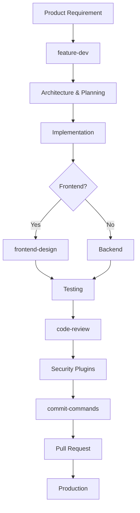

# Top Claude Code Plugins — End-to-End Product Development

A **Claude Code Plugin** is a packaged extension that can bundle multiple capabilities together:

```text
Plugin
├── Skills
├── Agents
├── Slash Commands
├── Hooks
├── MCP Servers
└── Configuration
```

So, compared with your previous questions:

| Component   | Purpose                                                 |
| ----------- | ------------------------------------------------------- |
| **Skills**  | Teach Claude how to perform work                        |
| **Agents**  | Specialized roles that perform work                     |
| **Hooks**   | Automatically enforce rules and workflows               |
| **MCP**     | Connect Claude to external systems                      |
| **Plugins** | Package and distribute combinations of all of the above |

Official Claude Code plugins can contain custom commands, specialized agents, hooks, and MCP server configurations. ([GitHub][1])

---

# 🏆 Top Plugin Repositories & Marketplaces

These are the repositories I recommend using as your primary discovery sources.

| Rank | Plugin Repository / Marketplace                                                                                                       | Best For                                        | Priority |
| ---- | ------------------------------------------------------------------------------------------------------------------------------------- | ----------------------------------------------- | -------- |
| 🥇   | [Anthropic Official Claude Plugins](https://github.com/anthropics/claude-plugins-official?utm_source=chatgpt.com)                     | Production-quality official and partner plugins | ⭐⭐⭐⭐⭐    |
| 🥈   | [Anthropic Community Plugins](https://github.com/anthropics/claude-plugins-community?utm_source=chatgpt.com)                          | Reviewed community plugins                      | ⭐⭐⭐⭐⭐    |
| 🥉   | [Anthropic Claude Code Plugin Examples](https://github.com/anthropics/claude-code/blob/main/plugins/README.md?utm_source=chatgpt.com) | Official reference implementations              | ⭐⭐⭐⭐⭐    |
| 4    | [Awesome Claude Code Plugins](https://github.com/ccplugins/awesome-claude-code-plugins?utm_source=chatgpt.com)                        | Curated ecosystem discovery                     | ⭐⭐⭐⭐⭐    |
| 5    | [Awesome Claude Plugins Index](https://github.com/quemsah/awesome-claude-plugins/blob/main/README.md?utm_source=chatgpt.com)          | Large repository index                          | ⭐⭐⭐⭐     |
| 6    | [Joshua Oliphant Claude Plugins](https://github.com/JoshuaOliphant/claude-plugins?utm_source=chatgpt.com)                             | Productivity and learning workflows             | ⭐⭐⭐⭐     |

The strongest starting point is the **Anthropic-managed official marketplace**, which contains internally maintained plugins and approved third-party plugins. Anthropic's official directory also explicitly warns users to trust and inspect plugins because plugins may include MCP servers, files, and other executable components. ([GitHub][2])

---

# Phase → What You Need → Ready-Made Plugin → Repository → Priority

## Phase 0 — Claude Code Foundation

| What You Need                    | Ready-Made Plugin          | Repository                   | Priority |
| -------------------------------- | -------------------------- | ---------------------------- | -------- |
| Learn Claude Agent SDK           | `agent-sdk-dev`            | Anthropic Official           | ⭐⭐⭐⭐⭐    |
| Create new AI agent applications | `agent-sdk-dev`            | Anthropic Official           | ⭐⭐⭐⭐⭐    |
| Better coding methodology        | `Superpowers`              | Plugin directory / ecosystem | ⭐⭐⭐⭐⭐    |
| Explain implementation decisions | `explanatory-output-style` | Anthropic Official           | ⭐⭐⭐⭐     |
| Build Claude plugins             | Plugin creation tooling    | Anthropic ecosystem          | ⭐⭐⭐⭐     |

### Recommended

```text
agent-sdk-dev
Superpowers
explanatory-output-style
```

The official Claude Code marketplace includes `agent-sdk-dev` and other bundled development plugins. ([GitHub][3])

---

# Phase 1 — Product Discovery & Planning

| What You Need                 | Plugin Type / Plugin         | Repository            | Priority |
| ----------------------------- | ---------------------------- | --------------------- | -------- |
| Feature planning              | `feature-dev`                | Anthropic Official    | ⭐⭐⭐⭐⭐    |
| Codebase exploration          | Feature-development workflow | Anthropic Official    | ⭐⭐⭐⭐⭐    |
| Architecture planning         | `feature-dev`                | Anthropic Official    | ⭐⭐⭐⭐⭐    |
| Requirements → implementation | Feature workflow plugin      | Anthropic Official    | ⭐⭐⭐⭐⭐    |
| Team knowledge workflows      | Knowledge-work plugins       | Anthropic marketplace | ⭐⭐⭐⭐     |

## 🥇 `feature-dev`

This is one of the most useful plugins for your **end-to-end product development** workflow.

It is designed as a feature-development workflow involving specialized stages such as:

```text
Requirement
    ↓
Codebase Exploration
    ↓
Architecture / Design
    ↓
Implementation
    ↓
Quality Review
```

Anthropic's marketplace describes `feature-dev` as a comprehensive feature-development workflow using specialized agents for codebase exploration, architecture design, and quality review. ([GitHub][3])

### Priority

⭐⭐⭐⭐⭐⭐

---

# Phase 2 — Architecture & System Design

| What You Need                     | Plugin                         | Repository            | Priority |
| --------------------------------- | ------------------------------ | --------------------- | -------- |
| Feature architecture              | `feature-dev`                  | Anthropic Official    | ⭐⭐⭐⭐⭐    |
| Agent architecture                | `agent-sdk-dev`                | Anthropic Official    | ⭐⭐⭐⭐⭐    |
| Explain architecture decisions    | `explanatory-output-style`     | Anthropic Official    | ⭐⭐⭐⭐     |
| Codebase architecture analysis    | Community architecture plugins | Community Marketplace | ⭐⭐⭐⭐⭐    |
| Enterprise architecture workflows | Custom plugin                  | Your organization     | ⭐⭐⭐⭐⭐    |

## Recommended Architecture Plugin Stack

```text
feature-dev
    +
agent-sdk-dev
    +
architecture-review plugin
```

For your long-term setup, I recommend creating your own organization-level:

```text
architecture-engineering
```

plugin containing:

```text
architecture-agent
ADR-agent
API-design-agent
DDD-agent
CQRS-agent
security-architecture-agent
```

---

# Phase 3 — Frontend & UI/UX Development

| What You Need                | Ready-Made Plugin      | Repository                            | Priority |
| ---------------------------- | ---------------------- | ------------------------------------- | -------- |
| Production frontend design   | `frontend-design`      | Anthropic Official                    | ⭐⭐⭐⭐⭐    |
| High-quality UI generation   | `frontend-design`      | Anthropic Official                    | ⭐⭐⭐⭐⭐    |
| Avoid generic AI UI          | `frontend-design`      | Anthropic Official / Plugin directory | ⭐⭐⭐⭐⭐    |
| Creative design automation   | `adobe-for-creativity` | Anthropic Official Marketplace        | ⭐⭐⭐⭐     |
| Design workflow integrations | Figma/design plugins   | Official + Community Marketplace      | ⭐⭐⭐⭐⭐    |

The official plugin directory includes `frontend-design`, described as creating distinctive production-grade frontend interfaces. ([GitHub][3])

## 🥇 Recommended

```text
frontend-design
```

For frontend-heavy products, this should be one of your first installations.

---

# Phase 4 — Backend Development

For your **.NET/backend engineering** work:

| What You Need          | Recommended Plugin Category     | Repository                     | Priority |
| ---------------------- | ------------------------------- | ------------------------------ | -------- |
| Feature implementation | `feature-dev`                   | Anthropic Official             | ⭐⭐⭐⭐⭐    |
| Code review            | `code-review`                   | Anthropic Official             | ⭐⭐⭐⭐⭐    |
| Git workflow           | `commit-commands`               | Anthropic Official             | ⭐⭐⭐⭐⭐    |
| API security           | `42crunch-api-security-testing` | Anthropic Official Marketplace | ⭐⭐⭐⭐⭐    |
| Supply-chain security  | Endor Labs AI plugins           | Official Marketplace           | ⭐⭐⭐⭐     |
| .NET workflow          | Custom plugin                   | Your organization              | ⭐⭐⭐⭐⭐    |

---

# Phase 5 — Code Review & Quality

| What You Need               | Ready-Made Plugin         | Repository            | Priority |
| --------------------------- | ------------------------- | --------------------- | -------- |
| Automated PR review         | `code-review`             | Anthropic Official    | ⭐⭐⭐⭐⭐    |
| Multi-agent review          | `code-review`             | Anthropic Official    | ⭐⭐⭐⭐⭐    |
| Confidence scoring          | `code-review`             | Anthropic Official    | ⭐⭐⭐⭐⭐    |
| False-positive filtering    | `code-review`             | Anthropic Official    | ⭐⭐⭐⭐⭐    |
| Continuous quality workflow | Community quality plugins | Community Marketplace | ⭐⭐⭐⭐     |

## 🥇 `code-review`

This is one of the highest-value plugins for professional software development.

Its workflow uses multiple specialized agents and confidence-based scoring to reduce false positives during pull-request review. ([GitHub][3])

### Recommended pipeline

```text
Implementation
      ↓
Tests
      ↓
Code Review Plugin
      ↓
Security Review
      ↓
Fix Issues
      ↓
Commit / PR
```

---

# Phase 6 — Git, Commits & Pull Requests

| What You Need  | Plugin                | Repository            | Priority |
| -------------- | --------------------- | --------------------- | -------- |
| Create commits | `commit-commands`     | Anthropic Official    | ⭐⭐⭐⭐⭐    |
| Push workflow  | `commit-commands`     | Anthropic Official    | ⭐⭐⭐⭐⭐    |
| Create PR      | `commit-commands`     | Anthropic Official    | ⭐⭐⭐⭐⭐    |
| PR review      | `code-review`         | Anthropic Official    | ⭐⭐⭐⭐⭐    |
| Git automation | Community Git plugins | Community Marketplace | ⭐⭐⭐⭐     |

## Recommended Git Stack

```text
commit-commands
      +
code-review
      +
your Git safety hooks
```

Anthropic's official marketplace describes `commit-commands` as providing commands for commit, push, and pull-request workflows. ([GitHub][3])

---

# Phase 7 — Testing & QA

| What You Need                  | Plugin                          | Repository            | Priority |
| ------------------------------ | ------------------------------- | --------------------- | -------- |
| Feature-level testing workflow | `feature-dev`                   | Anthropic Official    | ⭐⭐⭐⭐⭐    |
| Code quality review            | `code-review`                   | Anthropic Official    | ⭐⭐⭐⭐⭐    |
| Browser/E2E testing            | Playwright-enabled plugins      | Marketplace ecosystem | ⭐⭐⭐⭐⭐    |
| API security testing           | `42crunch-api-security-testing` | Official Marketplace  | ⭐⭐⭐⭐⭐    |
| TDD workflow                   | `Superpowers` ecosystem         | Community / directory | ⭐⭐⭐⭐⭐    |

The public plugin directory lists **Superpowers** as a popular plugin focused on workflows including brainstorming, subagent development, code review, debugging, TDD, and skill authoring. ([Claude][4])

## Recommended Testing Stack

```text
Superpowers
    +
code-review
    +
Playwright MCP/plugin integration
    +
test hooks
```

---

# Phase 8 — API Security

| What You Need                  | Ready-Made Plugin               | Repository                     | Priority |
| ------------------------------ | ------------------------------- | ------------------------------ | -------- |
| OpenAPI audit                  | `42crunch-api-security-testing` | Anthropic Official Marketplace | ⭐⭐⭐⭐⭐    |
| API vulnerability detection    | `42crunch-api-security-testing` | Anthropic Official Marketplace | ⭐⭐⭐⭐⭐    |
| OWASP API security             | `42crunch-api-security-testing` | Anthropic Official Marketplace | ⭐⭐⭐⭐⭐    |
| Automated remediation workflow | `42crunch-api-security-testing` | Anthropic Official Marketplace | ⭐⭐⭐⭐     |

The official marketplace describes this plugin as supporting an audit → scan → remediate → validate workflow for API security, including checks aligned with OWASP API security risks. ([GitHub][5])

## 🥇 Recommended Security Plugin

```text
42crunch-api-security-testing
```

Especially valuable for:

```text
ASP.NET Core APIs
Microservices
OpenAPI / Swagger
Enterprise APIs
```

---

# Phase 9 — Application & Supply-Chain Security

| What You Need                  | Plugin                          | Repository                     | Priority |
| ------------------------------ | ------------------------------- | ------------------------------ | -------- |
| SAST + secrets + IaC scanning  | `aikido`                        | Anthropic Official Marketplace | ⭐⭐⭐⭐⭐    |
| Software supply-chain scanning | Endor Labs `ai-plugins`         | Anthropic Official Marketplace | ⭐⭐⭐⭐⭐    |
| API security                   | `42crunch-api-security-testing` | Anthropic Official Marketplace | ⭐⭐⭐⭐⭐    |
| Security automation            | Security plugins                | Official Marketplace           | ⭐⭐⭐⭐⭐    |

The official marketplace currently includes security-focused plugins such as Aikido and Endor Labs integrations. ([GitHub][5])

## Recommended Security Stack

```text
CODE
 │
 ▼
Aikido
 │
 ├── SAST
 ├── Secret Detection
 └── IaC Scanning
 │
 ▼
Endor Labs
 │
 └── Supply Chain Risk
 │
 ▼
42Crunch
 │
 └── API Security
```

---

# Phase 10 — AI Agents & Agent Engineering

This is particularly relevant to your interest in **RAG, agents, and Microsoft Agent Framework-style architecture**.

| What You Need                | Plugin                 | Repository           | Priority |
| ---------------------------- | ---------------------- | -------------------- | -------- |
| Claude Agent SDK development | `agent-sdk-dev`        | Anthropic Official   | ⭐⭐⭐⭐⭐    |
| Agent development lifecycle  | `agentforce-adlc`      | Official Marketplace | ⭐⭐⭐⭐⭐    |
| Agent workflows              | `Superpowers`          | Plugin ecosystem     | ⭐⭐⭐⭐⭐    |
| Agent code review            | `code-review`          | Anthropic Official   | ⭐⭐⭐⭐     |
| Agent architecture           | Custom internal plugin | Your organization    | ⭐⭐⭐⭐⭐    |

The official marketplace includes `agent-sdk-dev` and third-party agent-development lifecycle tooling such as `agentforce-adlc`. ([GitHub][5])

## Recommended Agent Development Stack

```text
agent-sdk-dev
      +
Superpowers
      +
code-review
      +
your custom agent-engineering plugin
```

---

# Phase 11 — AI-Assisted Product Development

| What You Need              | Plugin            | Priority |
| -------------------------- | ----------------- | -------- |
| Feature planning           | `feature-dev`     | ⭐⭐⭐⭐⭐    |
| Implementation methodology | `Superpowers`     | ⭐⭐⭐⭐⭐    |
| Agent development          | `agent-sdk-dev`   | ⭐⭐⭐⭐⭐    |
| Code review                | `code-review`     | ⭐⭐⭐⭐⭐    |
| Git workflow               | `commit-commands` | ⭐⭐⭐⭐⭐    |
| Frontend                   | `frontend-design` | ⭐⭐⭐⭐⭐    |

## 🥇 Best Complete Product Plugin Stack

```text
PRODUCT
│
├── feature-dev
│
ARCHITECTURE
│
├── feature-dev
└── Superpowers
│
FRONTEND
│
├── frontend-design
│
BACKEND
│
├── feature-dev
└── agent-sdk-dev
│
QUALITY
│
├── code-review
└── Superpowers
│
GIT
│
└── commit-commands
│
SECURITY
│
├── Aikido
├── 42Crunch
└── Endor Labs
```

---

# Phase 12 — Documentation & Learning

| What You Need                  | Plugin                     | Repository         | Priority |
| ------------------------------ | -------------------------- | ------------------ | -------- |
| Explain code decisions         | `explanatory-output-style` | Anthropic Official | ⭐⭐⭐⭐     |
| Learn development methodology  | `Superpowers`              | Ecosystem          | ⭐⭐⭐⭐⭐    |
| Agent SDK learning             | `agent-sdk-dev`            | Anthropic Official | ⭐⭐⭐⭐⭐    |
| Internal engineering knowledge | Custom plugin              | Organization       | ⭐⭐⭐⭐⭐    |

The official bundled plugins include an explanatory output style plugin designed to add educational context about implementation choices and codebase patterns. ([GitHub][3])

---

# 🏆 My Top 15 Plugins for Your Claude Code Setup

Based on your previous interests:

* Claude Code
* .NET development
* architecture
* AI agents
* RAG
* CQRS / Event Sourcing
* performance engineering
* end-to-end product development

| Rank | Plugin                           | Primary Purpose                         | Priority |
| ---- | -------------------------------- | --------------------------------------- | -------- |
| 🥇 1 | `feature-dev`                    | End-to-end feature development          | ⭐⭐⭐⭐⭐    |
| 🥈 2 | `Superpowers`                    | Engineering methodology, TDD, debugging | ⭐⭐⭐⭐⭐    |
| 🥉 3 | `code-review`                    | Multi-agent code review                 | ⭐⭐⭐⭐⭐    |
| 4    | `frontend-design`                | Production UI/UX                        | ⭐⭐⭐⭐⭐    |
| 5    | `agent-sdk-dev`                  | AI agent development                    | ⭐⭐⭐⭐⭐    |
| 6    | `commit-commands`                | Git and PR workflows                    | ⭐⭐⭐⭐⭐    |
| 7    | `aikido`                         | SAST, secrets, IaC security             | ⭐⭐⭐⭐⭐    |
| 8    | `42crunch-api-security-testing`  | API security                            | ⭐⭐⭐⭐⭐    |
| 9    | `ai-plugins` / Endor Labs        | Supply-chain security                   | ⭐⭐⭐⭐     |
| 10   | `agentforce-adlc`                | Agent lifecycle                         | ⭐⭐⭐⭐     |
| 11   | `explanatory-output-style`       | Learning and explanation                | ⭐⭐⭐⭐     |
| 12   | Browser testing plugin stack     | E2E testing                             | ⭐⭐⭐⭐⭐    |
| 13   | Figma/design integration plugins | Design-to-code                          | ⭐⭐⭐⭐⭐    |
| 14   | Database integration plugins     | Data engineering                        | ⭐⭐⭐⭐     |
| 15   | Custom enterprise plugin         | Your organization standards             | ⭐⭐⭐⭐⭐    |

---

# 🥇 My Recommended Installation Order

## Tier 1 — Install First

```text
feature-dev
code-review
frontend-design
commit-commands
Superpowers
```

This gives you the biggest immediate improvement for general product development.

---

## Tier 2 — Security

```text
aikido
42crunch-api-security-testing
Endor Labs
```

Install these for serious production applications.

---

## Tier 3 — AI Engineering

```text
agent-sdk-dev
agentforce-adlc
```

Install these when working heavily on AI agents.

---

# Recommended End-to-End Claude Code Plugin Architecture



---

# Plugin Repository Installation

## 1. Official Anthropic Marketplace

The official marketplace is the best first choice:

[Anthropic Official Claude Plugins Repository](https://github.com/anthropics/claude-plugins-official?utm_source=chatgpt.com)

Typical Claude Code workflow:

```bash
/plugin
```

Then browse:

```text
Discover
    ↓
Search Plugin
    ↓
Review Plugin Contents
    ↓
Install
```

The official repository documents installation using:

```bash
/plugin install {plugin-name}@claude-plugins-official
```

or browsing through Claude Code's plugin discovery interface. ([GitHub][6])

---

## 2. Community Marketplace

[Anthropic Community Plugins Repository](https://github.com/anthropics/claude-plugins-community?utm_source=chatgpt.com)

Typical setup:

```bash
claude plugin marketplace add anthropics/claude-plugins-community
```

Then:

```bash
claude plugin install <plugin-name>@claude-community
```

The community marketplace repository states that listed plugins pass automated security scanning and an approval process before distribution, although you should still review the plugin and its permissions before use. ([GitHub][7])

---

## 3. Curated Community Discovery

[Awesome Claude Code Plugins](https://github.com/ccplugins/awesome-claude-code-plugins?utm_source=chatgpt.com)

Useful when you want to discover specialized plugins across:

```text
Development
Architecture
Security
Compliance
Privacy
Agents
Hooks
MCP
Commands
Subagents
```

([GitHub][8])

---

# Recommended Plugin Repository Strategy

```text
LEVEL 1 — OFFICIAL
Anthropic Official Marketplace
        ↓

LEVEL 2 — REVIEWED COMMUNITY
Anthropic Community Marketplace
        ↓

LEVEL 3 — CURATED DISCOVERY
Awesome Claude Code Plugins
        ↓

LEVEL 4 — YOUR ORGANIZATION
Private Company Plugin Marketplace
```

---

# Recommended `.claude` + Plugin Ecosystem

For your complete setup:

```text
project/
│
├── .claude/
│   ├── CLAUDE.md
│   │
│   ├── skills/
│   │   ├── architecture/
│   │   ├── dotnet/
│   │   ├── testing/
│   │   └── security/
│   │
│   ├── agents/
│   │   ├── architect/
│   │   ├── backend/
│   │   ├── frontend/
│   │   ├── reviewer/
│   │   └── security/
│   │
│   └── hooks/
│       ├── safety/
│       ├── quality/
│       ├── git/
│       └── testing/
│
├── .mcp.json
│
├── plugins/
│   └── company-engineering/
│       ├── .claude-plugin/
│       ├── skills/
│       ├── agents/
│       ├── hooks/
│       ├── commands/
│       └── .mcp.json
│
├── src/
├── tests/
└── docs/
```

---

# The Most Important Recommendation

Do **not** think of plugins as separate from Skills, Agents, Hooks, and MCP.

The best production architecture is:

```text
                 CLAUDE CODE
                      │
         ┌────────────┼────────────┐
         │            │            │
       PLUGIN       PLUGIN       PLUGIN
         │            │            │
    ┌────┼────┐  ┌────┼────┐  ┌───┼─────┐
    │    │    │  │    │    │  │   │     │
  Skills Agents Hooks MCP Commands
```

## My ideal setup for you

```text
CORE PRODUCT DEVELOPMENT
├── feature-dev
├── Superpowers
├── code-review
└── commit-commands

FRONTEND
└── frontend-design

AI ENGINEERING
├── agent-sdk-dev
└── agentforce-adlc

SECURITY
├── aikido
├── 42crunch-api-security-testing
└── Endor Labs

CUSTOM COMPANY PLUGIN
├── .NET architecture
├── CQRS / Event Sourcing
├── RAG
├── Microsoft Agent Framework
├── Azure
├── coding standards
├── testing standards
└── security rules
```

**My strongest recommendation:** start with the official marketplace and install only a small, complementary stack. Plugins can bundle executable hooks and MCP integrations, so avoid blindly installing overlapping plugins or plugins you have not inspected. Anthropic explicitly recommends treating plugin trust as a security decision. ([GitHub][2])

[1]: https://github.com/anthropics/claude-code/blob/main/plugins/README.md?utm_source=chatgpt.com "claude-code/plugins/README.md at main · anthropics/claude-code · GitHub"
[2]: https://github.com/anthropics/claude-plugins-official?utm_source=chatgpt.com "GitHub - anthropics/claude-plugins-official: Official, Anthropic-managed directory of high quality Claude Code Plugins. · GitHub"
[3]: https://github.com/anthropics/claude-code/blob/main/.claude-plugin/marketplace.json?utm_source=chatgpt.com "claude-code/.claude-plugin/marketplace.json at main · anthropics/claude-code · GitHub"
[4]: https://claude.com/plugins?utm_source=chatgpt.com "Plugins for Claude | Claude by Anthropic"
[5]: https://github.com/anthropics/claude-plugins-official/blob/main/.claude-plugin/marketplace.json?utm_source=chatgpt.com "claude-plugins-official/.claude-plugin/marketplace.json at main · anthropics/claude-plugins-official · GitHub"
[6]: https://github.com/anthropics/claude-plugins-official/blob/main/README.md?utm_source=chatgpt.com "claude-plugins-official/README.md at main · anthropics/claude-plugins-official · GitHub"
[7]: https://github.com/anthropics/claude-plugins-community?utm_source=chatgpt.com "GitHub - anthropics/claude-plugins-community: Community plugin marketplace for Claude Cowork and Claude Code. Read-only mirror — submit plugins at clau.de/plugin-directory-submission. · GitHub"
[8]: https://github.com/ccplugins/awesome-claude-code-plugins?utm_source=chatgpt.com "GitHub - ccplugins/awesome-claude-code-plugins: Awesome Claude Code plugins — a curated list of slash commands, subagents, MCP servers, and hooks for Claude Code · GitHub"
