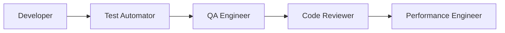
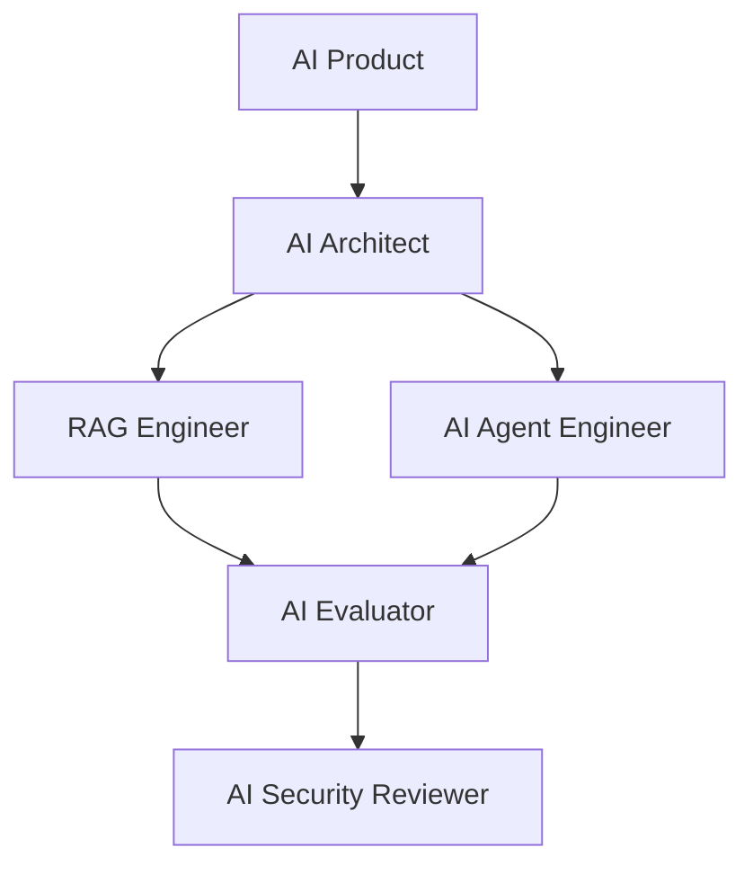
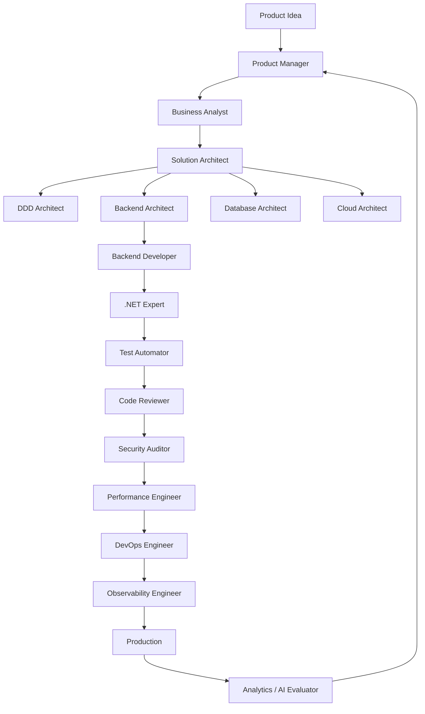

# Top Ready-Made Claude Code Agents — End-to-End Product Development

Below is a curated **Phase → What You Need → Ready-Made Agent → Repository → Priority** map for building an end-to-end Claude Code agent team.

> **Important distinction:** Skills tell Claude **how to perform a capability**. Agents/subagents define a **specialized role with its own context, instructions, tools, and often model**. Claude Code supports project agents in `.claude/agents/`, personal agents in `~/.claude/agents/`, and plugin-provided agents. ([WebFiddle][1])

---

# 🏆 Top Agent Repositories First

## Recommended repositories to explore

| Rank | Repository                                                                                                                               | What It Provides                             | Priority |
| ---- | ---------------------------------------------------------------------------------------------------------------------------------------- | -------------------------------------------- | -------- |
| 🥇   | [0xfurai/claude-code-subagents](https://github.com/0xfurai/claude-code-subagents?utm_source=chatgpt.com)                                 | 100+ specialized development agents          | ⭐⭐⭐⭐⭐    |
| 🥈   | [MrhDung/claude-code-subagents-collection](https://github.com/MrhDung/claude-code-subagents-collection?utm_source=chatgpt.com)           | 43+ specialized agents + commands            | ⭐⭐⭐⭐⭐    |
| 🥉   | [vijaythecoder/awesome-claude-agents](https://github.com/vijaythecoder/awesome-claude-agents/blob/main/README.md?utm_source=chatgpt.com) | Curated multi-role agent collection          | ⭐⭐⭐⭐     |
| 4    | [lst97/claude-code-sub-agents](https://github.com/lst97/claude-code-sub-agents?utm_source=chatgpt.com)                                   | Full-stack focused personal agent collection | ⭐⭐⭐⭐     |
| 5    | [hesreallyhim/a-list-of-claude-code-agents](https://github.com/hesreallyhim/a-list-of-claude-code-agents?utm_source=chatgpt.com)         | Discovery list of community agent resources  | ⭐⭐⭐⭐     |
| 6    | [chusri/claude-code-agents](https://github.com/chusri/claude-code-agents?utm_source=chatgpt.com)                                         | Production-oriented development agents       | ⭐⭐⭐⭐     |

### My strongest recommendation

Start with **one broad repository** such as `0xfurai/claude-code-subagents`, then selectively install/copy agents you actually use.

Do **not** put 100+ agents directly into every project. Too many overlapping agents create:

* duplicate responsibilities
* ambiguous agent selection
* inconsistent output
* higher token usage
* conflicting instructions

The `0xfurai` collection explicitly describes itself as a collection of 100+ specialized development subagents designed for automatic or explicit invocation. ([GitHub][2])

---

# Complete End-to-End Agent Map

# Phase 0 — Product Discovery

| What You Need              | Ready-Made Agent Type                | Repository                      | Priority |
| -------------------------- | ------------------------------------ | ------------------------------- | -------- |
| Understand product problem | `product-manager`                    | `0xfurai/claude-code-subagents` | ⭐⭐⭐⭐⭐    |
| Analyze requirements       | `business-analyst`                   | `0xfurai/claude-code-subagents` | ⭐⭐⭐⭐⭐    |
| Research market            | `market-researcher` / research agent | Community collections           | ⭐⭐⭐⭐     |
| Analyze competitors        | `competitive-analyst`                | Community collections           | ⭐⭐⭐⭐     |
| Define user needs          | `ux-researcher`                      | Community collections           | ⭐⭐⭐⭐     |
| Product strategy           | `product-strategist`                 | Community collections           | ⭐⭐⭐⭐     |

## Recommended Product Agent Team

```text
product-manager
      │
      ├── business-analyst
      │
      ├── market-researcher
      │
      └── ux-researcher
```

### Priority

⭐⭐⭐⭐⭐

For a developer-driven product workflow, I would keep this phase lightweight:

```text
product-manager
business-analyst
```

---

# Phase 1 — Requirements Engineering

| What You Need          | Ready-Made Agent                | Repository                      | Priority |
| ---------------------- | ------------------------------- | ------------------------------- | -------- |
| Business requirements  | `business-analyst`              | `0xfurai/claude-code-subagents` | ⭐⭐⭐⭐⭐    |
| Product requirements   | `product-manager`               | `0xfurai/claude-code-subagents` | ⭐⭐⭐⭐⭐    |
| User stories           | Requirements/BA agent           | Community collections           | ⭐⭐⭐⭐⭐    |
| Acceptance criteria    | Test/QA agent                   | Community collections           | ⭐⭐⭐⭐     |
| Edge cases             | `code-reviewer` / analyst agent | `0xfurai/claude-code-subagents` | ⭐⭐⭐⭐     |
| Requirement validation | `solution-architect`            | Community collections           | ⭐⭐⭐⭐⭐    |

### Your Minimum Team

```text
business-analyst
product-manager
solution-architect
```

---

# Phase 2 — UX & UI Design

| What You Need  | Ready-Made Agent               | Repository                      | Priority |
| -------------- | ------------------------------ | ------------------------------- | -------- |
| UX strategy    | `ux-designer`                  | `0xfurai/claude-code-subagents` | ⭐⭐⭐⭐⭐    |
| UI development | `frontend-developer`           | `0xfurai/claude-code-subagents` | ⭐⭐⭐⭐⭐    |
| Design system  | UI/design agent                | Community collections           | ⭐⭐⭐⭐     |
| Accessibility  | accessibility specialist agent | Community collections           | ⭐⭐⭐⭐     |
| UX review      | UX reviewer                    | Community collections           | ⭐⭐⭐⭐     |

## Recommended Team

```text
ux-designer
     ↓
frontend-developer
     ↓
accessibility-reviewer
```

---

# Phase 3 — Software Architecture

This should be one of the strongest parts of your setup.

| What You Need         | Ready-Made Agent               | Repository                      | Priority |
| --------------------- | ------------------------------ | ------------------------------- | -------- |
| Overall architecture  | `solution-architect`           | `0xfurai/claude-code-subagents` | ⭐⭐⭐⭐⭐    |
| Backend architecture  | `backend-architect`            | `0xfurai/claude-code-subagents` | ⭐⭐⭐⭐⭐    |
| System design         | `system-architect`             | Community collections           | ⭐⭐⭐⭐⭐    |
| Cloud architecture    | `cloud-architect`              | `0xfurai/claude-code-subagents` | ⭐⭐⭐⭐⭐    |
| Database architecture | `database-architect`           | `0xfurai/claude-code-subagents` | ⭐⭐⭐⭐⭐    |
| Distributed systems   | specialized architecture agent | Community collections           | ⭐⭐⭐⭐     |

## Recommended Architecture Team

```text
                  solution-architect
                         │
        ┌────────────────┼────────────────┐
        │                │                │
backend-architect  database-architect  cloud-architect
```

### Priority

⭐⭐⭐⭐⭐⭐

For your **.NET + Azure + CQRS + Event Sourcing** interests, these are among the most valuable agents.

---

# Phase 4 — Backend Development

| What You Need          | Ready-Made Agent    | Repository                                 | Priority |
| ---------------------- | ------------------- | ------------------------------------------ | -------- |
| Backend implementation | `backend-developer` | `0xfurai/claude-code-subagents`            | ⭐⭐⭐⭐⭐    |
| API design             | API/backend agent   | Community collections                      | ⭐⭐⭐⭐⭐    |
| C# expertise           | `csharp-expert`     | `0xfurai/claude-code-subagents` or similar | ⭐⭐⭐⭐⭐    |
| .NET expertise         | `.net-expert`       | Discover in repository                     | ⭐⭐⭐⭐⭐    |
| Refactoring            | `code-simplifier`   | Community collections                      | ⭐⭐⭐⭐     |
| Debugging              | `debugger`          | Community collections                      | ⭐⭐⭐⭐⭐    |

## Your Recommended .NET Team

```text
solution-architect
        ↓
backend-architect
        ↓
csharp-expert
        ↓
backend-developer
        ↓
code-reviewer
```

---

# Phase 5 — Frontend Development

| What You Need        | Ready-Made Agent     | Repository                      | Priority |
| -------------------- | -------------------- | ------------------------------- | -------- |
| Frontend development | `frontend-developer` | `0xfurai/claude-code-subagents` | ⭐⭐⭐⭐⭐    |
| React                | `react-expert`       | `0xfurai/claude-code-subagents` | ⭐⭐⭐⭐⭐    |
| TypeScript           | `typescript-expert`  | Agent collections               | ⭐⭐⭐⭐     |
| UI implementation    | frontend/UI agent    | Community collections           | ⭐⭐⭐⭐⭐    |
| Accessibility        | accessibility agent  | Community collections           | ⭐⭐⭐⭐     |
| Frontend performance | performance engineer | Agent collections               | ⭐⭐⭐⭐     |

---

# Phase 6 — Database & Data Engineering

| What You Need         | Ready-Made Agent     | Repository                      | Priority |
| --------------------- | -------------------- | ------------------------------- | -------- |
| Database architecture | `database-architect` | `0xfurai/claude-code-subagents` | ⭐⭐⭐⭐⭐    |
| Database optimization | `database-optimizer` | Community collections           | ⭐⭐⭐⭐⭐    |
| SQL                   | `sql-expert`         | Agent collections               | ⭐⭐⭐⭐⭐    |
| PostgreSQL            | `postgres-expert`    | Agent collections               | ⭐⭐⭐⭐     |
| SQL Server            | `sql-server-expert`  | Search collections              | ⭐⭐⭐⭐⭐    |
| Data engineering      | `data-engineer`      | Community collections           | ⭐⭐⭐⭐     |

---

# Phase 7 — DDD, CQRS & Event Sourcing

For your interests, I strongly recommend creating or finding highly focused agents.

| What You Need      | Recommended Agent            | Repository Strategy | Priority |
| ------------------ | ---------------------------- | ------------------- | -------- |
| Domain modeling    | `ddd-expert`                 | Search collections  | ⭐⭐⭐⭐⭐    |
| Bounded contexts   | `domain-architect`           | Search collections  | ⭐⭐⭐⭐⭐    |
| CQRS               | `cqrs-expert`                | Search collections  | ⭐⭐⭐⭐⭐    |
| Event sourcing     | `event-sourcing-expert`      | Search collections  | ⭐⭐⭐⭐⭐    |
| Event architecture | `event-driven-architect`     | Search collections  | ⭐⭐⭐⭐⭐    |
| Messaging          | `distributed-systems-expert` | Search collections  | ⭐⭐⭐⭐     |

### My recommendation

These are specialized enough that **custom agents may be better than generic repository agents**.

```text
.claude/agents/
│
├── ddd-architect.md
├── cqrs-architect.md
├── event-sourcing-expert.md
└── distributed-systems-architect.md
```

Generic backend agents often don't deeply understand the architectural trade-offs in these patterns.

---

# Phase 8 — Testing & Quality Engineering

| What You Need       | Ready-Made Agent       | Repository                      | Priority |
| ------------------- | ---------------------- | ------------------------------- | -------- |
| Test automation     | `test-automator`       | `0xfurai/claude-code-subagents` | ⭐⭐⭐⭐⭐    |
| QA                  | `qa-engineer`          | Agent collections               | ⭐⭐⭐⭐⭐    |
| Code review         | `code-reviewer`        | Multiple repositories           | ⭐⭐⭐⭐⭐    |
| Bug analysis        | `debugger`             | Agent collections               | ⭐⭐⭐⭐⭐    |
| Performance testing | `performance-engineer` | `0xfurai/claude-code-subagents` | ⭐⭐⭐⭐⭐    |
| E2E testing         | testing specialist     | Community collections           | ⭐⭐⭐⭐     |

## Recommended Quality Pipeline



The Claude Code power-user guidance specifically recommends using teams of focused agents for review concerns such as logic errors, security issues, and performance regressions. ([Claude Help Center][3])

---

# Phase 9 — Security Engineering

| What You Need        | Ready-Made Agent          | Repository                      | Priority |
| -------------------- | ------------------------- | ------------------------------- | -------- |
| Security audit       | `security-auditor`        | `0xfurai/claude-code-subagents` | ⭐⭐⭐⭐⭐    |
| Application security | `security-engineer`       | Agent collections               | ⭐⭐⭐⭐⭐    |
| OWASP review         | security agent            | Community collections           | ⭐⭐⭐⭐⭐    |
| API security         | API security specialist   | Community collections           | ⭐⭐⭐⭐⭐    |
| Dependency security  | dependency/security agent | Community collections           | ⭐⭐⭐⭐     |
| Threat modeling      | `security-architect`      | Search collections              | ⭐⭐⭐⭐⭐    |

## Recommended Security Gate

```text
Implementation
      ↓
Code Reviewer
      ↓
Security Auditor
      ↓
Security Architect
      ↓
Release
```

---

# Phase 10 — Performance Engineering

| What You Need           | Ready-Made Agent               | Repository                      | Priority |
| ----------------------- | ------------------------------ | ------------------------------- | -------- |
| Application performance | `performance-engineer`         | `0xfurai/claude-code-subagents` | ⭐⭐⭐⭐⭐    |
| Backend optimization    | backend performance agent      | Community collections           | ⭐⭐⭐⭐⭐    |
| Database optimization   | `database-optimizer`           | Community collections           | ⭐⭐⭐⭐⭐    |
| Frontend performance    | frontend performance agent     | Community collections           | ⭐⭐⭐⭐     |
| Load testing            | performance/load testing agent | Community collections           | ⭐⭐⭐⭐     |

For .NET, consider adding a project-specific:

```text
dotnet-performance-engineer
```

focused on:

* BenchmarkDotNet
* allocations
* GC
* async performance
* EF Core performance
* SQL query analysis

---

# Phase 11 — DevOps & Cloud

| What You Need  | Ready-Made Agent          | Repository                      | Priority |
| -------------- | ------------------------- | ------------------------------- | -------- |
| DevOps         | `devops-engineer`         | `0xfurai/claude-code-subagents` | ⭐⭐⭐⭐⭐    |
| Cloud          | `cloud-architect`         | `0xfurai/claude-code-subagents` | ⭐⭐⭐⭐⭐    |
| Kubernetes     | `kubernetes-expert`       | Community collections           | ⭐⭐⭐⭐     |
| Docker         | `docker-expert`           | Community collections           | ⭐⭐⭐⭐     |
| CI/CD          | CI/CD specialist          | Community collections           | ⭐⭐⭐⭐⭐    |
| Infrastructure | `infrastructure-engineer` | Agent collections               | ⭐⭐⭐⭐⭐    |

## Recommended Azure/.NET Team

```text
cloud-architect
      ↓
azure-expert
      ↓
devops-engineer
      ↓
infrastructure-engineer
```

---

# Phase 12 — Observability & SRE

| What You Need          | Ready-Made Agent         | Repository Strategy        | Priority |
| ---------------------- | ------------------------ | -------------------------- | -------- |
| Monitoring             | `sre-engineer`           | Search collections         | ⭐⭐⭐⭐⭐    |
| Observability          | `observability-engineer` | Search collections         | ⭐⭐⭐⭐⭐    |
| Incident debugging     | `incident-responder`     | Community collections      | ⭐⭐⭐⭐     |
| Root cause analysis    | `debugger`               | Existing agent collections | ⭐⭐⭐⭐⭐    |
| Performance monitoring | `performance-engineer`   | Existing collections       | ⭐⭐⭐⭐⭐    |

## Recommended Production Team

```text
Production Issue
      ↓
incident-responder
      ↓
debugger
      ↓
observability-engineer
      ↓
performance-engineer
```

---

# Phase 13 — AI Engineering

| What You Need      | Ready-Made Agent    | Repository            | Priority |
| ------------------ | ------------------- | --------------------- | -------- |
| AI engineering     | `ai-engineer`       | Agent collections     | ⭐⭐⭐⭐⭐    |
| LLM applications   | `llm-engineer`      | Community collections | ⭐⭐⭐⭐⭐    |
| RAG                | `rag-engineer`      | Search repositories   | ⭐⭐⭐⭐⭐    |
| AI agents          | `ai-agent-engineer` | Search repositories   | ⭐⭐⭐⭐⭐    |
| Prompt engineering | `prompt-engineer`   | Agent collections     | ⭐⭐⭐⭐     |
| AI evaluation      | `ai-evaluator`      | Search collections    | ⭐⭐⭐⭐⭐    |

## Your AI Team



---

# Phase 14 — Documentation

| What You Need     | Ready-Made Agent                      | Repository                      | Priority |
| ----------------- | ------------------------------------- | ------------------------------- | -------- |
| Technical docs    | `technical-writer`                    | `0xfurai/claude-code-subagents` | ⭐⭐⭐⭐⭐    |
| API documentation | documentation agent                   | Community collections           | ⭐⭐⭐⭐     |
| Architecture docs | solution architect + technical writer | Existing agents                 | ⭐⭐⭐⭐⭐    |
| README            | documentation agent                   | Agent collections               | ⭐⭐⭐⭐     |
| ADRs              | architecture agent                    | Agent collections               | ⭐⭐⭐⭐⭐    |

---

# Phase 15 — Project Management & Delivery

| What You Need      | Ready-Made Agent  | Repository            | Priority |
| ------------------ | ----------------- | --------------------- | -------- |
| Planning           | `project-manager` | Community collections | ⭐⭐⭐⭐     |
| Task decomposition | planning agent    | Community collections | ⭐⭐⭐⭐⭐    |
| Estimation         | project manager   | Community collections | ⭐⭐⭐      |
| Release management | release manager   | Search collections    | ⭐⭐⭐⭐     |
| Coordination       | orchestrator      | Custom recommended    | ⭐⭐⭐⭐⭐    |

---

# 🏆 My Recommended Top 30 Agents for You

Based on your interests in **.NET, architecture, AI, RAG, CQRS/Event Sourcing, and Claude Code**:

## Tier 1 — Core Team

| #  | Agent                  |
| -- | ---------------------- |
| 1  | `product-manager`      |
| 2  | `business-analyst`     |
| 3  | `solution-architect`   |
| 4  | `backend-architect`    |
| 5  | `backend-developer`    |
| 6  | `code-reviewer`        |
| 7  | `test-automator`       |
| 8  | `security-auditor`     |
| 9  | `performance-engineer` |
| 10 | `devops-engineer`      |

---

## Tier 2 — Architecture Specialists

| #  | Agent                           |
| -- | ------------------------------- |
| 11 | `database-architect`            |
| 12 | `cloud-architect`               |
| 13 | `distributed-systems-architect` |
| 14 | `ddd-architect`                 |
| 15 | `cqrs-expert`                   |
| 16 | `event-sourcing-expert`         |

---

## Tier 3 — .NET Specialists

| #  | Agent                         |
| -- | ----------------------------- |
| 17 | `csharp-expert`               |
| 18 | `dotnet-expert`               |
| 19 | `aspnet-core-expert`          |
| 20 | `ef-core-expert`              |
| 21 | `dotnet-performance-engineer` |

---

## Tier 4 — AI Engineering

| #  | Agent               |
| -- | ------------------- |
| 22 | `ai-architect`      |
| 23 | `llm-engineer`      |
| 24 | `rag-engineer`      |
| 25 | `ai-agent-engineer` |
| 26 | `ai-evaluator`      |

---

## Tier 5 — Operations

| #  | Agent                    |
| -- | ------------------------ |
| 27 | `observability-engineer` |
| 28 | `sre-engineer`           |
| 29 | `incident-responder`     |
| 30 | `technical-writer`       |

---

# Recommended Repository Strategy

## Repository 1 — Broad Agent Library

[0xfurai/claude-code-subagents](https://github.com/0xfurai/claude-code-subagents?utm_source=chatgpt.com)

Use this as your primary source for:

```text
Development
Architecture
Security
Testing
Performance
DevOps
Frontend
Backend
Database
```

---

## Repository 2 — Curated Collection

[MrhDung/claude-code-subagents-collection](https://github.com/MrhDung/claude-code-subagents-collection?utm_source=chatgpt.com)

Useful for:

```text
Specialized roles
Slash commands
Alternative agent designs
```

---

## Repository 3 — Discovery

[hesreallyhim/a-list-of-claude-code-agents](https://github.com/hesreallyhim/a-list-of-claude-code-agents?utm_source=chatgpt.com)

Use this when you need:

```text
New agent repositories
Specialized agents
Community projects
```

Note that this repository itself says it is a list of community resources rather than a fully curated quality ranking, so review individual repositories before adopting them. ([GitHub][4])

---

# Recommended `.claude/agents` Structure

For your projects, I recommend this:

```text
.claude/
│
├── CLAUDE.md
│
└── agents/
    │
    ├── product/
    │   ├── product-manager.md
    │   └── business-analyst.md
    │
    ├── architecture/
    │   ├── solution-architect.md
    │   ├── backend-architect.md
    │   ├── database-architect.md
    │   ├── ddd-architect.md
    │   ├── cqrs-expert.md
    │   └── event-sourcing-expert.md
    │
    ├── development/
    │   ├── csharp-expert.md
    │   ├── dotnet-expert.md
    │   ├── backend-developer.md
    │   └── frontend-developer.md
    │
    ├── quality/
    │   ├── code-reviewer.md
    │   ├── test-automator.md
    │   ├── security-auditor.md
    │   └── performance-engineer.md
    │
    ├── cloud/
    │   ├── cloud-architect.md
    │   ├── devops-engineer.md
    │   └── sre-engineer.md
    │
    ├── ai/
    │   ├── ai-architect.md
    │   ├── rag-engineer.md
    │   ├── ai-agent-engineer.md
    │   └── ai-evaluator.md
    │
    └── operations/
        ├── observability-engineer.md
        ├── incident-responder.md
        └── technical-writer.md
```

Claude Code scans project and user agent directories recursively, so organizing agents into folders is supported while the agent's identity is determined by its frontmatter `name`. ([WebFiddle][1])

---

# Best End-to-End Agent Workflow



---

# ⭐ My Actual Recommendation: Don't Install 100 Agents

For your first production-quality setup, start with **12–15 agents**:

```text
product-manager
business-analyst

solution-architect
backend-architect
database-architect

csharp-expert
backend-developer

test-automator
code-reviewer
security-auditor
performance-engineer

devops-engineer
cloud-architect

rag-engineer
ai-agent-engineer
```

Then use your agent repositories to add specialists only when a real project requires them.

Claude Code's subagent system is designed for focused delegation and context isolation, and custom agents can have specialized prompts, tool restrictions, and model choices. ([WebFiddle][1])

**The most effective setup for you is likely a curated hybrid:** ready-made agents for common engineering roles, plus custom project-specific agents for **.NET, DDD, CQRS, Event Sourcing, RAG, and Azure**, where generic community agents may not match your architecture conventions exactly.

[1]: https://webfiddle.net/cats-d8c4vu/code.claude.com/docs/en/sub-agents?utm_source=chatgpt.com "Create custom subagents - Claude Code Docs"
[2]: https://github.com/0xfurai/claude-code-subagents?utm_source=chatgpt.com "GitHub - 0xfurai/claude-code-subagents: A comprehensive collection of 100+ production-ready development subagents for Claude Code · GitHub"
[3]: https://support.claude.com/en/articles/14554000-claude-code-power-user-tips?utm_source=chatgpt.com "Claude Code power user tips | Anthropic Help Center"
[4]: https://github.com/hesreallyhim/a-list-of-claude-code-agents?utm_source=chatgpt.com "GitHub - hesreallyhim/a-list-of-claude-code-agents: A list of Claude Code Sub-Agents submitted by the community. · GitHub"
