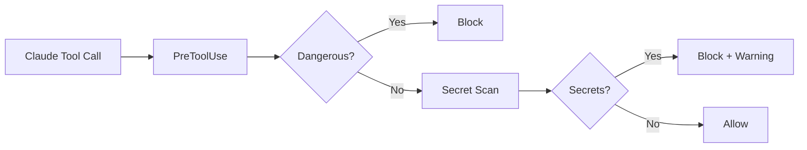
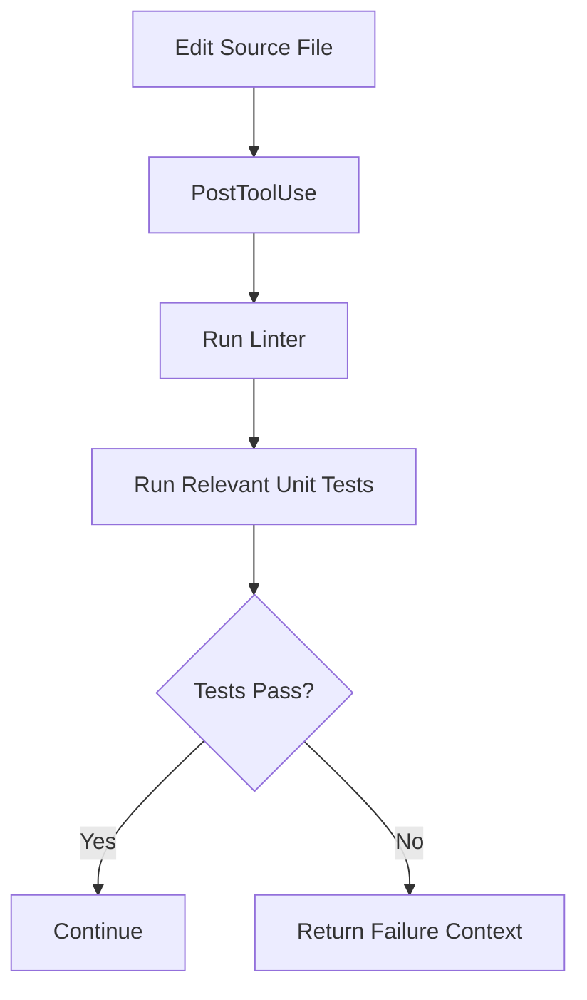
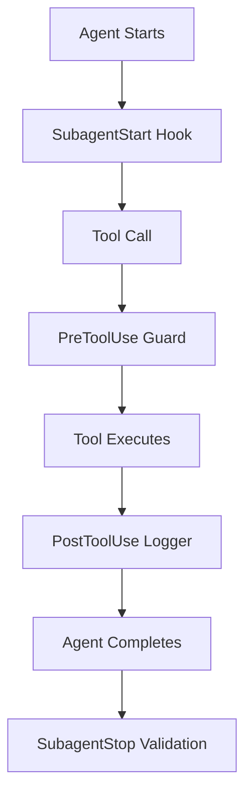
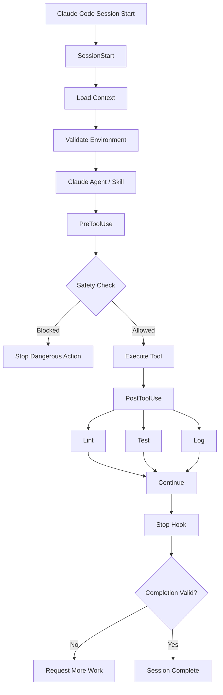

# Top Ready-Made Claude Code Hooks — End-to-End Product Development

Hooks are the **automation and enforcement layer** of Claude Code.

A useful mental model is:

```text
Skills  → How Claude performs work
Agents  → Who/what specialized role performs work
Hooks   → What automatically happens before, after, or during work
```

For a production setup:

```text
Product / Requirements
        ↓
Agents
        ↓
Skills
        ↓
Claude Code Tools
        ↓
        HOOKS
  ├── Safety
  ├── Quality Gates
  ├── Testing
  ├── Security
  ├── Git Protection
  ├── Observability
  └── Session Automation
```

Claude Code hooks can run around events such as `PreToolUse`, `PostToolUse`, `Stop`, `SubagentStop`, `SessionStart`, `SessionEnd`, `UserPromptSubmit`, and others. Official hook-development guidance describes hooks as event-driven automation for validating operations, enforcing policies, loading context, and automating workflows. ([GitHub][1])

---

# 🏆 Top Hook Repositories

## Recommended repositories to investigate

| Rank | Repository                                                                                                                                                               | Best For                                             | Priority |
| ---- | ------------------------------------------------------------------------------------------------------------------------------------------------------------------------ | ---------------------------------------------------- | -------- |
| 🥇   | [edgeless-ai/claude-code-hooks](https://github.com/edgeless-ai/claude-code-hooks?utm_source=chatgpt.com)                                                                 | Production-ready drop-in hooks                       | ⭐⭐⭐⭐⭐    |
| 🥈   | [MOlechowski/claude-hooks](https://github.com/MOlechowski/claude-hooks?utm_source=chatgpt.com)                                                                           | Plugin-based security, observability, session memory | ⭐⭐⭐⭐⭐    |
| 🥉   | [karanb192/claude-code-hooks](https://github.com/karanb192/claude-code-hooks?utm_source=chatgpt.com)                                                                     | Simple copy/paste hooks                              | ⭐⭐⭐⭐⭐    |
| 4    | [disler/claude-code-hooks-mastery](https://github.com/disler/claude-code-hooks-mastery?utm_source=chatgpt.com)                                                           | Learn every hook event deeply                        | ⭐⭐⭐⭐     |
| 5    | [shanraisshan/claude-code-hooks](https://github.com/shanraisshan/claude-code-hooks/blob/main/.claude/hooks/HOOKS-README.md?utm_source=chatgpt.com)                       | Broad hook-event examples and automation             | ⭐⭐⭐⭐     |
| 6    | [Anthropic Claude Code Hook Development](https://github.com/anthropics/claude-code/blob/main/plugins/plugin-dev/skills/hook-development/SKILL.md?utm_source=chatgpt.com) | Official hook-development reference                  | ⭐⭐⭐⭐⭐    |

---

# Phase → What You Need → Ready-Made Hook → Repository → Priority

# Phase 0 — Claude Code Foundation & Session Management

| What You Need          | Ready-Made Hook                | Repository                         | Priority |
| ---------------------- | ------------------------------ | ---------------------------------- | -------- |
| Load project context   | `SessionStart` context loader  | `disler/claude-code-hooks-mastery` | ⭐⭐⭐⭐⭐    |
| Environment validation | setup/environment hook         | `shanraisshan/claude-code-hooks`   | ⭐⭐⭐⭐     |
| Session logging        | `session-logger`               | `edgeless-ai/claude-code-hooks`    | ⭐⭐⭐⭐⭐    |
| Session memory         | `hook-session-memory`          | `MOlechowski/claude-hooks`         | ⭐⭐⭐⭐⭐    |
| Compact protection     | `PreCompact` transcript backup | `disler/claude-code-hooks-mastery` | ⭐⭐⭐⭐     |
| Session cleanup        | `SessionEnd` cleanup           | `disler/claude-code-hooks-mastery` | ⭐⭐⭐⭐     |

## Recommended Foundation Stack

```text
SessionStart
    ↓
Load Project Context
    ↓
Validate Environment
    ↓
Start Development
    ↓
Log Activity
    ↓
Stop / Compact
    ↓
Save Session Context
```

The `MOlechowski/claude-hooks` collection includes dedicated session-memory functionality designed to preserve context across compaction, while its observability plugin logs tool and session events. ([GitHub][2])

---

# Phase 1 — Product Discovery & Requirements

Hooks are less important here than agents and skills, but they can enforce workflow quality.

| What You Need                    | Hook Type                   | Repository Strategy   | Priority |
| -------------------------------- | --------------------------- | --------------------- | -------- |
| Load product context             | `SessionStart`              | Custom / mastery repo | ⭐⭐⭐⭐     |
| Validate requirement artifacts   | `PreToolUse` / `Stop`       | Custom                | ⭐⭐⭐⭐     |
| Prevent premature implementation | `PreToolUse` guard          | Custom                | ⭐⭐⭐⭐⭐    |
| Ensure requirements exist        | `Stop` completion validator | Custom                | ⭐⭐⭐⭐     |
| Track task lifecycle             | `UserPromptSubmit`          | Custom                | ⭐⭐⭐      |

### Recommended Hook

```text
requirement-before-implementation
```

Purpose:

```text
Before Claude writes major implementation code:

Check:
✓ Requirement exists
✓ Acceptance criteria exist
✓ Architecture decision exists where needed
✓ Task scope is clear
```

This is usually worth making **project-specific**.

---

# Phase 2 — Architecture & Design

| What You Need               | Hook          | Repository / Strategy         | Priority |
| --------------------------- | ------------- | ----------------------------- | -------- |
| Protect architecture files  | `PreToolUse`  | Security/damage-control hooks | ⭐⭐⭐⭐⭐    |
| Validate ADR updates        | `PostToolUse` | Custom                        | ⭐⭐⭐⭐     |
| Enforce architecture checks | `Stop`        | Custom                        | ⭐⭐⭐⭐⭐    |
| Detect unsafe refactoring   | `PreToolUse`  | Custom                        | ⭐⭐⭐⭐     |
| Architecture change logging | `PostToolUse` | Observability hooks           | ⭐⭐⭐⭐     |

## Recommended Hooks

```text
architecture-guard
adr-validator
breaking-change-detector
```

Example flow:

```text
Claude wants to modify:

/src
/domain
/api-contracts
/infrastructure

        ↓

PreToolUse Hook

        ↓

Check:
- Is this a breaking change?
- Does this modify public API?
- Does this modify database schema?
- Is an ADR required?

        ↓

Allow / Warn / Block
```

---

# Phase 3 — Development Safety

This is one of the **highest-value hook phases**.

| What You Need                | Ready-Made Hook            | Repository                         | Priority |
| ---------------------------- | -------------------------- | ---------------------------------- | -------- |
| Block destructive commands   | `damage-control`           | `edgeless-ai/claude-code-hooks`    | ⭐⭐⭐⭐⭐    |
| Block dangerous commands     | `block-dangerous-commands` | `karanb192/claude-code-hooks`      | ⭐⭐⭐⭐⭐    |
| General CLI protection       | `hook-security`            | `MOlechowski/claude-hooks`         | ⭐⭐⭐⭐⭐    |
| Protect important files      | protected-path hook        | `edgeless-ai/claude-code-hooks`    | ⭐⭐⭐⭐⭐    |
| Prevent dangerous operations | PreToolUse guard           | `disler/claude-code-hooks-mastery` | ⭐⭐⭐⭐     |

The `damage-control` hook blocks dangerous commands and writes to protected paths, while the `hook-security` plugin provides configurable blocking for risky CLI commands. ([GitHub][2])

---

# Phase 4 — Git & Source Control

This is a **must-have hook category**.

| What You Need       | Ready-Made Hook       | Repository                      | Priority |
| ------------------- | --------------------- | ------------------------------- | -------- |
| Prevent force push  | `no-force-push`       | `edgeless-ai/claude-code-hooks` | ⭐⭐⭐⭐⭐    |
| Branch naming       | `branch-naming`       | `edgeless-ai/claude-code-hooks` | ⭐⭐⭐⭐     |
| Auto stage files    | `auto-stage`          | `karanb192/claude-code-hooks`   | ⭐⭐⭐      |
| Commit validation   | `auto-commit-message` | `edgeless-ai/claude-code-hooks` | ⭐⭐⭐⭐     |
| Git safety          | `hook-security`       | `MOlechowski/claude-hooks`      | ⭐⭐⭐⭐⭐    |
| Checkpoint workflow | Git checkpoint hooks  | Community collections           | ⭐⭐⭐⭐     |

## My recommended Git protection stack

```text
PreToolUse
│
├── no-force-push
├── protected-branch-guard
├── destructive-git-command-guard
└── branch-naming

PostToolUse
│
└── commit-message-validation
```

The `edgeless-ai` collection explicitly includes protection against force pushes to main/master/production branches and branch naming enforcement. ([GitHub][3])

---

# Phase 5 — Security

This should be your **highest-priority automation category**.

| What You Need           | Ready-Made Hook         | Repository                      | Priority |
| ----------------------- | ----------------------- | ------------------------------- | -------- |
| Detect secrets          | `security-scan`         | `edgeless-ai/claude-code-hooks` | ⭐⭐⭐⭐⭐    |
| Protect secrets         | `protect-secrets`       | `karanb192/claude-code-hooks`   | ⭐⭐⭐⭐⭐    |
| Block dangerous CLI     | `hook-security`         | `MOlechowski/claude-hooks`      | ⭐⭐⭐⭐⭐    |
| Protect sensitive files | protected path guard    | Multiple repos                  | ⭐⭐⭐⭐⭐    |
| Validate file writes    | prompt-based PreToolUse | Official Anthropic patterns     | ⭐⭐⭐⭐⭐    |

The `protect-secrets` hook can guard sensitive files from unsafe reads, modifications, or exfiltration patterns, while the `security-scan` hook is designed to detect API keys and secrets before they are written to disk. ([GitHub][3])

## Recommended Security Pipeline



---

# Phase 6 — Code Quality

| What You Need          | Ready-Made Hook        | Repository                      | Priority |
| ---------------------- | ---------------------- | ------------------------------- | -------- |
| Lint changed files     | `lint-on-save`         | `edgeless-ai/claude-code-hooks` | ⭐⭐⭐⭐⭐    |
| Verify completion      | `verify-completion`    | `edgeless-ai/claude-code-hooks` | ⭐⭐⭐⭐⭐    |
| Validate before finish | `Stop` quality gate    | Official patterns/custom        | ⭐⭐⭐⭐⭐    |
| Code quality checks    | PostToolUse automation | Community/custom                | ⭐⭐⭐⭐     |
| Completion evidence    | Stop guard             | Community/custom                | ⭐⭐⭐⭐⭐    |

The `verify-completion` hook warns when work is declared complete without supporting test evidence, while `lint-on-save` runs linting after files are written. ([GitHub][3])

## Recommended Quality Flow

```text
Write/Edit
    ↓
PostToolUse
    ↓
Lint
    ↓
Format Check
    ↓
Relevant Tests
    ↓
Stop Hook
    ↓
Verify Completion Evidence
```

---

# Phase 7 — Testing & TDD

One of the most useful categories for your development workflow.

| What You Need           | Ready-Made Hook         | Repository                      | Priority |
| ----------------------- | ----------------------- | ------------------------------- | -------- |
| Test after code changes | `test-on-change`        | `edgeless-ai/claude-code-hooks` | ⭐⭐⭐⭐⭐    |
| Enforce TDD             | TDD guard               | `nizos/tdd-guard`               | ⭐⭐⭐⭐⭐    |
| Validate completion     | `verify-completion`     | `edgeless-ai/claude-code-hooks` | ⭐⭐⭐⭐⭐    |
| Test automation         | PostToolUse custom hook | Custom                          | ⭐⭐⭐⭐⭐    |
| Regression detection    | Stop quality gate       | Custom                          | ⭐⭐⭐⭐     |

The community ecosystem includes a dedicated TDD guard intended to prevent implementation from proceeding before a failing test exists; it is best suited to projects intentionally following strict TDD. ([ComputingForGeeks][4])

## Recommended Test Pipeline



---

# Phase 8 — Performance Engineering

| What You Need                    | Hook        | Strategy         | Priority |
| -------------------------------- | ----------- | ---------------- | -------- |
| Benchmark after critical changes | PostToolUse | Custom           | ⭐⭐⭐⭐     |
| Performance regression detection | Stop        | Custom           | ⭐⭐⭐⭐⭐    |
| .NET BenchmarkDotNet             | PostToolUse | Custom .NET hook | ⭐⭐⭐⭐⭐    |
| API performance validation       | Stop        | Custom           | ⭐⭐⭐⭐     |
| Database query checks            | PostToolUse | Custom           | ⭐⭐⭐⭐     |

For your stack, I recommend a custom:

```text
dotnet-performance-check
```

Trigger it when changing:

```text
Critical API
Database query
EF Core repository
Caching
Async workflow
```

Then optionally run:

```text
dotnet test
BenchmarkDotNet
integration performance tests
```

Do not run expensive benchmarks on **every file edit**.

---

# Phase 9 — .NET Development

For you, this deserves dedicated hooks.

| What You Need           | Recommended Hook            | Priority |
| ----------------------- | --------------------------- | -------- |
| Build after C# change   | `dotnet-build-on-change`    | ⭐⭐⭐⭐⭐    |
| Test after change       | `dotnet-test-on-change`     | ⭐⭐⭐⭐⭐    |
| Format validation       | `dotnet-format-check`       | ⭐⭐⭐⭐⭐    |
| Architecture validation | `dotnet-architecture-check` | ⭐⭐⭐⭐⭐    |
| Dependency validation   | `dotnet-package-check`      | ⭐⭐⭐⭐     |
| Security scanning       | `dotnet-security-scan`      | ⭐⭐⭐⭐⭐    |

## Recommended .NET Workflow

```text
Edit .cs File
      ↓
PostToolUse
      ↓
dotnet format
      ↓
dotnet build
      ↓
Run Relevant Tests
      ↓
Report Result to Claude
```

I recommend **not blindly installing generic hooks** for these. Create or adapt hooks around your repository structure, test projects, and build commands.

---

# Phase 10 — Database & Schema Changes

| What You Need                  | Recommended Hook           | Priority |
| ------------------------------ | -------------------------- | -------- |
| Migration validation           | `database-migration-guard` | ⭐⭐⭐⭐⭐    |
| Dangerous SQL protection       | `sql-safety-guard`         | ⭐⭐⭐⭐⭐    |
| Production database protection | `production-db-guard`      | ⭐⭐⭐⭐⭐    |
| EF Core migration check        | `ef-migration-validator`   | ⭐⭐⭐⭐⭐    |
| Schema-change review           | `schema-change-detector`   | ⭐⭐⭐⭐     |

## Critical Rule

```text
Claude wants to execute:

DROP
DELETE
TRUNCATE
ALTER

        ↓

PreToolUse

        ↓

Detect environment

        ↓

Production?
    │
 ┌──┴───┐
 │      │
YES     NO
 │      │
BLOCK   Require confirmation
```

This should be part of your security baseline.

---

# Phase 11 — DevOps & Infrastructure

| What You Need         | Recommended Hook          | Priority |
| --------------------- | ------------------------- | -------- |
| Terraform validation  | `terraform-validate`      | ⭐⭐⭐⭐⭐    |
| Infrastructure safety | `infra-safety-guard`      | ⭐⭐⭐⭐⭐    |
| Docker validation     | `docker-build-check`      | ⭐⭐⭐⭐     |
| Kubernetes validation | `k8s-manifest-validator`  | ⭐⭐⭐⭐⭐    |
| Deployment protection | `production-deploy-guard` | ⭐⭐⭐⭐⭐    |
| CI/CD validation      | `pipeline-validator`      | ⭐⭐⭐⭐⭐    |

Recommended events:

```text
PreToolUse
    ↓
Block dangerous infrastructure commands

PostToolUse
    ↓
terraform validate
docker build
manifest validation

Stop
    ↓
verify deployment evidence
```

---

# Phase 12 — Observability & Session Intelligence

This is a very valuable category.

| What You Need       | Ready-Made Hook        | Repository                         | Priority |
| ------------------- | ---------------------- | ---------------------------------- | -------- |
| Tool usage logging  | `hook-observability`   | `MOlechowski/claude-hooks`         | ⭐⭐⭐⭐⭐    |
| Command history     | observability plugin   | `MOlechowski/claude-hooks`         | ⭐⭐⭐⭐⭐    |
| Session logging     | `session-logger`       | `edgeless-ai/claude-code-hooks`    | ⭐⭐⭐⭐     |
| Token cost tracking | `cost-tracker`         | `edgeless-ai/claude-code-hooks`    | ⭐⭐⭐⭐     |
| Subagent tracking   | `SubagentStop` logging | `disler/claude-code-hooks-mastery` | ⭐⭐⭐⭐     |

The observability plugin from `MOlechowski/claude-hooks` records tool usage, results, notifications, session events, and subagent completion. ([GitHub][2])

---

# Phase 13 — AI Agent Development

For your interest in AI agents and RAG, use hooks to enforce **agent reliability and safety**.

| What You Need               | Recommended Hook         | Priority |
| --------------------------- | ------------------------ | -------- |
| Agent tool safety           | `agent-tool-guard`       | ⭐⭐⭐⭐⭐    |
| Prompt validation           | `UserPromptSubmit`       | ⭐⭐⭐⭐     |
| Tool execution logging      | `PreToolUse/PostToolUse` | ⭐⭐⭐⭐⭐    |
| Agent completion validation | `SubagentStop`           | ⭐⭐⭐⭐⭐    |
| Context preservation        | `PreCompact`             | ⭐⭐⭐⭐⭐    |
| Agent error logging         | `PostToolUseFailure`     | ⭐⭐⭐⭐⭐    |

## Agent Lifecycle



---

# Phase 14 — Completion & Release Gates

These hooks prevent Claude from declaring success too early.

| What You Need              | Ready-Made Hook     | Repository                      | Priority |
| -------------------------- | ------------------- | ------------------------------- | -------- |
| Verify tests               | `verify-completion` | `edgeless-ai/claude-code-hooks` | ⭐⭐⭐⭐⭐    |
| Validate final state       | Stop quality gate   | Custom                          | ⭐⭐⭐⭐⭐    |
| Check git status           | Stop/session hook   | Custom                          | ⭐⭐⭐⭐     |
| Detect uncommitted changes | Stop hook           | Custom                          | ⭐⭐⭐⭐     |
| Release validation         | Stop hook           | Custom                          | ⭐⭐⭐⭐⭐    |

The `verify-completion` hook is specifically intended to flag completion claims that lack evidence of test execution. ([GitHub][3])

---

# 🏆 My Recommended Top 20 Hooks for You

Based on your **.NET + architecture + AI + Claude Code** focus:

| #  | Hook                            | Event             | Priority |
| -- | ------------------------------- | ----------------- | -------- |
| 1  | `damage-control`                | PreToolUse        | ⭐⭐⭐⭐⭐    |
| 2  | `no-force-push`                 | PreToolUse        | ⭐⭐⭐⭐⭐    |
| 3  | `protect-secrets`               | PreToolUse        | ⭐⭐⭐⭐⭐    |
| 4  | `security-scan`                 | PreToolUse        | ⭐⭐⭐⭐⭐    |
| 5  | `lint-on-save`                  | PostToolUse       | ⭐⭐⭐⭐⭐    |
| 6  | `test-on-change`                | PostToolUse       | ⭐⭐⭐⭐⭐    |
| 7  | `verify-completion`             | Stop              | ⭐⭐⭐⭐⭐    |
| 8  | `hook-observability`            | Multiple          | ⭐⭐⭐⭐⭐    |
| 9  | `hook-session-memory`           | Session lifecycle | ⭐⭐⭐⭐⭐    |
| 10 | `cost-tracker`                  | Stop              | ⭐⭐⭐⭐     |
| 11 | `branch-naming`                 | PreToolUse        | ⭐⭐⭐⭐     |
| 12 | `auto-commit-message`           | PostToolUse       | ⭐⭐⭐⭐     |
| 13 | `dotnet-build-on-change`        | PostToolUse       | ⭐⭐⭐⭐⭐    |
| 14 | `dotnet-test-on-change`         | PostToolUse       | ⭐⭐⭐⭐⭐    |
| 15 | `dotnet-format-check`           | PostToolUse       | ⭐⭐⭐⭐⭐    |
| 16 | `database-migration-guard`      | PreToolUse        | ⭐⭐⭐⭐⭐    |
| 17 | `production-deploy-guard`       | PreToolUse        | ⭐⭐⭐⭐⭐    |
| 18 | `architecture-change-guard`     | PreToolUse        | ⭐⭐⭐⭐     |
| 19 | `agent-tool-guard`              | PreToolUse        | ⭐⭐⭐⭐⭐    |
| 20 | `subagent-completion-validator` | SubagentStop      | ⭐⭐⭐⭐⭐    |

---

# 🥇 My Recommended Installation Strategy

## Layer 1 — Install First: Safety

From [edgeless-ai/claude-code-hooks](https://github.com/edgeless-ai/claude-code-hooks?utm_source=chatgpt.com):

```text
damage-control
no-force-push
security-scan
```

From [karanb192/claude-code-hooks](https://github.com/karanb192/claude-code-hooks?utm_source=chatgpt.com):

```text
block-dangerous-commands
protect-secrets
```

Choose overlapping hooks carefully—don't install two hooks that block the same command with conflicting rules.

---

## Layer 2 — Quality

From `edgeless-ai/claude-code-hooks`:

```text
lint-on-save
test-on-change
verify-completion
```

---

## Layer 3 — Observability

From [MOlechowski/claude-hooks](https://github.com/MOlechowski/claude-hooks?utm_source=chatgpt.com):

```text
hook-observability
hook-session-memory
```

---

## Layer 4 — Your Custom .NET Hooks

Create:

```text
dotnet-build-on-change
dotnet-test-on-change
dotnet-format-check
ef-migration-validator
dotnet-security-scan
```

---

# Recommended `.claude/hooks` Structure

```text
.claude/
│
├── settings.json
│
├── hooks/
│   │
│   ├── safety/
│   │   ├── damage-control.py
│   │   ├── no-force-push.py
│   │   ├── secret-protection.py
│   │   └── protected-paths.py
│   │
│   ├── quality/
│   │   ├── lint-on-save.py
│   │   ├── test-on-change.py
│   │   └── verify-completion.py
│   │
│   ├── dotnet/
│   │   ├── build-on-change.sh
│   │   ├── test-on-change.sh
│   │   ├── format-check.sh
│   │   └── ef-migration-check.sh
│   │
│   ├── git/
│   │   ├── branch-guard.py
│   │   └── commit-validation.py
│   │
│   ├── architecture/
│   │   └── architecture-change-guard.py
│   │
│   ├── infrastructure/
│   │   ├── terraform-guard.sh
│   │   ├── kubernetes-validator.sh
│   │   └── production-deploy-guard.sh
│   │
│   ├── observability/
│   │   ├── tool-logger.py
│   │   └── session-logger.py
│   │
│   └── agents/
│       ├── agent-tool-guard.py
│       └── subagent-validator.py
```

Hook configuration can live at user, project, local-project, managed-policy, plugin, and skill/agent scopes; project-level configuration can be shared in a repository. ([GitHub][5])

---

# Recommended End-to-End Hook Architecture



---

# The Most Important Rule

**Do not install every hook you find.**

Hooks can execute commands automatically with the same privileges available to your development environment. Treat a third-party hook like any executable script: inspect it before enabling it, especially hooks that run shell commands, modify files, access secrets, or interact with cloud infrastructure. ([GitHub][1])

## My ideal starter set for you

```text
SAFETY
├── damage-control
├── no-force-push
└── protect-secrets

QUALITY
├── lint-on-save
├── test-on-change
└── verify-completion

OBSERVABILITY
├── hook-observability
└── hook-session-memory

.NET CUSTOM
├── dotnet-format-check
├── dotnet-build-on-change
└── dotnet-test-on-change
```

This gives you a strong foundation without turning every Claude Code action into a slow chain of overlapping hooks.

[1]: https://github.com/anthropics/claude-code/blob/main/plugins/plugin-dev/skills/hook-development/SKILL.md?utm_source=chatgpt.com "claude-code/plugins/plugin-dev/skills/hook-development/SKILL.md at main · anthropics/claude-code · GitHub"
[2]: https://github.com/MOlechowski/claude-hooks?utm_source=chatgpt.com "GitHub - MOlechowski/claude-hooks: Claude Code hooks collection · GitHub"
[3]: https://github.com/edgeless-ai/claude-code-hooks/blob/main/README.md?utm_source=chatgpt.com "claude-code-hooks/README.md at main · edgeless-ai/claude-code-hooks · GitHub"
[4]: https://computingforgeeks.com/claude-code-hooks-guide/?utm_source=chatgpt.com "Claude Code Hooks: The Complete Guide | ComputingForGeeks"
[5]: https://github.com/thevibeworks/claude-code-docs/blob/main/content/en/docs/claude-code/hooks-guide.md?utm_source=chatgpt.com "claude-code-docs/content/en/docs/claude-code/hooks-guide.md at main · thevibeworks/claude-code-docs · GitHub"
