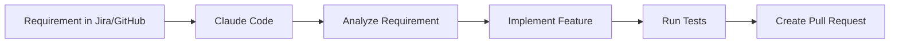
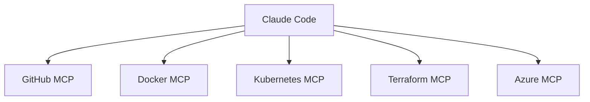
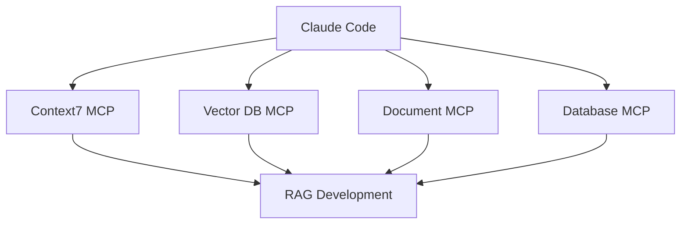
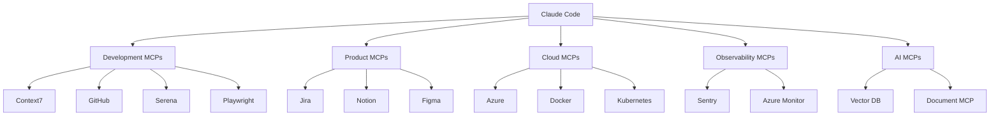

# Top Ready-Made MCP Servers for Claude Code

MCP (**Model Context Protocol**) is the layer that connects Claude Code to **external tools, services, databases, documentation, browsers, cloud platforms, and APIs**.

```text
Skills  → Teach Claude how to work
Agents  → Give Claude specialized roles
Hooks   → Automatically enforce/validate actions
MCP     → Give Claude access to external systems and tools
```

Claude Code can connect to hundreds of external systems through MCP, including issue trackers, databases, monitoring systems, design tools, and source control. Anthropic recommends connecting MCP servers when you otherwise find yourself manually copying information between tools. ([Claude][1])

---

# 🏆 Top MCP Discovery Repositories

Before installing individual MCPs, these are the repositories/directories I recommend using to discover them.

| Rank | Repository / Directory                                                                                    | What It Provides                                       | Priority |
| ---- | --------------------------------------------------------------------------------------------------------- | ------------------------------------------------------ | -------- |
| 🥇   | [BrethofAI Awesome MCP Servers](https://github.com/BrethofAI/awesome-mcp-servers?utm_source=chatgpt.com)  | Curated, permission-aware MCP servers                  | ⭐⭐⭐⭐⭐    |
| 🥈   | [Official MCP Servers Repository](https://github.com/modelcontextprotocol/servers?utm_source=chatgpt.com) | Official reference implementations and ecosystem links | ⭐⭐⭐⭐⭐    |
| 🥉   | [Awesome MCP Servers Directory](https://awesomeclaude.ai/top-mcp-servers?utm_source=chatgpt.com)          | Large searchable MCP catalog                           | ⭐⭐⭐⭐⭐    |
| 4    | [Skillselion MCP Directory](https://skillselion.com/mcp?utm_source=chatgpt.com)                           | Large ranked directory, refreshed frequently           | ⭐⭐⭐⭐     |
| 5    | [Awesome MCP Tools Directory](https://awesome-mcp.tools/blog/mcp-servers-list?utm_source=chatgpt.com)     | Categorized ecosystem discovery                        | ⭐⭐⭐⭐     |

**Important:** The official `modelcontextprotocol/servers` repository is mainly for reference implementations and education, not a blanket recommendation that every server there is production-ready. ([GitHub][2])

---

# Master Phase → Need → Ready-Made MCP → Repository → Priority

# Phase 0 — Claude Code Foundation

| What You Need              | Ready-Made MCP                     | Repository             | Priority |
| -------------------------- | ---------------------------------- | ---------------------- | -------- |
| Up-to-date documentation   | Context7                           | Upstash / Context7     | ⭐⭐⭐⭐⭐    |
| Semantic code intelligence | Serena                             | `oraios/serena`        | ⭐⭐⭐⭐⭐    |
| File/document conversion   | MarkItDown                         | Microsoft              | ⭐⭐⭐⭐     |
| MCP development            | MCP SDK / server development tools | Official MCP ecosystem | ⭐⭐⭐⭐⭐    |
| MCP discovery              | Awesome MCP Servers                | Community directories  | ⭐⭐⭐⭐⭐    |

## 🥇 Context7

**Use for:**

```text
Latest framework documentation
Library APIs
Package usage
Current code examples
Framework migrations
```

This is one of the highest-value MCPs for AI-assisted development because models may otherwise rely on outdated library knowledge. A recent Claude Code MCP ranking recommends Context7 specifically for fetching current library documentation into the coding context. ([MCPVault][3])

### Priority

⭐⭐⭐⭐⭐⭐

For your development workflow, this should be near the top.

---

# Phase 1 — Product Discovery & Research

| What You Need          | Ready-Made MCP Category | Recommended Source    | Priority |
| ---------------------- | ----------------------- | --------------------- | -------- |
| Web research           | Search MCP              | MCP directories       | ⭐⭐⭐⭐⭐    |
| GitHub research        | GitHub MCP              | Official GitHub MCP   | ⭐⭐⭐⭐⭐    |
| Documentation research | Context7                | Context7              | ⭐⭐⭐⭐⭐    |
| Knowledge base         | Notion MCP              | Official provider MCP | ⭐⭐⭐⭐     |
| Team communication     | Slack MCP               | Official/provider MCP | ⭐⭐⭐⭐     |
| Browser research       | Browser automation MCP  | Playwright ecosystem  | ⭐⭐⭐⭐     |

## Recommended Product Research Stack

```text
Context7
   +
GitHub MCP
   +
Web/Search MCP
   +
Browser MCP
```

---

# Phase 2 — Requirements & Project Management

| What You Need       | MCP        | Repository / Provider     | Priority |
| ------------------- | ---------- | ------------------------- | -------- |
| GitHub Issues       | GitHub MCP | GitHub                    | ⭐⭐⭐⭐⭐    |
| Jira                | Jira MCP   | Atlassian ecosystem       | ⭐⭐⭐⭐⭐    |
| Linear              | Linear MCP | Linear/provider ecosystem | ⭐⭐⭐⭐     |
| Notion requirements | Notion MCP | Notion                    | ⭐⭐⭐⭐     |
| Slack discussions   | Slack MCP  | Slack/provider ecosystem  | ⭐⭐⭐⭐     |

Claude Code's MCP documentation specifically highlights workflows such as reading an issue, implementing the requested feature, checking monitoring data, and creating a pull request. ([Claude][1])

## Recommended Workflow



---

# Phase 3 — UX & UI Design

| What You Need      | Ready-Made MCP         | Repository / Provider            | Priority |
| ------------------ | ---------------------- | -------------------------------- | -------- |
| Figma designs      | Figma MCP              | Figma ecosystem                  | ⭐⭐⭐⭐⭐    |
| Browser testing    | Playwright MCP         | Microsoft / Playwright ecosystem | ⭐⭐⭐⭐⭐    |
| Browser automation | Playwright MCP         | Playwright MCP server            | ⭐⭐⭐⭐⭐    |
| UI inspection      | Browser automation MCP | Community / official             | ⭐⭐⭐⭐     |
| Design assets      | Figma/provider MCP     | Provider                         | ⭐⭐⭐⭐     |

## 🥇 Playwright MCP

Use it for:

```text
Open application
Inspect UI
Click elements
Fill forms
Test workflows
Capture UI state
Debug browser behavior
```

The Playwright MCP ecosystem is among the most widely adopted MCP categories and is consistently highly ranked in current MCP directories. ([Agent Tresor Hub][4])

---

# Phase 4 — Software Architecture & Codebase Understanding

| What You Need            | Ready-Made MCP     | Repository                         | Priority |
| ------------------------ | ------------------ | ---------------------------------- | -------- |
| Semantic code navigation | Serena             | `oraios/serena`                    | ⭐⭐⭐⭐⭐    |
| Current framework docs   | Context7           | Upstash                            | ⭐⭐⭐⭐⭐    |
| Git repository access    | GitHub MCP         | GitHub                             | ⭐⭐⭐⭐⭐    |
| Local file access        | Filesystem MCP     | Official/community implementations | ⭐⭐⭐⭐     |
| Knowledge graph          | Graph/codebase MCP | Community ecosystem                | ⭐⭐⭐⭐     |

## 🥇 Serena

Useful for:

```text
Understand large codebases
Navigate symbols
Find references
Semantic retrieval
Targeted editing
```

Serena is currently listed among the highly ranked MCP coding-agent tools and provides semantic retrieval/editing capabilities for codebases. ([Agent Tresor Hub][4])

### Recommended Architecture Stack

```text
Serena
   +
Context7
   +
GitHub MCP
```

---

# Phase 5 — Backend Development

For your .NET development workflow:

| What You Need             | MCP                         | Priority |
| ------------------------- | --------------------------- | -------- |
| Latest .NET documentation | Context7                    | ⭐⭐⭐⭐⭐    |
| Code intelligence         | Serena                      | ⭐⭐⭐⭐⭐    |
| Repository integration    | GitHub MCP                  | ⭐⭐⭐⭐⭐    |
| API testing               | HTTP/API MCP                | ⭐⭐⭐⭐     |
| Database access           | PostgreSQL / SQL Server MCP | ⭐⭐⭐⭐⭐    |
| Container environment     | Docker MCP                  | ⭐⭐⭐⭐     |

## Recommended .NET MCP Stack

```text
Context7
    ↓
Serena
    ↓
GitHub MCP
    ↓
Database MCP
    ↓
Docker MCP
```

---

# Phase 6 — Frontend Development

| What You Need           | MCP            | Priority |
| ----------------------- | -------------- | -------- |
| Current React/Next docs | Context7       | ⭐⭐⭐⭐⭐    |
| UI testing              | Playwright MCP | ⭐⭐⭐⭐⭐    |
| Design integration      | Figma MCP      | ⭐⭐⭐⭐⭐    |
| Browser debugging       | Browser MCP    | ⭐⭐⭐⭐     |
| GitHub integration      | GitHub MCP     | ⭐⭐⭐⭐⭐    |

---

# Phase 7 — Database Engineering

| What You Need | Ready-Made MCP | Priority |
| ------------- | -------------- | -------- |
| PostgreSQL    | PostgreSQL MCP | ⭐⭐⭐⭐⭐    |
| SQL Server    | SQL Server MCP | ⭐⭐⭐⭐⭐    |
| MySQL         | MySQL MCP      | ⭐⭐⭐⭐     |
| SQLite        | SQLite MCP     | ⭐⭐⭐⭐     |
| Redis         | Redis MCP      | ⭐⭐⭐⭐     |

## Recommended Safety Model

For production databases:

```text
Development DB
      ↓
Read/Write MCP

Staging DB
      ↓
Restricted MCP

Production DB
      ↓
Read-only MCP
```

Do **not** give a coding agent unrestricted write access to production databases.

MCP servers can expose mutating tools, so the permissions and trust boundary of each server should be reviewed before connection. The curated BrethofAI directory explicitly labels servers as read-only or mutating to help evaluate that risk. ([GitHub][5])

---

# Phase 8 — Testing & QA

| What You Need            | MCP                    | Priority |
| ------------------------ | ---------------------- | -------- |
| Browser E2E tests        | Playwright MCP         | ⭐⭐⭐⭐⭐    |
| API testing              | HTTP/API MCP           | ⭐⭐⭐⭐⭐    |
| Repository test analysis | GitHub MCP             | ⭐⭐⭐⭐     |
| Test documentation       | Context7               | ⭐⭐⭐⭐     |
| Visual testing           | Browser/Playwright MCP | ⭐⭐⭐⭐     |

## Recommended Testing Stack

```text
Claude Code
    │
    ├── Playwright MCP
    │
    ├── API Testing MCP
    │
    └── GitHub MCP
```

---

# Phase 9 — Security

| What You Need       | MCP                  | Priority |
| ------------------- | -------------------- | -------- |
| Security scanning   | Security scanner MCP | ⭐⭐⭐⭐⭐    |
| Dependency analysis | Package/security MCP | ⭐⭐⭐⭐⭐    |
| Secret management   | Cloud Secret MCP     | ⭐⭐⭐⭐⭐    |
| Cloud security      | Cloud provider MCP   | ⭐⭐⭐⭐⭐    |
| Repository security | GitHub MCP           | ⭐⭐⭐⭐     |

## Recommended Rule

```text
Claude Code
   ↓
Security MCP
   ↓
Analyze
   ↓
Report
   ↓
Human Approval
   ↓
Fix
```

Avoid MCPs that automatically:

* delete cloud resources
* rotate production secrets
* deploy to production
* modify IAM permissions

unless you have explicit approval and strong guardrails.

---

# Phase 10 — DevOps & Infrastructure

| What You Need  | Ready-Made MCP | Priority |
| -------------- | -------------- | -------- |
| Docker         | Docker MCP     | ⭐⭐⭐⭐⭐    |
| Kubernetes     | Kubernetes MCP | ⭐⭐⭐⭐⭐    |
| Terraform      | Terraform MCP  | ⭐⭐⭐⭐⭐    |
| GitHub Actions | GitHub MCP     | ⭐⭐⭐⭐⭐    |
| Azure          | Azure MCP      | ⭐⭐⭐⭐⭐    |
| Cloudflare     | Cloudflare MCP | ⭐⭐⭐⭐     |

## Recommended Infrastructure Stack



For production infrastructure, use:

```text
Development → Read/Write
Staging     → Restricted
Production  → Read-only or Approval Required
```

---

# Phase 11 — Azure & .NET Cloud Development

For your interests, this should be a dedicated group.

| What You Need            | MCP Category                | Priority |
| ------------------------ | --------------------------- | -------- |
| Azure resource discovery | Azure MCP                   | ⭐⭐⭐⭐⭐    |
| Azure documentation      | Context7 + Azure docs       | ⭐⭐⭐⭐⭐    |
| Azure DevOps             | Azure DevOps MCP            | ⭐⭐⭐⭐⭐    |
| Application monitoring   | Azure Monitor MCP           | ⭐⭐⭐⭐⭐    |
| Log analysis             | Monitoring/log MCP          | ⭐⭐⭐⭐⭐    |
| Key Vault                | Azure Key Vault integration | ⭐⭐⭐⭐⭐    |

### Recommended Stack

```text
Azure MCP
    +
Azure DevOps MCP
    +
Context7
    +
GitHub MCP
    +
Monitoring MCP
```

---

# Phase 12 — Observability & Production

| What You Need         | Ready-Made MCP            | Priority |
| --------------------- | ------------------------- | -------- |
| Error monitoring      | Sentry MCP                | ⭐⭐⭐⭐⭐    |
| Metrics               | Datadog MCP               | ⭐⭐⭐⭐⭐    |
| Logs                  | Elasticsearch/Grafana MCP | ⭐⭐⭐⭐     |
| Cloud monitoring      | Azure Monitor MCP         | ⭐⭐⭐⭐⭐    |
| Application debugging | Monitoring MCP            | ⭐⭐⭐⭐⭐    |

Anthropic specifically lists connecting monitoring data as a useful Claude Code MCP workflow. ([Claude][1])

## Production Debugging Flow

```text
Production Issue
      ↓
Sentry / Monitoring MCP
      ↓
Logs + Errors + Metrics
      ↓
Claude Analysis
      ↓
GitHub Code Context
      ↓
Root Cause
      ↓
Fix
      ↓
Tests
      ↓
Pull Request
```

---

# Phase 13 — AI Engineering & RAG

This is highly relevant to your interests.

| What You Need    | MCP                              | Priority |
| ---------------- | -------------------------------- | -------- |
| AI documentation | Context7                         | ⭐⭐⭐⭐⭐    |
| Vector database  | Pinecone / Qdrant / Weaviate MCP | ⭐⭐⭐⭐⭐    |
| RAG data         | Database/document MCP            | ⭐⭐⭐⭐⭐    |
| Model APIs       | AI provider MCP                  | ⭐⭐⭐⭐⭐    |
| AI evaluation    | Evaluation platform MCP          | ⭐⭐⭐⭐     |
| Agent tools      | Custom MCP servers               | ⭐⭐⭐⭐⭐    |

## Recommended RAG Architecture



---

# Phase 14 — Documentation & Knowledge

| What You Need         | Ready-Made MCP       | Priority |
| --------------------- | -------------------- | -------- |
| Knowledge base        | Notion MCP           | ⭐⭐⭐⭐⭐    |
| Document processing   | MarkItDown           | ⭐⭐⭐⭐     |
| GitHub documentation  | GitHub MCP           | ⭐⭐⭐⭐⭐    |
| Latest technical docs | Context7             | ⭐⭐⭐⭐⭐    |
| Internal knowledge    | Custom Knowledge MCP | ⭐⭐⭐⭐⭐    |

Microsoft's MarkItDown is currently highly popular for converting documents such as PDFs, Office files, HTML, and images into Markdown suitable for AI workflows. ([awesome-mcp.tools][6])

---

# Phase 15 — Communication & Collaboration

| What You Need   | MCP             | Priority |
| --------------- | --------------- | -------- |
| Slack           | Slack MCP       | ⭐⭐⭐⭐⭐    |
| Microsoft Teams | Teams MCP       | ⭐⭐⭐⭐     |
| Email           | Gmail/Email MCP | ⭐⭐⭐⭐     |
| Notion          | Notion MCP      | ⭐⭐⭐⭐⭐    |
| GitHub          | GitHub MCP      | ⭐⭐⭐⭐⭐    |

---

# 🏆 My Recommended Top 20 MCP Servers for You

Based on your focus on **Claude Code + .NET + Architecture + Azure + RAG + AI Agents**:

| Rank | MCP                         | Primary Purpose                | Priority |
| ---- | --------------------------- | ------------------------------ | -------- |
| 🥇 1 | Context7                    | Current library documentation  | ⭐⭐⭐⭐⭐    |
| 🥈 2 | GitHub MCP                  | Repository, issues, PRs        | ⭐⭐⭐⭐⭐    |
| 🥉 3 | Serena                      | Semantic codebase intelligence | ⭐⭐⭐⭐⭐    |
| 4    | Playwright MCP              | Browser automation and testing | ⭐⭐⭐⭐⭐    |
| 5    | Azure MCP                   | Azure resources                | ⭐⭐⭐⭐⭐    |
| 6    | Azure DevOps MCP            | Boards and pipelines           | ⭐⭐⭐⭐⭐    |
| 7    | PostgreSQL / SQL Server MCP | Database development           | ⭐⭐⭐⭐⭐    |
| 8    | Docker MCP                  | Containers                     | ⭐⭐⭐⭐     |
| 9    | Kubernetes MCP              | Cluster operations             | ⭐⭐⭐⭐     |
| 10   | Terraform MCP               | Infrastructure                 | ⭐⭐⭐⭐     |
| 11   | Figma MCP                   | Design-to-code                 | ⭐⭐⭐⭐     |
| 12   | Sentry MCP                  | Error monitoring               | ⭐⭐⭐⭐⭐    |
| 13   | Datadog / Metrics MCP       | Observability                  | ⭐⭐⭐⭐     |
| 14   | Notion MCP                  | Knowledge and requirements     | ⭐⭐⭐⭐     |
| 15   | Slack MCP                   | Team communication             | ⭐⭐⭐      |
| 16   | Vector DB MCP               | RAG development                | ⭐⭐⭐⭐⭐    |
| 17   | API/HTTP MCP                | API integration/testing        | ⭐⭐⭐⭐⭐    |
| 18   | Filesystem MCP              | Controlled file access         | ⭐⭐⭐⭐     |
| 19   | MarkItDown                  | Document ingestion/conversion  | ⭐⭐⭐⭐     |
| 20   | Custom MCP                  | Your internal systems          | ⭐⭐⭐⭐⭐    |

---

# 🥇 My Recommended MCP Starter Pack

Do **not install all 20 initially**.

Start with:

```text
CORE DEVELOPMENT
├── Context7
├── GitHub MCP
├── Serena
└── Playwright MCP

.NET / BACKEND
├── SQL Server or PostgreSQL MCP
└── API MCP

CLOUD
├── Azure MCP
└── Azure DevOps MCP

OBSERVABILITY
└── Sentry or Azure Monitor MCP

AI
└── Vector Database MCP
```

---

# Recommended End-to-End MCP Architecture



---

# Repository Structure Recommendation

Keep MCP configuration separate from Skills, Agents, and Hooks:

```text
project/
│
├── .claude/
│   ├── CLAUDE.md
│   │
│   ├── skills/
│   ├── agents/
│   ├── hooks/
│   └── commands/
│
├── .mcp.json
│
├── src/
├── tests/
└── docs/
```

Claude Code supports project-scoped MCP configuration in `.mcp.json`, which can be committed to version control so the team shares the same MCP configuration. Claude prompts for approval before using project-scoped MCP servers. ([Claude][1])

---

# Recommended Installation Order

## Tier 1 — Install Immediately

```text
1. Context7
2. GitHub MCP
3. Serena
4. Playwright MCP
```

## Tier 2 — Based on Your .NET Project

```text
5. SQL Server MCP
6. Azure MCP
7. Azure DevOps MCP
8. Docker MCP
```

## Tier 3 — Production Projects

```text
9. Sentry / Azure Monitor MCP
10. Kubernetes MCP
11. Terraform MCP
```

## Tier 4 — AI Projects

```text
12. Vector Database MCP
13. Document MCP
14. AI Evaluation MCP
```

---

# Important MCP Security Rule

MCP is powerful because it gives Claude access to external systems.

Therefore:

```text
SKILL
  = Instructions

AGENT
  = Specialized reasoning

HOOK
  = Automated enforcement

MCP
  = Real-world access
```

Treat every MCP as part of your security boundary.

Anthropic explicitly warns that MCP servers fetching external content can expose Claude Code to prompt-injection risks, and MCP tool access should be granted explicitly rather than broadly. ([Claude][1])

## My recommendation for your setup

```text
PERSONAL / USER MCPs
├── Context7
├── GitHub
├── Serena
└── Documentation tools

PROJECT MCPs
├── Database
├── Azure
├── Playwright
└── Project-specific APIs

PRODUCTION MCPs
├── Read-only monitoring
├── Read-only logs
└── Restricted infrastructure access
```

The best next step is to build a **single complete Claude Code ecosystem matrix** combining everything you've asked for:

| Phase | Skills | Agents | Hooks | MCPs | Priority | Recommended Repository | Installation |
| ----- | ------ | ------ | ----- | ---- | -------- | ---------------------- | ------------ |

That would give you one complete **Idea → Architecture → Development → Testing → Security → Deployment → AI → Production** Claude Code setup.

[1]: https://code.claude.com/docs/en/mcp?utm_source=chatgpt.com "Connect Claude Code to tools via MCP - Claude Code Docs"
[2]: https://github.com/modelcontextprotocol/servers?utm_source=chatgpt.com "GitHub - modelcontextprotocol/servers: Model Context Protocol Servers · GitHub"
[3]: https://mcpvault.io/blog/best-mcp-servers-claude-code?utm_source=chatgpt.com "12 Best MCP Servers for Claude Code [2026], Ranked | MCPVault"
[4]: https://www.agtr.app/ranking/mcp-servers?utm_source=chatgpt.com "Agent Tresor Hub"
[5]: https://github.com/BrethofAI/awesome-mcp-servers?utm_source=chatgpt.com "GitHub - BrethofAI/awesome-mcp-servers: Curated Model Context Protocol servers for Claude, agents, and the growing MCP ecosystem. · GitHub"
[6]: https://awesome-mcp.tools/blog/top-mcp-servers-2026?utm_source=chatgpt.com "Top MCP Servers in 2026 — Most Popular by GitHub Stars — Awesome MCP Tools"
