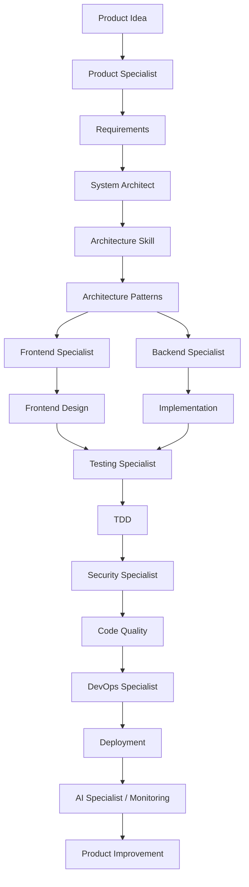

# Top Ready-Made Skills for Claude Code — End-to-End Product Development

I searched the current Skills ecosystem and mapped ready-made skills to the **complete product development lifecycle** you asked for.

The best approach is **not to install hundreds of skills**. Build a curated Claude Code skill stack with:

1. **One skill for discovering more skills**
2. **High-quality workflow/engineering skills**
3. **Specialized skills for your .NET + architecture + AI stack**
4. **A few project-specific custom skills**

The skills.sh directory currently lists **`find-skills` as one of its most-installed skills**, and its Claude Code integration installs `SKILL.md` skills into your repository for automatic use across sessions. ([Skills][1])

---

# Master Phase → Need → Ready-Made Skill → Repository → Priority

## Phase 0 — Skill Discovery and Claude Code Foundation

| What You Need             | Ready-Made Skill    | Repository                   | Priority |
| ------------------------- | ------------------- | ---------------------------- | -------- |
| 🔍 Find new skills        | `find-skills`       | `vercel-labs/skills`         | ⭐⭐⭐⭐⭐    |
| Skill discovery           | `skills-search`     | `daymade/claude-code-skills` | ⭐⭐⭐⭐     |
| Create custom skills      | `skill-development` | `aiskillstore/marketplace`   | ⭐⭐⭐⭐     |
| Learn Claude API          | `claude-api`        | `anthropics/skills`          | ⭐⭐⭐⭐     |
| General official examples | Example Skills      | `anthropics/skills`          | ⭐⭐⭐⭐⭐    |

### My #1 recommendation

```bash
npx skills add vercel-labs/skills --skill find-skills
```

This should become your **skill discovery engine**.

Whenever you need something new:

```text
Find the best Claude Code skill for:
[architecture / React / .NET / testing / security / Azure / RAG]
```

The official Anthropic repository is also a major reference implementation for Agent Skills and can be added as a Claude Code plugin marketplace. ([GitHub][2])

---

# Phase 1 — Product Discovery and Product Management

| What You Need        | Recommended Ready-Made Skill    | Repository                           | Priority |
| -------------------- | ------------------------------- | ------------------------------------ | -------- |
| Product specialist   | `product-specialist`            | `prorise-cool/prorise-claude-skills` | ⭐⭐⭐⭐⭐    |
| Competitive research | `lead-research-assistant`       | `prorise-cool/prorise-claude-skills` | ⭐⭐⭐      |
| Product analysis     | Search with `find-skills`       | `vercel-labs/skills`                 | ⭐⭐⭐⭐⭐    |
| Project analysis     | `project-analyze`               | `prorise-cool/prorise-claude-skills` | ⭐⭐⭐⭐     |
| Project management   | `project-management-specialist` | `prorise-cool/prorise-claude-skills` | ⭐⭐⭐      |

The `prorise-cool/prorise-claude-skills` repository is interesting because it already groups many specialist roles—product, architecture, frontend, backend, testing, security, DevOps, AI, and more—in one repository. ([Skills][3])

---

# Phase 2 — Requirements and Planning

| What You Need            | Recommended Skill               | Repository                           | Priority |
| ------------------------ | ------------------------------- | ------------------------------------ | -------- |
| Product requirements     | `product-specialist`            | `prorise-cool/prorise-claude-skills` | ⭐⭐⭐⭐⭐    |
| Project planning         | `project-management-specialist` | `prorise-cool/prorise-claude-skills` | ⭐⭐⭐⭐     |
| Analyze existing project | `project-analyze`               | `prorise-cool/prorise-claude-skills` | ⭐⭐⭐⭐     |
| Architecture preparation | `architecture`                  | `davila7/claude-code-templates`      | ⭐⭐⭐⭐⭐    |

The `architecture` skill from `davila7/claude-code-templates` explicitly focuses on **requirements-driven architecture, trade-offs, ADRs, pattern selection, and context discovery**. ([Skills][4])

```bash
npx skills add davila7/claude-code-templates --skill architecture
```

---

# Phase 3 — UX, UI and Product Design

| What You Need      | Ready-Made Skill             | Repository                           | Priority |
| ------------------ | ---------------------------- | ------------------------------------ | -------- |
| UI/UX specialist   | `design-specialist`          | `prorise-cool/prorise-claude-skills` | ⭐⭐⭐⭐⭐    |
| UI/UX design       | `ui-ux-pro-max`              | `prorise-cool/prorise-claude-skills` | ⭐⭐⭐⭐     |
| UI quality review  | `ui-skills`                  | `adwilkinson/claude-code-tools`      | ⭐⭐⭐⭐     |
| Frontend design    | `frontend-design`            | `anthropics/skills`                  | ⭐⭐⭐⭐⭐    |
| Component patterns | Discover using `find-skills` | `vercel-labs/skills`                 | ⭐⭐⭐⭐⭐    |

Anthropic's `frontend-design` is one of the highly used skills in the Skills directory, making it a strong default for production UI work. ([Skills][5])

---

# Phase 4 — Software Architecture

This is one of your most important phases.

| What You Need           | Ready-Made Skill                | Repository                           | Priority |
| ----------------------- | ------------------------------- | ------------------------------------ | -------- |
| System architecture     | `system-architect`              | `aj-geddes/claude-code-bmad-skills`  | ⭐⭐⭐⭐⭐    |
| Architecture decisions  | `architecture`                  | `davila7/claude-code-templates`      | ⭐⭐⭐⭐⭐    |
| Architecture patterns   | `architecture-patterns`         | `secondsky/claude-skills`            | ⭐⭐⭐⭐⭐    |
| Improve architecture    | `improve-codebase-architecture` | `mattpocock/skills`                  | ⭐⭐⭐⭐⭐    |
| Architecture specialist | `architecture-specialist`       | `prorise-cool/prorise-claude-skills` | ⭐⭐⭐⭐     |

### Recommended architecture stack

```bash
npx skills add aj-geddes/claude-code-bmad-skills --skill system-architect

npx skills add davila7/claude-code-templates --skill architecture

npx skills add secondsky/claude-skills --skill architecture-patterns
```

The `system-architect` skill explicitly covers architecture from requirements, technology choices, component boundaries, data models, APIs, and non-functional requirements such as scalability and security. ([Skills][6])

The `architecture-patterns` skill focuses on Clean Architecture, Hexagonal Architecture, and Domain-Driven Design. ([Skills][7])

---

# Phase 5 — Backend Development

For your stack, I recommend looking specifically for **C# and .NET skills** using `find-skills`, because framework-specific skills evolve quickly.

| What You Need          | Ready-Made Skill                | Repository                           | Priority |
| ---------------------- | ------------------------------- | ------------------------------------ | -------- |
| Backend engineering    | `backend-specialist`            | `prorise-cool/prorise-claude-skills` | ⭐⭐⭐⭐⭐    |
| Codebase improvement   | `improve-codebase-architecture` | `mattpocock/skills`                  | ⭐⭐⭐⭐⭐    |
| Code quality           | `code-quality-specialist`       | `prorise-cool/prorise-claude-skills` | ⭐⭐⭐⭐⭐    |
| .NET-specific workflow | Discover via `find-skills`      | `vercel-labs/skills`                 | ⭐⭐⭐⭐⭐    |
| ASP.NET Core           | Discover via `find-skills`      | `vercel-labs/skills`                 | ⭐⭐⭐⭐⭐    |
| EF Core                | Discover via `find-skills`      | `vercel-labs/skills`                 | ⭐⭐⭐⭐     |

Search inside Claude Code:

```text
Use find-skills to find the best skills for:

- C#
- .NET
- ASP.NET Core
- Entity Framework Core
- Clean Architecture
- DDD
- CQRS
- Event Sourcing
- MediatR
```

---

# Phase 6 — Frontend Development

| What You Need        | Ready-Made Skill           | Repository                           | Priority |
| -------------------- | -------------------------- | ------------------------------------ | -------- |
| Frontend engineering | `frontend-specialist`      | `prorise-cool/prorise-claude-skills` | ⭐⭐⭐⭐⭐    |
| High-quality UI      | `frontend-design`          | `anthropics/skills`                  | ⭐⭐⭐⭐⭐    |
| UI review            | `ui-skills`                | `adwilkinson/claude-code-tools`      | ⭐⭐⭐⭐     |
| Framework knowledge  | `framework-specialist`     | `prorise-cool/prorise-claude-skills` | ⭐⭐⭐⭐     |
| React/Next.js        | Discover via `find-skills` | `vercel-labs/skills`                 | ⭐⭐⭐⭐⭐    |

The Skills directory specifically highlights categories for **React, Next.js, frontend performance, component patterns, and agent workflows**. ([Skills][1])

---

# Phase 7 — Database and Data

| What You Need    | Recommended Skill Strategy | Repository                           | Priority |
| ---------------- | -------------------------- | ------------------------------------ | -------- |
| Database design  | Search using `find-skills` | `vercel-labs/skills`                 | ⭐⭐⭐⭐⭐    |
| SQL optimization | Search using `find-skills` | `vercel-labs/skills`                 | ⭐⭐⭐⭐⭐    |
| PostgreSQL       | Search using `find-skills` | `vercel-labs/skills`                 | ⭐⭐⭐⭐     |
| SQL Server       | Search using `find-skills` | `vercel-labs/skills`                 | ⭐⭐⭐⭐⭐    |
| Data engineering | `data-specialist`          | `prorise-cool/prorise-claude-skills` | ⭐⭐⭐⭐     |

Recommended Claude Code query:

```text
Use find-skills and find the highest quality skills for:

SQL Server schema design
EF Core performance
database indexing
PostgreSQL optimization
database migrations
data modeling
```

---

# Phase 8 — Testing and Quality Engineering

This is another **must-install category**.

| What You Need            | Ready-Made Skill           | Repository                           | Priority |
| ------------------------ | -------------------------- | ------------------------------------ | -------- |
| Test-driven development  | `tdd`                      | `mattpocock/skills`                  | ⭐⭐⭐⭐⭐    |
| Testing specialist       | `testing-specialist`       | `prorise-cool/prorise-claude-skills` | ⭐⭐⭐⭐⭐    |
| Code review              | `review-code`              | `prorise-cool/prorise-claude-skills` | ⭐⭐⭐⭐     |
| Code quality             | `code-quality-specialist`  | `prorise-cool/prorise-claude-skills` | ⭐⭐⭐⭐⭐    |
| Web application testing  | `webapp-testing`           | `prorise-cool/prorise-claude-skills` | ⭐⭐⭐⭐     |
| Framework-specific tests | Discover via `find-skills` | `vercel-labs/skills`                 | ⭐⭐⭐⭐⭐    |

The `tdd` skill is among the most-installed skills listed in the Skills directory. ([Skills][5])

### Recommended

```bash
npx skills add mattpocock/skills --skill tdd
```

---

# Phase 9 — Security

| What You Need        | Ready-Made Skill            | Repository                           | Priority |
| -------------------- | --------------------------- | ------------------------------------ | -------- |
| Security engineering | `security-specialist`       | `prorise-cool/prorise-claude-skills` | ⭐⭐⭐⭐⭐    |
| Secure architecture  | `system-architect`          | `aj-geddes/claude-code-bmad-skills`  | ⭐⭐⭐⭐     |
| Security code review | Discover with `find-skills` | `vercel-labs/skills`                 | ⭐⭐⭐⭐⭐    |
| OWASP workflows      | Discover with `find-skills` | `vercel-labs/skills`                 | ⭐⭐⭐⭐⭐    |

Recommended query:

```text
Use find-skills to find the best audited Claude Code skills for:

OWASP Top 10
.NET security
API security
authentication
OAuth
OpenID Connect
JWT
security code review
threat modeling
```

---

# Phase 10 — DevOps and Cloud

| What You Need     | Ready-Made Skill             | Repository                           | Priority |
| ----------------- | ---------------------------- | ------------------------------------ | -------- |
| DevOps specialist | `devops-specialist`          | `prorise-cool/prorise-claude-skills` | ⭐⭐⭐⭐⭐    |
| Azure             | Discover using `find-skills` | `vercel-labs/skills`                 | ⭐⭐⭐⭐⭐    |
| Docker            | Discover using `find-skills` | `vercel-labs/skills`                 | ⭐⭐⭐⭐⭐    |
| Kubernetes        | Discover using `find-skills` | `vercel-labs/skills`                 | ⭐⭐⭐⭐     |
| Terraform         | Discover using `find-skills` | `vercel-labs/skills`                 | ⭐⭐⭐⭐     |
| CI/CD             | Discover using `find-skills` | `vercel-labs/skills`                 | ⭐⭐⭐⭐⭐    |

Recommended searches:

```text
Azure DevOps
GitHub Actions
Docker
Kubernetes
Terraform
Bicep
Azure Container Apps
AKS
CI/CD
```

---

# Phase 11 — AI Engineering

This should be a major part of your skill stack.

| What You Need   | Ready-Made Skill           | Repository                           | Priority |
| --------------- | -------------------------- | ------------------------------------ | -------- |
| AI specialist   | `ai-specialist`            | `prorise-cool/prorise-claude-skills` | ⭐⭐⭐⭐⭐    |
| Claude API      | `claude-api`               | `anthropics/skills`                  | ⭐⭐⭐⭐⭐    |
| MCP development | `mcp-builder`              | `prorise-cool/prorise-claude-skills` | ⭐⭐⭐⭐     |
| Agent workflows | Discover via `find-skills` | `vercel-labs/skills`                 | ⭐⭐⭐⭐⭐    |
| RAG             | Discover via `find-skills` | `vercel-labs/skills`                 | ⭐⭐⭐⭐⭐    |
| AI agents       | Discover via `find-skills` | `vercel-labs/skills`                 | ⭐⭐⭐⭐⭐    |

Anthropic documents the `claude-api` skill as bundled with Claude Code for relevant Claude API work, and also provides installation options through the Anthropic skills repository. ([Claude][8])

---

# Phase 12 — Documentation

| What You Need           | Ready-Made Skill           | Repository                           | Priority |
| ----------------------- | -------------------------- | ------------------------------------ | -------- |
| Technical documentation | `documentation-specialist` | `prorise-cool/prorise-claude-skills` | ⭐⭐⭐⭐⭐    |
| PDF work                | Official document skills   | `anthropics/skills`                  | ⭐⭐⭐⭐     |
| Word documents          | Official document skills   | `anthropics/skills`                  | ⭐⭐⭐      |
| Excel                   | Official document skills   | `anthropics/skills`                  | ⭐⭐⭐      |
| Presentations           | Official document skills   | `anthropics/skills`                  | ⭐⭐⭐      |

The official Anthropic repository includes document skills and provides a Claude Code plugin marketplace installation path. ([GitHub][2])

---

# Phase 13 — Code Review and Refactoring

| What You Need               | Ready-Made Skill                | Repository                           | Priority |
| --------------------------- | ------------------------------- | ------------------------------------ | -------- |
| Improve architecture        | `improve-codebase-architecture` | `mattpocock/skills`                  | ⭐⭐⭐⭐⭐    |
| Code review                 | `review-code`                   | `prorise-cool/prorise-claude-skills` | ⭐⭐⭐⭐⭐    |
| Code quality                | `code-quality-specialist`       | `prorise-cool/prorise-claude-skills` | ⭐⭐⭐⭐⭐    |
| TDD                         | `tdd`                           | `mattpocock/skills`                  | ⭐⭐⭐⭐⭐    |
| General code improvement    | `grill-me`                      | `mattpocock/skills`                  | ⭐⭐⭐⭐     |
| Documentation-driven review | `grill-with-docs`               | `mattpocock/skills`                  | ⭐⭐⭐⭐     |

Several of the `mattpocock/skills` skills—including architecture improvement, TDD, and code-review-oriented workflows—are currently among the highly installed skills in the directory. ([Skills][5])

---

# Phase 14 — Complete Specialist Repository

## `prorise-cool/prorise-claude-skills`

This is particularly useful for your goal because it contains a broad set of specialist roles:

```text
Product
Design
Architecture
Frontend
Backend
Testing
Security
DevOps
AI
Data
Documentation
Project Management
Code Quality
```

The repository currently exposes dozens of skills through the Skills directory, including specialist skills for product, design, architecture, frontend, backend, testing, security, DevOps, and AI. ([Skills][3])

### Install the repository

```bash
npx skills add prorise-cool/prorise-claude-skills
```

Or install selected skills individually.

My recommendation is to **install selected skills**, not everything initially.

---

# 🏆 My Recommended Top 15 for Your Claude Code Setup

## Tier 1 — Install Immediately

| # | Skill                           | Repository                          |
| - | ------------------------------- | ----------------------------------- |
| 1 | `find-skills`                   | `vercel-labs/skills`                |
| 2 | `architecture`                  | `davila7/claude-code-templates`     |
| 3 | `system-architect`              | `aj-geddes/claude-code-bmad-skills` |
| 4 | `architecture-patterns`         | `secondsky/claude-skills`           |
| 5 | `improve-codebase-architecture` | `mattpocock/skills`                 |
| 6 | `tdd`                           | `mattpocock/skills`                 |
| 7 | `frontend-design`               | `anthropics/skills`                 |

---

## Tier 2 — Strong Engineering Team

| #  | Skill                     | Repository                           |
| -- | ------------------------- | ------------------------------------ |
| 8  | `backend-specialist`      | `prorise-cool/prorise-claude-skills` |
| 9  | `frontend-specialist`     | `prorise-cool/prorise-claude-skills` |
| 10 | `testing-specialist`      | `prorise-cool/prorise-claude-skills` |
| 11 | `security-specialist`     | `prorise-cool/prorise-claude-skills` |
| 12 | `devops-specialist`       | `prorise-cool/prorise-claude-skills` |
| 13 | `code-quality-specialist` | `prorise-cool/prorise-claude-skills` |

---

## Tier 3 — Product + AI

| #  | Skill                | Repository                           |
| -- | -------------------- | ------------------------------------ |
| 14 | `product-specialist` | `prorise-cool/prorise-claude-skills` |
| 15 | `ai-specialist`      | `prorise-cool/prorise-claude-skills` |

---

# My Recommended End-to-End Claude Code Workflow



---

# Recommended Installation Strategy

## Step 1 — Install Your Core Intelligence Layer

```bash
npx skills add vercel-labs/skills --skill find-skills

npx skills add mattpocock/skills --skill tdd

npx skills add mattpocock/skills --skill improve-codebase-architecture

npx skills add davila7/claude-code-templates --skill architecture

npx skills add secondsky/claude-skills --skill architecture-patterns
```

---

## Step 2 — Install Architecture

```bash
npx skills add aj-geddes/claude-code-bmad-skills --skill system-architect
```

---

## Step 3 — Install Product Engineering Specialists

Use the `prorise-cool/prorise-claude-skills` repository for the specialist roles you need:

```text
product-specialist
architecture-specialist
backend-specialist
frontend-specialist
testing-specialist
security-specialist
devops-specialist
ai-specialist
code-quality-specialist
documentation-specialist
```

---

# Best Architecture for Your `.claude` Folder

I recommend eventually organizing your project like this:

```text
.claude/
│
├── CLAUDE.md
│
├── skills/
│   │
│   ├── product-development/
│   │   └── SKILL.md
│   │
│   ├── requirements/
│   │   └── SKILL.md
│   │
│   ├── architecture/
│   │   └── SKILL.md
│   │
│   ├── dotnet/
│   │   └── SKILL.md
│   │
│   ├── testing/
│   │   └── SKILL.md
│   │
│   ├── security/
│   │   └── SKILL.md
│   │
│   ├── devops/
│   │   └── SKILL.md
│   │
│   ├── ai/
│   │   └── SKILL.md
│   │
│   └── documentation/
│       └── SKILL.md
│
├── agents/
│
├── commands/
│
└── rules/
```

Claude Code supports project skills through `.claude/skills/<skill-name>/SKILL.md`, with skills loaded automatically when relevant or invoked directly. ([Claude][9])

---

# My Strong Recommendation for You

For your specific goal, build your Claude Code environment around **five layers**:

```text
                    ┌─────────────────┐
                    │  FIND SKILLS    │
                    │  Discover New   │
                    └────────┬────────┘
                             │
             ┌───────────────▼───────────────┐
             │ PRODUCT + REQUIREMENTS        │
             │ Product Specialist            │
             └───────────────┬───────────────┘
                             │
             ┌───────────────▼───────────────┐
             │ ARCHITECTURE                  │
             │ System Architect              │
             │ Architecture Patterns         │
             │ Architecture Improvement      │
             └───────────────┬───────────────┘
                             │
             ┌───────────────▼───────────────┐
             │ ENGINEERING                   │
             │ Backend / Frontend / AI       │
             └───────────────┬───────────────┘
                             │
             ┌───────────────▼───────────────┐
             │ QUALITY                       │
             │ TDD / Testing / Security      │
             │ Code Quality                  │
             └───────────────┬───────────────┘
                             │
             ┌───────────────▼───────────────┐
             │ DELIVERY                      │
             │ DevOps / Documentation        │
             │ Monitoring                    │
             └───────────────────────────────┘
```

**Important:** treat third-party skills as executable instructions within your development environment. Anthropic's documentation explicitly warns that repository skills are part of an agent's trust boundary, so review skills and repositories before installing them—especially skills that instruct Claude to run shell commands or access external services. ([Claude][10])

The most effective next step for your learning and development workflow would be to build a **complete curated table of 50–100 specific skills**, grouped by the exact phases above, with:

**Phase → Skill → Repository → Install Command → What It Does → When to Use → Priority → Recommended for .NET/AI/Product Development**.

[1]: https://www.skills.sh/agent/claude-code?utm_source=chatgpt.com "Skills for Claude Code — Install via the skills CLI"
[2]: https://github.com/anthropics/skills?utm_source=chatgpt.com "GitHub - anthropics/skills: Public repository for Agent Skills · GitHub"
[3]: https://www.skills.sh/prorise-cool/prorise-claude-skills?utm_source=chatgpt.com "prorise-cool/prorise-claude-skills — Agent skills"
[4]: https://www.skills.sh/davila7/claude-code-templates/architecture?utm_source=chatgpt.com "architecture — davila7/claude-code-templates"
[5]: https://skills.sh/?utm_source=chatgpt.com "The Agent Skills Directory"
[6]: https://www.skills.sh/aj-geddes/claude-code-bmad-skills/system-architect?utm_source=chatgpt.com "system-architect — aj-geddes/claude-code-bmad-skills"
[7]: https://www.skills.sh/secondsky/claude-skills/architecture-patterns?utm_source=chatgpt.com "architecture-patterns — secondsky/claude-skills"
[8]: https://platform.claude.com/docs/en/agents-and-tools/agent-skills/claude-api-skill?utm_source=chatgpt.com "Claude API skill - Claude Platform Docs"
[9]: https://code.claude.com/docs/en/slash-commands?utm_source=chatgpt.com "Extend Claude with skills - Claude Code Docs"
[10]: https://platform.claude.com/docs/en/managed-agents/skills?utm_source=chatgpt.com "Skills - Claude Platform Docs"
